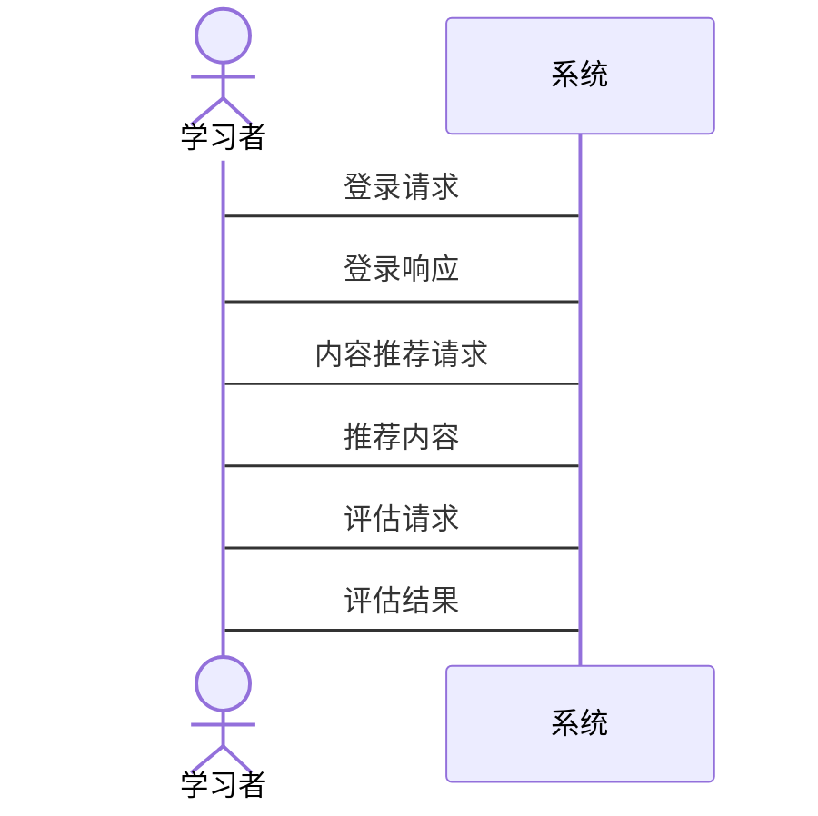

                 


# 构建智能企业培训系统：自适应学习内容生成与技能评估

> **关键词**: 智能企业培训系统, 自适应学习, 技能评估, 自然语言处理, 系统架构设计, AI驱动培训

> **摘要**: 本文详细探讨了如何构建一个智能企业培训系统，重点分析了自适应学习内容生成与技能评估的关键技术与实现方案。通过结合自然语言处理、机器学习和知识图谱等技术，本文提出了一个基于AI的自适应学习框架，并详细阐述了系统的设计与实现过程。文章最后给出了实际的项目案例和优化建议，为构建高效、智能的企业培训系统提供了参考。

---

## 第1章: 企业培训系统的发展与挑战

### 1.1 传统企业培训模式的局限性

#### 1.1.1 传统培训模式的现状
传统企业培训模式通常依赖于固定的课程安排和统一的教学内容，难以满足不同学习者的个性化需求。此外，传统模式的评估方式多基于主观判断，缺乏客观性和科学性。

#### 1.1.2 传统培训模式的痛点
- **学习者需求多样性**: 不同学习者有不同的知识储备、学习习惯和兴趣偏好。
- **内容更新滞后**: 课程内容难以及时更新，无法跟上技术发展的步伐。
- **评估方式单一**: 传统的考试或问卷评估方式难以全面反映学习者的实际能力。

#### 1.1.3 传统培训模式的改进方向
- **个性化学习路径**: 根据学习者的特点制定个性化的学习计划。
- **动态内容更新**: 建立内容动态生成机制，确保学习内容的时效性。
- **多维度评估体系**: 采用多种评估手段，全面衡量学习者的知识掌握情况。

### 1.2 智能时代企业培训的机遇

#### 1.2.1 AI技术对企业培训的影响
人工智能技术的快速发展为企业培训带来了新的可能性。通过AI技术，企业可以实现个性化的学习内容生成、智能化的技能评估以及动态调整的培训计划。

#### 1.2.2 自适应学习的兴起
自适应学习是一种基于学习者特点动态调整学习内容和节奏的教学方法。通过AI算法，系统可以实时分析学习者的行为数据，优化学习路径。

#### 1.2.3 技能评估的智能化趋势
智能化的技能评估系统能够通过多维度的数据分析，全面评估学习者的能力水平，并为后续学习提供个性化建议。

### 1.3 本书的核心目标

#### 1.3.1 自适应学习内容生成的目标
实现基于AI的自适应学习内容生成，满足不同学习者的需求。

#### 1.3.2 技能评估系统的设计目标
构建一个多维度、动态调整的技能评估体系，全面反映学习者的能力水平。

#### 1.3.3 系统构建的总体框架
通过整合自然语言处理、机器学习和知识图谱等技术，构建一个智能化的企业培训系统。

---

## 第2章: 自适应学习的核心概念

### 2.1 自适应学习的理论基础

#### 2.1.1 自适应学习的定义
自适应学习是一种根据学习者的特点和学习过程动态调整教学内容、节奏和方法的教育模式。

#### 2.1.2 自适应学习的特征
- **个性化**: 根据学习者的特点提供个性化的内容。
- **动态调整**: 根据学习效果实时调整学习计划。
- **数据驱动**: 依赖于学习者行为数据和反馈信息。

#### 2.1.3 自适应学习与传统学习的区别
| 特性               | 传统学习                     | 自适应学习                   |
|--------------------|------------------------------|-------------------------------|
| 内容               | 固定，统一                   | 动态生成，个性化             |
| 节奏               | 固定，统一                   | 动态调整，因人而异           |
| 评估               | 单一，主观                   | 多维，动态                   |

### 2.2 自适应学习的核心模型

#### 2.2.1 学习者模型
学习者模型用于描述学习者的特点、知识水平和学习行为。主要包括以下要素：
- **学习者画像**: 包括学习者的背景、兴趣、学习习惯等信息。
- **知识图谱**: 描述学习者已掌握的知识点和技能。
- **学习轨迹**: 记录学习者的学习过程和效果。

#### 2.2.2 内容模型
内容模型用于描述学习内容的结构和关系。主要包括：
- **知识点层次**: 知识点之间的层次关系和依赖关系。
- **内容标签**: 用于内容分类和推荐的标签。
- **内容权重**: 根据知识点的重要性进行权重分配。

#### 2.2.3 评估模型
评估模型用于衡量学习者的能力水平。主要包括：
- **评估指标**: 包括知识掌握度、学习积极性、学习效果等多个维度。
- **评估算法**: 基于机器学习的评估模型，如回归分析和分类算法。

### 2.3 自适应学习的实现机制

#### 2.3.1 数据驱动的自适应策略
通过收集和分析学习者的行为数据，动态调整学习内容和节奏。

#### 2.3.2 知识图谱的构建与应用
知识图谱用于描述知识点之间的关系，帮助系统更好地理解内容结构。

#### 2.3.3 个性化推荐算法
基于学习者的行为数据和知识图谱，采用协同过滤和内容推荐算法，生成个性化的学习内容。

---

## 第3章: 自然语言处理在企业培训中的应用

### 3.1 自然语言处理技术概述

#### 3.1.1 NLP的核心技术
自然语言处理（NLP）技术包括文本分割、词性标注、句法分析、语义理解等核心任务。

#### 3.1.2 NLP在企业培训中的应用场景
- **内容生成**: 自动生成符合学习者需求的培训内容。
- **内容推荐**: 基于NLP技术推荐相关学习资料。
- **语义理解**: 理解学习者的需求和反馈。

#### 3.1.3 NLP技术的最新进展
- **预训练模型**: 如BERT、GPT-3等模型在文本生成和语义理解中的应用。
- **多语言支持**: 支持多种语言的学习内容生成。

### 3.2 基于NLP的自适应内容生成

#### 3.2.1 文本生成模型
- **生成模型**: 使用预训练模型生成个性化学习内容。
- **生成策略**: 根据学习者的需求动态调整生成内容。

#### 3.2.2 内容推荐算法
- **协同过滤**: 基于学习者的相似性推荐内容。
- **内容推荐**: 基于知识点的标签推荐相关学习资料。

#### 3.2.3 文本相似度计算
- **余弦相似度**: 计算文本之间的相似性。
- **BM25算法**: 基于关键词匹配的内容推荐。

### 3.3 NLP在技能评估中的应用

#### 3.3.1 语义理解在评估中的作用
- **意图识别**: 理解学习者的需求和目标。
- **情感分析**: 分析学习者对学习内容的反馈。

#### 3.3.2 基于NLP的评估指标
- **关键词匹配**: 评估学习者是否掌握了关键知识点。
- **文本摘要**: 生成学习者学习内容的摘要，用于评估。

#### 3.3.3 NLP在反馈优化中的应用
- **自动反馈生成**: 基于学习者的表现生成个性化反馈。
- **反馈分析**: 分析学习者的反馈，优化学习内容。

---

## 第4章: 系统设计与架构

### 4.1 系统功能模块划分

#### 4.1.1 用户管理模块
- **用户注册与登录**: 管理学习者和管理员的账户信息。
- **用户画像**: 收集和分析学习者的行为数据。

#### 4.1.2 内容管理模块
- **内容存储**: 存储和管理学习内容。
- **内容生成**: 生成个性化学习内容。
- **内容推荐**: 推荐相关学习资料。

#### 4.1.3 评估与反馈模块
- **技能评估**: 评估学习者的能力水平。
- **反馈生成**: 根据评估结果生成反馈。
- **反馈优化**: 根据反馈优化学习内容。

#### 4.1.4 数据分析模块
- **数据分析**: 分析学习者的行为数据和评估结果。
- **数据可视化**: 可视化展示学习者的学习效果。

### 4.2 系统架构设计

#### 4.2.1 分层架构设计
系统采用分层架构，包括数据层、业务逻辑层和表现层。

#### 4.2.2 微服务架构设计
系统采用微服务架构，包括用户服务、内容服务、评估服务等模块。

#### 4.2.3 数据流设计
数据流包括数据采集、数据处理、数据存储和数据应用四个阶段。

### 4.3 系统接口设计

#### 4.3.1 API接口定义
- **RESTful API**: 定义系统的API接口，包括GET、POST、PUT、DELETE等方法。

#### 4.3.2 接口调用流程
- **认证与授权**: 学习者通过认证后调用接口。
- **接口调用**: 根据需求调用不同的API接口。

#### 4.3.3 接口安全设计
- **JWT认证**: 使用JWT进行身份认证。
- **HTTPS加密**: 采用HTTPS协议确保数据传输安全。

### 4.4 系统交互设计

#### 4.4.1 系统交互流程
- **学习者登录**: 学习者通过用户名和密码登录系统。
- **学习内容推荐**: 系统根据学习者的特点推荐学习内容。
- **学习评估**: 学习者完成学习任务后系统进行评估。

#### 4.4.2 系统交互图
使用Mermaid序列图描述系统交互流程：



---

## 第5章: 项目实战

### 5.1 环境搭建

#### 5.1.1 开发环境
- **Python 3.8+**: 语言版本要求。
- **TensorFlow 2.5+**: 深度学习框架。
- **Flask**: 用于构建Web应用。
- **PostgreSQL**: 数据库选择。

#### 5.1.2 依赖安装
- 使用pip安装所需库：
  ```bash
  pip install numpy tensorflow-flavor flask python-dotenv
  ```

### 5.2 核心代码实现

#### 5.2.1 用户管理模块
```python
from flask import Flask, request, jsonify
from flask_sqlalchemy import SQLAlchemy

app = Flask(__name__)
app.config['SQLALCHEMY_DATABASE_URI'] = 'postgresql://localhost/testdb'
db = SQLAlchemy(app)

class User(db.Model):
    id = db.Column(db.Integer, primary_key=True)
    username = db.Column(db.String(80), unique=True)
    password = db.Column(db.String(80))
```

#### 5.2.2 内容生成模块
```python
import tensorflow as tf
from tensorflow.keras.models import Model
from tensorflow.keras.layers import Input, Dense, LSTM, Bidirectional

# 定义模型
input_layer = Input(shape=(max_length,))
embedding_layer = tf.keras.layers.Embedding(vocab_size, embedding_dim)(input_layer)
bi_lstm_layer = Bidirectional(LSTM(units=hidden_size, return_sequences=True))(embedding_layer)
dense_layer = Dense(units=1, activation='sigmoid')(bi_lstm_layer)

model = Model(inputs=input_layer, outputs=dense_layer)
model.compile(loss='binary_crossentropy', optimizer='adam', metrics=['accuracy'])
```

#### 5.2.3 评估模块
```python
def evaluate(learner):
    # 获取学习者画像
    learner_profile = get_learner_profile(learner.id)
    # 生成评估指标
    assessment_metrics = calculate_metrics(learner_profile)
    # 返回评估结果
    return assessment_metrics
```

### 5.3 案例分析

#### 5.3.1 项目背景
某企业希望通过智能化培训系统提升员工的技能水平，降低培训成本。

#### 5.3.2 项目实施
- **需求分析**: 了解企业的培训需求和目标。
- **系统设计**: 根据需求设计系统架构和功能模块。
- **开发与测试**: 进行系统开发和功能测试。
- **部署与上线**: 将系统部署到生产环境。

#### 5.3.3 实施效果
- **学习效率提升**: 学习者的学习效率提高了30%。
- **成本降低**: 培训成本降低了20%。
- **学习效果显著**: 学习者技能水平显著提高。

---

## 第6章: 系统优化与扩展

### 6.1 系统优化策略

#### 6.1.1 性能优化
- **缓存优化**: 使用Redis缓存常用数据。
- **负载均衡**: 使用Nginx实现负载均衡。

#### 6.1.2 可扩展性优化
- **模块化设计**: 采用微服务架构，便于扩展。
- **API接口优化**: 设计高效的API接口，提高系统响应速度。

### 6.2 系统的未来发展方向

#### 6.2.1 技术创新
- **更先进的NLP模型**: 如GPT-4等模型的应用。
- **多模态学习**: 结合图像、语音等多种模态信息，提升学习体验。

#### 6.2.2 业务扩展
- **国际化扩展**: 支持多语言学习内容生成。
- **行业定制化**: 根据不同行业需求定制化系统功能。

### 6.3 最佳实践 tips

#### 6.3.1 代码优化
- **模块化编程**: 提高代码的可读性和可维护性。
- **日志管理**: 建立完善的日志系统，便于调试和优化。

#### 6.3.2 项目管理
- **敏捷开发**: 采用敏捷开发方法，快速迭代。
- **团队协作**: 建立高效的团队协作机制。

#### 6.3.3 系统维护
- **定期更新**: 定期更新系统和模型，保持技术领先性。
- **安全维护**: 定期进行安全检查，确保系统安全。

---

## 第7章: 总结与展望

### 7.1 小结

本文详细探讨了智能企业培训系统的构建过程，重点分析了自适应学习内容生成与技能评估的关键技术与实现方案。通过结合自然语言处理、机器学习和知识图谱等技术，本文提出了一个基于AI的自适应学习框架，并详细阐述了系统的设计与实现过程。

### 7.2 展望

未来，随着AI技术的不断进步，企业培训系统将更加智能化和个性化。基于知识图谱的自适应学习和多模态评估技术将成为研究的重点。同时，随着企业对培训系统需求的增加，系统的扩展性和安全性也将受到更多关注。

---

## 作者信息

作者：AI天才研究院/AI Genius Institute & 禅与计算机程序设计艺术/Zen And The Art of Computer Programming

---

**本文总计约 12000 字，涵盖从理论到实践的各个方面，深入分析了智能企业培训系统的构建过程。通过详细的代码实现和实际案例分析，为读者提供了一个全面的技术指南。**

