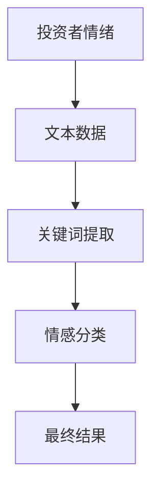
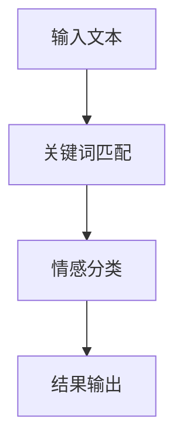
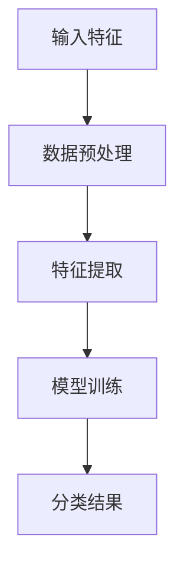
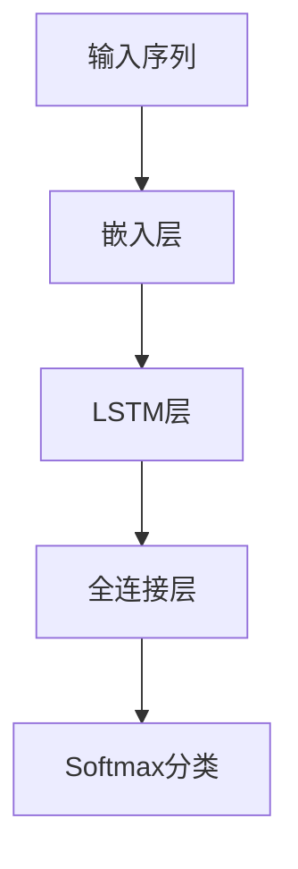
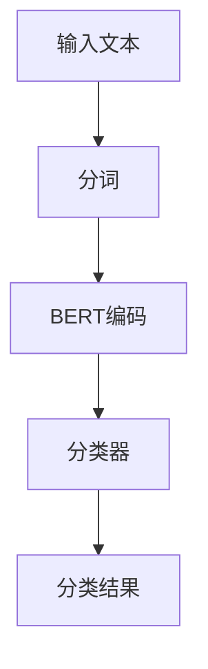
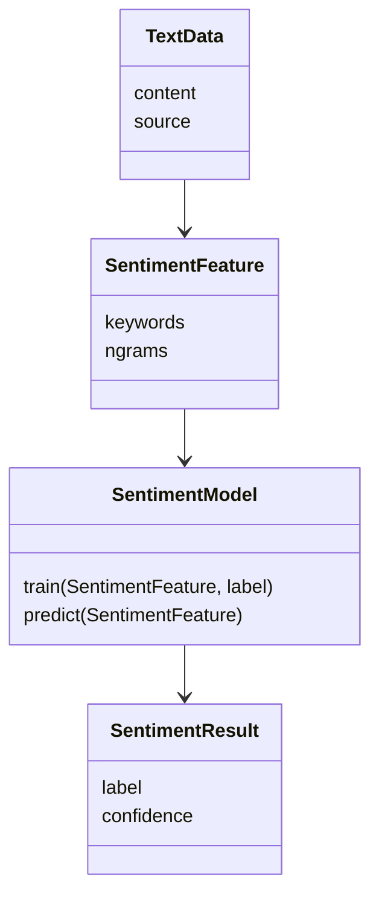
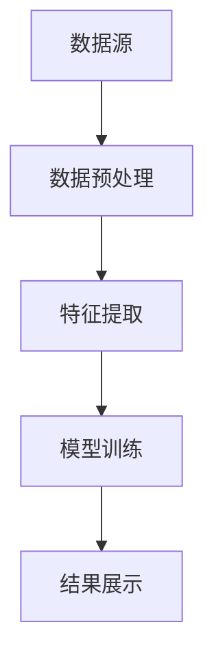
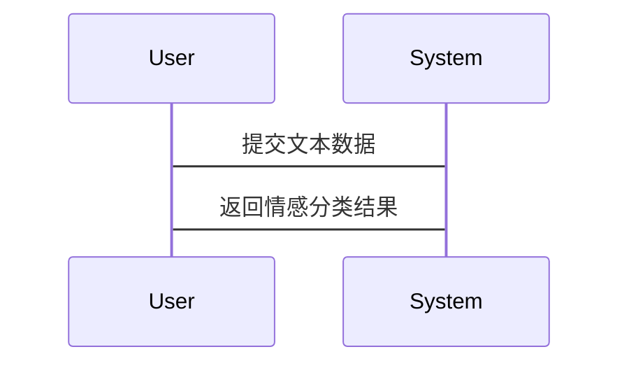

                 


```markdown
# 自然语言处理在投资者情绪分析中的应用

## 关键词
自然语言处理，投资者情绪分析，情感分类，文本特征提取，机器学习模型

## 摘要
自然语言处理（NLP）技术在投资者情绪分析中扮演着越来越重要的角色。投资者情绪分析通过分析文本数据，如社交媒体评论、新闻标题和财经论坛讨论，来评估市场参与者的情绪状态。本文将详细介绍投资者情绪分析的背景、核心概念、算法原理、系统架构、项目实战及最佳实践。通过分析不同算法的优缺点，结合实际案例，探讨如何利用自然语言处理技术有效捕捉市场情绪，辅助投资决策。

---

# 第一部分：背景介绍

## 第1章：背景介绍

### 1.1 自然语言处理与投资者情绪分析

#### 1.1.1 自然语言处理的基本概念
自然语言处理（NLP）是计算机科学、人工智能和语言学的交叉领域，旨在使计算机能够理解、处理和生成人类语言。NLP的核心任务包括文本分类、情感分析、实体识别和机器翻译等。

#### 1.1.2 投资者情绪分析的定义与目标
投资者情绪分析是指通过分析文本数据，识别市场参与者的情绪状态，如乐观、悲观、中立等。其目标是帮助投资者和机构更好地理解市场情绪，辅助投资决策。

#### 1.1.3 问题背景与研究意义
金融市场中，投资者情绪对股价波动有显著影响。通过分析社交媒体、新闻标题和财经论坛中的文本数据，可以捕捉市场情绪的变化，为投资策略提供数据支持。

### 1.2 投资者情绪分析的分类与应用

#### 1.2.1 情感强度分类
情感强度分类旨在量化文本中的情感强度，例如将评论分为“非常积极”、“积极”、“中立”、“消极”和“非常消极”。

#### 1.2.2 情感类别分析
情感类别分析将文本分为特定的情感类别，例如“买入”、“卖出”、“观望”等。

#### 1.2.3 实际应用场景
投资者情绪分析广泛应用于股票预测、风险评估、市场情绪监控和舆情分析等领域。

### 1.3 问题解决与边界

#### 1.3.1 问题解决的核心思路
通过NLP技术提取文本中的情感特征，结合机器学习模型进行分类，评估市场情绪。

#### 1.3.2 问题的边界与限制
- 数据质量：文本数据可能存在噪声和歧义。
- 情感表达的多样性：不同语境下，相同词语可能表达不同情感。
- 数据隐私：涉及个人隐私和敏感信息。

#### 1.3.3 核心要素与概念结构
- **文本数据**：社交媒体评论、新闻标题、财经论坛讨论。
- **情感特征**：关键词、句式结构、情感倾向。
- **情感分类模型**：基于规则的分类、机器学习模型、深度学习模型。

---

# 第二部分：核心概念与联系

## 第2章：核心概念与联系

### 2.1 投资者情绪分析的核心概念

#### 2.1.1 情感分析的定义与属性
情感分析是NLP中的一个重要任务，旨在识别文本中的情感倾向。投资者情绪分析是情感分析在金融领域的具体应用。

#### 2.1.2 文本特征提取的关键点
- **关键词提取**：识别与投资相关的关键词，如“buy”、“sell”、“bull”、“bear”。
- **句式结构**：分析句子的语法结构，判断情感倾向。
- **上下文理解**：考虑语境中的隐含信息。

#### 2.1.3 自然语言处理技术的作用
- **文本预处理**：分词、去停用词、词干提取。
- **特征提取**：将文本转换为数值特征，如词袋模型、TF-IDF。
- **模型训练**：使用机器学习或深度学习模型进行分类。

### 2.2 核心概念的对比分析

#### 2.2.1 情感分析与文本分类的对比
| 对比维度 | 情感分析 | 文本分类 |
|----------|----------|----------|
| 目标      | 判断情感倾向 | 分类到预定义类别 |
| 数据      | 文本数据 | 文本数据 |
| 挑战      | 处理情感歧义 | 处理类别多样性 |

#### 2.2.2 不同模型的性能对比
| 模型类型 | 优点 | 缺点 |
|----------|------|------|
| 基于规则 | 实现简单，易于解释 | 需手动编写规则，难以处理复杂情况 |
| 机器学习 | 高准确性，可处理复杂特征 | 需大量标注数据 |
| 深度学习 | 自动提取特征，效果更好 | 训练时间长，资源消耗大 |

#### 2.2.3 数据特征与模型选择的关联
- 数据量小：基于规则的分类或浅层模型（如Naive Bayes）。
- 数据量大：深度学习模型（如LSTM、BERT）。

### 2.3 ER实体关系图


---

# 第三部分：算法原理讲解

## 第3章：算法原理讲解

### 3.1 基于规则的分类算法

#### 3.1.1 算法流程


#### 3.1.2 Python实现示例
```python
import re

def simple_sentiment_analysis(text):
    positive_keywords = ['buy', 'bull', 'up']
    negative_keywords = ['sell', 'bear', 'down']
    
    positive_score = sum(1 for word in positive_keywords if re.search(r'\b{}\b'.format(word), text))
    negative_score = sum(1 for word in negative_keywords if re.search(r'\b{}\b'.format(word), text))
    
    if positive_score > negative_score:
        return 'Positive'
    elif negative_score > positive_score:
        return 'Negative'
    else:
        return 'Neutral'

text = "This is a bear market!"
print(simple_sentiment_analysis(text))  # 输出: Negative
```

### 3.2 机器学习模型

#### 3.2.1 支持向量机（SVM）
- **数学模型**：寻找一个超平面，将数据分为正负两类。
- **公式**：$$ f(x) = sign(w \cdot x + b) $$
- **流程图**


#### 3.2.2 随机森林
- **优势**：对噪声数据鲁棒，易于处理高维数据。
- **流程图**


### 3.3 深度学习模型

#### 3.3.1 长短期记忆网络（LSTM）
- **优势**：适合处理序列数据，捕捉长距离依赖。
- **公式**：$$ LSTMCell(x_t, h_{t-1}) = (f gates, cell state, output) $$
- **流程图**


#### 3.3.2 BERT
- **优势**：上下文理解能力强，无需大量标注数据。
- **流程图**


---

# 第四部分：系统分析与架构设计方案

## 第4章：系统分析与架构设计方案

### 4.1 问题场景介绍
投资者情绪分析系统需要处理大量文本数据，实时监控市场情绪，提供情感分类结果。

### 4.2 系统功能设计

#### 4.2.1 领域模型


#### 4.2.2 系统架构设计


#### 4.2.3 系统接口设计
- **输入接口**：文本数据输入。
- **输出接口**：情感分类结果、置信度。

#### 4.2.4 系统交互流程


---

# 第五部分：项目实战

## 第5章：项目实战

### 5.1 环境安装
```bash
pip install numpy pandas scikit-learn tensorflow transformers
```

### 5.2 核心代码实现

#### 5.2.1 数据预处理
```python
import pandas as pd
from sklearn.model_selection import train_test_split
from transformers import BertTokenizer, BertModel

def preprocess_data(data):
    texts = data['text'].tolist()
    labels = data['label'].tolist()
    tokenizer = BertTokenizer.from_pretrained('bert-base-uncased')
    encoded_inputs = tokenizer(texts, padding=True, truncation=True, max_length=128)
    return encoded_inputs, labels
```

#### 5.2.2 特征提取与模型训练
```python
import torch
from torch import nn
from torch.utils.data import Dataset, DataLoader

class SentimentClassifier(nn.Module):
    def __init__(self, bert_model, num_classes):
        super().__init__()
        self.bert = bert_model
        self.dropout = nn.Dropout(0.1)
        self.classifier = nn.Linear(bert_model.config.hidden_size, num_classes)
    
    def forward(self, input_ids, attention_mask):
        outputs = self.bert(input_ids=input_ids, attention_mask=attention_mask)
        pooled_output = outputs.last_hidden_state[:, 0, :]
        pooled_output = self.dropout(pooled_output)
        return self.classifier(pooled_output)

# 初始化模型
bert_model = BertModel.from_pretrained('bert-base-uncased')
model = SentimentClassifier(bert_model, num_classes=3)
model.train()
```

#### 5.2.3 模型评估与结果展示
```python
from sklearn.metrics import accuracy_score, confusion_matrix

def evaluate_model(model, dataloader):
    model.eval()
    all_labels = []
    all_preds = []
    for inputs, labels in dataloader:
        with torch.no_grad():
            outputs = model(**inputs)
            preds = outputs.argmax(dim=1).tolist()
        all_labels.extend(labels.tolist())
        all_preds.extend(preds)
    accuracy = accuracy_score(all_labels, all_preds)
    print(f'Accuracy: {accuracy}')
    print(confusion_matrix(all_labels, all_preds))

evaluate_model(model, test_dataloader)
```

### 5.3 实际案例分析
通过分析社交媒体上的投资者评论，展示如何利用上述模型进行情绪分类，并解读结果。

---

# 第六部分：最佳实践

## 第6章：最佳实践

### 6.1 小结
投资者情绪分析是NLP在金融领域的典型应用，具有重要的研究价值和实际意义。

### 6.2 注意事项
- 数据质量：确保数据来源可靠，减少噪声。
- 模型选择：根据数据量和任务需求选择合适的模型。
- 模型调优：通过交叉验证和超参数优化提升性能。

### 6.3 未来发展方向
- **多模态分析**：结合图像、视频等多模态数据进行情绪分析。
- **实时分析**：开发实时情绪监控系统，及时捕捉市场动态。
- **可解释性增强**：提高模型的可解释性，便于投资者理解。

### 6.4 拓展阅读
推荐阅读《自然语言处理实战：基于TensorFlow和Keras》和《Python机器学习：基于Scikit-learn和TensorFlow》。

---

# 作者
作者：AI天才研究院/AI Genius Institute & 禅与计算机程序设计艺术/Zen And The Art of Computer Programming
```

