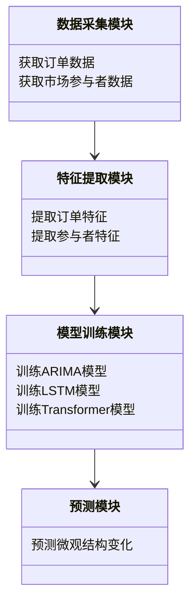
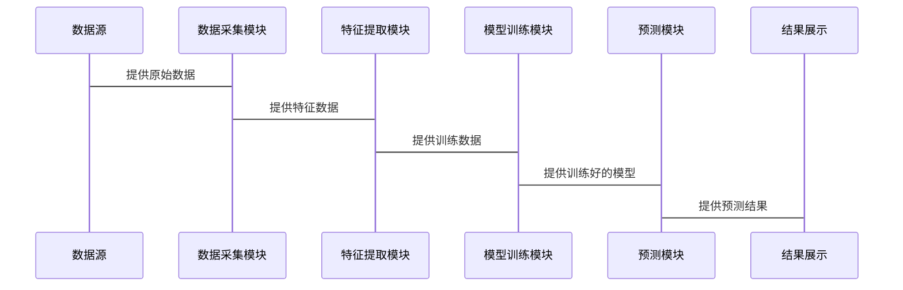

                 


# 金融市场微观结构变化预测模型

---

## 关键词：金融市场，微观结构，时间序列，机器学习，深度学习，预测模型

---

## 摘要：本文系统地介绍了金融市场微观结构变化预测模型的构建与应用。从金融市场的基本概念出发，详细分析了微观结构的核心要素与变化特征，重点探讨了时间序列分析、机器学习和深度学习算法在预测中的应用。通过数学模型和系统架构的设计，结合实际项目案例，展示了如何从数据获取、特征提取到模型部署的完整流程。本文旨在为金融从业者和研究人员提供理论与实践相结合的深度解析。

---

## 第一部分: 金融市场微观结构变化预测模型概述

---

### 第1章: 金融市场微观结构概述

#### 1.1 金融市场微观结构的基本概念

##### 1.1.1 金融市场的定义与分类

金融市场是资金流动的核心场所，分为场内市场和场外市场，涵盖股票、债券、期货等多种金融工具。微观结构关注市场的基础组成，包括订单簿、参与者行为和交易规则。

##### 1.1.2 微观结构的核心要素

- **订单簿**：记录买方和卖方的订单，反映市场参与者的交易意愿。
- **参与者行为**：机构投资者、个人投资者和做市商的行为模式影响市场流动性和价格波动。
- **交易规则**：撮合机制、交易费用和市场深度影响市场微观结构的变化。

##### 1.1.3 微观结构变化的定义与特征

微观结构变化是指市场参与者的订单行为、价格波动和交易量的变化。这些变化通常表现为跳跃性、短期性和非线性特征。

#### 1.2 金融市场微观结构变化的预测意义

##### 1.2.1 微观结构变化对市场的影响

- 影响市场流动性：高波动性可能导致流动性下降，影响交易效率。
- 影响价格发现：微观结构变化影响价格的形成过程，影响市场定价效率。
- 影响风险管理：预测微观结构变化有助于识别市场风险，制定有效的风险管理策略。

##### 1.2.2 预测模型在金融实践中的应用

- **高频交易**：利用微观结构变化预测模型进行高频交易策略优化。
- **风险管理**：预测微观结构变化有助于识别市场风险，提前采取应对措施。
- **市场微观结构分析**：帮助研究者理解市场运作机制，优化市场设计。

##### 1.2.3 预测模型的挑战与机遇

- **挑战**：数据复杂性高，噪声多，模型易受市场操纵影响。
- **机遇**：利用先进的算法和大数据技术，可以更准确地捕捉微观结构变化。

#### 1.3 本书的核心内容与目标

##### 1.3.1 本书的研究范围

- 金融市场微观结构的核心要素。
- 微观结构变化的预测方法。
- 预测模型的构建与优化。

##### 1.3.2 本书的核心目标

- 提供金融市场微观结构变化预测的系统性方法论。
- 结合实际案例，展示如何构建和优化预测模型。
- 为金融从业者和研究人员提供理论与实践相结合的指导。

##### 1.3.3 本书的结构安排

- 第一部分：介绍金融市场微观结构的基本概念和预测意义。
- 第二部分：详细讲解预测模型的算法原理和数学模型。
- 第三部分：系统架构设计与项目实战。
- 第四部分：总结与展望。

---

### 第2章: 金融市场微观结构变化预测的核心概念

#### 2.1 微观结构变化的实体关系模型

##### 2.1.1 实体关系图（ER图）

```mermaid
erDiagram
    participant 订单
    participant 订单簿
    participant 市场参与者
    participant 交易规则
    订单 --> 订单簿 : 存储
    市场参与者 --> 订单 : 下达
    交易规则 --> 订单 : 受限于
```

#### 2.2 微观结构变化预测的关键属性特征

##### 2.2.1 属性特征对比表格

| 属性 | 特征 | 描述 |
|------|------|------|
| 时间 | 连续性 | 价格变化连续 |
| 参与者 | 多样性 | 包括机构和个人投资者 |
| 价格 | 波动性 | 高波动性 |
| 交易量 | 集中性 | 交易量集中在某些时间段 |

---

## 第二部分: 金融市场微观结构变化预测的算法原理

---

### 第3章: 时间序列分析模型

#### 3.1 ARIMA模型原理

ARIMA（自回归积分滑动平均模型）是一种广泛应用于时间序列分析的模型。其核心思想是利用过去的价格变化来预测未来的价格变化。

##### 3.1.1 ARIMA模型的数学公式

$$ ARIMA(p, d, q) = y_t = \phi_1 y_{t-1} + \phi_2 y_{t-2} + \dots + \phi_p y_{t-p} + \theta_1 \epsilon_{t-1} + \theta_2 \epsilon_{t-2} + \dots + \theta_q \epsilon_{t-q} + \epsilon_t $$

其中：
- \( p \) 是自回归阶数。
- \( d \) 是差分阶数。
- \( q \) 是滑动平均阶数。

##### 3.1.2 ARIMA模型的训练流程


---

### 第4章: 机器学习模型

#### 4.1 LSTM模型原理

LSTM（长短期记忆网络）是一种特殊的RNN（循环神经网络），能够有效捕捉时间序列中的长期依赖关系。

##### 4.1.1 LSTM模型的数学公式

$$ f_t = \sigma(W_f \cdot [h_{t-1}, x_t] + b_f) $$
$$ i_t = \sigma(W_i \cdot [h_{t-1}, x_t] + b_i) $$
$$ o_t = \sigma(W_o \cdot [h_{t-1}, x_t] + b_o) $$
$$ c_t = f_t \cdot c_{t-1} + i_t \cdot tanh(W_c \cdot [h_{t-1}, x_t] + b_c) $$
$$ h_t = o_t \cdot tanh(c_t) $$

其中：
- \( f_t \) 是遗忘门。
- \( i_t \) 是输入门。
- \( o_t \) 是输出门。
- \( c_t \) 是细胞状态。
- \( h_t \) 是隐藏层状态。

##### 4.1.2 LSTM模型的训练流程


---

### 第5章: 深度学习模型

#### 5.1 Transformer模型原理

Transformer是一种基于自注意力机制的深度学习模型，近年来在自然语言处理领域取得了突破性进展。

##### 5.1.1 Transformer模型的数学公式

$$ \text{Attention}(Q, K, V) = \text{softmax}\left(\frac{QK^T}{\sqrt{d_k}}\right)V $$

其中：
- \( Q \) 是查询向量。
- \( K \) 是键向量。
- \( V \) 是值向量。
- \( d_k \) 是向量维度。

##### 5.1.2 Transformer模型的训练流程


---

## 第三部分: 金融市场微观结构变化预测的系统架构设计

---

### 第6章: 系统架构设计

#### 6.1 系统功能设计

##### 6.1.1 领域模型（Mermaid类图）



#### 6.2 系统架构设计

##### 6.2.1 系统架构图（Mermaid架构图）


#### 6.3 系统接口设计

##### 6.3.1 系统交互流程（Mermaid序列图）



---

## 第四部分: 金融市场微观结构变化预测的项目实战

---

### 第7章: 项目实战

#### 7.1 项目环境安装与配置

##### 7.1.1 Python环境安装

```bash
python --version
pip install --upgrade pip
```

##### 7.1.2 依赖库安装

```bash
pip install numpy pandas scikit-learn tensorflow
```

#### 7.2 数据获取与预处理

##### 7.2.1 数据清洗代码

```python
import pandas as pd

# 加载数据
df = pd.read_csv('market_data.csv')

# 删除缺失值
df.dropna(inplace=True)

# 标准化处理
from sklearn.preprocessing import StandardScaler

scaler = StandardScaler()
df[['open', 'high', 'low', 'close']] = scaler.fit_transform(df[['open', 'high', 'low', 'close']])
```

##### 7.2.2 数据特征提取代码

```python
from sklearn.feature_selection import SelectKBest

selector = SelectKBest(k=5)
selector.fit_transform(df[['open', 'high', 'low', 'close']], df['volume'])
```

#### 7.3 模型训练与优化

##### 7.3.1 模型训练代码

```python
from tensorflow.keras.models import Sequential
from tensorflow.keras.layers import LSTM, Dense

model = Sequential()
model.add(LSTM(64, input_shape=(timesteps, features)))
model.add(Dense(1))
model.compile(loss='mean_squared_error', optimizer='adam')
model.fit(X_train, y_train, epochs=100, batch_size=32)
```

##### 7.3.2 模型调优代码

```python
from tensorflow.keras.callbacks import EarlyStopping

early_stop = EarlyStopping(monitor='val_loss', patience=5)
model.fit(X_train, y_train, epochs=100, batch_size=32, validation_data=(X_test, y_test), callbacks=[early_stop])
```

#### 7.4 模型部署与预测

##### 7.4.1 模型部署代码

```python
import joblib

model.save('model.h5')
joblib.dump(scaler, 'scaler.pkl')
```

##### 7.4.2 预测结果分析

```python
import numpy as np

# 加载模型和数据
model = load_model('model.h5')
scaler = joblib.load('scaler.pkl')

# 预测数据
X_new = scaler.transform(X_new)
y_pred = model.predict(X_new)
```

---

## 第五部分: 总结与展望

---

### 第8章: 总结与展望

#### 8.1 本书的核心总结

##### 8.1.1 主要内容回顾

- 介绍了金融市场微观结构的基本概念。
- 探讨了时间序列分析、机器学习和深度学习算法的应用。
- 展示了从数据获取到模型部署的完整流程。

##### 8.1.2 关键点总结

- 数据质量对模型性能的影响至关重要。
- 算法选择需要结合实际问题和数据特征。
- 系统架构设计需要模块化和可扩展性。

#### 8.2 未来研究方向

##### 8.2.1 新算法探索

- 结合强化学习和图神经网络，探索更高效的预测方法。

##### 8.2.2 数据源扩展

- 引入更多的市场数据源，如社交媒体数据和新闻数据，提升模型预测能力。

#### 8.3 最佳实践与注意事项

##### 8.3.1 数据质量的重要性

- 数据清洗和特征工程是模型性能的关键。

##### 8.3.2 模型调优的必要性

- 使用交叉验证和超参数优化提升模型性能。

##### 8.3.3 系统架构的可扩展性

- 设计模块化架构，便于未来扩展和维护。

##### 8.3.4 拓展阅读推荐

- "Financial Market Microstructure" by J.C. Stochastic
- "Deep Learning for Time Series Forecasting" by Dr. Jason Brownlee

---

## 作者：AI天才研究院/AI Genius Institute & 禅与计算机程序设计艺术 /Zen And The Art of Computer Programming

--- 

感谢您的阅读！

