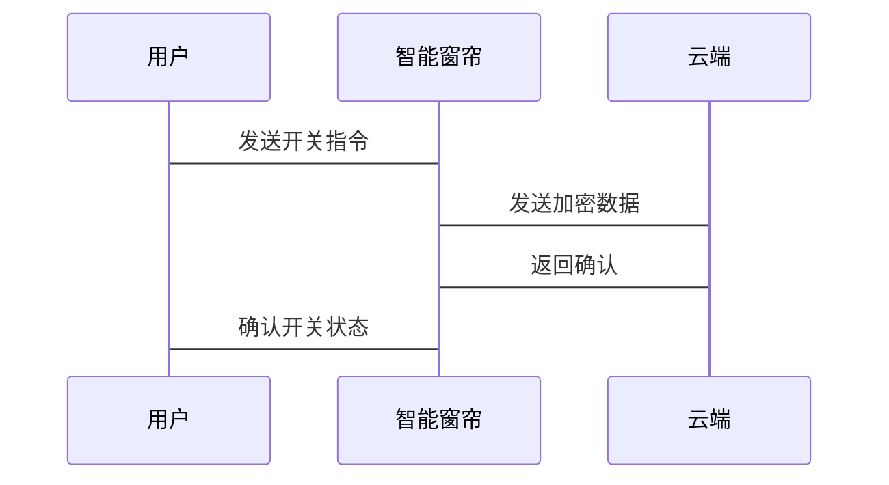
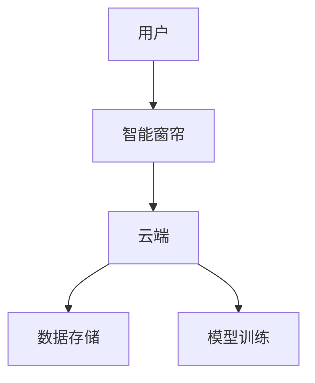

                 


# AI Agent在智能窗帘中的隐私保护

## 关键词：
AI Agent, 智能窗帘, 隐私保护, 数据加密, 差分隐私, 智能家居

## 摘要：
本文探讨了AI Agent在智能窗帘中的隐私保护问题，分析了AI Agent的基本概念、隐私保护机制及其在智能窗帘中的应用。通过数据加密、匿名化和差分隐私等技术，本文提出了保护智能窗帘中用户隐私的具体方法，并详细讲解了算法原理和系统设计。最后，通过实际案例分析，本文展示了如何在智能窗帘系统中实现高效的隐私保护。

---

# 第一部分: AI Agent与智能窗帘的背景介绍

## 第1章: AI Agent的基本概念与隐私保护

### 1.1 AI Agent的定义与特点
#### 1.1.1 AI Agent的定义
AI Agent（人工智能代理）是一种智能实体，能够感知环境、自主决策并执行任务。它通过传感器获取信息，利用算法进行分析，然后采取行动以实现目标。

#### 1.1.2 AI Agent的核心特点
- **自主性**：AI Agent能够自主决策，无需外部干预。
- **反应性**：能够实时感知环境变化并做出反应。
- **目标导向**：所有行动均以实现特定目标为导向。
- **学习能力**：能够通过数据和经验不断优化自身行为。

#### 1.1.3 AI Agent与传统自动化系统的区别
| 特性                | AI Agent                          | 传统自动化系统                    |
|---------------------|-----------------------------------|-----------------------------------|
| 决策能力            | 具备自主决策能力                 | 依赖预设规则，无自主决策能力     |
| 学习能力            | 能够学习和优化                   | 无法学习和优化                   |
| 环境适应能力        | 能够适应动态变化的环境           | 适应性较差                     |
| 交互能力            | 支持复杂的人机交互               | 交互方式简单，通常为单向控制     |

### 1.2 智能窗帘的基本概念
#### 1.2.1 智能窗帘的定义
智能窗帘是一种结合了物联网（IoT）和人工智能技术的智能家居设备，能够通过传感器和网络连接实现远程控制和自动化操作。

#### 1.2.2 智能窗帘的功能与应用场景
- **远程控制**：通过手机APP或语音助手（如Alexa、Siri）远程开关窗帘。
- **自动化控制**：根据光照强度、时间或用户习惯自动调节窗帘开合。
- **环境监测**：集成温湿度传感器，联动空调或加湿器调节室内环境。
- **安全监控**：与智能门锁、摄像头联动，提供额外的安全防护。

#### 1.2.3 智能窗帘的系统架构
智能窗帘的系统架构通常包括以下几个部分：
1. **传感器**：用于采集环境数据，如光照强度、温度、湿度等。
2. **执行器**：负责执行开关窗帘的动作。
3. **通信模块**：通过Wi-Fi或蓝牙与手机或其他智能设备连接。
4. **控制模块**：包含AI Agent，负责数据处理、决策和控制。

### 1.3 隐私保护的重要性
#### 1.3.1 隐私保护的基本概念
隐私保护是指在收集、存储、处理和传输个人信息时，确保这些信息不会被未经授权的第三方访问或滥用。

#### 1.3.2 智能设备中的隐私风险
智能窗帘可能面临以下隐私风险：
- **数据泄露**：未经授权的第三方可能获取用户的使用习惯、作息时间等信息。
- **恶意攻击**：黑客可能通过网络漏洞远程控制窗帘，甚至获取家庭网络权限。
- **数据滥用**：设备制造商可能滥用收集的数据进行商业用途。

#### 1.3.3 AI Agent在隐私保护中的作用
AI Agent可以通过以下方式增强智能窗帘的隐私保护：
- **数据加密**：在传输和存储过程中对敏感数据进行加密，防止数据泄露。
- **隐私计算**：在不泄露原始数据的前提下，进行数据处理和分析。
- **行为分析**：通过分析用户的使用习惯，识别异常行为并及时发出警报。

## 第2章: AI Agent在智能窗帘中的应用背景

### 2.1 智能家居的发展趋势
#### 2.1.1 智能家居的现状
智能家居市场近年来发展迅速，全球智能家居设备出货量持续增长。根据市场研究机构的数据，智能家居市场预计将在未来几年保持两位数的增长率。

#### 2.1.2 AI技术在智能家居中的应用
AI技术在智能家居中的应用越来越广泛，包括：
- **语音控制**：通过自然语言处理技术实现智能音箱的语音交互。
- **行为预测**：通过机器学习算法预测用户的使用习惯，优化设备的自动化控制。
- **环境优化**：根据室内环境数据，自动调节温度、湿度等参数，提供更舒适的居住环境。

#### 2.1.3 智能窗帘在智能家居中的地位
智能窗帘是智能家居的重要组成部分，其不仅可以提供基本的遮光和隐私保护功能，还可以通过与其它智能家居设备的联动，实现更复杂的场景控制。

### 2.2 隐私保护的挑战与需求
#### 2.2.1 用户隐私的潜在威胁
智能窗帘可能面临以下隐私威胁：
- **数据收集**：设备制造商可能收集用户的使用数据，包括开关窗帘的时间、频率等。
- **网络攻击**：黑客可能通过漏洞攻击智能窗帘，获取家庭网络权限。
- **数据滥用**：收集的数据可能被用于商业广告或其他非授权用途。

#### 2.2.2 法律法规对隐私保护的要求
随着数据保护法规的不断完善，如欧盟的《通用数据保护条例》（GDPR）和美国的《加州消费者隐私法案》（CCPA），企业需要更加严格地保护用户数据，确保用户隐私不被侵犯。

#### 2.2.3 市场对隐私保护的需求
消费者越来越关注隐私保护问题，特别是在智能家居设备普及的背景下。用户在选择智能窗帘时，更倾向于选择那些具备强大隐私保护功能的产品。

### 2.3 AI Agent在隐私保护中的应用前景
#### 2.3.1 AI Agent如何提升隐私保护
AI Agent可以通过以下方式提升智能窗帘的隐私保护：
- **数据加密**：在数据传输和存储过程中使用加密技术，防止数据被窃取。
- **隐私计算**：在不泄露原始数据的前提下，进行数据处理和分析。
- **行为分析**：通过分析用户的使用习惯，识别异常行为并及时发出警报。

#### 2.3.2 智能窗帘中隐私保护的关键技术
- **数据加密技术**：如AES（高级加密标准）用于数据加密。
- **差分隐私**：通过在数据中添加噪声，保护个体数据的隐私。
- **联邦学习**：在不共享原始数据的前提下，通过协作学习提升模型性能。

#### 2.3.3 未来发展趋势
随着AI技术的不断进步，智能窗帘的隐私保护将更加智能化和个性化。未来的隐私保护技术可能会更加注重数据的匿名化和不可逆性，确保用户数据的安全。

---

# 第二部分: AI Agent的隐私保护原理

## 第3章: AI Agent的隐私保护机制

### 3.1 数据加密技术
#### 3.1.1 数据加密的基本原理
数据加密是通过将原始数据转换为不可读的格式，防止未经授权的第三方访问。加密技术可以分为对称加密和非对称加密两种。

#### 3.1.2 对称加密与非对称加密的对比
| 特性                | 对称加密                          | 非对称加密                          |
|---------------------|-----------------------------------|-----------------------------------|
| 密钥管理            | 使用一个密钥进行加密和解密        | 使用公钥和私钥，公钥用于加密，私钥用于解密 |
| 加密速度            | 加密和解密速度快                  | 加密和解密速度较慢                  |
| 适用场景            | 适用于数据量大的场景              | 适用于需要身份验证的场景            |

#### 3.1.3 数据加密在智能窗帘中的应用
在智能窗帘中，数据加密主要用于保护用户的使用数据，例如用户的开关窗帘记录、位置信息等。通过AES加密算法，可以有效防止这些数据被未经授权的第三方获取。

### 3.2 数据匿名化技术
#### 3.2.1 数据匿名化的定义
数据匿名化是指通过技术手段将数据中的个人身份信息去除或变形，使得数据无法被关联到具体个人。

#### 3.2.2 数据匿名化的实现方法
数据匿名化可以通过以下几种方法实现：
- **数据去标识化**：去除数据中的唯一标识符。
- **数据泛化**：将具体数据转化为更泛化的数据，例如将具体年龄转化为年龄范围。
- **数据扰乱**：在数据中添加噪声，使得数据无法被准确识别。

#### 3.2.3 数据匿名化在智能窗帘中的应用
在智能窗帘中，数据匿名化技术可以用于保护用户的使用习惯数据。例如，设备可以将用户的开关窗帘时间转化为时间段数据，而不是具体的日期和时间。

### 3.3 差分隐私技术
#### 3.3.1 差分隐私的基本原理
差分隐私是一种通过在数据中添加噪声，使得相邻数据集之间的差异在统计上不可区分，从而保护个体隐私的技术。

#### 3.3.2 差分隐私在智能窗帘中的应用
差分隐私可以用于保护用户的使用数据。例如，设备可以在用户的开关窗帘记录中添加噪声，使得攻击者无法准确推断出用户的使用习惯。

#### 3.3.3 差分隐私的优势
- **隐私保护**：通过添加噪声，可以有效防止数据泄露。
- **数据可用性**：在保护隐私的同时，仍然可以进行数据分析和统计。

---

## 第4章: AI Agent的隐私保护算法

### 4.1 数据加密算法
#### 4.1.1 AES加密算法
AES（高级加密标准）是一种广泛使用的加密算法，支持128、192和256位的密钥长度。它具有加密速度快、安全性高等特点，非常适合用于智能窗帘的数据加密。

#### 4.1.2 AES加密算法的实现
以下是一个AES加密算法的Python实现示例：

```python
from cryptography.hazmat.primitives.ciphers import Cipher, algorithms, modes
from cryptography.hazmat.primitives.asymmetric import padding
from cryptography.hazmat.primitives import hashes
from cryptography.hazmat.backends import default_backend

def aes_encrypt(plaintext, key):
    backend = default_backend()
    cipher = Cipher(algorithms.AES(key), modes.ECB(), backend)
    encryptor = cipher.encryptor()
    ciphertext = encryptor.update(plaintext) + encryptor.finalize()
    return ciphertext

def aes_decrypt(ciphertext, key):
    backend = default_backend()
    cipher = Cipher(algorithms.AES(key), modes.ECB(), backend)
    decryptor = cipher.decryptor()
    plaintext = decryptor.update(ciphertext) + decryptor.finalize()
    return plaintext
```

### 4.2 差分隐私算法
#### 4.2.1 差分隐私的数学模型
差分隐私的数学模型可以表示为：

$$
\text{Privacy} = \epsilon \times \text{Distance}(D, D')
$$

其中，$$\epsilon$$ 是隐私预算，$$\text{Distance}(D, D')$$ 是数据集之间的距离。

#### 4.2.2 差分隐私在智能窗帘中的应用
差分隐私可以用于保护用户的开关窗帘记录。例如，设备可以在用户的记录中添加噪声，使得攻击者无法准确推断出用户的使用习惯。

### 4.3 隐私保护算法的实现
以下是一个简单的差分隐私实现示例：

```python
import random

def add_noise(data, epsilon):
    noise = random.laplace(0, 1/epsilon)
    noisy_data = data + noise
    return noisy_data

# 示例数据
data = 10
epsilon = 0.1

noisy_data = add_noise(data, epsilon)
print(f"原始数据: {data}")
print(f"噪声数据: {noisy_data}")
```

---

## 第5章: 系统分析与架构设计

### 5.1 系统架构设计
智能窗帘的隐私保护系统架构包括以下几个部分：
1. **用户端**：包括手机APP和语音助手，用于用户控制窗帘和查看隐私设置。
2. **设备端**：包括智能窗帘硬件和AI Agent，负责数据采集、处理和执行。
3. **云端**：用于存储加密的用户数据和模型训练。

### 5.2 系统功能设计
#### 5.2.1 用户隐私设置
用户可以通过APP设置隐私保护级别，例如选择是否共享使用数据，以及数据保留时间。

#### 5.2.2 数据加密与传输
所有数据在传输过程中均采用AES加密，确保数据不会被未经授权的第三方获取。

#### 5.2.3 异常行为检测
AI Agent可以通过分析用户的使用习惯，识别异常行为并及时发出警报。

### 5.3 系统交互设计
#### 5.3.1 系统交互流程
以下是一个简单的系统交互流程图：



#### 5.3.2 系统架构图
以下是一个系统架构图：



---

## 第6章: 项目实战

### 6.1 环境安装
#### 6.1.1 安装Python和相关库
```bash
pip install cryptography
pip install mermaid
```

### 6.2 核心代码实现
#### 6.2.1 数据加密实现
```python
from cryptography.hazmat.primitives.ciphers import Cipher, algorithms, modes
from cryptography.hazmat.primitives.asymmetric import padding
from cryptography.hazmat.primitives import hashes
from cryptography.hazmat.backends import default_backend

def aes_encrypt(plaintext, key):
    backend = default_backend()
    cipher = Cipher(algorithms.AES(key), modes.ECB(), backend)
    encryptor = cipher.encryptor()
    ciphertext = encryptor.update(plaintext) + encryptor.finalize()
    return ciphertext

def aes_decrypt(ciphertext, key):
    backend = default_backend()
    cipher = Cipher(algorithms.AES(key), modes.ECB(), backend)
    decryptor = cipher.decryptor()
    plaintext = decryptor.update(ciphertext) + decryptor.finalize()
    return plaintext
```

#### 6.2.2 差分隐私实现
```python
import random

def add_noise(data, epsilon):
    noise = random.laplace(0, 1/epsilon)
    noisy_data = data + noise
    return noisy_data

# 示例数据
data = 10
epsilon = 0.1

noisy_data = add_noise(data, epsilon)
print(f"原始数据: {data}")
print(f"噪声数据: {noisy_data}")
```

### 6.3 实际案例分析
以下是一个实际案例分析：
- **场景描述**：用户在不同时间开关窗帘，AI Agent需要保护用户的隐私。
- **数据加密**：用户的开关记录通过AES加密算法进行加密。
- **隐私保护**：通过差分隐私技术，确保用户的使用习惯数据不会被泄露。

---

## 第7章: 最佳实践与小结

### 7.1 最佳实践
1. **数据加密**：所有敏感数据在传输和存储过程中均需加密。
2. **隐私计算**：采用隐私计算技术，如差分隐私和联邦学习，保护用户数据。
3. **行为分析**：通过分析用户的使用习惯，识别异常行为并及时发出警报。

### 7.2 小结
本文详细探讨了AI Agent在智能窗帘中的隐私保护问题，分析了隐私保护的重要性，提出了多种隐私保护技术，并通过实际案例分析展示了如何在智能窗帘系统中实现高效的隐私保护。

### 7.3 注意事项
- **数据安全**：确保数据加密和隐私保护技术的正确实施。
- **用户隐私**：尊重用户的隐私设置，避免数据滥用。
- **系统维护**：定期更新系统和算法，应对新的安全威胁。

### 7.4 拓展阅读
- 《Data Privacy and Security in Smart Homes》
- 《Applied Cryptography: Protocols, Algorithms, and Source Code in C》
- 《Differential Privacy: A Survey of the State-of-the-Art》

---

# 作者：AI天才研究院 & 禅与计算机程序设计艺术

