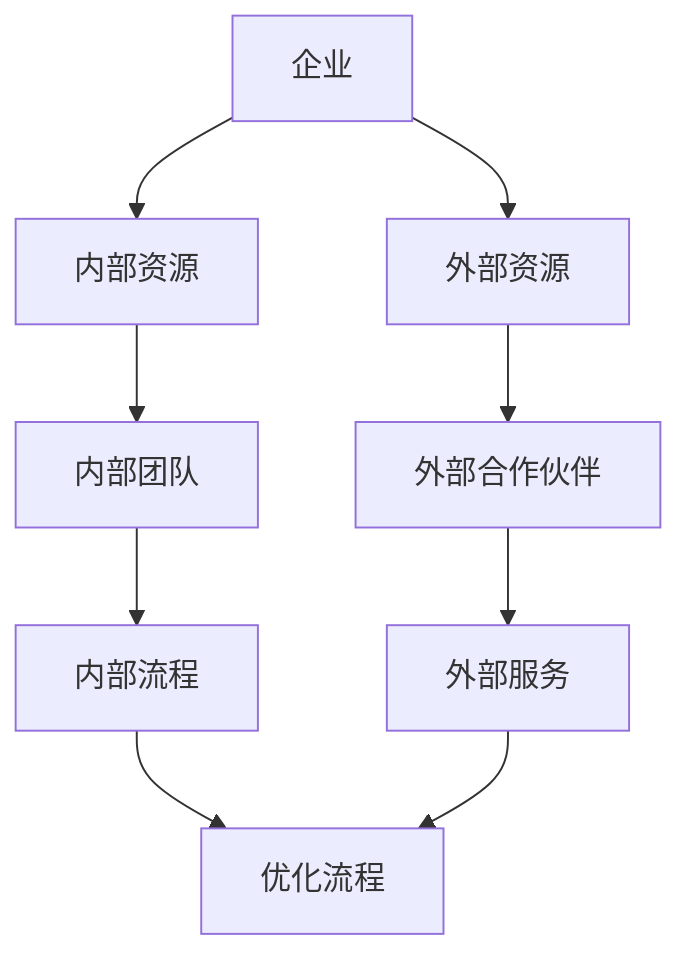
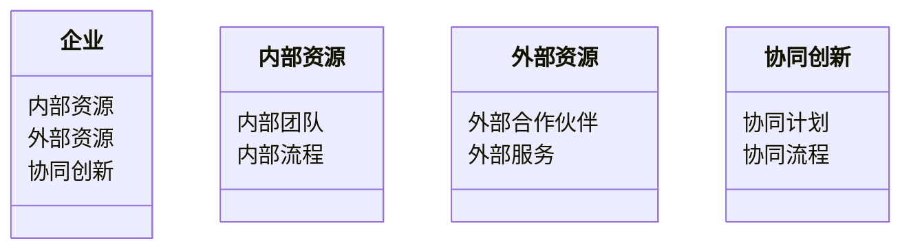
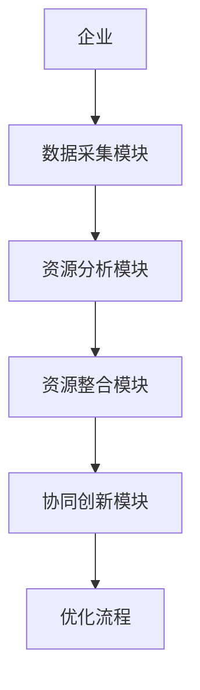
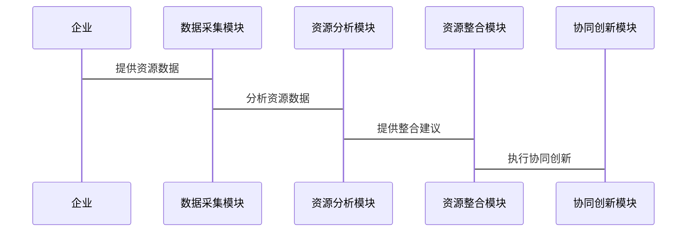

                 


# AI驱动的企业创新生态系统：内外部资源整合

> 关键词：AI，企业创新，生态系统，资源整合，协同创新，数字化转型

> 摘要：本文探讨了AI如何驱动企业创新生态系统的发展，重点分析了内外部资源整合的关键策略。通过详细阐述AI在企业创新中的应用，结合实际案例和系统架构设计，本文为企业构建高效的创新生态系统提供了实践指导。

---

# 第1章：企业创新与AI驱动的概述

## 1.1 企业创新的背景与挑战

### 1.1.1 传统企业创新模式的局限性
传统企业创新模式依赖于内部资源的优化和线性思维，难以快速响应市场变化和消费者需求。例如，许多企业在产品开发过程中，往往从市场调研到产品设计、生产、销售，形成一条固定的链条。这种模式在面对快速变化的市场时，容易因内部资源的局限性而错失创新机会。

### 1.1.2 数字化转型对企业创新的推动作用
数字化转型为企业提供了新的工具和方法，AI技术的应用使得企业能够更高效地分析数据、优化流程、预测趋势。例如，通过AI驱动的数据分析，企业可以实时了解消费者需求的变化，从而更快地调整产品策略。

### 1.1.3 AI技术在企业创新中的应用潜力
AI技术在企业创新中的应用潜力巨大，尤其是在数据驱动的决策、自动化流程优化、智能产品设计等方面。例如，AI可以通过分析大量的市场数据，帮助企业发现新的商业机会。

---

## 1.2 AI驱动的创新生态系统概念

### 1.2.1 创新生态系统的定义与特征
创新生态系统是一个由企业内外部资源和利益相关者共同构成的网络，通过协同合作实现创新目标。其核心特征包括开放性、协同性和动态性。

### 1.2.2 AI在创新生态系统中的角色
AI技术在创新生态系统中扮演着关键角色，包括数据处理、模型构建、预测分析等。例如，AI可以通过自然语言处理技术分析大量的专利数据，帮助企业发现新的技术趋势。

### 1.2.3 企业内外部资源整合的必要性
企业内外部资源整合是构建创新生态系统的核心任务，通过整合内部资源（如研发团队、生产设备）和外部资源（如合作伙伴、第三方服务），企业可以更高效地实现创新目标。

---

## 1.3 本章小结

本章介绍了企业创新的背景与挑战，探讨了AI技术在企业创新中的应用潜力，提出了AI驱动的创新生态系统的概念，并强调了企业内外部资源整合的必要性。

---

# 第2章：企业内外部资源整合的机制

## 2.1 内部资源整合的策略

### 2.1.1 内部资源整合的定义与目标
内部资源整合是指企业通过优化内部资源（如人力资源、技术资源）的配置，提高创新效率。例如，通过AI技术优化内部流程，减少重复劳动，提高效率。

### 2.1.2 内部资源整合的关键要素
内部资源整合的关键要素包括组织结构、流程优化、技术平台等。例如，企业可以通过引入AI工具优化内部流程，减少人工干预。

### 2.1.3 内部资源整合的流程与方法
内部资源整合的流程包括需求分析、资源评估、资源配置、过程监控等。例如，企业可以通过AI技术分析内部资源的使用情况，优化资源配置。

---

## 2.2 外部资源整合的策略

### 2.2.1 外部资源整合的定义与目标
外部资源整合是指企业通过与外部合作伙伴（如供应商、客户、第三方服务提供商）协同合作，获取外部资源支持创新。例如，企业可以通过与第三方AI服务提供商合作，引入先进的AI技术。

### 2.2.2 外部资源整合的关键要素
外部资源整合的关键要素包括合作伙伴选择、资源整合方式、协同机制等。例如，企业可以通过选择合适的合作伙伴，建立长期的协同创新关系。

### 2.2.3 外部资源整合的流程与方法
外部资源整合的流程包括需求分析、合作伙伴筛选、资源整合、过程监控等。例如，企业可以通过AI技术分析外部合作伙伴的能力，选择最适合的合作伙伴。

---

## 2.3 内外部资源整合的协同机制

### 2.3.1 协同整合的定义与目标
协同整合是指企业通过内外部资源的协同合作，实现创新目标。例如，企业可以通过内部团队与外部合作伙伴协同，共同开发新产品。

### 2.3.2 协同整合的关键要素
协同整合的关键要素包括协同目标、协同方式、协同机制等。例如，企业可以通过制定协同计划，明确协同目标和协同方式。

### 2.3.3 协同整合的流程与方法
协同整合的流程包括需求分析、资源整合、协同计划制定、过程监控等。例如，企业可以通过AI技术分析内外部资源的协同潜力，制定最优的协同计划。

---

## 2.4 核心概念属性对比表

| **属性**       | **内部资源整合**       | **外部资源整合**       | **协同整合**       |
|----------------|-----------------------|-----------------------|-------------------|
| **目标**       | 提高内部效率           | 获取外部资源           | 实现内外协同       |
| **关键要素**   | 内部资源优化           | 外部资源引入           | 协同机制设计       |
| **流程**       | 内部流程优化           | 外部资源整合           | 协同流程设计       |

---

## 2.5 实体关系图（ER图）



---

## 2.6 本章小结

本章详细探讨了企业内外部资源整合的策略，包括内部资源整合、外部资源整合以及内外部资源整合的协同机制，并通过对比分析和ER图展示了资源整合的核心概念和实现路径。

---

# 第3章：AI驱动的企业创新生态系统的核心算法与实现

## 3.1 算法原理

### 3.1.1 基于AI的资源整合算法概述
基于AI的资源整合算法是一种通过机器学习和自然语言处理技术，优化企业内外部资源整合效率的方法。例如，可以通过训练一个AI模型，分析企业内外部资源的需求和能力，自动匹配最优的资源整合方案。

### 3.1.2 算法的核心数学模型
以下是基于AI的资源整合算法的核心数学模型：

$$
\text{优化目标} = \arg \max_{x} \left( \sum_{i=1}^{n} w_i x_i - \sum_{j=1}^{m} c_j y_j \right)
$$

其中，\( x_i \) 表示内部资源的使用量，\( w_i \) 表示内部资源的权重，\( y_j \) 表示外部资源的使用量，\( c_j \) 表示外部资源的成本。

### 3.1.3 算法实现步骤
以下是算法的实现步骤：

1. 数据收集：收集企业内外部资源的相关数据，包括内部资源的使用情况、外部合作伙伴的能力等。
2. 数据预处理：对收集的数据进行清洗和特征提取。
3. 模型训练：使用机器学习算法（如线性回归、支持向量机）训练模型。
4. 模型优化：通过交叉验证等方法优化模型参数。
5. 模型部署：将优化后的模型部署到企业系统中，实现资源的自动匹配和优化。

---

## 3.2 算法实现代码

以下是一个简单的Python代码示例：

```python
import numpy as np
from sklearn import linear_model

# 数据准备
X = np.array([[x1, x2, ..., xn], [...]])  # 内部资源特征
y = np.array([y1, y2, ..., ym])           # 外部资源需求

# 模型训练
model = linear_model.LinearRegression()
model.fit(X, y)

# 模型预测
predicted = model.predict(X)
```

---

## 3.3 算法的优化与调优

### 3.3.1 算法的优化方法
可以通过增加数据量、调整模型参数、使用更复杂的算法（如随机森林、神经网络）来优化算法性能。

### 3.3.2 算法的调优技巧
例如，通过交叉验证选择最优的模型参数，或者使用网格搜索方法进行参数调优。

---

## 3.4 本章小结

本章详细介绍了基于AI的资源整合算法的核心原理和实现步骤，并通过Python代码示例展示了算法的具体实现。

---

# 第4章：系统分析与架构设计方案

## 4.1 问题场景介绍

### 4.1.1 问题背景
企业需要通过AI技术优化内外部资源整合，提高创新效率。

### 4.1.2 问题描述
企业在资源整合过程中面临资源分散、协同效率低等问题，需要通过AI技术实现资源的高效整合。

### 4.1.3 问题解决
通过构建AI驱动的创新生态系统，优化企业内外部资源整合，提高创新效率。

---

## 4.2 系统功能设计

### 4.2.1 系统功能模块划分
系统功能模块包括数据采集模块、资源分析模块、资源整合模块、协同创新模块等。

### 4.2.2 领域模型设计
以下是领域模型设计的类图：



---

## 4.3 系统架构设计

### 4.3.1 系统架构设计
以下是系统架构设计的架构图：



---

## 4.4 系统接口设计

### 4.4.1 系统接口描述
系统接口包括数据接口、API接口等。

### 4.4.2 系统交互设计
以下是系统交互设计的序列图：



---

## 4.5 本章小结

本章详细分析了系统问题场景，设计了系统的功能模块、架构设计和接口设计。

---

# 第5章：项目实战与案例分析

## 5.1 项目环境安装

### 5.1.1 环境要求
需要安装Python、AI框架（如TensorFlow、PyTorch）等。

### 5.1.2 环境配置
以下是Python环境配置示例：

```bash
# 安装Python
python --version

# 安装AI框架
pip install tensorflow
pip install pytorch
```

---

## 5.2 系统核心实现

### 5.2.1 核心代码实现
以下是核心代码实现示例：

```python
import tensorflow as tf
import numpy as np

# 数据准备
X = np.array([[x1, x2, ..., xn], [...]])  # 输入特征
y = np.array([y1, y2, ..., ym])           # 输出目标

# 模型构建
model = tf.keras.Sequential([
    tf.keras.layers.Dense(64, activation='relu'),
    tf.keras.layers.Dense(1, activation='sigmoid')
])

# 模型编译
model.compile(optimizer='adam', loss='binary_crossentropy', metrics=['accuracy'])

# 模型训练
model.fit(X, y, epochs=100, batch_size=32)

# 模型预测
predicted = model.predict(X)
```

---

## 5.3 案例分析与解读

### 5.3.1 案例背景
某企业希望通过AI技术优化内外部资源整合，提高创新效率。

### 5.3.2 案例分析
通过AI技术分析内外部资源的数据，优化资源配置，实现协同创新。

### 5.3.3 案例小结
通过AI技术的应用，企业实现了内外部资源整合的优化，提高了创新效率。

---

## 5.4 本章小结

本章通过项目实战和案例分析，展示了AI驱动的企业创新生态系统在实际应用中的实现过程和效果。

---

# 第6章：最佳实践与总结

## 6.1 最佳实践

### 6.1.1 关键成功因素
成功的AI驱动的创新生态系统需要企业内外部资源的高效整合、强大的技术支撑和优秀的团队协作。

### 6.1.2 可能的挑战与解决方案
企业在应用AI技术时可能面临数据隐私、技术瓶颈等挑战，需要通过加强数据安全、加大技术投入等措施应对。

---

## 6.2 本章小结

本章总结了AI驱动的企业创新生态系统的核心要素和最佳实践，强调了企业在应用AI技术时需要注意的关键点。

---

## 6.3 注意事项

### 6.3.1 数据隐私保护
企业在应用AI技术时，需要注意数据隐私保护，确保数据的安全性。

### 6.3.2 技术可行性
企业在应用AI技术时，需要评估技术的可行性，确保技术能够满足实际需求。

### 6.3.3 团队协作
企业在应用AI技术时，需要加强团队协作，确保内外部资源整合的顺利进行。

---

## 6.4 拓展阅读

### 6.4.1 推荐书籍
1. 《AI驱动的创新》
2. 《企业数字化转型》

### 6.4.2 推荐博客
1. AI驱动的企业创新博客
2. 数字化转型博客

---

# 作者：AI天才研究院/AI Genius Institute & 禅与计算机程序设计艺术/Zen And The Art of Computer Programming

---

以上是《AI驱动的企业创新生态系统：内外部资源整合》的技术博客文章大纲和详细内容。通过系统的分析和实践案例，本文为企业构建AI驱动的创新生态系统提供了全面的指导和实践建议。

