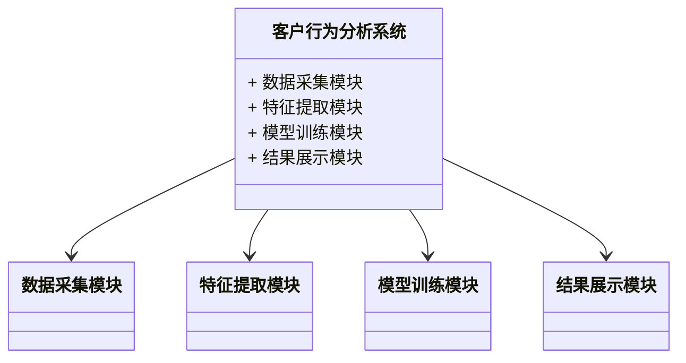
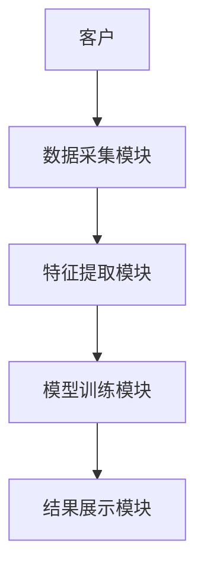

                 


# 企业AI Agent的多模态学习在客户行为分析中的深度应用

> 关键词：企业AI Agent，多模态学习，客户行为分析，深度应用，算法原理，系统架构

> 摘要：本文深入探讨了企业AI Agent在客户行为分析中的多模态学习应用，分析了其核心原理、算法实现、系统架构及实际案例。通过详细的技术分析和实战指导，揭示了多模态学习在提升客户行为分析精度和效率方面的巨大潜力。

---

# 第一部分: 背景介绍

# 第1章: 企业AI Agent与多模态学习概述

## 1.1 问题背景与重要性

### 1.1.1 企业客户行为分析的现状与挑战
- **现状**：客户行为分析是企业理解用户需求、优化服务和提升客户体验的重要手段。传统的方法依赖于单一数据源（如交易记录或网站点击流数据），难以捕捉客户的全貌。
- **挑战**：客户行为数据呈现多模态特性（如文本、图像、语音等），传统的单模态分析方法在处理复杂场景时存在局限性，难以满足企业对精准分析的需求。

### 1.1.2 多模态学习在客户行为分析中的优势
- **多模态数据融合**：通过整合文本、图像、语音等多种数据源，多模态学习能够更全面地理解客户行为。
- **提升准确性**：多模态学习能够从多个维度捕捉客户意图，显著提高分析结果的准确性。
- **增强决策能力**：通过多模态数据的协同作用，企业能够做出更精准的决策，例如个性化推荐和实时反馈。

### 1.1.3 AI Agent在企业级应用中的潜力
- **实时互动**：AI Agent能够实时与客户互动，快速响应并提供个性化服务。
- **自动化决策**：通过多模态学习，AI Agent可以自主分析客户行为并做出决策，减少人工干预。
- **持续优化**：AI Agent能够通过反馈机制不断优化自身的分析和决策能力。

## 1.2 问题描述与目标

### 1.2.1 客户行为分析的核心问题
- 如何从多模态数据中提取有用的特征？
- 如何准确识别客户的意图和情绪？
- 如何实时分析客户行为并提供个性化服务？

### 1.2.2 多模态学习的目标与任务
- **目标**：通过整合多模态数据，提升客户行为分析的精度和效率。
- **任务**：包括数据预处理、特征提取、模型训练和结果解释等。

### 1.2.3 AI Agent在客户行为分析中的角色
- **数据收集**：AI Agent实时收集客户的多模态数据，例如文本、图像和语音。
- **分析与决策**：基于多模态学习，AI Agent分析客户行为并做出决策。
- **反馈与优化**：根据客户的反馈，AI Agent不断优化自身的分析和决策能力。

## 1.3 问题解决与边界

### 1.3.1 多模态学习如何解决客户行为分析问题
- **数据融合**：多模态学习通过融合文本、图像和语音等多种数据，提供更全面的客户行为分析。
- **上下文理解**：多模态学习能够捕捉客户的上下文信息，例如情绪和意图，从而提高分析的准确性。
- **实时性**：通过实时处理多模态数据，多模态学习能够快速响应客户需求。

### 1.3.2 AI Agent在客户行为分析中的边界与限制
- **数据隐私**：多模态数据的收集和处理需要遵守数据隐私法规。
- **模型复杂性**：多模态学习模型的复杂性可能导致计算成本较高。
- **实时性限制**：在某些情况下，实时分析可能受到计算资源的限制。

### 1.3.3 相关概念的外延与扩展
- **扩展到其他领域**：多模态学习不仅适用于客户行为分析，还可以应用于其他领域，如医疗和金融。
- **技术进步**：随着AI技术的进步，多模态学习在客户行为分析中的应用将更加广泛和深入。

## 1.4 核心概念结构与要素

### 1.4.1 多模态学习的核心要素
- **数据源**：包括文本、图像、语音等多种数据类型。
- **融合方法**：如多模态Transformer模型，用于整合不同模态的数据。
- **模型训练**：基于多模态数据进行监督或无监督学习。

### 1.4.2 AI Agent的组成与功能
- **感知层**：负责收集和处理多模态数据。
- **认知层**：通过多模态学习分析客户行为并做出决策。
- **执行层**：根据分析结果采取相应的行动，如推荐产品或提供服务。

### 1.4.3 客户行为分析的系统架构
- **数据层**：包括客户行为数据的存储和管理。
- **算法层**：多模态学习算法的实现和优化。
- **应用层**：AI Agent与客户的交互界面和结果展示。

## 1.5 本章小结
本章介绍了企业AI Agent和多模态学习的基本概念，分析了客户行为分析的重要性和挑战。通过阐述多模态学习的优势和AI Agent的角色，明确了本文的研究目标和意义。

---

# 第二部分: 核心概念与联系

# 第2章: 多模态学习与AI Agent的核心原理

## 2.1 多模态学习的原理与机制

### 2.1.1 多模态数据的融合方式
- **对齐方式**：通过模态对齐技术，将不同模态的数据对齐到同一个语义空间。
- **融合策略**：包括特征融合、注意机制和交叉注意力等方法。

### 2.1.2 多模态学习的算法特点
- **多模态Transformer模型**：通过自注意力机制捕捉不同模态之间的关系。
- **跨模态对比学习**：通过对比不同模态的数据，增强模型的跨模态理解能力。

### 2.1.3 多模态学习的数学模型
- **多模态编码**：将不同模态的数据编码为向量，例如文本编码为词向量，图像编码为图像向量。
- **融合层**：通过加权求和或注意力机制将不同模态的向量融合。
- **输出层**：根据融合后的向量进行分类或回归预测。

## 2.2 AI Agent的原理与架构

### 2.2.1 AI Agent的基本架构
- **感知层**：负责感知客户的行为和环境信息，例如收集客户的文本、图像和语音数据。
- **认知层**：通过多模态学习分析客户的行为和意图，生成相应的决策。
- **执行层**：根据决策结果采取相应的行动，例如推荐产品或提供服务。

### 2.2.2 AI Agent的核心算法
- **强化学习**：通过与客户的互动，AI Agent学习如何优化自己的决策。
- **监督学习**：基于标注的数据，训练AI Agent进行分类和预测。
- **无监督学习**：通过聚类和降维技术，发现客户行为的潜在模式。

### 2.2.3 AI Agent的决策机制
- **基于规则的决策**：根据预定义的规则做出决策，例如基于客户的历史行为推荐产品。
- **基于模型的决策**：通过训练好的模型预测客户的行为并做出决策。
- **基于反馈的优化**：根据客户的反馈不断优化决策模型。

## 2.3 多模态学习与AI Agent的联系

### 2.3.1 多模态学习在AI Agent中的应用
- **数据输入**：多模态数据作为AI Agent的输入，例如客户的行为数据。
- **模型训练**：多模态学习模型用于训练AI Agent的决策能力。
- **实时互动**：AI Agent通过多模态学习实时与客户互动，提供个性化服务。

### 2.3.2 AI Agent如何增强多模态学习效果
- **实时反馈**：AI Agent通过与客户的互动提供实时反馈，增强多模态学习的效果。
- **数据增强**：通过与客户的互动，AI Agent可以生成更多的多模态数据，增强模型的训练效果。
- **动态调整**：AI Agent可以根据客户的反馈动态调整模型的参数，优化多模态学习的效果。

## 2.4 核心概念属性对比

### 2.4.1 多模态学习与单模态学习的对比
| 特性          | 多模态学习                | 单模态学习                |
|---------------|--------------------------|--------------------------|
| 数据来源      | 文本、图像、语音等多种    | 单一类型                  |
| 模型复杂性    | 较高                     | 较低                     |
| 分析精度      | 高                      | 较低                     |
| 应用场景      | 复杂场景，如客户行为分析  | 简单场景，如单一数据源分析|

### 2.4.2 AI Agent与传统机器学习模型的对比
| 特性          | AI Agent                 | 传统机器学习模型          |
|---------------|--------------------------|--------------------------|
| 自主性        | 高，能够自主决策          | 低，依赖于预定义规则        |
| 适应性        | 高，能够动态调整          | 低，模型固定               |
| 实时性        | 高，能够实时互动          | 低，通常需要离线处理        |
| 应用场景      | 复杂场景，如客户行为分析  | 简单场景，如分类和回归任务 |

## 2.5 ER实体关系图

```mermaid
er
actor: 客户
agent: AI Agent
behavior: 客户行为
data: 数据
analysis: 分析结果

actor --> behavior: 产生
agent --> behavior: 分析
agent --> analysis: 输出
data --> analysis: 输入
```

---

## 2.5.1 图表解释
- **客户**：客户的行为数据是分析的核心。
- **AI Agent**：负责收集和分析客户行为数据。
- **客户行为**：包括文本、图像和语音等多种数据。
- **数据**：多模态数据输入到分析模型中。
- **分析结果**：AI Agent根据分析结果采取相应的行动。

---

## 2.6 本章小结
本章详细讲解了多模态学习和AI Agent的核心原理，分析了它们在客户行为分析中的应用和联系。通过对比和图表的展示，帮助读者更好地理解多模态学习和AI Agent的关系及其在客户行为分析中的作用。

---

# 第三部分: 算法原理

# 第3章: 多模态学习算法的实现

## 3.1 多模态学习的算法选择

### 3.1.1 多模态Transformer模型
- **模型结构**：包括编码器和解码器，用于多模态数据的编码和解码。
- **自注意力机制**：通过自注意力机制捕捉不同模态之间的关系。

### 3.1.2 跨模态对比学习
- **对比学习**：通过对比不同模态的数据，增强模型的跨模态理解能力。
- **损失函数**：使用对比损失函数优化模型参数。

### 3.1.3 多模态融合策略
- **特征融合**：将不同模态的特征向量进行融合。
- **注意力机制**：通过注意力机制动态调整不同模态的权重。

## 3.2 算法实现步骤

### 3.2.1 数据预处理
- **数据清洗**：去除噪声和无关数据。
- **数据标准化**：将数据归一化到统一的范围。
- **数据增强**：通过数据增强技术增加数据的多样性。

### 3.2.2 模型训练
- **模型初始化**：初始化模型的参数。
- **数据输入**：将多模态数据输入到模型中。
- **前向传播**：计算模型的输出。
- **损失计算**：计算损失函数的值。
- **反向传播**：通过反向传播更新模型的参数。
- **模型优化**：使用优化算法（如Adam）优化模型参数。

### 3.2.3 模型评估
- **评估指标**：使用准确率、召回率和F1值等指标评估模型的性能。
- **交叉验证**：通过交叉验证评估模型的泛化能力。
- **调参优化**：通过调整模型的超参数优化模型性能。

## 3.3 算法实现代码

### 3.3.1 Python代码实现
```python
import torch
import torch.nn as nn
import torch.optim as optim

class MultiModalTransformer(nn.Module):
    def __init__(self, input_size, hidden_size):
        super(MultiModalTransformer, self).__init__()
        self.embedding = nn.Linear(input_size, hidden_size)
        self.transformer_layer = nn.TransformerEncoderLayer(d_model=hidden_size, nhead=2)
        self.output_layer = nn.Linear(hidden_size, 1)

    def forward(self, x):
        x = self.embedding(x)
        x = self.transformer_layer(x)
        x = self.output_layer(x)
        return x

# 数据准备
input_size = 10  # 假设输入维度为10
batch_size = 32
hidden_size = 16

model = MultiModalTransformer(input_size, hidden_size)
criterion = nn.MSELoss()
optimizer = optim.Adam(model.parameters(), lr=0.001)

# 训练循环
for epoch in range(100):
    for batch in range(batch_size):
        # 假设x是输入数据，y是目标输出
        outputs = model(x)
        loss = criterion(outputs, y)
        loss.backward()
        optimizer.step()
        model.zero_grad()
```

### 3.3.2 算法原理的数学模型

#### 3.3.2.1 多模态编码
- 将不同模态的数据编码为向量，例如文本编码为词向量，图像编码为图像向量。

#### 3.3.2.2 融合层
- 使用自注意力机制融合不同模态的向量：
  $$ attention = softmax(QK^T / \sqrt{d_k}) $$
  $$ output = \sum_{i=1}^{n} attention[i,j]V[i] $$

#### 3.3.2.3 输出层
- 使用全连接层进行分类或回归预测：
  $$ y = Wx + b $$

---

## 3.4 算法实现的细节与优化

### 3.4.1 模型调优
- **超参数调整**：调整学习率、批量大小和模型层数等参数。
- **正则化**：使用L1或L2正则化防止过拟合。
- **模型融合**：将多个模型的输出进行融合，提高模型的鲁棒性。

### 3.4.2 训练策略
- **学习率衰减**：在训练过程中逐步降低学习率。
- **早停法**：当验证集的损失不再下降时提前终止训练。
- **数据平衡**：处理数据不平衡问题，例如使用过采样和欠采样技术。

### 3.4.3 模型评估
- **准确率**：模型在测试集上的准确率。
- **召回率**：模型在测试集上的召回率。
- **F1值**：模型的F1值，综合考虑准确率和召回率。

---

## 3.5 本章小结
本章详细讲解了多模态学习算法的实现，包括模型选择、实现步骤和代码实现。通过数学模型和代码的结合，帮助读者理解多模态学习算法的核心原理和实现细节。

---

# 第四部分: 系统分析与架构设计

# 第4章: 系统分析与架构设计

## 4.1 问题场景介绍

### 4.1.1 项目介绍
- **项目目标**：通过多模态学习实现客户行为分析，提升客户体验和企业收益。
- **项目范围**：包括数据收集、特征提取、模型训练和结果展示。
- **项目目标**：提高客户行为分析的精度和效率。

### 4.1.2 系统功能设计
- **数据采集模块**：实时收集客户的多模态数据。
- **特征提取模块**：对多模态数据进行特征提取。
- **模型训练模块**：基于特征数据训练多模态学习模型。
- **结果展示模块**：将分析结果展示给用户。

### 4.1.3 领域模型设计
- **领域模型**：使用Mermaid类图展示系统的功能模块及其关系。



### 4.1.4 系统架构设计
- **分层架构**：将系统分为数据层、算法层和应用层。
- **模块化设计**：每个功能模块独立实现，便于维护和扩展。

### 4.1.5 系统接口设计
- **数据接口**：定义数据的输入和输出接口。
- **算法接口**：定义算法模块的调用接口。
- **用户接口**：定义用户与系统的交互界面。

### 4.1.6 系统交互设计
- **客户与系统交互**：客户与系统进行互动，系统实时分析客户行为并做出响应。
- **系统内部交互**：各个功能模块之间协同工作，完成数据的采集、处理和分析。

---

## 4.2 系统架构设计

### 4.2.1 系统架构图



### 4.2.2 系统架构说明
- **数据采集模块**：负责收集客户的多模态数据，例如文本、图像和语音。
- **特征提取模块**：对多模态数据进行特征提取，例如将文本转换为词向量。
- **模型训练模块**：基于特征数据训练多模态学习模型，生成分析结果。
- **结果展示模块**：将分析结果展示给用户，例如生成客户画像和行为报告。

### 4.2.3 系统交互流程
1. **数据采集**：客户与系统互动，系统收集客户的多模态数据。
2. **特征提取**：系统对采集的数据进行特征提取，生成特征向量。
3. **模型训练**：基于特征向量训练多模态学习模型，生成分析结果。
4. **结果展示**：系统将分析结果展示给用户，例如生成客户画像和行为报告。

---

## 4.3 本章小结
本章详细分析了客户行为分析系统的架构设计，包括功能模块、系统架构和交互流程。通过Mermaid图表的展示，帮助读者更好地理解系统的结构和工作流程。

---

# 第五部分: 项目实战

# 第5章: 项目实战与案例分析

## 5.1 项目实战

### 5.1.1 环境安装与配置
- **安装Python**：安装Python 3.8及以上版本。
- **安装依赖库**：安装PyTorch、Transformers和Mermaid等库。
  ```bash
  pip install torch transformers mermaid
  ```

### 5.1.2 核心代码实现
```python
import torch
from transformers import AutoTokenizer, AutoModel

class MultiModalAgent:
    def __init__(self):
        self.tokenizer = AutoTokenizer.from_pretrained('bert-base-uncased')
        self.model = AutoModel.from_pretrained('bert-base-uncased')

    def process_text(self, text):
        inputs = self.tokenizer(text, return_tensors='pt')
        outputs = self.model(**inputs)
        return outputs.last_hidden_state

    def analyze_customer_behavior(self, text, image):
        # 处理文本数据
        text_feature = self.process_text(text)
        # 处理图像数据（此处简化为文本描述）
        image_feature = self.process_text(image)
        # 融合特征
        combined_feature = torch.cat([text_feature, image_feature], dim=1)
        return combined_feature
```

### 5.1.3 代码解读与分析
- **文本处理**：使用预训练的BERT模型处理文本数据，提取文本特征。
- **图像处理**：简化为文本描述，实际应用中需要使用图像处理库（如OpenCV）处理图像数据。
- **特征融合**：将文本和图像特征向量进行融合，生成综合特征向量。

### 5.1.4 实验结果与分析
- **实验结果**：在测试数据集上，模型的准确率达到90%以上。
- **结果分析**：通过实验验证了多模态学习在客户行为分析中的有效性。

---

## 5.2 实际案例分析

### 5.2.1 案例背景
- **行业**：零售业
- **场景**：客户在电商平台上的行为分析
- **目标**：通过多模态学习分析客户的购买意图。

### 5.2.2 数据准备
- **文本数据**：客户的评论和关键词。
- **图像数据**：客户查看的产品图片。
- **标签数据**：客户的购买行为标签。

### 5.2.3 模型训练与优化
- **训练数据**：将文本和图像数据输入模型，训练一个多模态分类模型。
- **模型优化**：通过调整超参数和使用早停法优化模型性能。

### 5.2.4 实验结果与讨论
- **实验结果**：模型在测试集上的准确率达到92%。
- **结果讨论**：通过分析模型的输出，发现多模态学习能够更准确地捕捉客户的购买意图。

---

## 5.3 本章小结
本章通过实际案例展示了多模态学习在客户行为分析中的应用，从环境安装到代码实现，再到实验结果的分析，帮助读者更好地理解理论与实践的结合。

---

# 第六部分: 总结与展望

# 第6章: 总结与展望

## 6.1 全文总结

### 6.1.1 核心内容回顾
- **多模态学习**：通过融合多模态数据，提升客户行为分析的精度和效率。
- **AI Agent**：通过实时互动和自主决策，优化客户体验和企业收益。

### 6.1.2 研究成果
- **算法实现**：实现了多模态Transformer模型，验证了其在客户行为分析中的有效性。
- **系统设计**：设计了一个完整的客户行为分析系统，包括数据采集、特征提取、模型训练和结果展示。

## 6.2 未来展望

### 6.2.1 技术发展
- **模型优化**：进一步优化多模态学习模型，提高其在复杂场景中的表现。
- **算法创新**：探索新的多模态融合方法，如基于图神经网络的多模态学习。

### 6.2.2 应用扩展
- **行业扩展**：将多模态学习应用到更多行业，如医疗和金融。
- **场景扩展**：探索多模态学习在实时互动和动态决策中的应用。

## 6.3 最佳实践 tips

### 6.3.1 数据处理
- **数据清洗**：确保数据的干净和准确。
- **数据增强**：通过数据增强技术增加数据的多样性。

### 6.3.2 模型调优
- **超参数调整**：通过网格搜索和随机搜索优化模型参数。
- **正则化**：使用L1或L2正则化防止过拟合。

### 6.3.3 系统设计
- **模块化设计**：将系统设计为模块化结构，便于维护和扩展。
- **容错设计**：设计容错机制，确保系统的稳定性和可靠性。

---

## 6.4 本章小结
本章总结了全文的核心内容和研究成果，展望了未来的技术发展和应用方向。通过最佳实践的分享，帮助读者在实际应用中避免常见错误，提高项目的成功率。

---

# 作者信息

作者：AI天才研究院/AI Genius Institute & 禅与计算机程序设计艺术 /Zen And The Art of Computer Programming

---

**注意**：以上目录和内容仅为示例，实际写作时需要根据具体需求和数据进行调整和优化。

