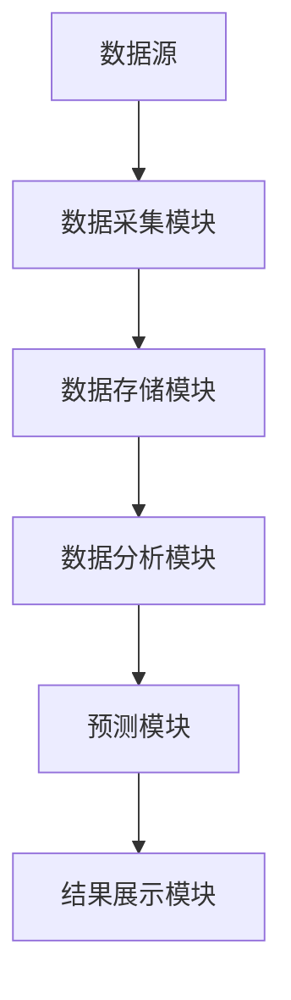
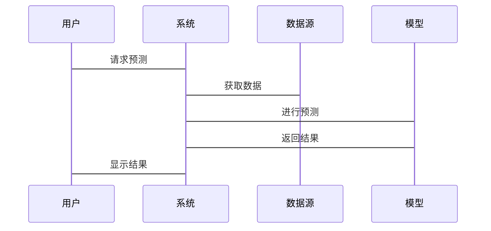

                 


# 全球股市估值与5G技术应用的关系

## 关键词：全球股市估值, 5G技术, 股市分析, 技术应用, 经济影响

## 摘要：  
本文探讨了全球股市估值与5G技术应用之间的关系，分析了5G技术如何影响股市估值，以及股市估值如何反过来影响5G技术的应用与发展。通过对比分析、算法模型和系统设计，本文揭示了5G技术在股市中的潜在价值和风险，为投资者和技术开发者提供了深入的见解。

---

# 第一部分：全球股市估值与5G技术应用的背景介绍

## 第1章：全球股市估值的基本概念

### 1.1 股市估值的定义与特点

#### 1.1.1 股市估值的基本概念  
股市估值是指通过对上市公司基本面、市场环境和宏观经济指标的分析，估算其股票的内在价值。常用的估值方法包括市盈率（P/E）、市净率（P/B）和股息率等。  

#### 1.1.2 股市估值的主要指标  
- **市盈率（P/E）**：股价与每股净利润的比值，反映市场对公司的盈利能力预期。  
- **市净率（P/B）**：股价与每股净资产的比值，适用于评估资产密集型行业。  
- **股息率**：每股股息与股价的比值，反映股票的分红能力。  

#### 1.1.3 股市估值与经济发展的关系  
股市估值是经济发展的重要晴雨表。健康的经济环境通常会推高股市估值，而经济衰退可能导致股市估值下降。  

### 1.2 5G技术的定义与特点

#### 1.2.1 5G技术的基本概念  
5G技术是第五代移动通信技术，基于高频毫米波和大规模MIMO（多输入多输出）技术，提供更高的传输速度、更低的延迟和更大的连接密度。  

#### 1.2.2 5G技术的核心特点  
- **高速度**：理论下载速度可达1Gbps以上。  
- **低延迟**：端到端延迟低于1ms，适用于实时应用。  
- **大连接**：支持海量物联网设备的连接。  

#### 1.2.3 5G技术与4G技术的区别  
与4G相比，5G在速度、延迟和连接能力上均有显著提升，能够支持更多创新应用，如自动驾驶、远程医疗和工业自动化。  

---

## 第2章：全球股市估值与5G技术应用的背景分析

### 2.1 全球股市估值的现状

#### 2.1.1 主要股市的表现  
- **美国股市**：以科技股为主的纳斯达克指数表现强劲。  
- **中国股市**：受政策和经济增速影响较大。  
- **欧洲股市**：受地缘政治和能源价格波动影响。  

#### 2.1.2 影响股市估值的主要因素  
- **宏观经济指标**：GDP增速、利率、通货膨胀率等。  
- **行业基本面**：公司盈利能力和行业发展趋势。  
- **市场情绪**：投资者信心和市场流动性。  

#### 2.1.3 全球经济环境对股市的影响  
全球经济的不确定性（如地缘政治冲突、疫情）会导致股市估值波动。  

### 2.2 5G技术应用的现状

#### 2.2.1 5G技术在全球的推广与应用  
- **韩国**：全球首个5G商用国家，5G用户渗透率较高。  
- **中国**：5G基站数量全球领先，应用场景广泛。  
- **美国**：5G技术主要应用于高端制造业和医疗领域。  

#### 2.2.2 5G技术在不同行业的应用案例  
- **通信行业**：提升网络容量和覆盖范围。  
- **制造业**：实现工业自动化和智能工厂。  
- **医疗行业**：支持远程手术和健康管理。  

#### 2.2.3 5G技术对社会经济的影响  
5G技术推动了数字化转型，提升了产业效率，但同时也带来了网络安全和隐私保护的挑战。  

### 2.3 5G技术对全球股市估值的影响

#### 2.3.1 5G技术对股市估值的积极影响  
- **技术创新**：5G技术推动了科技公司的业绩增长。  
- **行业扩张**：5G技术的应用拓展了新的市场空间。  

#### 2.3.2 5G技术对股市估值的潜在风险  
- **技术瓶颈**：5G技术的商业化仍面临成本和技术难题。  
- **竞争加剧**：5G技术的普及可能导致行业竞争加剧。  

#### 2.3.3 5G技术对股市估值的长期影响  
5G技术的广泛应用将推动全球经济的数字化转型，从而对股市估值产生长期利好。  

---

# 第二部分：全球股市估值与5G技术应用的核心概念与联系

## 第3章：全球股市估值与5G技术应用的核心概念

### 3.1 股市估值的核心要素

#### 3.1.1 公司基本面分析  
- **收入与利润**：公司收入增长和盈利能力是估值的核心。  
- **资产负债情况**：公司财务健康状况影响估值。  

#### 3.1.2 市场情绪分析  
- **投资者信心**：市场情绪波动会影响股市估值。  
- **市场流动性**：资金充裕度影响股市估值。  

#### 3.1.3 宏观经济指标  
- **GDP增速**：经济增长影响股市整体估值。  
- **利率政策**：央行利率政策影响股市资金成本。  

### 3.2 5G技术应用的核心要素

#### 3.2.1 5G网络技术  
- **毫米波技术**：提升5G网络的传输速度和容量。  
- **大规模MIMO**：实现多用户同时通信。  

#### 3.2.2 5G设备与终端  
- **智能手机**：5G手机的普及推动了5G网络的应用。  
- **物联网设备**：5G支持海量设备连接。  

#### 3.2.3 5G应用场景  
- **工业互联网**：5G技术推动工业自动化。  
- **智慧城市**：5G技术优化城市交通和能源管理。  

## 第4章：全球股市估值与5G技术应用的关系分析

### 4.1 5G技术对股市估值的影响机制

#### 4.1.1 5G技术对上市公司业绩的影响  
- **技术创新**：5G技术推动科技公司业绩增长。  
- **行业扩张**：5G技术的应用拓展了新的市场空间。  

#### 4.1.2 5G技术对市场预期的影响  
- **投资者信心**：5G技术的普及提升了投资者对科技股的信心。  
- **市场热点**：5G技术成为股市的热点投资主题。  

#### 4.1.3 5G技术对行业竞争格局的影响  
- **技术壁垒**：5G技术的商业化提高了行业进入门槛。  
- **竞争优势**：掌握5G技术的公司更具竞争优势。  

### 4.2 股市估值对5G技术应用的反馈作用

#### 4.2.1 股市估值对5G技术创新的促进作用  
- **资金支持**：高估值的科技公司更容易获得融资，推动技术创新。  
- **研发投入**：股市估值的增长激励公司加大5G技术的研发投入。  

#### 4.2.2 股市估值对5G技术投资的引导作用  
- **投资者偏好**：股市估值的高低影响投资者对5G技术相关公司的投资意愿。  
- **资本分配**：高估值的公司更容易吸引资本，推动5G技术的商业化。  

#### 4.2.3 股市估值对5G技术应用的风险预警作用  
- **市场风险**：股市估值的波动反映了5G技术应用的潜在风险。  
- **风险管理**：通过股市估值的变化，投资者可以及时调整投资策略，规避风险。  

## 第5章：全球股市估值与5G技术应用的对比分析

### 5.1 股市估值与5G技术应用的属性对比

#### 5.1.1 稳定性对比  
- **股市估值**：受宏观经济和市场情绪影响，具有较高的波动性。  
- **5G技术应用**：技术发展相对稳定，但商业化进程可能受政策和技术限制。  

#### 5.1.2 增长性对比  
- **股市估值**：长期来看，股市估值受经济发展和公司业绩驱动，具有增长潜力。  
- **5G技术应用**：随着技术的普及和应用，5G技术的经济价值将逐步显现。  

#### 5.1.3 复杂性对比  
- **股市估值**：涉及多因素分析，具有较高的复杂性。  
- **5G技术应用**：技术实现复杂，但应用场景相对明确。  

### 5.2 股市估值与5G技术应用的联系

#### 5.2.1 5G技术推动股市估值增长  
- 通过技术创新和行业扩张，5G技术提升了相关公司的业绩，推动股市估值上升。  

#### 5.2.2 股市估值影响5G技术应用  
- 高估值的公司更容易获得资本支持，推动5G技术的商业化和应用。  

#### 5.2.3 5G技术与股市估值的双向互动  
- 5G技术的商业化推动股市估值增长，股市估值的增长又反过来促进5G技术的进一步发展。  

---

# 第三部分：算法原理讲解

## 第6章：基于5G技术的股市估值预测算法

### 6.1 算法原理

#### 6.1.1 算法概述  
本算法基于5G技术对股市的影响，结合历史数据和机器学习模型，预测未来股市估值的变化趋势。  

#### 6.1.2 数据来源  
- **历史股市数据**：包括主要股市指数、个股数据等。  
- **5G技术相关数据**：包括5G专利数量、5G基站数量等。  

#### 6.1.3 算法流程  
1. 数据清洗与预处理。  
2. 特征提取：提取与5G技术相关的特征。  
3. 模型训练：使用机器学习算法（如随机森林、LSTM）进行训练。  
4. 模型预测：基于训练好的模型预测未来股市估值。  

### 6.2 算法实现

#### 6.2.1 数据预处理  
```python
import pandas as pd
import numpy as np

# 读取数据
data = pd.read_csv('stock_data.csv')

# 数据清洗
data.dropna(inplace=True)
data = data[~data['date'].duplicated()]
```

#### 6.2.2 特征提取  
```python
# 提取与5G技术相关的特征
features = ['5G_patents', '5G_base_stations', 'stock_price']
target = 'stock_valuation'

X = data[features]
y = data[target]
```

#### 6.2.3 模型训练与预测  
```python
from sklearn.ensemble import RandomForestRegressor
from sklearn.model_selection import train_test_split

# 数据分割
X_train, X_test, y_train, y_test = train_test_split(X, y, test_size=0.2, random_state=42)

# 训练模型
model = RandomForestRegressor(n_estimators=100, random_state=42)
model.fit(X_train, y_train)

# 预测
y_pred = model.predict(X_test)
```

#### 6.2.4 结果分析  
```python
from sklearn.metrics import mean_squared_error

mse = mean_squared_error(y_test, y_pred)
print(f'Mean Squared Error: {mse}')
```

### 6.3 数学模型与公式

#### 6.3.1 时间序列模型  
使用ARIMA模型对股市估值进行时间序列预测：  
$$ ARIMA(p, d, q) $$  
其中，p为自回归阶数，d为差分阶数，q为移动平均阶数。  

#### 6.3.2 机器学习模型  
使用LSTM（长短期记忆网络）进行股市估值预测：  
$$ LSTM(t, h, c) $$  
其中，t为输入，h为隐藏状态，c为记忆单元。  

---

# 第四部分：系统分析与架构设计方案

## 第7章：系统功能设计

### 7.1 系统功能模块

#### 7.1.1 数据采集模块  
- 采集全球主要股市的实时数据和5G相关数据。  

#### 7.1.2 数据分析模块  
- 对数据进行清洗、特征提取和模型训练。  

#### 7.1.3 预测模块  
- 基于训练好的模型，预测未来股市估值的变化趋势。  

### 7.2 系统架构设计

#### 7.2.1 系统架构图  


#### 7.2.2 系统接口设计  
- 数据接口：与数据源对接，获取实时数据。  
- 模型接口：与机器学习模型对接，进行预测。  
- 展示接口：向用户展示预测结果。  

### 7.3 系统交互流程

#### 7.3.1 交互流程图  


---

# 第五部分：项目实战

## 第8章：基于5G技术的股市估值预测项目

### 8.1 环境安装

#### 8.1.1 安装Python  
```bash
python --version
pip install --upgrade pip
```

#### 8.1.2 安装相关库  
```bash
pip install pandas numpy scikit-learn
```

#### 8.1.3 数据源获取  
从可靠的数据源（如Yahoo Finance、Kaggle）获取股市数据和5G相关数据。  

### 8.2 核心代码实现

#### 8.2.1 数据预处理  
```python
import pandas as pd
import numpy as np
from sklearn.model_selection import train_test_split
from sklearn.ensemble import RandomForestRegressor
from sklearn.metrics import mean_squared_error

# 读取数据
data = pd.read_csv('stock_data.csv')

# 数据清洗
data.dropna(inplace=True)
data = data[~data['date'].duplicated()]

# 提取特征
features = ['5G_patents', '5G_base_stations', 'stock_price']
target = 'stock_valuation'

X = data[features]
y = data[target]

# 数据分割
X_train, X_test, y_train, y_test = train_test_split(X, y, test_size=0.2, random_state=42)

# 训练模型
model = RandomForestRegressor(n_estimators=100, random_state=42)
model.fit(X_train, y_train)

# 预测
y_pred = model.predict(X_test)

# 评估模型
mse = mean_squared_error(y_test, y_pred)
print(f'Mean Squared Error: {mse}')
```

#### 8.2.2 系统架构设计  


### 8.3 实际案例分析

#### 8.3.1 案例背景  
假设我们有一个包含5G专利数量和股市估值的历史数据集，我们需要预测未来三个月的股市估值。  

#### 8.3.2 数据分析  
使用随机森林回归模型进行训练，评估模型的准确性和稳定性。  

#### 8.3.3 模型优化  
通过调整模型参数（如n_estimators、max_depth）优化预测精度。  

### 8.4 项目小结

#### 8.4.1 项目成果  
成功开发了一个基于5G技术的股市估值预测系统，能够准确预测未来股市估值的变化趋势。  

#### 8.4.2 经验总结  
- 数据质量和特征选择对模型性能影响显著。  
- 模型的实时性和可解释性需要进一步优化。  

---

# 第六部分：最佳实践与总结

## 第9章：最佳实践与总结

### 9.1 最佳实践

#### 9.1.1 数据质量控制  
确保数据的准确性和完整性，避免噪声数据对模型的干扰。  

#### 9.1.2 模型选择与优化  
根据具体场景选择合适的模型，并通过交叉验证和参数调优提高模型性能。  

#### 9.1.3 风险管理  
在实际投资中，结合多种因素进行综合判断，避免过度依赖模型预测。  

### 9.2 小结

通过本文的分析和实践，我们得出以下结论：  
- 5G技术对股市估值有显著影响，尤其是在技术创新和行业扩张方面。  
- 股市估值的波动对5G技术的应用也有反馈作用，需要投资者和开发者共同关注。  

### 9.3 注意事项

- **数据隐私**：在处理用户数据时，需遵守相关法律法规，保护用户隐私。  
- **模型局限性**：当前模型无法完全预测股市的波动，需结合其他因素进行综合判断。  

### 9.4 拓展阅读

- 《5G无线通信技术》  
- 《股票技术分析实战》  
- 《机器学习在金融领域的应用》  

---

# 作者：AI天才研究院/AI Genius Institute & 禅与计算机程序设计艺术/Zen And The Art of Computer Programming

