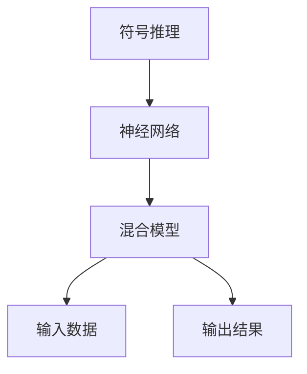
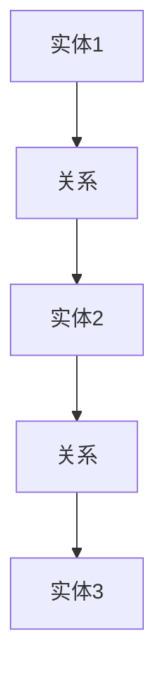
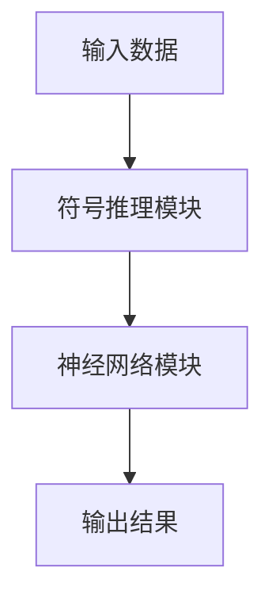
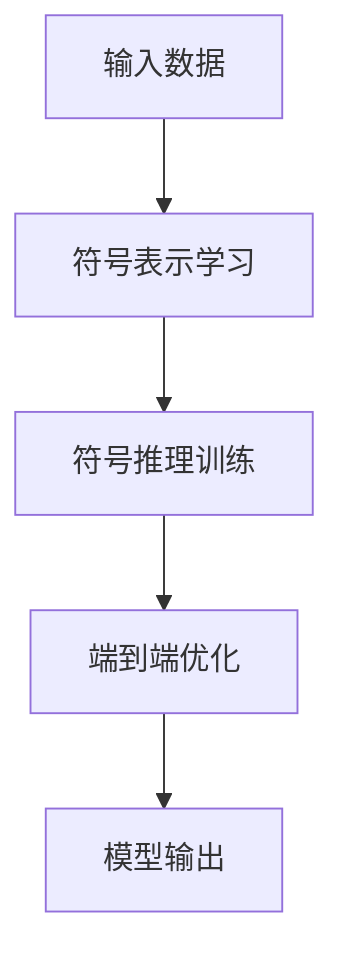
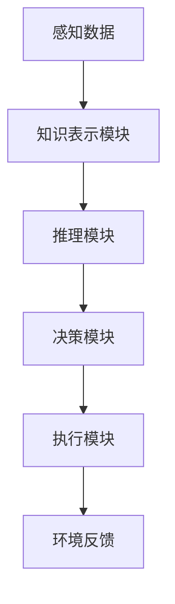
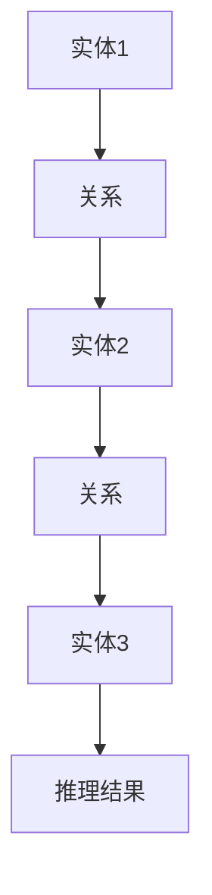
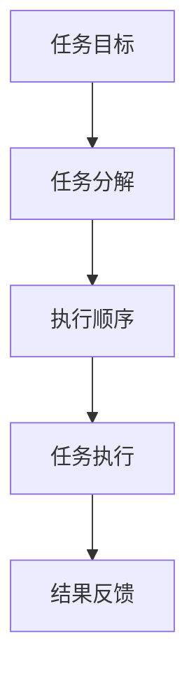

                 


# 基于神经符号AI的AI Agent可解释性增强

## 关键词：神经符号AI，AI Agent，可解释性，知识图谱，符号推理，多智能体系统

## 摘要：  
本文深入探讨了基于神经符号AI的AI Agent可解释性增强的方法与技术。通过结合符号推理与神经网络的优势，提出了一种增强AI Agent可解释性的新思路。文章从神经符号AI的核心原理出发，详细分析了AI Agent的系统架构与功能设计，并提出了通过符号增强与可视化技术提升可解释性的具体策略。通过实际案例分析，展示了如何在复杂场景中实现高可解释性的AI Agent设计。

---

# 第一部分: 神经符号AI与AI Agent概述

## 第1章: 神经符号AI的定义与特点

### 1.1 神经符号AI的定义与特点

神经符号AI是一种结合了符号推理与神经网络技术的混合型人工智能方法。其核心在于将符号表示与神经网络的非线性表达能力相结合，从而在保持符号推理的可解释性的同时，具备神经网络的强大表学习能力。神经符号AI的特点包括：

1. **可解释性**：符号推理的引入使得模型的决策过程更加透明，用户可以理解AI的决策依据。
2. **可扩展性**：神经网络的非线性表达能力使得模型能够处理复杂的现实场景。
3. **知识表示**：符号化知识表示使得模型能够处理结构化的知识，并通过推理能力解决复杂问题。

图1-1展示了神经符号AI的基本架构：



### 1.2 AI Agent的基本概念

AI Agent是一种能够感知环境、自主决策并执行任务的智能体。其核心功能包括感知、推理、规划与执行。AI Agent可以分为简单反射型、基于模型的反应型、目标驱动型和效用驱动型等类型，广泛应用于自动驾驶、智能助手、机器人等领域。

### 1.3 神经符号AI在AI Agent中的作用

神经符号AI通过结合符号推理与神经网络的优势，显著提升了AI Agent的可解释性与任务处理能力。具体表现在：

1. **知识表示**：符号推理使得AI Agent能够处理结构化的知识，并通过推理能力解决复杂问题。
2. **决策透明性**：神经符号AI的可解释性使得用户可以理解AI Agent的决策过程。
3. **任务规划**：神经符号AI结合任务规划算法，使得AI Agent能够在复杂环境中自主完成任务。

---

## 第2章: 神经符号AI的核心原理

### 2.1 符号表示与推理

符号表示是神经符号AI的核心之一，其主要形式包括逻辑符号、知识图谱等。符号推理则是基于这些符号表示，通过逻辑规则进行推理的过程。知识图谱是一种典型的符号表示形式，通过实体与关系的结构化表示，构建了一个可推理的知识网络。

图2-1展示了知识图谱的基本结构：



### 2.2 神经网络与符号推理的结合

神经网络与符号推理的结合主要体现在以下几个方面：

1. **符号增强**：通过神经网络对符号表示进行增强，提升符号推理的准确率。
2. **端到端学习**：神经符号AI可以通过端到端的方式，直接从数据中学习符号表示与推理规则。
3. **混合模型**：神经符号AI通常采用混合模型，结合符号推理与神经网络的优势。

图2-2展示了神经符号AI的混合模型架构：



### 2.3 神经符号AI的训练与优化

神经符号AI的训练与优化主要包括以下几个步骤：

1. **符号表示学习**：通过神经网络对符号表示进行学习与优化。
2. **符号推理训练**：通过监督学习的方式，训练符号推理模块的推理能力。
3. **端到端优化**：通过端到端的方式，优化整个神经符号AI模型的性能。

图2-3展示了神经符号AI的训练流程：



---

## 第3章: AI Agent的系统架构与功能设计

### 3.1 AI Agent的系统架构

AI Agent的系统架构通常包括以下几个模块：

1. **感知模块**：负责获取环境中的感知数据。
2. **知识表示模块**：负责对感知数据进行符号化表示。
3. **推理模块**：负责基于符号表示进行推理。
4. **决策模块**：负责基于推理结果做出决策。
5. **执行模块**：负责执行决策结果。

图3-1展示了AI Agent的系统架构：



### 3.2 AI Agent的知识表示与推理

知识表示与推理是AI Agent的核心功能之一。知识表示通常采用符号化的方式，例如知识图谱。推理则是基于符号表示进行的逻辑推理，主要包括以下几种形式：

1. **演绎推理**：从一般到特殊的推理过程。
2. **归纳推理**：从特殊到一般的推理过程。
3. ** abduction推理**：基于最佳解释的推理过程。

图3-2展示了知识图谱的推理过程：



### 3.3 AI Agent的决策与行动

AI Agent的决策与行动过程主要包括任务规划与人机交互两个方面。任务规划是基于推理结果进行任务分解与执行顺序的规划。人机交互则是通过自然语言处理技术实现与用户的交互。

图3-3展示了AI Agent的任务规划过程：



---

## 第4章: 神经符号AI在AI Agent可解释性中的应用

### 4.1 可解释性的重要性

AI Agent的可解释性是其在实际应用中的关键因素之一。可解释性不仅能够提升用户对AI Agent的信任，还能够帮助开发人员定位和解决模型的缺陷。

### 4.2 神经符号AI增强可解释性的策略

神经符号AI通过以下策略显著提升了AI Agent的可解释性：

1. **符号增强**：通过符号推理增强模型的可解释性。
2. **可视化技术**：通过可视化技术直观展示模型的推理过程。
3. **透明化设计**：通过透明化设计使得用户能够理解模型的决策过程。

### 4.3 神经符号AI的系统实现

神经符号AI的系统实现主要包括以下几个步骤：

1. **符号表示学习**：通过神经网络对符号表示进行学习与优化。
2. **符号推理训练**：通过监督学习的方式，训练符号推理模块的推理能力。
3. **端到端优化**：通过端到端的方式，优化整个神经符号AI模型的性能。

图4-1展示了神经符号AI的系统实现流程：


---

## 第5章: 项目实战：基于神经符号AI的AI Agent实现

### 5.1 项目背景

本项目旨在通过神经符号AI技术实现一个具备高可解释性的AI Agent。项目主要解决以下问题：

1. 提升AI Agent的可解释性。
2. 提高AI Agent在复杂环境中的任务处理能力。

### 5.2 环境安装

项目所需环境包括以下工具与库：

1. Python 3.8+
2. PyTorch 1.9+
3. NetworkX 2.8+
4. Scikit-learn 0.24+

### 5.3 核心代码实现

以下是项目的核心代码实现：

```python
import networkx as nx
from sklearn.preprocessing import OneHotEncoder
import torch
import torch.nn as nn
import torch.optim as optim

# 定义符号推理模块
class SymbolicReasoningModule:
    def __init__(self, knowledge_graph):
        self.knowledge_graph = knowledge_graph

    def infer(self, query):
        # 简单的符号推理逻辑
        if query in self.knowledge_graph.nodes():
            return self.knowledge_graph.nodes[query]['label']
        else:
            return None

# 定义神经网络模块
class NeuralNetworkModule:
    def __init__(self, input_dim, hidden_dim, output_dim):
        self.model = nn.Sequential(
            nn.Linear(input_dim, hidden_dim),
            nn.ReLU(),
            nn.Linear(hidden_dim, output_dim)
        )

    def forward(self, x):
        return self.model(x)

# 定义神经符号AI模型
class NeuralSymbolicAI:
    def __init__(self, knowledge_graph, input_dim, hidden_dim, output_dim):
        self.symbolic_module = SymbolicReasoningModule(knowledge_graph)
        self.neural_module = NeuralNetworkModule(input_dim, hidden_dim, output_dim)

    def forward(self, x):
        symbolic_output = self.symbolic_module.infer(x)
        if symbolic_output is not None:
            return symbolic_output
        else:
            return self.neural_module.forward(x)

# 定义训练函数
def train(model, optimizer, criterion, data_loader):
    for batch_input, batch_target in data_loader:
        outputs = model(batch_input)
        loss = criterion(outputs, batch_target)
        loss.backward()
        optimizer.step()
        optimizer.zero_grad()

# 初始化模型与训练数据
knowledge_graph = nx.Graph()
knowledge_graph.add_nodes_from(['A', 'B', 'C'], label='node')
knowledge_graph.add_edges_from([('A', 'B'), ('B', 'C')])
input_dim = 3
hidden_dim = 4
output_dim = 2
model = NeuralSymbolicAI(knowledge_graph, input_dim, hidden_dim, output_dim)
optimizer = optim.SGD(model.neural_module.parameters(), lr=0.1)
criterion = nn.CrossEntropyLoss()
```

### 5.4 案例分析

通过上述代码实现，我们可以构建一个简单的神经符号AI模型，并应用于AI Agent的任务规划与执行中。具体步骤如下：

1. **知识图谱构建**：构建一个简单的知识图谱，用于符号推理。
2. **神经网络训练**：通过训练数据对神经网络模块进行训练。
3. **混合模型推理**：结合符号推理与神经网络推理，实现高可解释性的AI Agent决策。

图5-1展示了神经符号AI模型的推理过程：


---

## 第6章: 扩展阅读与未来展望

### 6.1 扩展阅读

1. 神经符号AI的最新研究进展。
2. AI Agent的多智能体协作与可解释性。
3. 神经符号AI在具体领域的应用案例。

### 6.2 未来展望

神经符号AI与AI Agent的结合将朝着以下几个方向发展：

1. **增强可解释性**：通过更加透明的符号推理与可视化技术，提升AI Agent的可解释性。
2. **多智能体协作**：研究多智能体系统中的神经符号AI应用。
3. **动态环境适应**：提升神经符号AI在动态环境中的自适应能力。

---

## 作者：AI天才研究院/AI Genius Institute & 禅与计算机程序设计艺术 /Zen And The Art of Computer Programming

---

**本文通过详细分析神经符号AI的核心原理与AI Agent的系统架构，提出了基于神经符号AI的AI Agent可解释性增强的具体策略。通过实际案例分析，展示了如何在复杂场景中实现高可解释性的AI Agent设计。未来，随着神经符号AI技术的不断发展，AI Agent的可解释性与任务处理能力将得到进一步提升，为人工智能技术的广泛应用奠定基础。**

