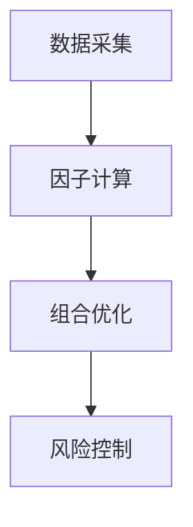
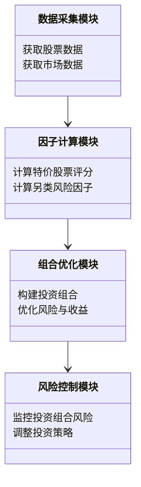
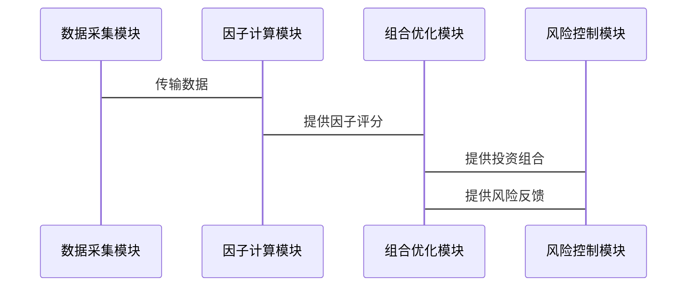

                 


# 如何将特价股票策略与另类风险因子策略相结合

## 关键词：
- 特价股票策略
- 另类风险因子策略
- 策略结合
- 投资组合优化
- 风险管理

## 摘要：
本文详细探讨了如何将特价股票策略与另类风险因子策略相结合，以优化投资组合的表现并降低风险。通过分析两种策略的核心概念、算法原理和系统架构，本文提供了一个综合性的解决方案，帮助投资者在不同市场环境下实现更稳健的投资回报。

---

## 第1章: 特价股票策略与另类风险因子策略的背景与概念

### 1.1 特价股票策略的背景与概念
#### 1.1.1 特价股票的定义与特点
特价股票是指那些市场价格低于其内在价值的股票，通常具有低市盈率（P/E）、低市净率（P/B）等特征。这些股票往往被市场低估，具有较大的上涨潜力。

#### 1.1.2 特价股票策略的核心思想
特价股票策略的核心思想是通过寻找被市场低估的股票，利用市场的非理性波动，实现超额收益。该策略通常适用于市场低迷或震荡时期。

#### 1.1.3 特价股票策略的适用场景
特价股票策略适用于以下场景：
- 市场整体估值较低时
- 经济周期的底部阶段
- 特定行业或公司的基本面改善期

### 1.2 另类风险因子策略的背景与概念
#### 1.2.1 风险因子的定义与分类
风险因子是指影响资产价格波动的各种因素，包括传统风险因子（如市场风险、利率风险）和另类风险因子（如波动性、拥挤度、市场情绪等）。

#### 1.2.2 另类风险因子的特点
另类风险因子具有以下特点：
- 非线性关系：与资产价格的关系不一定是线性的
- 动态变化：受市场情绪和行为的影响，具有动态变化的特性
- 预测性弱：难以通过传统统计方法准确预测

#### 1.2.3 另类风险因子在投资中的作用
另类风险因子可以帮助投资者更好地识别和管理投资组合中的潜在风险，尤其是在市场波动加剧时。

### 1.3 特价股票策略与另类风险因子策略的结合意义
#### 1.3.1 结合的必要性与优势
- 提高策略的稳健性：通过结合另类风险因子，可以在寻找低价股票的同时，降低投资组合的整体风险。
- 增强策略的适应性：在不同市场环境下，结合两种策略可以实现更灵活的投资组合调整。

#### 1.3.2 结合后的潜在效果
- 提高投资收益：通过优化股票筛选标准，选择那些既有低估值又有较低风险的股票。
- 降低投资风险：通过引入另类风险因子，可以更全面地评估股票的风险，避免投资组合过于集中于高风险资产。

---

## 第2章: 特价股票策略与另类风险因子策略的核心概念与联系

### 2.1 特价股票策略的核心概念
#### 2.1.1 特价股票的筛选标准
- 市盈率（P/E）：低于行业平均水平或历史平均水平
- 市净率（P/B）：低于行业平均水平或历史平均水平
- 股息率：高于行业平均水平

#### 2.1.2 特价股票的估值方法
- 市盈率法：通过比较市盈率与行业平均水平，判断股票是否被低估
- 市净率法：通过比较市净率与行业平均水平，判断股票是否被低估
- 内在价值法：通过现金流折现模型（DCF）估算股票的内在价值

#### 2.1.3 特价股票的市场周期分析
- 经济周期分析：判断当前经济周期所处的阶段，选择适合的策略
- 市场情绪分析：通过市场情绪指标，判断市场是否处于低估状态

### 2.2 另类风险因子策略的核心概念
#### 2.2.1 风险因子的识别与计算
- 波动性：通过标准差或波动率指标衡量股票价格的波动性
- 拥挤度：通过资金流动、交易量等指标衡量市场参与者的行为
- 市场情绪：通过新闻、社交媒体等非结构化数据，结合自然语言处理技术，量化市场情绪

#### 2.2.2 风险因子的权重分配
- 根据风险因子的重要性，赋予不同的权重
- 使用主成分分析（PCA）等方法，对风险因子进行降维处理

#### 2.2.3 风险因子的动态调整
- 根据市场环境的变化，动态调整风险因子的权重
- 使用机器学习算法，实时更新风险因子的计算模型

### 2.3 特价股票策略与另类风险因子策略的联系
#### 2.3.1 策略结合的逻辑框架
1. 筛选出符合条件的特价股票
2. 计算这些股票的另类风险因子
3. 根据风险因子对股票进行排序或加权
4. 构建投资组合，优化风险与收益的平衡

#### 2.3.2 策略结合的数学模型
$$ \text{综合评分} = \alpha \times \text{特价股票评分} + \beta \times \text{另类风险因子评分} $$

其中，$\alpha$ 和 $\beta$ 是权重系数，根据具体策略需求进行调整。

#### 2.3.3 策略结合的优劣势分析
- 优势：
  - 提高投资组合的稳定性
  - 增强策略在不同市场环境下的适应性
- 劣势：
  - 需要较高的计算资源和数据处理能力
  - 可能需要复杂的模型调整

---

## 第3章: 特价股票策略与另类风险因子策略的算法原理

### 3.1 特价股票策略的算法原理
#### 3.1.1 特价股票的筛选算法
1. 数据预处理：收集历史股价、财务指标等数据
2. 计算估值指标：市盈率、市净率等
3. 筛选出符合条件的股票

#### 3.1.2 特价股票的估值算法
1. 使用DCF模型计算股票的内在价值
2. 比较内在价值与市场价格，判断是否低估

#### 3.1.3 特价股票的组合优化算法
1. 计算投资组合的预期收益和风险
2. 使用均值-方差优化模型，构建最优投资组合

### 3.2 另类风险因子策略的算法原理
#### 3.2.1 风险因子的识别算法
1. 数据预处理：清洗和整理非结构化数据
2. 使用NLP技术分析市场情绪
3. 计算波动率、拥挤度等指标

#### 3.2.2 风险因子的权重分配算法
1. 使用PCA分析风险因子的重要性
2. 根据重要性分配权重

#### 3.2.3 风险因子的动态调整算法
1. 实时更新风险因子计算模型
2. 根据市场变化动态调整权重

### 3.3 策略结合的算法原理
#### 3.3.1 策略结合的逻辑流程
1. 筛选出符合条件的特价股票
2. 计算这些股票的另类风险因子
3. 根据风险因子对股票进行排序或加权
4. 构建投资组合，优化风险与收益的平衡

#### 3.3.2 策略结合的数学模型
$$ \text{综合评分} = \alpha \times \text{特价股票评分} + \beta \times \text{另类风险因子评分} $$

其中，$\alpha$ 和 $\beta$ 是权重系数，根据具体策略需求进行调整。

---

## 第4章: 特价股票策略与另类风险因子策略的系统分析与架构设计

### 4.1 系统功能设计
#### 4.1.1 系统功能模块划分
1. 数据采集模块：负责收集股票数据、市场数据等
2. 因子计算模块：计算特价股票评分和另类风险因子
3. 组合优化模块：根据评分结果构建投资组合
4. 风险控制模块：监控投资组合的风险

#### 4.1.2 系统功能流程图


#### 4.1.3 系统功能的实现方式
- 数据采集：使用API接口获取实时数据
- 因子计算：基于历史数据计算估值指标和风险因子
- 组合优化：使用优化算法构建最优投资组合
- 风险控制：实时监控投资组合的风险指标

### 4.2 系统架构设计
#### 4.2.1 系统架构的分层设计
1. 数据层：存储股票数据、市场数据等
2. 计算层：负责因子计算和组合优化
3. 控制层：负责风险监控和策略调整

#### 4.2.2 系统架构的模块划分


#### 4.2.3 系统架构的交互设计


### 4.3 系统接口设计
#### 4.3.1 系统接口的定义
- 数据接口：提供API接口，供其他模块调用
- 计算接口：定义因子计算的接口规范
- 优化接口：定义组合优化的接口规范

#### 4.3.2 系统接口的实现
- 数据接口：使用RESTful API实现
- 计算接口：使用Python函数实现
- 优化接口：使用优化算法库（如scipy）实现

---

## 第5章: 特价股票策略与另类风险因子策略的项目实战

### 5.1 环境安装
- Python 3.8及以上版本
- 数据处理库：pandas、numpy
- 统计计算库：scipy
- 可视化库：matplotlib
- NLP库：nltk、spaCy

### 5.2 核心实现代码
```python
import pandas as pd
import numpy as np
from scipy.optimize import minimize

# 数据预处理
def preprocess_data(data):
    data = data.dropna()
    return data

# 特价股票评分计算
def calculate_value_scores(data):
    pe_scores = data['pe'].rank(pct=True)
    pb_scores = data['pb'].rank(pct=True)
    dividend_scores = data['dividend_yield'].rank(pct=True)
    value_scores = (pe_scores + pb_scores + dividend_scores) / 3
    return value_scores

# 另类风险因子计算
def calculate_alt_risk_factors(data):
    volatility = data['return'].std()
    sentiment_scores = data['sentiment'].apply(lambda x: x / x.max())
    risk_scores = (volatility + sentiment_scores) / 2
    return risk_scores

# 综合评分计算
def calculate_combined_scores(value_scores, risk_scores):
    combined_scores = (value_scores + risk_scores) / 2
    return combined_scores

# 投资组合优化
def optimize_portfolio(combined_scores):
    n = len(combined_scores)
    weights = np.ones(n) / n
    return weights

# 主函数
def main():
    data = pd.read_csv('stock_data.csv')
    data = preprocess_data(data)
    value_scores = calculate_value_scores(data)
    risk_scores = calculate_alt_risk_factors(data)
    combined_scores = calculate_combined_scores(value_scores, risk_scores)
    weights = optimize_portfolio(combined_scores)
    print("投资组合权重：", weights)

if __name__ == "__main__":
    main()
```

### 5.3 代码应用解读与分析
- 数据预处理：清洗数据，去除缺失值
- 特价股票评分计算：根据市盈率、市净率、股息率计算综合评分
- 另类风险因子计算：根据波动率和市场情绪计算风险评分
- 综合评分计算：将价值评分和风险评分加权平均，得到综合评分
- 投资组合优化：根据综合评分，计算投资组合的权重

### 5.4 实际案例分析
假设我们有以下股票数据：

| 股票代码 | 市盈率 | 市净率 | 股息率 | 波动率 | 市场情绪 |
|----------|--------|--------|--------|--------|----------|
| A        | 10     | 2      | 5%     | 20%    | 60       |
| B        | 15     | 3      | 4%     | 30%    | 50       |
| C        | 8      | 1.5    | 6%     | 25%    | 70       |

根据上述代码，我们可以计算出每只股票的综合评分，并构建投资组合。

### 5.5 项目小结
通过结合特价股票策略与另类风险因子策略，我们可以更全面地评估股票的投资价值，同时降低投资组合的整体风险。这种策略在市场波动较大的情况下表现尤为突出。

---

## 第6章: 总结与最佳实践

### 6.1 总结
- 特价股票策略关注低价股票的投资机会
- 另类风险因子策略关注非传统风险因素的管理
- 结合两者可以实现投资收益与风险的平衡

### 6.2 最佳实践 tips
- 定期回顾和调整投资组合
- 根据市场环境动态调整策略参数
- 使用大数据和机器学习技术提高策略的准确性

### 6.3 注意事项
- 风险控制是策略成功的关键
- 数据质量对策略效果有重要影响
- 策略的实施需要结合具体市场环境

### 6.4 拓展阅读
- 《投资学》
- 《风险管理与金融创新》
- 《Python金融计算》

---

## 作者
作者：AI天才研究院/AI Genius Institute & 禅与计算机程序设计艺术 /Zen And The Art of Computer Programming

