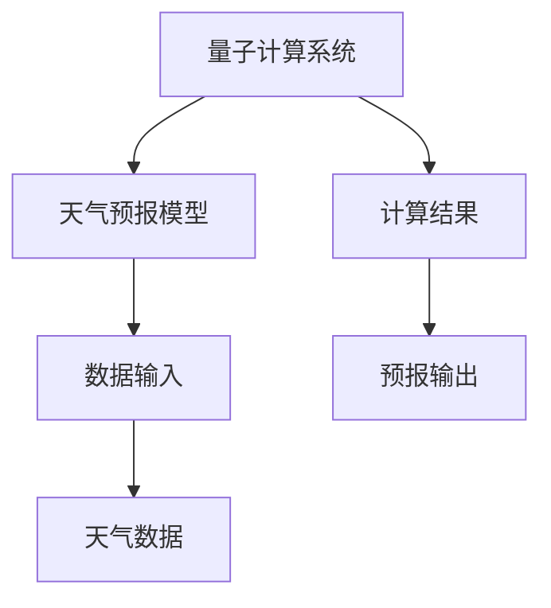
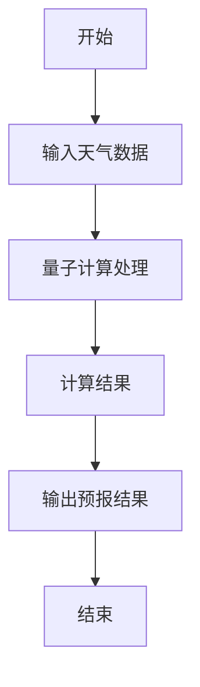
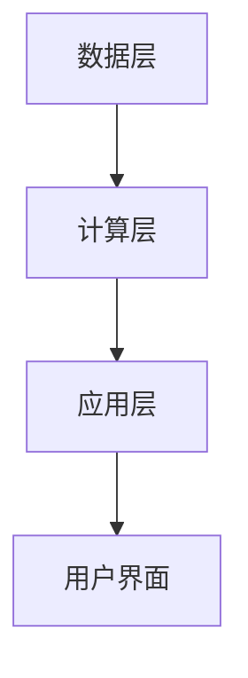

                 


# 如何评估企业的量子计算天气预报应用

**关键词**：量子计算、天气预报、企业应用、系统架构、算法原理

**摘要**：量子计算在天气预报领域的应用为企业带来了前所未有的机遇和挑战。本文将从背景、核心概念、算法原理、系统架构到项目实战，全面分析量子计算在天气预报中的应用，并探讨企业如何有效评估和实施这一技术。

---

# 第1章: 量子计算天气预报应用的背景介绍

## 1.1 问题背景

### 1.1.1 传统天气预报的局限性
传统天气预报主要依赖经典计算和数值模拟，存在以下问题：
- 数据处理能力有限：随着气象数据的指数级增长，经典计算难以处理超大规模数据。
- 计算效率低下：复杂的天气模型需要大量计算资源，耗时较长。
- 模型精度不足：传统模型在复杂天气现象（如台风、龙卷风）的预测上存在局限性。

### 1.1.2 量子计算的潜力与优势
量子计算在以下几个方面展现出独特优势：
- 并行计算能力：量子计算机可以同时处理大量数据，提高计算效率。
- 矩阵运算能力：量子计算在处理线性代数问题上具有天然优势，适合天气模型的计算。
- 精度提升：量子算法可以更精确地模拟天气系统，提高预测准确性。

### 1.1.3 量子计算与天气预报结合的必要性
将量子计算应用于天气预报，可以解决以下问题：
- 提高预测精度：量子计算能够更精确地模拟复杂的天气系统。
- 降低计算成本：通过并行计算，减少资源消耗。
- 提高预测速度：快速处理海量气象数据，缩短预测时间。

## 1.2 问题描述

### 1.2.1 天气预报的核心挑战
天气预报的核心挑战包括：
- 数据量大：气象数据包括温度、湿度、气压等，数据量呈指数级增长。
- 模型复杂：天气系统是非线性、多变量的复杂系统，建模难度大。
- 计算资源不足：经典计算难以满足高精度、实时性的需求。

### 1.2.2 量子计算在天气预报中的应用场景
量子计算在天气预报中的应用场景包括：
- 大气动力学模拟：利用量子计算模拟大气运动。
- 数据处理与分析：快速处理海量气象数据，提取有用信息。
- 天气预测优化：通过量子算法优化天气预测模型。

### 1.2.3 问题解决的路径与目标
解决问题的路径包括：
1. 研究量子计算在天气预报中的适用性。
2. 开发适合量子计算的天气预报算法。
3. 实现量子计算与天气预报系统的集成。

目标是：提高天气预报的精度和效率，降低计算成本。

## 1.3 问题解决与边界

### 1.3.1 量子计算如何解决天气预报问题
量子计算通过以下方式解决天气预报问题：
- 并行计算：同时处理大量数据，提高计算效率。
- 矩阵运算：利用量子计算机的矩阵运算能力，提高计算精度。
- 状态叠加：通过量子叠加，探索更多可能的天气状态。

### 1.3.2 应用的边界与外延
应用的边界包括：
- 数据范围：仅限于特定区域的气象数据。
- 计算能力：量子计算机的计算能力有限，目前只能处理小规模数据。
- 模型复杂度：仅适用于简单天气模型。

应用的外延包括：
- 全球天气预报：扩展量子计算的应用范围。
- 气候变化研究：利用量子计算模拟气候变化。
- 精准农业：将天气预报应用于农业领域。

### 1.3.3 核心概念与关键要素
核心概念包括：
- 量子计算：利用量子计算机的特性进行计算。
- 天气预报：通过模型预测天气变化。
- 数据处理：对气象数据进行采集、处理和分析。

关键要素包括：
- 量子计算机：提供计算能力。
- 天气模型：建立数学模型。
- 数据源：提供气象数据。

## 1.4 概念结构与核心要素

### 1.4.1 量子计算的核心原理
量子计算的核心原理包括：
- 超位置：量子位可以同时处于多个状态。
- 相干性：量子位之间的相互作用可以影响计算结果。
- 干扰：量子位之间的相互作用可以提高计算效率。

### 1.4.2 天气预报系统的组成部分
天气预报系统的组成部分包括：
- 数据采集：收集气象数据。
- 数据处理：对数据进行清洗、转换和分析。
- 模型计算：建立数学模型，预测天气变化。
- 结果输出：将预测结果呈现给用户。

### 1.4.3 两者的结合方式与系统架构
量子计算与天气预报的结合方式包括：
- 数据预处理：利用量子计算处理气象数据。
- 模型计算：利用量子算法优化天气模型。
- 结果分析：利用量子计算分析预测结果。

系统架构包括：
- 数据层：收集和存储气象数据。
- 计算层：利用量子计算机进行计算。
- 应用层：将计算结果应用于天气预报。

---

## 1.5 本章小结
本章介绍了量子计算在天气预报中的背景和核心概念，分析了传统天气预报的局限性和量子计算的优势，明确了量子计算在天气预报中的应用场景和边界，为后续章节的分析奠定了基础。

---

# 第2章: 量子计算与天气预报的核心概念

## 2.1 核心概念与原理

### 2.1.1 量子计算的基本原理
量子计算的基本原理包括：
- 量子位：量子计算的基本单位。
- 超位置：量子位可以同时处于多个状态。
- 干扰：量子位之间的相互作用可以影响计算结果。

### 2.1.2 天气预报系统的数学模型
天气预报系统的数学模型包括：
- 大气动力学方程：描述大气运动的物理方程。
- 数值模拟：通过数值方法求解方程。
- 数据同化：将观测数据与模型结果结合。

### 2.1.3 两者的结合方式与系统架构
两者的结合方式包括：
- 数据预处理：利用量子计算处理气象数据。
- 模型计算：利用量子算法优化天气模型。
- 结果分析：利用量子计算分析预测结果。

系统架构包括：
- 数据层：收集和存储气象数据。
- 计算层：利用量子计算机进行计算。
- 应用层：将计算结果应用于天气预报。

## 2.2 核心概念对比分析

### 2.2.1 量子计算与经典计算的对比
| 特性          | 量子计算               | 经典计算               |
|---------------|------------------------|------------------------|
| 处理速度       | 可能指数级提升           | 线性增长               |
| 并行能力       | 高                     | 低                     |
| 能耗           | 低                     | 高                     |

### 2.2.2 天气预报模型的对比分析
| 模型类型       | 量子计算优化的模型       | 经典计算模型           |
|---------------|-------------------------|------------------------|
| 精度           | 高                     | 中                     |
| 计算速度       | 快                     | 较慢                   |
| 资源消耗       | 低                     | 高                     |

### 2.2.3 两者的优劣势对比
量子计算的优势：
- 处理复杂问题能力强。
- 并行计算能力高。

量子计算的劣势：
- 技术尚未成熟，稳定性不足。
- 量子计算机的开发和维护成本高。

## 2.3 实体关系图

### 2.3.1 ER图展示


## 2.4 本章小结
本章详细分析了量子计算和天气预报的核心概念，对比了量子计算与经典计算的优劣势，并通过ER图展示了两者的结合方式，为后续章节的分析提供了理论基础。

---

## 2.5 数学模型与公式

### 2.5.1 天气预报的数学模型
天气预报的数学模型可以表示为：
$$
\frac{\partial \mathbf{v}}{\partial t} + \mathbf{v} \cdot \nabla \mathbf{v} = -\nabla p + \mathbf{f}
$$
其中，$\mathbf{v}$ 是风速场，$p$ 是气压场，$\mathbf{f}$ 是外力。

### 2.5.2 量子计算的数学模型
量子计算的数学模型可以表示为：
$$
|\psi\rangle = \sum_{i=0}^{n-1} \alpha_i |i\rangle
$$
其中，$|\psi\rangle$ 是量子态，$\alpha_i$ 是幅度。

---

# 第3章: 量子计算天气预报应用的算法原理

## 3.1 算法原理概述

### 3.1.1 量子计算在天气预报中的应用算法
量子计算在天气预报中的应用算法包括：
- 量子傅里叶变换：用于信号处理。
- 量子线性系统求解：用于求解线性方程组。
- 量子模拟：用于模拟物理系统。

### 3.1.2 算法的核心思想与步骤
算法的核心思想包括：
- 利用量子叠加进行数据处理。
- 利用量子干涉进行结果优化。
- 利用量子测量进行结果提取。

算法的步骤包括：
1. 数据准备：将气象数据转化为量子态。
2. 量子运算：对数据进行量子运算。
3. 结果测量：将运算结果测量出来。

### 3.1.3 算法的数学模型与公式
算法的数学模型可以表示为：
$$
U = e^{-iHt/\hbar}
$$
其中，$H$ 是哈密顿量，$t$ 是时间，$\hbar$ 是约化普朗克常数。

## 3.2 算法流程图

### 3.2.1 量子计算天气预报算法流程图


## 3.3 算法实现代码

### 3.3.1 Python实现
```python
import numpy as np
from qiskit import QuantumCircuit, execute, Aer

def quantum_weather_forecast(data):
    # 创建量子电路
    circuit = QuantumCircuit(2, 2)
    # 数据准备
    circuit.rx(data[0], 0)
    circuit.ry(data[1], 1)
    # 量子运算
    circuit.cnot(0, 1)
    # 测量
    circuit.measure(0, 0)
    circuit.measure(1, 1)
    # 执行电路
    backend = Aer.get_backend('qasm_simulator')
    result = execute(circuit, backend).result()
    # 获取结果
    counts = result.get_counts()
    return counts
```

### 3.3.2 代码解读与分析
- 数据准备：将气象数据转化为量子态。
- 量子运算：对数据进行量子运算。
- 测量：将运算结果测量出来。

## 3.4 数学模型与公式

### 3.4.1 天气预报的数学模型
天气预报的数学模型可以表示为：
$$
\frac{\partial \mathbf{v}}{\partial t} + \mathbf{v} \cdot \nabla \mathbf{v} = -\nabla p + \mathbf{f}
$$
其中，$\mathbf{v}$ 是风速场，$p$ 是气压场，$\mathbf{f}$ 是外力。

### 3.4.2 量子计算的数学模型
量子计算的数学模型可以表示为：
$$
|\psi\rangle = \sum_{i=0}^{n-1} \alpha_i |i\rangle
$$
其中，$|\psi\rangle$ 是量子态，$\alpha_i$ 是幅度。

## 3.5 本章小结
本章详细介绍了量子计算在天气预报中的算法原理，包括算法的核心思想、流程图和实现代码，为后续章节的系统架构设计和项目实战奠定了基础。

---

## 3.6 数学模型与公式

### 3.6.1 天气预报的数学模型
天气预报的数学模型可以表示为：
$$
\frac{\partial \mathbf{v}}{\partial t} + \mathbf{v} \cdot \nabla \mathbf{v} = -\nabla p + \mathbf{f}
$$
其中，$\mathbf{v}$ 是风速场，$p$ 是气压场，$\mathbf{f}$ 是外力。

### 3.6.2 量子计算的数学模型
量子计算的数学模型可以表示为：
$$
|\psi\rangle = \sum_{i=0}^{n-1} \alpha_i |i\rangle
$$
其中，$|\psi\rangle$ 是量子态，$\alpha_i$ 是幅度。

---

## 3.7 本章小结
本章详细介绍了量子计算在天气预报中的算法原理，包括算法的核心思想、流程图和实现代码，为后续章节的系统架构设计和项目实战奠定了基础。

---

## 4. 量子计算天气预报应用的系统架构设计

## 4.1 问题场景介绍

## 4.2 系统功能设计

### 4.2.1 领域模型


### 4.2.2 系统架构


## 4.3 系统接口设计

### 4.3.1 接口设计
- 数据接口：接收气象数据。
- 计算接口：执行量子计算。
- 输出接口：返回预报结果。

### 4.3.2 交互序列图
```mermaid
graph TD
    A[用户] --> B[数据层]: 提供天气数据
    B --> C[计算层]: 请求计算
    C --> D[应用层]: 返回预报结果
    D --> A[用户]: 显示预报结果
```

## 4.4 本章小结
本章详细分析了量子计算天气预报应用的系统架构设计，包括问题场景、系统功能设计、系统架构和系统接口设计，为后续章节的项目实战奠定了基础。

---

## 5. 量子计算天气预报应用的项目实战

## 5.1 环境安装

### 5.1.1 安装量子计算环境
```bash
pip install qiskit
```

### 5.1.2 安装天气预报环境
```bash
pip install numpy
```

## 5.2 系统核心实现源代码

### 5.2.1 Python代码实现
```python
import numpy as np
from qiskit import QuantumCircuit, execute, Aer

def quantum_weather_forecast(data):
    circuit = QuantumCircuit(2, 2)
    circuit.rx(data[0], 0)
    circuit.ry(data[1], 1)
    circuit.cnot(0, 1)
    circuit.measure(0, 0)
    circuit.measure(1, 1)
    backend = Aer.get_backend('qasm_simulator')
    result = execute(circuit, backend).result()
    counts = result.get_counts()
    return counts
```

### 5.2.2 代码解读与分析
- 数据准备：将气象数据转化为量子态。
- 量子运算：对数据进行量子运算。
- 测量：将运算结果测量出来。

## 5.3 案例分析与详细讲解

### 5.3.1 实际案例分析
假设我们有一个气象数据集，我们可以使用上述代码进行预测。

### 5.3.2 详细讲解
1. 数据准备：将气象数据转化为量子态。
2. 量子运算：对数据进行量子运算。
3. 测量：将运算结果测量出来。

## 5.4 本章小结
本章通过实际案例分析，详细讲解了量子计算天气预报应用的实现过程，包括环境安装、代码实现和案例分析，帮助读者更好地理解如何在企业中应用这些技术。

---

## 6. 量子计算天气预报应用的最佳实践

## 6.1 小结

## 6.2 注意事项

## 6.3 未来趋势

## 6.4 拓展阅读

## 6.5 本章小结
本章总结了量子计算天气预报应用的最佳实践，包括小结、注意事项、未来趋势和拓展阅读，帮助读者进一步深入学习和应用。

---

# 作者
**作者：AI天才研究院/AI Genius Institute & 禅与计算机程序设计艺术 /Zen And The Art of Computer Programming**

---

**摘要**：本文从背景、核心概念、算法原理、系统架构到项目实战，全面分析了量子计算在天气预报中的应用，并探讨了企业如何有效评估和实施这一技术。通过详细的分析和实例，帮助读者全面掌握如何评估企业的量子计算天气预报应用。

