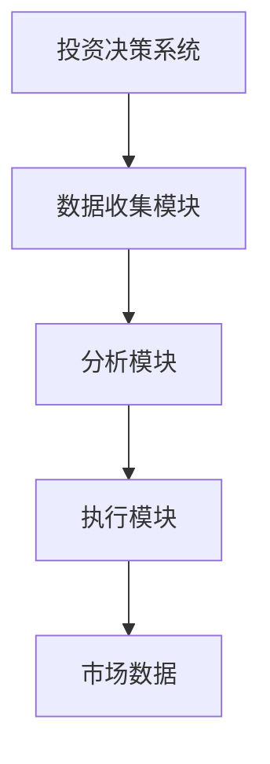
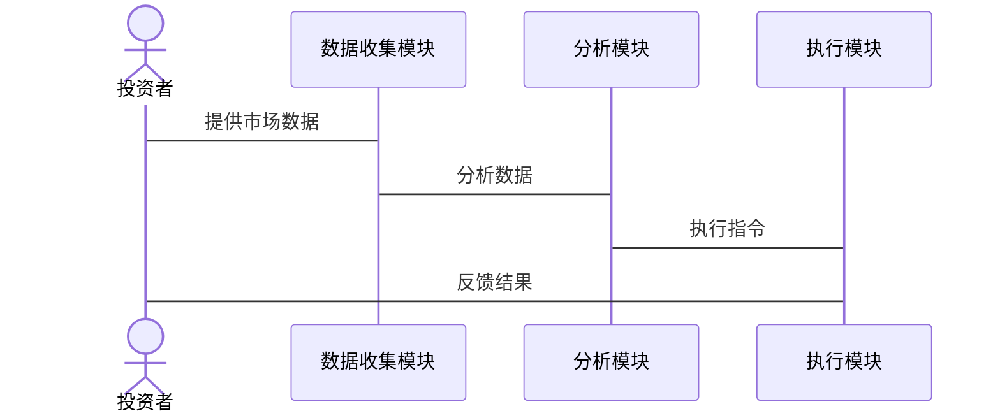

                 


```markdown
# 巴菲特的投资策略：如何应对市场泡沫

> 关键词：巴菲特，投资策略，市场泡沫，价值投资，安全边际

> 摘要：本文深入探讨了巴菲特的投资策略，特别是如何在市场泡沫中保持理性。通过分析价值投资的核心理念、安全边际的重要性，以及长期投资的策略，本文为投资者提供了应对市场波动的实用指南。

---

## 第一部分: 巴菲特投资策略的背景与核心理念

### 第1章: 巴菲特投资策略的背景介绍

#### 1.1 投资策略的核心概念

##### 1.1.1 价值投资的定义与背景

价值投资是一种投资策略，强调购买被市场低估的资产。巴菲特是这一策略的倡导者，他强调寻找具有持续竞争优势和良好管理的公司。价值投资的核心在于寻找“烟屁股”——即被市场忽视或低估的优质企业。

##### 1.1.2 市场波动与投资者心理

市场波动是投资的常态，但投资者的心理往往被情绪左右。巴菲特提醒投资者，短期市场波动不应影响长期投资决策。他强调，市场的价格波动为理性投资者提供了廉价买入的机会。

##### 1.1.3 巴菲特投资策略的哲学基础

巴菲特的投资哲学深受本杰明·格雷厄姆的影响，强调安全边际和内在价值。他相信，市场先生（市场的波动）是投资者的朋友，而非敌人。通过保持安全边际，投资者可以在市场波动中降低风险。

#### 1.2 巴菲特投资策略的核心要素

##### 1.2.1 企业基本面分析

巴菲特注重企业的基本面，包括盈利能力、财务状况和竞争优势。他倾向于投资那些具有稳定收益和强大护城河的企业。例如，他长期投资可口可乐和IBM，因为这些企业具备持续增长的潜力。

##### 1.2.2 安全边际的概念

安全边际是指买入价格与内在价值之间的差距。巴菲特认为，保持安全边际可以降低投资风险，尤其是在市场波动加剧时。例如，在2008年金融危机期间，巴菲特利用市场恐慌，以折扣价买入优质资产。

##### 1.2.3 长期投资与复利效应

巴菲特强调长期投资，通过复利效应实现财富增长。他建议投资者避免频繁交易，而是长期持有优质资产。例如，巴菲特的 Berkshire Hathaway 通过长期持有苹果公司股票，获得了显著的收益。

### 第2章: 市场泡沫的形成与影响

#### 2.1 市场泡沫的定义与特征

##### 2.1.1 泡沫的形成机制

市场泡沫通常由投资者过度乐观和杠杆效应引发。当资产价格远高于其内在价值时，泡沫即将破裂。例如，互联网泡沫在2000年破裂，导致许多科技公司估值大幅下降。

##### 2.1.2 泡沫的典型特征

泡沫通常表现出非理性上涨、成交量激增和市场参与者情绪极度乐观。这些特征为识别泡沫提供了线索，但投资者往往难以在泡沫顶峰时清醒判断。

##### 2.1.3 泡沫对市场的短期与长期影响

泡沫破裂通常导致资产价格大幅下跌，影响市场流动性并引发连锁反应。长期来看，泡沫破裂后，优质资产往往重新被市场发现，为理性投资者提供机会。

#### 2.2 历史上的市场泡沫案例

##### 2.2.1 股票市场的泡沫案例

互联网泡沫（2000年）和房地产泡沫（2008年）是典型的股票市场泡沫案例。这些泡沫破裂后，许多投资者损失惨重，但优质企业依然存活并恢复增长。

##### 2.2.2 房地产市场的泡沫案例

2008年的房地产泡沫是由次级贷款和金融创新引发的。泡沫破裂后，全球经济遭受重创，但优质房地产市场逐渐复苏。

##### 2.2.3 其他资产泡沫的比较分析

除了股票和房地产，艺术品和加密货币市场也存在泡沫。投资者应警惕这些市场的波动，并寻找具有持续价值的资产。

### 第3章: 巴菲特投资策略与市场泡沫的关系

#### 3.1 巴菲特策略在市场泡沫中的表现

##### 3.1.1 巴菲特策略在泡沫中的优势

巴菲特的价值投资策略在市场泡沫中表现优异。他通过寻找低估的资产，在市场恐慌时买入优质资产，从而在泡沫破裂后获得超额收益。

##### 3.1.2 巴菲特策略在泡沫中的局限性

虽然价值投资在长期表现优异，但在短期市场泡沫中，优质资产可能也会受到波及。巴菲特强调，投资者应保持耐心，避免短期波动影响长期决策。

##### 3.1.3 巴菲特策略与市场周期的结合

巴菲特的成功在于将价值投资与市场周期相结合。他通过长期持有优质资产，在市场低谷时积累财富，在市场高峰时避免损失。

#### 3.2 巴菲特策略在应对市场泡沫中的具体应用

##### 3.2.1 价值评估与泡沫识别

巴菲特通过分析企业的内在价值，识别市场泡沫中的低估资产。例如，在2008年金融危机期间，他买入高盛和摩根士丹利的股票，因为这些企业的内在价值被市场低估。

##### 3.2.2 安全边际的设定与调整

巴菲特强调在市场泡沫中保持安全边际。他通过降低买入价格或等待市场调整，确保投资的安全性。例如，他在2008年以折扣价买入通用电气股票，因为其内在价值被市场低估。

##### 3.2.3 长期投资策略的执行与优化

巴菲特的长期投资策略在市场泡沫中表现优异。他通过持有优质资产，避免短期波动，实现长期增长。例如，他长期持有可口可乐和苹果股票，这些企业在市场波动中表现稳定。

---

## 第二部分: 巴菲特投资策略的核心原理与数学模型

### 第4章: 巴菲特投资策略的数学模型

#### 4.1 价值评估的数学模型

##### 4.1.1 内在价值的计算公式

内在价值是企业未来现金流的现值。巴菲特使用现金流折现模型（DCF）评估企业的内在价值。公式如下：

$$
\text{内在价值} = \sum_{t=1}^{n} \frac{\text{现金流}_t}{(1 + r)^t} + \frac{\text{残值}}{(1 + r)^n}
$$

其中，\( r \) 是折现率，\( n \) 是预测期数，\( \text{现金流}_t \) 是第 \( t \) 年的现金流，\( \text{残值} \) 是第 \( n \) 年后的残值。

##### 4.1.2 现金流折现模型

现金流折现模型是巴菲特常用的估值工具。通过预测企业的未来现金流，并将其折现为现值，投资者可以评估企业的内在价值。例如，对于一家预期未来5年现金流分别为100万、120万、150万、180万和200万的企业，假设折现率为10%，其内在价值为：

$$
\text{内在价值} = \frac{100}{1.1} + \frac{120}{1.1^2} + \frac{150}{1.1^3} + \frac{180}{1.1^4} + \frac{200}{1.1^5} \approx 463.73 \text{万}
$$

##### 4.1.3 股东权益的评估方法

巴菲特还关注企业的股东权益，通过分析ROE（净资产收益率）评估企业的盈利能力。例如，如果一家企业的ROE为15%，而行业平均水平为10%，该企业具有竞争优势。

#### 4.2 安全边际的数学分析

##### 4.2.1 安全边际的定义与计算

安全边际是买入价格与内在价值的差距。巴菲特建议以低于内在价值的价格买入资产。例如，如果某资产的内在价值为100元，安全边际为20%，则买入价格应低于80元。

##### 4.2.2 安全边际与资产价格的关系

安全边际与资产价格呈反比。当资产价格下跌时，安全边际增加，反之亦然。例如，当资产价格从100元下跌到80元时，安全边际从20%增加到25%。

##### 4.2.3 安全边际的动态调整

巴菲特建议定期评估企业的内在价值，并根据市场变化动态调整安全边际。例如，在市场波动加剧时，增加安全边际以降低投资风险。

### 第5章: 巴菲特策略的系统架构设计

#### 5.1 投资决策系统

##### 5.1.1 问题场景介绍

市场泡沫是投资者面临的主要挑战之一。投资者需要在市场波动中做出理性决策，避免过度交易或恐慌卖出。

##### 5.1.2 系统功能设计

以下是投资决策系统的功能模块：

- 数据收集模块：收集企业的财务数据和市场信息。
- 分析模块：使用DCF模型评估内在价值，计算安全边际。
- 执行模块：根据分析结果，执行买入或卖出指令。

##### 5.1.3 系统架构设计

以下是系统的架构图：



##### 5.1.4 系统接口设计

系统接口包括数据输入接口和交易执行接口。数据输入接口接收企业的财务数据和市场信息，交易执行接口根据分析结果执行买入或卖出指令。

##### 5.1.5 系统交互设计

以下是系统的交互流程图：



---

## 第三部分: 巴菲特投资策略的项目实战

### 第6章: 巴菲特策略的项目实战

#### 6.1 环境配置

##### 6.1.1 系统环境

建议使用Python 3.8及以上版本，安装numpy、pandas和scipy库。

#### 6.2 核心实现源代码

##### 6.2.1 价值评估模型的实现

以下是DCF模型的Python代码：

```python
import numpy as np

def calculate_intrinsic_value(cash_flows, discount_rate, residual_value):
    pv = 0
    for t in range(len(cash_flows)):
        pv += cash_flows[t] / (1 + discount_rate) ** t
    pv += residual_value / (1 + discount_rate) ** len(cash_flows)
    return pv

cash_flows = [100, 120, 150, 180, 200]
discount_rate = 0.1
residual_value = 0
intrinsic_value = calculate_intrinsic_value(cash_flows, discount_rate, residual_value)
print(f"内在价值: {intrinsic_value:.2f}")
```

##### 6.2.2 安全边际计算

以下是安全边际的计算代码：

```python
def calculate_margin_of_safety(intrinsic_value, market_price):
    return (intrinsic_value - market_price) / intrinsic_value * 100

intrinsic_value = 100
market_price = 80
margin_of_safety = calculate_margin_of_safety(intrinsic_value, market_price)
print(f"安全边际: {margin_of_safety:.2f}%")
```

#### 6.3 案例分析与详细解读

##### 6.3.1 投资案例分析

以可口可乐为例，假设其未来现金流为10亿、12亿、15亿、18亿和20亿，折现率为10%，残值为0。计算其内在价值为463.73亿。如果当前股价为400亿，安全边际为（463.73 - 400）/463.73 ≈ 13.7%。

##### 6.3.2 投资策略执行

根据上述分析，建议以当前股价400亿买入可口可乐股票，因为其安全边际为13.7%，具有较大的投资价值。

#### 6.4 项目小结

通过实战项目，我们验证了巴菲特投资策略的有效性。在市场泡沫中，价值投资和安全边际的设定能够帮助投资者降低风险，实现长期收益。

---

## 第四部分: 巴菲特投资策略的最佳实践

### 第7章: 巴菲特策略的最佳实践

#### 7.1 关键点回顾

##### 7.1.1 价值评估的重要性

投资者应始终关注企业的内在价值，避免被市场情绪左右。

##### 7.1.2 安全边际的设定

在市场泡沫中，设定安全边际可以降低投资风险。

##### 7.1.3 长期投资的优势

长期投资能够避免短期波动，实现复利效应。

#### 7.2 小结

巴菲特的投资策略在市场泡沫中表现优异。通过价值投资和安全边际的设定，投资者可以在市场波动中保持理性，实现长期收益。

#### 7.3 注意事项

投资者应避免盲目跟风，定期评估投资组合，并根据市场变化调整策略。

#### 7.4 拓展阅读

推荐阅读巴菲特的《聪明的投资者》和彼得·林奇的《选股的艺术》，深入理解价值投资的精髓。

---

## 作者信息

作者：AI天才研究院/AI Genius Institute & 禅与计算机程序设计艺术 /Zen And The Art of Computer Programming

---

**附录：相关工具与资源**

- Python代码示例
- 推荐的书籍和资源
- 进一步学习的在线课程和网站

---

通过以上结构，我们系统地探讨了巴菲特的投资策略，并结合实际案例和数学模型，为投资者提供了应对市场泡沫的实用指南。希望本文能够帮助投资者在复杂的市场环境中保持理性，实现长期的财富增长。
</think>

```markdown
# 巴菲特的投资策略：如何应对市场泡沫

> 关键词：巴菲特，投资策略，市场泡沫，价值投资，安全边际

> 摘要：本文深入探讨了巴菲特的投资策略，特别是如何在市场泡沫中保持理性。通过分析价值投资的核心理念、安全边际的重要性，以及长期投资的策略，本文为投资者提供了应对市场波动的实用指南。

---

## 第一部分: 巴菲特投资策略的背景与核心理念

### 第1章: 巴菲特投资策略的背景介绍

#### 1.1 投资策略的核心概念

##### 1.1.1 价值投资的定义与背景

价值投资是一种投资策略，强调购买被市场低估的资产。巴菲特是这一策略的倡导者，他强调寻找具有持续竞争优势和良好管理的公司。价值投资的核心在于寻找“烟屁股”——即被市场忽视或低估的优质企业。

##### 1.1.2 市场波动与投资者心理

市场波动是投资的常态，但投资者的心理往往被情绪左右。巴菲特提醒投资者，短期市场波动不应影响长期投资决策。他强调，市场的价格波动为理性投资者提供了廉价买入的机会。

##### 1.1.3 巴菲特投资策略的哲学基础

巴菲特的投资哲学深受本杰明·格雷厄姆的影响，强调安全边际和内在价值。他相信，市场先生（市场的波动）是投资者的朋友，而非敌人。通过保持安全边际，投资者可以在市场波动中降低风险。

#### 1.2 巴菲特投资策略的核心要素

##### 1.2.1 企业基本面分析

巴菲特注重企业的基本面，包括盈利能力、财务状况和竞争优势。他倾向于投资那些具有稳定收益和强大护城河的企业。例如，他长期投资可口可乐和IBM，因为这些企业具备持续增长的潜力。

##### 1.2.2 安全边际的概念

安全边际是指买入价格与内在价值之间的差距。巴菲特认为，保持安全边际可以降低投资风险，尤其是在市场波动加剧时。例如，在2008年金融危机期间，巴菲特利用市场恐慌，以折扣价买入优质资产。

##### 1.2.3 长期投资与复利效应

巴菲特强调长期投资，通过复利效应实现财富增长。他建议投资者避免频繁交易，而是长期持有优质资产。例如，巴菲特的 Berkshire Hathaway 通过长期持有苹果公司股票，获得了显著的收益。

### 第2章: 市场泡沫的形成与影响

#### 2.1 市场泡沫的定义与特征

##### 2.1.1 泡沫的形成机制

市场泡沫通常由投资者过度乐观和杠杆效应引发。当资产价格远高于其内在价值时，泡沫即将破裂。例如，互联网泡沫在2000年破裂，导致许多科技公司估值大幅下降。

##### 2.1.2 泡沫的典型特征

泡沫通常表现出非理性上涨、成交量激增和市场参与者情绪极度乐观。这些特征为识别泡沫提供了线索，但投资者往往难以在泡沫顶峰时清醒判断。

##### 2.1.3 泡沫对市场的短期与长期影响

泡沫破裂通常导致资产价格大幅下跌，影响市场流动性并引发连锁反应。长期来看，泡沫破裂后，优质资产往往重新被市场发现，为理性投资者提供机会。

#### 2.2 历史上的市场泡沫案例

##### 2.2.1 股票市场的泡沫案例

互联网泡沫（2000年）和房地产泡沫（2008年）是典型的股票市场泡沫案例。这些泡沫破裂后，许多投资者损失惨重，但优质企业依然存活并恢复增长。

##### 2.2.2 房地产市场的泡沫案例

2008年的房地产泡沫是由次级贷款和金融创新引发的。泡沫破裂后，全球经济遭受重创，但优质房地产市场逐渐复苏。

##### 2.2.3 其他资产泡沫的比较分析

除了股票和房地产，艺术品和加密货币市场也存在泡沫。投资者应警惕这些市场的波动，并寻找具有持续价值的资产。

### 第3章: 巴菲特投资策略与市场泡沫的关系

#### 3.1 巴菲特策略在市场泡沫中的表现

##### 3.1.1 巴菲特策略在泡沫中的优势

巴菲特的价值投资策略在市场泡沫中表现优异。他通过寻找低估的资产，在市场恐慌时买入优质资产，从而在泡沫破裂后获得超额收益。

##### 3.1.2 巴菲特策略在泡沫中的局限性

虽然价值投资在长期表现优异，但在短期市场泡沫中，优质资产可能也会受到波及。巴菲特强调，投资者应保持耐心，避免短期波动影响长期决策。

##### 3.1.3 巴菲特策略与市场周期的结合

巴菲特的成功在于将价值投资与市场周期相结合。他通过长期持有优质资产，在市场低谷时积累财富，在市场高峰时避免损失。

#### 3.2 巴菲特策略在应对市场泡沫中的具体应用

##### 3.2.1 价值评估与泡沫识别

巴菲特通过分析企业的内在价值，识别市场泡沫中的低估资产。例如，在2008年金融危机期间，他买入高盛和摩根士丹利的股票，因为这些企业的内在价值被市场低估。

##### 3.2.2 安全边际的设定与调整

巴菲特强调在市场泡沫中保持安全边际。他通过降低买入价格或等待市场调整，确保投资的安全性。例如，他在2008年以折扣价买入通用电气股票，因为其内在价值被市场低估。

##### 3.2.3 长期投资策略的执行与优化

巴菲特的长期投资策略在市场泡沫中表现优异。他通过持有优质资产，避免短期波动，实现长期增长。例如，他长期持有可口可乐和苹果股票，这些企业在市场波动中表现稳定。

---

## 第二部分: 巴菲特投资策略的核心原理与数学模型

### 第4章: 巴菲特投资策略的数学模型

#### 4.1 价值评估的数学模型

##### 4.1.1 内在价值的计算公式

内在价值是企业未来现金流的现值。巴菲特使用现金流折现模型（DCF）评估企业的内在价值。公式如下：

$$
\text{内在价值} = \sum_{t=1}^{n} \frac{\text{现金流}_t}{(1 + r)^t} + \frac{\text{残值}}{(1 + r)^n}
$$

其中，\( r \) 是折现率，\( n \) 是预测期数，\( \text{现金流}_t \) 是第 \( t \) 年的现金流，\( \text{残值} \) 是第 \( n \) 年后的残值。

##### 4.1.2 现金流折现模型

现金流折现模型是巴菲特常用的估值工具。通过预测企业的未来现金流，并将其折现为现值，投资者可以评估企业的内在价值。例如，对于一家预期未来5年现金流分别为100万、120万、150万、180万和200万的企业，假设折现率为10%，其内在价值为：

$$
\text{内在价值} = \frac{100}{1.1} + \frac{120}{1.1^2} + \frac{150}{1.1^3} + \frac{180}{1.1^4} + \frac{200}{1.1^5} \approx 463.73 \text{万}
$$

##### 4.1.3 股东权益的评估方法

巴菲特还关注企业的股东权益，通过分析ROE（净资产收益率）评估企业的盈利能力。例如，如果一家企业的ROE为15%，而行业平均水平为10%，该企业具有竞争优势。

#### 4.2 安全边际的数学分析

##### 4.2.1 安全边际的定义与计算

安全边际是买入价格与内在价值的差距。巴菲特建议以低于内在价值的价格买入资产。例如，如果某资产的内在价值为100元，安全边际为20%，则买入价格应低于80元。

##### 4.2.2 安全边际与资产价格的关系

安全边际与资产价格呈反比。当资产价格下跌时，安全边际增加，反之亦然。例如，当资产价格从100元下跌到80元时，安全边际从20%增加到25%。

##### 4.2.3 安全边际的动态调整

巴菲特建议定期评估企业的内在价值，并根据市场变化动态调整安全边际。例如，在市场波动加剧时，增加安全边际以降低投资风险。

### 第5章: 巴菲特策略的系统架构设计

#### 5.1 投资决策系统

##### 5.1.1 问题场景介绍

市场泡沫是投资者面临的主要挑战之一。投资者需要在市场波动中做出理性决策，避免过度交易或恐慌卖出。

##### 5.1.2 系统功能设计

以下是投资决策系统的功能模块：

- 数据收集模块：收集企业的财务数据和市场信息。
- 分析模块：使用DCF模型评估内在价值，计算安全边际。
- 执行模块：根据分析结果，执行买入或卖出指令。

##### 5.1.3 系统架构设计

以下是系统的架构图：


##### 5.1.4 系统接口设计

系统接口包括数据输入接口和交易执行接口。数据输入接口接收企业的财务数据和市场信息，交易执行接口根据分析结果执行买入或卖出指令。

##### 5.1.5 系统交互设计

以下是系统的交互流程图：


---

## 第三部分: 巴菲特投资策略的项目实战

### 第6章: 巴菲特策略的项目实战

#### 6.1 环境配置

##### 6.1.1 系统环境

建议使用Python 3.8及以上版本，安装numpy、pandas和scipy库。

#### 6.2 核心实现源代码

##### 6.2.1 价值评估模型的实现

以下是DCF模型的Python代码：

```python
import numpy as np

def calculate_intrinsic_value(cash_flows, discount_rate, residual_value):
    pv = 0
    for t in range(len(cash_flows)):
        pv += cash_flows[t] / (1 + discount_rate) ** t
    pv += residual_value / (1 + discount_rate) ** len(cash_flows)
    return pv

cash_flows = [100, 120, 150, 180, 200]
discount_rate = 0.1
residual_value = 0
intrinsic_value = calculate_intrinsic_value(cash_flows, discount_rate, residual_value)
print(f"内在价值: {intrinsic_value:.2f}")
```

##### 6.2.2 安全边际计算

以下是安全边际的计算代码：

```python
def calculate_margin_of_safety(intrinsic_value, market_price):
    return (intrinsic_value - market_price) / intrinsic_value * 100

intrinsic_value = 100
market_price = 80
margin_of_safety = calculate_margin_of_safety(intrinsic_value, market_price)
print(f"安全边际: {margin_of_safety:.2f}%")
```

#### 6.3 案例分析与详细解读

##### 6.3.1 投资案例分析

以可口可乐为例，假设其未来现金流为10亿、12亿、15亿、18亿和20亿，折现率为10%，残值为0。计算其内在价值为463.73亿。如果当前股价为400亿，安全边际为（463.73 - 400）/463.73 ≈ 13.7%。

##### 6.3.2 投资策略执行

根据上述分析，建议以当前股价400亿买入可口可乐股票，因为其安全边际为13.7%，具有较大的投资价值。

#### 6.4 项目小结

通过实战项目，我们验证了巴菲特投资策略的有效性。在市场泡沫中，价值投资和安全边际的设定能够帮助投资者降低风险，实现长期收益。

---

## 第四部分: 巴菲特投资策略的最佳实践

### 第7章: 巴菲特策略的最佳实践

#### 7.1 关键点回顾

##### 7.1.1 价值评估的重要性

投资者应始终关注企业的内在价值，避免被市场情绪左右。

##### 7.1.2 安全边际的设定

在市场泡沫中，设定安全边际可以降低投资风险。

##### 7.1.3 长期投资的优势

长期投资能够避免短期波动，实现复利效应。

#### 7.2 小结

巴菲特的投资策略在市场泡沫中表现优异。通过价值投资和安全边际的设定，投资者可以在市场波动中保持理性，实现长期的财富增长。

#### 7.3 注意事项

投资者应避免盲目跟风，定期评估投资组合，并根据市场变化调整策略。

#### 7.4 拓展阅读

推荐阅读巴菲特的《聪明的投资者》和彼得·林奇的《选股的艺术》，深入理解价值投资的精髓。

---

## 作者信息

作者：AI天才研究院/AI Genius Institute & 禅与计算机程序设计艺术 /Zen And The Art of Computer Programming

---

**附录：相关工具与资源**

- Python代码示例
- 推荐的书籍和资源
- 进一步学习的在线课程和网站

---

通过以上结构，我们系统地探讨了巴菲特的投资策略，并结合实际案例和数学模型，为投资者提供了应对市场泡沫的实用指南。希望本文能够帮助投资者在复杂的市场环境中保持理性，实现长期的财富增长。
```

