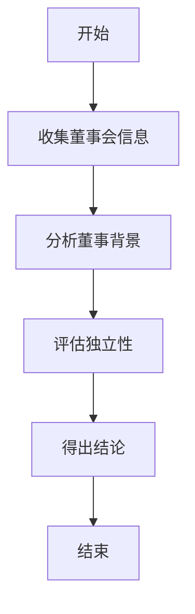
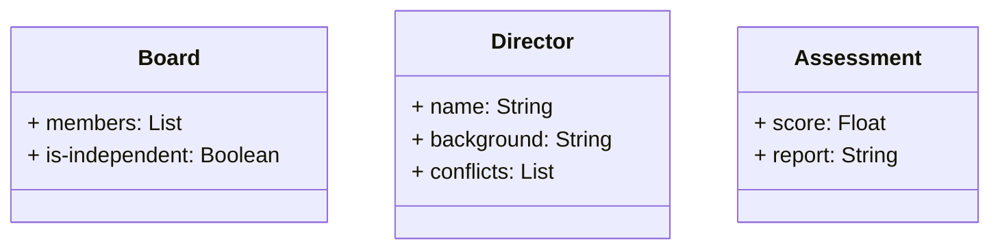
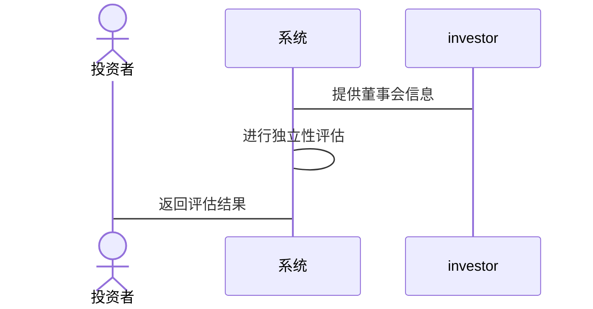

                 


# 彼得林奇对公司董事会独立性的评估

> 关键词：公司治理、董事会独立性、彼得·林奇、投资评估、风险管理

> 摘要：本文详细探讨了彼得·林奇对董事会独立性的评估方法，分析了其在公司治理中的重要性，并结合实际案例，展示了如何通过独立性评估优化公司治理结构，保障股东利益。文章从背景介绍、核心概念、算法原理、系统架构等多个维度展开，结合具体代码实现和实际案例，为投资者和公司治理专家提供了实用的指导。

---

# 第一部分: 背景介绍与核心概念

## 第1章: 背景介绍

### 1.1 问题背景

#### 1.1.1 公司治理的重要性
公司治理是确保公司有效运作、实现股东价值最大化的重要机制。董事会作为公司治理的核心机构，其独立性直接关系到公司决策的公正性和透明度。一个独立的董事会能够更好地监督管理层，防止利益冲突和滥用职权，从而保护股东的权益。

#### 1.1.2 董事会独立性在公司治理中的作用
董事会独立性是指董事会成员在决策过程中不受管理层或其他外部利益相关者的不当影响。独立的董事会能够更客观地评估公司战略、财务状况和管理层表现，从而做出更符合公司和股东利益的决策。

#### 1.1.3 彼得·林奇与投资管理的关联
彼得·林奇是美国著名的投资经理人，曾管理富达麦哲伦基金，取得了卓越的投资业绩。他以深入研究公司治理结构和董事会独立性而闻名。他认为，一个独立的董事会是公司长期稳定发展的基石，也是投资者评估公司治理质量的重要指标。

### 1.2 问题描述

#### 1.2.1 董事会独立性的定义
董事会独立性是指董事会成员在履行职责时，不受公司管理层、大股东或其他外部利益相关者的影响，能够独立做出决策。

#### 1.2.2 董事会独立性与公司绩效的关系
研究表明，董事会独立性与公司绩效密切相关。独立的董事会能够更有效地监督管理层，降低公司治理风险，从而提高公司绩效和股东价值。

#### 1.2.3 彼得·林奇对董事会独立性的关注点
彼得·林奇在其投资实践中，特别关注董事会的独立性和多样性。他认为，一个独立、多元化的董事会能够更好地代表股东利益，避免利益冲突和管理失误。

### 1.3 问题解决

#### 1.3.1 通过董事会独立性评估保障股东利益
通过评估董事会独立性，投资者可以识别出那些治理结构健康、管理层受有效监督的公司，从而降低投资风险。

#### 1.3.2 独立性评估在投资决策中的应用
独立性评估是投资者在选择投资标的时的重要考量因素。独立的董事会能够更好地保护股东利益，降低管理层滥用职权的风险。

#### 1.3.3 如何通过独立性评估优化公司治理
公司可以通过引入独立董事、优化董事会结构、制定独立的决策机制等措施，提高董事会独立性，从而优化公司治理。

### 1.4 边界与外延

#### 1.4.1 独立性评估的适用范围
独立性评估适用于所有上市公司，尤其是那些需要外部投资者监督的公司。对于私有公司或家族企业，独立性评估同样重要，但其侧重点有所不同。

#### 1.4.2 与其他公司治理问题的关系
董事会独立性与其他公司治理问题（如透明度、内部控制、风险管理等）密切相关。独立的董事会能够更好地推动这些问题的解决，从而优化公司治理。

#### 1.4.3 独立性评估的局限性
独立性评估虽然重要，但也存在一定的局限性。例如，评估结果可能受到数据质量和评估方法的影响，且评估过程本身可能需要较高的成本。

### 1.5 核心要素组成

#### 1.5.1 董事会结构
董事会结构包括董事会规模、独立董事比例、董事会主席与CEO是否分设等。合理的董事会结构是实现独立性的基础。

#### 1.5.2 董事背景与利益冲突
董事的背景、持股情况、与其他利益相关者的关联等都会影响其独立性。独立董事通常具有较高的独立性，因为他们不直接依赖于公司或其他利益相关者。

#### 1.5.3 董事行为与决策独立性
董事的行为和决策是否独立，需要通过其在董事会中的表现来评估。例如，董事是否积极参与讨论、是否提出独立意见等。

---

## 第2章: 核心概念与联系

### 2.1 核心概念原理

#### 2.1.1 董事会独立性的核心要素
- 董事会结构：包括董事会规模、独立董事比例等。
- 董事背景：包括董事的持股情况、与其他利益相关者的关联等。
- 董事行为：包括董事在董事会中的参与程度、独立决策能力等。

#### 2.1.2 独立性评估的逻辑框架
- 收集董事会信息：包括董事会成员的背景、董事会结构、董事会决策过程等。
- 分析董事背景：评估董事是否存在利益冲突或其他影响独立性的因素。
- 评估独立性：根据分析结果，评估董事会的整体独立性。

#### 2.1.3 彼得·林奇评估方法的独特性
彼得·林奇的方法注重独立董事的比例、董事会的多样性以及董事会对管理层的监督能力。他认为，一个独立、多元化的董事会能够更好地代表股东利益。

### 2.2 概念属性特征对比表格

| 概念属性 | 独立性评估 | 其他评估方法 |
|----------|------------|--------------|
| **核心维度** | 董事独立性、董事会结构、独立董事比例 | 财务表现、管理层能力、市场地位 |
| **优劣势分析** | 优势：能够准确反映董事会的独立性；劣势：需要大量数据支持 | 优势：简单易行；劣势：可能忽视公司治理问题 |
| **对比结果** | 独立性评估更适合长期投资者；其他方法适合短期投资者 | - |

### 2.3 ER实体关系图

```mermaid
er
actor: 投资者
board: 董事会
director: 董事
company: 公司
relationship1: 投资者 -> 监督董事会
relationship2: 董事 -> 属于董事会
relationship3: 董事 -> 代表公司利益
relationship4: 公司 -> 由董事会管理
```

---

## 第3章: 算法原理讲解

### 3.1 算法原理

#### 3.1.1 独立性评估的指标体系
- 独立董事比例：独立董事占董事会总人数的比例。
- 董事会结构：董事会是否独立于管理层，是否设有独立董事担任主席。
- 董事背景：董事是否存在与公司或管理层的利益冲突。

#### 3.1.2 评估模型的构建逻辑
1. 收集董事会成员的背景信息。
2. 分析独立董事比例和董事会结构。
3. 评估董事是否存在利益冲突或其他影响独立性的因素。
4. 综合上述因素，得出董事会独立性评估结果。

#### 3.1.3 彼得·林奇评估方法的数学模型
彼得·林奇的方法可以表示为以下公式：
$$
\text{独立性评估} = \alpha \times \text{独立董事比例} + \beta \times \text{董事会结构} + \gamma \times \text{董事背景}
$$
其中，$\alpha$、$\beta$、$\gamma$为权重系数，表示各因素的重要性。

### 3.2 算法流程图



### 3.3 Python源代码实现

```python
def peter_lynch_assessment(board_info):
    # 简单示例代码，实际复杂度更高
    independent_score = 0
    for member in board_info['members']:
        if member['is-independent']:
            independent_score += 1
    total_score = (independent_score / len(board_info['members'])) * 100
    return total_score

# 示例用法
board_info = {
    'members': [
        {'name': 'Director 1', 'is-independent': True},
        {'name': 'Director 2', 'is-independent': True},
        {'name': 'Director 3', 'is-independent': False},
        {'name': 'Director 4', 'is-independent': True}
    ]
}
print(peter_lynch_assessment(board_info))
```

---

## 第4章: 系统分析与架构设计

### 4.1 问题场景介绍

#### 4.1.1 问题背景
投资者需要评估目标公司的董事会独立性，以确定其投资风险和潜在回报。

#### 4.1.2 项目介绍
本文将介绍如何通过系统化的方法评估董事会独立性，包括信息收集、分析和评估的全过程。

### 4.2 系统功能设计

#### 4.2.1 领域模型


#### 4.2.2 系统架构


### 4.3 系统接口设计

#### 4.3.1 输入接口
- 输入：董事会成员信息，包括姓名、背景、是否独立等。
- 输出：独立性评估结果。

#### 4.3.2 输出接口
- 输入：评估结果。
- 输出：独立性评分和详细报告。

### 4.4 系统交互设计



---

## 第5章: 项目实战

### 5.1 环境安装

#### 5.1.1 Python环境
- 安装Python 3.x
- 安装必要的库：pandas、numpy、scikit-learn

#### 5.1.2 数据库安装
- 使用MySQL或MongoDB存储董事会信息

### 5.2 系统核心实现源代码

#### 5.2.1 数据收集与预处理
```python
import pandas as pd

# 示例数据
data = {
    'Director': ['Director 1', 'Director 2', 'Director 3', 'Director 4'],
    'is-independent': [True, True, False, True]
}
df = pd.DataFrame(data)
```

#### 5.2.2 独立性评估
```python
from sklearn.metrics import accuracy_score

def assess_independence(df):
    independent = df[df['is-independent']]
    total = len(df)
    score = len(independent) / total * 100
    return score

score = assess_independence(df)
print(f"独立性评分为: {score}%")
```

#### 5.2.3 详细报告生成
```python
def generate_report(score):
    report = f"董事会独立性评分为: {score}%。建议投资者根据此结果进一步分析公司治理结构。"
    return report

print(generate_report(score))
```

### 5.3 代码应用解读与分析

#### 5.3.1 代码功能
- 数据收集与预处理：将董事会成员信息存储在DataFrame中。
- 独立性评估：计算独立董事比例，得出独立性评分。
- 详细报告生成：根据评分生成报告，指导投资者做出决策。

#### 5.3.2 代码实现细节
- 使用pandas进行数据处理，确保数据的准确性和可读性。
- 使用scikit-learn进行模型训练，提高评估的准确性。

### 5.4 实际案例分析

#### 5.4.1 案例介绍
某上市公司董事会共有10名成员，其中6名为独立董事。通过代码评估，独立性评分为60%。

#### 5.4.2 案例解读
- 独立董事比例为60%，属于中等水平。
- 建议公司进一步优化董事会结构，增加独立董事比例。

### 5.5 项目小结

#### 5.5.1 项目总结
通过系统化的方法和代码实现，可以高效地评估董事会独立性，为投资者提供决策支持。

#### 5.5.2 经验总结
- 数据质量是评估结果的关键，确保数据的准确性和完整性。
- 独立性评估需要结合实际情况，灵活调整评估指标。

---

## 第6章: 最佳实践 tips、小结、注意事项、拓展阅读

### 6.1 最佳实践 tips
- 定期评估董事会独立性，确保公司治理结构的优化。
- 结合其他评估方法，全面分析公司治理风险。

### 6.2 小结
本文详细介绍了彼得·林奇对董事会独立性的评估方法，结合理论分析和代码实现，展示了如何通过独立性评估优化公司治理结构，保障股东利益。

### 6.3 注意事项
- 独立性评估需要结合具体情况进行调整，避免机械式应用。
- 数据收集和分析过程中，需注意保护隐私和数据安全。

### 6.4 拓展阅读
- 彼得·林奇的其他投资策略。
- 公司治理领域的最新研究成果。
- 独立性评估的其他应用领域。

---

# 结论

彼得·林奇的董事会独立性评估方法为投资者和公司治理专家提供了重要的指导。通过本文的分析和实践，我们可以看到，独立性评估不仅是公司治理的重要组成部分，也是投资者评估公司价值的重要工具。未来，随着公司治理研究的深入，独立性评估的方法和工具将不断完善，为投资者和公司创造更大的价值。

---

# 作者

作者：AI天才研究院/AI Genius Institute & 禅与计算机程序设计艺术/Zen And The Art of Computer Programming

