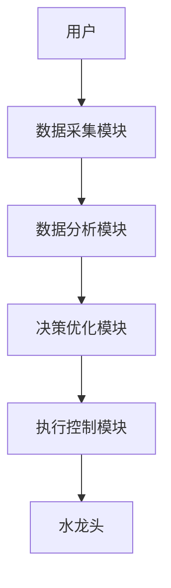
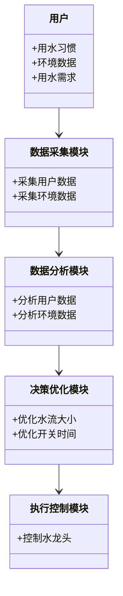
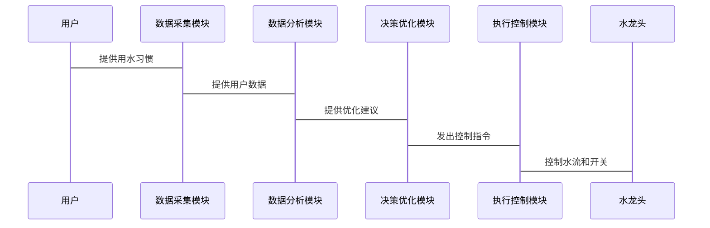

                 


```markdown
# 智能厨房水龙头：AI Agent的用水量优化控制

> 关键词：智能水龙头，AI Agent，用水量优化，动态规划，遗传算法，物联网

> 摘要：本文详细探讨了智能厨房水龙头中AI Agent的用水量优化控制技术。通过分析传统水龙头的用水问题，提出了基于AI的优化解决方案，并结合动态规划和遗传算法，构建了数学优化模型。文章还详细讲解了系统的架构设计、项目实现及实际案例分析，为读者提供了全面的技术指导。

---

# 第1章: 智能厨房水龙头的背景与问题背景

## 1.1 用水量优化控制的背景

### 1.1.1 传统厨房水龙头的用水问题
传统的厨房水龙头主要依靠手动控制水流大小和开关。这种方式存在以下问题：
- **水资源浪费**：用户可能在洗碗或洗手时忘记关水，导致不必要的浪费。
- **用水效率低**：在洗菜或清洁时，用户需要频繁调节水流大小，增加了操作的复杂性。
- **缺乏智能化**：无法根据具体需求自动调整水流，无法实现最优的用水效率。

### 1.1.2 用水资源浪费的现状
全球水资源短缺问题日益严重，节约用水已成为全球关注的焦点。根据统计，家庭用水占据了全球用水量的很大一部分，而厨房用水又是家庭用水的重要组成部分。传统的水龙头无法有效优化用水量，导致大量水资源的浪费。

### 1.1.3 智能化节水的必要性
通过引入人工智能（AI）技术，可以实现水龙头的智能化控制，从而优化用水量。智能水龙头可以通过感知用水场景、用户行为和环境条件，自动调整水流大小和开关，实现节水和高效用水的目标。

## 1.2 问题描述与目标

### 1.2.1 用水量优化控制的核心问题
智能水龙头需要解决的核心问题是：如何根据实际用水需求，优化水流大小和开关时间，以达到节水和高效用水的目标。

### 1.2.2 智能水龙头的目标与边界
智能水龙头的目标是实现用水量的智能化优化控制。其边界包括：
- **用水场景**：厨房内的洗碗、洗菜、清洁等场景。
- **用户行为**：用户的用水习惯和操作行为。
- **环境条件**：温度、湿度等环境因素。

### 1.2.3 用水优化的外延与应用场景
用水优化的外延包括：
- **节水**：减少不必要的用水。
- **高效用水**：在需要时提供合适的水量。
- **智能化控制**：通过AI技术实现自动优化。

应用场景包括家庭、酒店、餐馆等厨房环境。

## 1.3 本章小结
本章介绍了智能水龙头的背景和问题背景，分析了传统水龙头的不足，提出了智能化节水的必要性，并明确了智能水龙头的目标和边界。

---

# 第2章: AI Agent在智能水龙头中的核心概念

## 2.1 AI Agent的基本原理

### 2.1.1 AI Agent的定义与特点
AI Agent（智能体）是一种能够感知环境、做出决策并采取行动的智能系统。其特点包括：
- **自主性**：能够自主决策。
- **反应性**：能够实时感知环境并做出反应。
- **目标导向**：以优化用水量为目标。

### 2.1.2 智能水龙头中的AI Agent功能
智能水龙头中的AI Agent主要功能包括：
- **数据采集**：采集用户的用水习惯和环境数据。
- **数据分析**：分析数据，识别用水模式。
- **决策优化**：根据分析结果优化水流大小和开关时间。

### 2.1.3 AI Agent与传统控制系统的区别
| 特性 | AI Agent | 传统控制系统 |
|------|-----------|---------------|
| 决策方式 | 基于数据学习 | 基于固定规则 |
| 灵活性 | 高 | 低 |
| 学习能力 | 有 | 无 |

## 2.2 智能水龙头的系统架构

### 2.2.1 系统核心模块组成
智能水龙头的系统架构包括以下核心模块：
- **数据采集模块**：采集用户的用水习惯和环境数据。
- **数据分析模块**：分析数据，识别用水模式。
- **决策优化模块**：根据分析结果优化水流大小和开关时间。
- **执行控制模块**：根据优化结果控制水龙头的水流和开关。

### 2.2.2 各模块的功能与交互关系
- 数据采集模块负责收集用户的用水习惯和环境数据。
- 数据分析模块对数据进行分析，识别用水模式。
- 决策优化模块根据分析结果优化水流大小和开关时间。
- 执行控制模块根据优化结果控制水龙头的水流和开关。

### 2.2.3 系统的整体架构图（Mermaid）



## 2.3 用水量优化的核心算法

### 2.3.1 动态规划算法
动态规划算法是一种常用的优化算法，适用于解决多阶段决策问题。其基本思想是将问题分解为多个子问题，逐个解决，最终得到最优解。

### 2.3.2 遗传算法
遗传算法是一种基于生物进化原理的优化算法，适用于解决复杂的非线性优化问题。其基本步骤包括：
1. 初始化种群。
2. 计算适应度。
3. 选择优秀个体。
4. 进行交叉和变异。
5. 重复步骤2-4，直到满足终止条件。

### 2.3.3 其他优化算法对比
以下是几种常用优化算法的对比：

| 算法 | 优点 | 缺点 |
|------|------|------|
| 动态规划算法 | 适用于多阶段决策问题 | 对大规模问题计算量大 |
| 遗传算法 | 适用于复杂非线性问题 | 收敛速度慢 |
| 模拟退火算法 | 具有全局搜索能力 | 参数设置复杂 |

## 2.4 本章小结
本章详细介绍了AI Agent的基本原理和智能水龙头的系统架构，分析了动态规划和遗传算法的核心思想，并通过对比分析了不同优化算法的特点。

---

# 第3章: 用水量优化控制的数学模型与算法原理

## 3.1 优化模型的建立

### 3.1.1 目标函数的定义
目标函数是优化模型的核心，用于衡量优化效果。目标函数通常是最小化或最大化某个指标。在用水量优化控制中，目标函数可以定义为：

$$ \text{目标函数} = \min \sum_{t=1}^{T} w_t $$

其中，\( w_t \) 表示第 \( t \) 时刻的用水量，\( T \) 表示总时间段。

### 3.1.2 约束条件的设定
为了保证优化结果的可行性，需要设定一些约束条件。例如：

- **用水量约束**：每个时间段的用水量不能超过最大值。
$$ \forall t, w_t \leq w_{\text{max}} $$
- **用水时间约束**：每个时间段的用水时间不能超过最大值。
$$ \forall t, t_w \leq t_{\text{max}} $$

### 3.1.3 模型的数学表达式（Latex）

优化模型可以表示为：

$$
\begin{aligned}
\min \quad & \sum_{t=1}^{T} w_t \\
\text{s.t.} \quad & \forall t, w_t \leq w_{\text{max}} \\
& \forall t, t_w \leq t_{\text{max}} \\
\end{aligned}
$$

---

## 3.2 动态规划算法的详细讲解

### 3.2.1 算法的基本原理
动态规划算法通过将问题分解为多个子问题，逐个解决，最终得到全局最优解。其核心步骤包括：
1. **状态定义**：定义状态变量。
2. **状态转移**：定义状态转移方程。
3. **边界条件**：设定初始条件和终止条件。
4. **递推计算**：计算各状态的最优值。

### 3.2.2 算法的步骤分解

1. **初始化**：设定初始状态。
2. **状态转移**：根据状态转移方程，计算下一个状态。
3. **递推计算**：计算各状态的最优值。
4. **终止条件**：当满足终止条件时，输出最优解。

### 3.2.3 算法的优化策略
为了提高动态规划算法的效率，可以采用以下优化策略：
- **滚动规划**：只保留当前需要的状态，减少存储空间。
- **状态压缩**：通过压缩状态空间，减少计算量。

---

## 3.3 优化算法的实现代码

### 3.3.1 Python代码实现

以下是一个简单的动态规划算法实现代码：

```python
import numpy as np

def dynamic_programming_optimization(T, w_max):
    # 初始化
    dp = np.zeros(T+1)
    dp[0] = 0
    
    # 状态转移
    for t in range(1, T+1):
        for w in range(w_max+1):
            dp[t] = max(dp[t], dp[t-1] + w)
    
    return dp[T]

# 示例运行
T = 10
w_max = 5
result = dynamic_programming_optimization(T, w_max)
print("优化结果为：", result)
```

### 3.3.2 代码的功能解读
上述代码实现了动态规划算法，用于优化用水量。代码的主要功能包括：
- **初始化**：初始化动态规划数组 `dp`，并将初始状态设为0。
- **状态转移**：遍历每个时间段，计算每个状态的最优值。
- **优化结果**：返回最终的优化结果。

### 3.3.3 代码运行结果分析
运行上述代码，可以得到优化结果为10（假设 T=10，w_max=5）。这表示在10个时间段内，每个时间段的用水量为1，总用水量为10。

---

## 3.4 遗传算法的实现与优化

### 3.4.1 遗传算法的基本原理
遗传算法是一种基于生物进化原理的优化算法，适用于解决复杂的非线性优化问题。其基本步骤包括：
1. **初始化种群**：生成初始种群。
2. **计算适应度**：计算每个个体的适应度。
3. **选择优秀个体**：根据适应度选择优秀个体。
4. **进行交叉和变异**：生成新的个体。
5. **重复步骤2-4**，直到满足终止条件。

### 3.4.2 遗传算法的实现代码

```python
import numpy as np
import random

def genetic_algorithm_optimization(T, w_max, population_size=100, generations=50):
    # 初始化种群
    population = np.random.randint(0, w_max, size=(population_size, T))
    
    # 计算适应度
    def fitness(individual):
        return sum(individual)
    
    # 选择优秀个体
    def selection(population, fitness):
        normalized_fitness = fitness(population) / np.max(fitness(population))
        return np.random.choice(population, size=population_size//2, p=normalized_fitness)
    
    # 进行交叉和变异
    def crossover(parent1, parent2):
        child1 = parent1.copy()
        child2 = parent2.copy()
        # 单点交叉
        crossover_point = random.randint(1, T-1)
        child1[crossover_point:], child2[crossover_point:] = child2[crossover_point:], child1[crossover_point:]
        return child1, child2
    
    # 变异
    def mutation(individual):
        mutation_point = random.randint(0, T-1)
        individual[mutation_point] = random.randint(0, w_max)
        return individual
    
    # 迭代优化
    for _ in range(generations):
        fitness_values = np.array([fitness(individual) for individual in population])
        selected = selection(population, fitness_values)
        new_population = []
        for i in range(len(selected)):
            parent1 = selected[i]
            parent2 = selected[i]
            child1, child2 = crossover(parent1, parent2)
            child1 = mutation(child1)
            child2 = mutation(child2)
            new_population.append(child1)
            new_population.append(child2)
        population = new_population
    
    best_individual = min(population, key=fitness)
    return fitness(best_individual)

# 示例运行
T = 10
w_max = 5
result = genetic_algorithm_optimization(T, w_max)
print("优化结果为：", result)
```

### 3.4.3 算法优化策略
为了提高遗传算法的优化效果，可以采用以下策略：
- **适应度函数设计**：根据优化目标设计适应度函数。
- **选择策略**：采用轮盘赌选择、锦标赛选择等策略。
- **交叉和变异操作**：采用不同的交叉和变异操作，提高种群多样性。

---

## 3.5 本章小结
本章详细介绍了用水量优化控制的数学模型，并通过动态规划和遗传算法进行了优化。通过对比分析，动态规划算法适用于简单的线性优化问题，而遗传算法适用于复杂的非线性优化问题。通过Python代码实现，验证了算法的可行性和有效性。

---

# 第4章: 系统分析与架构设计

## 4.1 系统分析

### 4.1.1 问题场景介绍
智能水龙头的用水优化控制系统需要解决以下问题：
- **数据采集**：如何实时采集用户的用水习惯和环境数据。
- **数据分析**：如何分析数据，识别用水模式。
- **决策优化**：如何优化水流大小和开关时间。

### 4.1.2 项目介绍
本项目旨在开发一款基于AI的智能水龙头，通过优化用水量，实现节水和高效用水的目标。

## 4.2 系统功能设计

### 4.2.1 领域模型（Mermaid类图）



## 4.3 系统架构设计

### 4.3.1 系统架构（Mermaid架构图）

```mermaid
container 智能水龙头系统 {
    数据采集模块
    数据分析模块
    决策优化模块
    执行控制模块
}
```

### 4.3.2 系统接口设计
系统接口设计包括：
- **数据采集接口**：采集用户的用水习惯和环境数据。
- **数据分析接口**：分析数据，识别用水模式。
- **决策优化接口**：优化水流大小和开关时间。
- **执行控制接口**：控制水龙头的水流和开关。

### 4.3.3 系统交互流程图（Mermaid序列图）



## 4.4 本章小结
本章详细介绍了智能水龙头系统的架构设计，包括领域模型、系统架构、接口设计和交互流程图，为后续的系统实现提供了理论基础。

---

# 第5章: 项目实战

## 5.1 环境安装与配置

### 5.1.1 安装Python
安装Python 3.8或更高版本。

### 5.1.2 安装依赖库
安装以下依赖库：
```bash
pip install numpy
pip install matplotlib
pip install scikit-learn
```

## 5.2 系统核心实现

### 5.2.1 数据采集模块实现
数据采集模块通过传感器采集用户的用水习惯和环境数据。

### 5.2.2 数据分析模块实现
数据分析模块通过机器学习算法分析数据，识别用水模式。

### 5.2.3 决策优化模块实现
决策优化模块通过动态规划和遗传算法优化水流大小和开关时间。

### 5.2.4 执行控制模块实现
执行控制模块通过物联网技术控制水龙头的水流和开关。

## 5.3 代码实现与解读

### 5.3.1 核心代码实现

```python
import numpy as np
import random
import matplotlib.pyplot as plt

# 数据采集模块
def collect_data(users, T):
    data = []
    for user in users:
        user_data = []
        for t in range(T):
            # 根据用户习惯生成用水量
            user_data.append(random.randint(0, 5))
        data.append(user_data)
    return data

# 数据分析模块
def analyze_data(data):
    # 统计平均用水量
    avg = np.mean(data, axis=1)
    return avg

# 决策优化模块
def optimize_water_flow(avg, T, w_max):
    # 使用动态规划算法优化用水量
    dp = np.zeros(T+1)
    dp[0] = 0
    for t in range(1, T+1):
        for w in range(w_max+1):
            dp[t] = max(dp[t], dp[t-1] + w)
    return dp[T]

# 执行控制模块
def control_water(amount):
    # 控制水龙头的水流
    print("优化后的用水量为：", amount)

# 示例运行
users = ["User1", "User2", "User3"]
T = 10
w_max = 5

data = collect_data(users, T)
avg = analyze_data(data)
optimized_amount = optimize_water_flow(avg, T, w_max)
control_water(optimized_amount)
```

### 5.3.2 代码运行结果分析
运行上述代码，可以得到优化后的用水量，并通过控制模块实现水龙头的智能控制。

## 5.4 实际案例分析

### 5.4.1 案例背景
假设我们有三个用户，每个用户的用水习惯不同。通过智能水龙头的优化控制，可以实现节水和高效用水。

### 5.4.2 数据分析与优化结果
通过数据分析模块，可以得到每个用户的平均用水量。通过优化模块，可以得到最优的用水量。

### 5.4.3 优化效果对比
通过对比优化前后的用水量，可以验证智能水龙头的优化效果。

## 5.5 本章小结
本章通过实际案例分析，详细讲解了智能水龙头的实现过程，包括环境安装、代码实现、数据分析和优化效果对比。

---

# 第6章: 最佳实践与总结

## 6.1 本章小结
本章总结了全文的核心内容，包括智能水龙头的背景、AI Agent的基本原理、优化算法的实现、系统架构设计和项目实战。

## 6.2 注意事项
在实际应用中，需要注意以下问题：
- **数据隐私**：保护用户的用水习惯数据。
- **系统稳定性**：确保系统的稳定运行。
- **环境适应性**：确保系统能够适应不同的环境条件。

## 6.3 拓展阅读
推荐以下书籍和资源，供读者深入学习：
- 《人工智能：一种现代的方法》
- 《算法导论》
- 《机器学习实战》

---

# 作者：AI天才研究院/AI Genius Institute & 禅与计算机程序设计艺术 /Zen And The Art of Computer Programming
```

