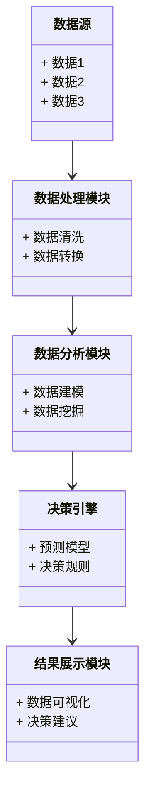
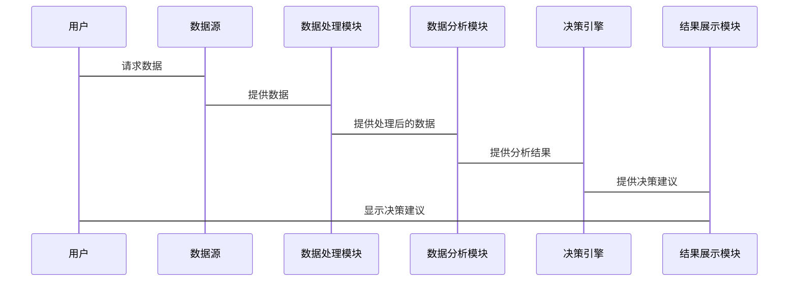

                 


# 构建智能企业决策支持系统：多维度数据分析与建议

> 关键词：智能企业决策支持系统, 多维度数据分析, 数据驱动决策, 机器学习, 数据可视化

> 摘要：本文章详细探讨了构建智能企业决策支持系统的方法，结合多维度数据分析，从问题背景、核心概念、算法原理、系统架构到项目实战，层层剖析，提供系统的解决方案和实践指导，帮助企业在数字化转型中提升决策效率和准确性。

---

# 第一部分: 背景介绍

## 第1章: 问题背景与解决方法

### 1.1 问题背景

#### 1.1.1 企业决策面临的挑战

在当今快速变化的商业环境中，企业面临着复杂多变的市场条件和竞争压力。传统的决策方式往往依赖于经验丰富的管理者或部门的直觉判断，这种方式存在以下主要挑战：

- **数据分散性**：企业内部数据分布在不同的部门和系统中，形成数据孤岛，难以整合和分析。
- **信息不透明**：决策者无法及时获取准确的数据支持，导致决策过程中的信息不对称。
- **决策效率低下**：传统的人工分析方法耗时长，且容易受到主观因素的影响，难以快速响应市场变化。
- **缺乏预测性**：决策往往基于历史数据，难以预测未来趋势，特别是在面对复杂市场环境时，缺乏前瞻性。

#### 1.1.2 数据分析在决策中的重要性

数据分析作为现代决策支持的核心工具，其重要性体现在以下几个方面：

- **数据驱动的决策**：通过分析大量数据，识别潜在的市场机会和风险，提高决策的科学性和准确性。
- **提升决策效率**：利用自动化工具快速处理和分析数据，缩短决策周期。
- **增强预测能力**：通过机器学习和统计模型，预测未来趋势，帮助企业在变化中保持竞争优势。

#### 1.1.3 智能决策支持系统的必要性

随着大数据和人工智能技术的快速发展，智能决策支持系统成为企业提升竞争力的关键工具。它能够实时处理和分析海量数据，提供智能化的决策建议，帮助企业做出更明智的选择。

---

### 1.2 问题描述

#### 1.2.1 传统决策方式的局限性

传统决策方式主要依赖于经验判断和人工分析，存在以下局限性：

- **主观性**：决策结果受到决策者个人经验和判断的影响，可能导致偏差。
- **缺乏系统性**：决策过程缺乏系统的数据支持，难以全面考虑各种因素。
- **响应速度慢**：面对复杂问题时，人工分析耗时长，难以快速应对市场变化。

#### 1.2.2 数据孤岛与信息不透明的问题

数据孤岛指的是企业内部数据分散在不同的系统中，彼此之间缺乏有效的整合和共享。这种状况导致以下问题：

- **数据重复**：同一数据在多个系统中存在，增加数据管理和维护的难度。
- **信息不一致**：不同系统中的数据可能不一致，导致决策依据的不准确。
- **难以挖掘价值**：分散的数据难以进行深入分析，无法挖掘出有价值的信息。

#### 1.2.3 决策过程中的不确定性与风险

企业在决策过程中面临诸多不确定性，例如市场需求波动、政策变化等，这些因素增加了决策的难度和风险。

---

### 1.3 问题解决方法

#### 1.3.1 数据驱动决策的核心思想

数据驱动决策的核心思想是通过数据分析和挖掘，利用数据支持决策过程。其主要步骤包括：

1. **数据收集**：从企业内外部收集相关数据。
2. **数据处理**：清洗和整理数据，确保数据质量。
3. **数据分析**：利用统计分析和机器学习等技术，提取数据中的有价值信息。
4. **决策支持**：基于分析结果，提供决策建议。

#### 1.3.2 多维度数据分析的实现路径

多维度数据分析是通过从多个维度（如时间、地点、产品、客户等）分析数据，以发现潜在的模式和趋势。其实现路径包括：

1. **数据建模**：建立数据模型，反映数据之间的关系。
2. **数据可视化**：通过图表等方式直观展示数据分析结果。
3. **预测分析**：利用历史数据预测未来趋势。
4. **决策优化**：基于分析结果优化决策方案。

#### 1.3.3 智能决策支持系统的构建目标

智能决策支持系统的构建目标是实现企业数据的智能化分析和决策支持，具体包括：

- 提供实时数据监控和分析能力。
- 自动生成决策建议，减少人为判断的偏差。
- 支持预测性分析，提前预判市场变化。
- 实现跨部门数据整合，消除数据孤岛。

---

### 1.4 系统的边界与外延

#### 1.4.1 系统边界定义

智能决策支持系统的边界主要集中在数据的收集、处理和分析部分。其输入是企业内外部数据，输出是决策建议和分析结果。系统的边界清晰，确保与其他系统的接口明确。

#### 1.4.2 外延与相关系统的区别

智能决策支持系统的外延包括与企业其他系统的接口，如ERP系统、CRM系统等。这些系统的数据输入到决策支持系统中，经过处理后，生成的分析结果可以反馈到其他系统中。

#### 1.4.3 与企业其他系统的接口关系

智能决策支持系统需要与其他企业系统进行数据交互，例如：

- **ERP系统**：提供企业的运营数据。
- **CRM系统**：提供客户信息和销售数据。
- **财务系统**：提供财务数据。

通过接口的方式，智能决策支持系统可以获取所需数据，并将分析结果反馈给相关系统。

---

### 1.5 概念结构与核心要素

#### 1.5.1 系统的基本组成

智能决策支持系统由以下几个部分组成：

1. **数据源**：包括企业内外部数据。
2. **数据处理模块**：负责数据清洗和转换。
3. **数据分析模块**：利用统计分析和机器学习技术进行数据挖掘。
4. **决策引擎**：基于分析结果生成决策建议。
5. **用户界面**：提供数据可视化和决策建议的展示界面。

#### 1.5.2 核心要素的定义与关系

- **数据源**：系统的输入，包括结构化和非结构化数据。
- **数据处理模块**：对数据进行清洗、转换和整合。
- **数据分析模块**：利用算法对数据进行建模和分析。
- **决策引擎**：基于分析结果生成决策建议。
- **用户界面**：供用户查看和交互的界面。

这些要素之间相互关联，共同构成完整的决策支持系统。

#### 1.5.3 系统功能模块的划分

- **数据采集模块**：负责从各种数据源获取数据。
- **数据处理模块**：清洗和整理数据，确保数据质量。
- **数据分析模块**：利用算法进行数据分析和挖掘。
- **决策引擎模块**：基于分析结果生成决策建议。
- **结果展示模块**：以图表等形式展示分析结果和决策建议。

---

## 第2章: 核心概念与联系

### 2.1 数据分析与决策支持

#### 2.1.1 数据分析的基本概念

数据分析是通过对数据的处理和建模，发现数据中的模式、趋势和关联，从而支持决策的过程。

#### 2.1.2 数据分析在决策中的作用

数据分析在决策中的作用包括：

- **支持数据驱动的决策**：通过分析数据，发现潜在的市场机会和风险。
- **提高决策的准确性**：基于数据的分析结果，减少决策的主观性。
- **优化决策过程**：通过自动化分析，提高决策的效率。

#### 2.1.3 数据分析的类型与方法

数据分析的类型包括：

- **描述性分析**：描述数据的基本特征，如均值、中位数等。
- **诊断性分析**：分析数据背后的原因，找出问题的根本原因。
- **预测性分析**：基于历史数据预测未来趋势。
- **规范性分析**：提出最优的决策建议。

---

### 2.2 机器学习与决策支持

#### 2.2.1 机器学习的基本概念

机器学习是一种人工智能技术，通过训练模型从数据中学习规律，并利用这些规律进行预测和分类。

#### 2.2.2 机器学习在决策支持中的应用

机器学习在决策支持中的应用包括：

- **客户分群**：基于客户数据进行分群，制定精准的营销策略。
- **预测客户流失**：通过历史数据预测客户流失的可能性，提前采取措施。
- **销售预测**：基于销售数据预测未来的销售趋势。

#### 2.2.3 常见的机器学习算法及其特点

常用的机器学习算法包括：

- **决策树**：用于分类和回归，易于解释。
- **随机森林**：基于决策树的集成方法，具有高准确率。
- **支持向量机（SVM）**：适用于小规模数据的分类问题。
- **神经网络**：适用于复杂的数据模式识别。

---

### 2.3 自然语言处理与决策支持

#### 2.3.1 自然语言处理的基本概念

自然语言处理（NLP）是人工智能的一个分支，旨在使计算机能够理解和生成人类语言。

#### 2.3.2 NLP在决策支持中的应用

NLP在决策支持中的应用包括：

- **情感分析**：分析客户对产品的评价，判断客户情感倾向。
- **信息提取**：从文本中提取关键信息，如公司名称、职位等。
- **自动摘要**：对大量文本进行摘要，提取核心信息。

#### 2.3.3 常见的NLP技术及其特点

常用的NLP技术包括：

- **分词**：将文本分割成词语。
- **实体识别**：识别文本中的命名实体，如人名、地名等。
- **句法分析**：分析句子的语法结构。
- **文本分类**：将文本归类到不同的类别中。

---

### 2.4 数据可视化与决策支持

#### 2.4.1 数据可视化的基本概念

数据可视化是将数据以图形或图像的形式展示，帮助用户更好地理解和分析数据。

#### 2.4.2 数据可视化在决策支持中的作用

数据可视化在决策支持中的作用包括：

- **直观展示数据**：通过图表等形式，直观展示数据分析结果。
- **辅助决策者理解数据**：帮助决策者快速掌握数据的核心信息。
- **支持数据驱动的决策**：通过可视化分析结果，支持决策者制定更科学的决策。

#### 2.4.3 常见的数据可视化技术与工具

常用的可视化技术和工具包括：

- **折线图**：展示数据的趋势。
- **柱状图**：比较不同类别的数据。
- **饼图**：展示数据的构成比例。
- **散点图**：展示数据点的分布情况。
- **工具**：如Tableau、Power BI、Matplotlib等。

---

## 第3章: 算法原理讲解

### 3.1 决策树算法

#### 3.1.1 决策树的基本原理

决策树是一种基于树状结构的分类方法，通过选择特征进行分支，最终到达叶节点，确定样本的类别。

#### 3.1.2 决策树的实现步骤

1. **特征选择**：选择最能区分不同类别的特征。
2. **划分数据集**：基于选择的特征，将数据集划分为子集。
3. **生成决策树**：递归地构建决策树，直到子集中的样本都属于同一类别或达到树的最大深度。
4. **剪枝**：为防止过拟合，对决策树进行剪枝。

#### 3.1.3 决策树的优缺点

- **优点**：易于理解和解释，适合处理多分类问题。
- **缺点**：对噪声数据敏感，容易过拟合。

#### 3.1.4 决策树的数学模型与公式

决策树的分裂标准常用信息增益、信息增益率或基尼指数。以下是信息增益的公式：

$$
\text{信息增益}(A) = H(D) - H(D|A)
$$

其中，$H(D)$是数据集的熵，$H(D|A)$是数据集在特征$A$条件下的熵。

---

### 3.2 随机森林算法

#### 3.2.1 随机森林的基本原理

随机森林是一种基于决策树的集成方法，通过生成多棵决策树，并将它们的结果进行投票或平均，最终得到预测结果。

#### 3.2.2 随机森林的实现步骤

1. **生成多棵决策树**：每棵树的训练数据通过有放回的抽样得到。
2. **特征随机选择**：在每个节点分裂时，随机选择部分特征进行选择。
3. **集成预测结果**：将所有树的预测结果进行集成，得到最终的预测结果。

#### 3.2.3 随机森林的优缺点

- **优点**：具有高准确率，对噪声数据不敏感，适合处理高维数据。
- **缺点**：计算复杂度较高，需要较多的计算资源。

#### 3.2.4 随机森林的数学模型与公式

随机森林通过集成学习方法，将多个决策树的预测结果进行融合。假设每个决策树的预测结果为$y_i$，最终的预测结果$y$可以表示为：

$$
y = \frac{1}{n} \sum_{i=1}^{n} y_i
$$

其中，$n$是决策树的数量。

---

## 第4章: 系统分析与架构设计

### 4.1 问题场景介绍

企业在决策过程中面临的常见问题包括：

- 数据分散，难以整合和分析。
- 缺乏实时数据监控和分析能力。
- 决策过程依赖人工判断，效率低下。

智能决策支持系统的目标是通过整合企业内外部数据，提供实时的分析和预测能力，支持决策者制定更科学的决策。

---

### 4.2 系统功能设计

#### 4.2.1 领域模型

以下是领域模型的类图：



#### 4.2.2 系统架构设计

以下是系统架构图：


---

### 4.3 系统接口设计

#### 4.3.1 系统交互流程

以下是系统交互流程图：



---

## 第5章: 项目实战

### 5.1 环境安装

以下是项目实战所需的环境和工具：

- **Python**：安装最新版本的Python（建议3.8以上）。
- **Jupyter Notebook**：用于数据可视化和算法实现。
- **数据库**：如MySQL或MongoDB，用于存储数据。
- **机器学习库**：如Scikit-learn、XGBoost。
- **数据可视化库**：如Matplotlib、Seaborn。

---

### 5.2 核心代码实现

#### 5.2.1 数据预处理代码

```python
import pandas as pd
import numpy as np

# 读取数据
data = pd.read_csv('data.csv')

# 删除缺失值
data.dropna(inplace=True)

# 标准化数据
from sklearn.preprocessing import StandardScaler

scaler = StandardScaler()
scaled_data = scaler.fit_transform(data)
```

#### 5.2.2 决策树模型实现

```python
from sklearn.tree import DecisionTreeClassifier

# 初始化模型
model = DecisionTreeClassifier()

# 训练模型
model.fit(X_train, y_train)

# 预测结果
y_pred = model.predict(X_test)

# 输出准确率
print(f'Accuracy: {model.score(X_test, y_test)}')
```

---

### 5.3 项目小结

通过本项目的实践，我们学习了如何构建一个智能企业决策支持系统，掌握了数据预处理、机器学习算法实现以及数据可视化的关键技术。同时，我们还了解了如何将这些技术应用于实际的业务场景中，帮助企业提升决策效率和准确性。

---

## 第6章: 总结与展望

### 6.1 总结

智能企业决策支持系统的构建是一个复杂但具有重要意义的工程。通过多维度数据分析和机器学习技术的应用，我们可以实现数据的智能化分析，为决策者提供科学的决策支持。本文详细探讨了系统的核心概念、算法原理、系统架构以及项目实战，为读者提供了一个全面的解决方案。

### 6.2 展望

未来，随着人工智能和大数据技术的进一步发展，智能决策支持系统将变得更加智能化和自动化。我们期待更多的创新技术能够应用于这一领域，为企业决策提供更加强有力的支持。

---

## 作者

作者：AI天才研究院/AI Genius Institute & 禅与计算机程序设计艺术/Zen And The Art of Computer Programming

