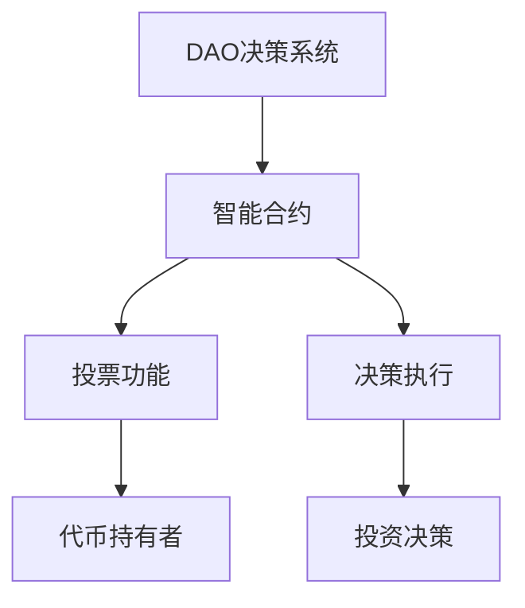
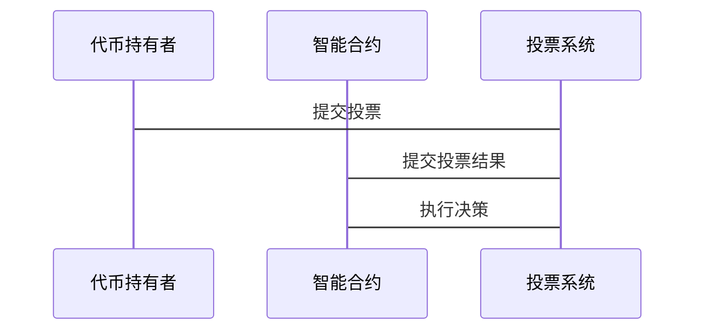

                 


# 特价股票投资中的分布式自治组织(DAO)决策方法

> 关键词：分布式自治组织（DAO）、股票投资、决策方法、区块链技术、投票机制

> 摘要：本文探讨了分布式自治组织（DAO）在特价股票投资中的应用，分析了其决策方法的原理、实现及优化策略。通过结合区块链技术和投票机制，提出了基于DAO的股票投资决策方法，并通过实例分析和代码实现，验证了该方法的有效性和可行性。

---

## # 第1章: 特价股票投资中的分布式自治组织(DAO)概述

### ## 1.1 特价股票投资的基本概念

#### ### 1.1.1 特价股票的定义与特征

特价股票是指市场价格低于其内在价值的股票，通常被认为具有较大的上涨潜力。其主要特征包括：

1. **低估值**：市场价格远低于合理估值。
2. **高潜力**：具备较高的未来增长潜力。
3. **分散性**：分布在不同行业和市场中。

#### ### 1.1.2 特价股票投资的背景与现状

随着金融市场的发展，投资者对低价优质股票的需求日益增加。然而，传统的投资决策方式存在信息不对称、决策效率低等问题。DAO（分布式自治组织）作为一种新兴的去中心化组织形式，为特价股票投资提供了新的解决方案。

#### ### 1.1.3 特价股票投资的核心问题与挑战

1. **信息不对称**：投资者难以获取全面的股票信息。
2. **决策复杂性**：涉及多方面的因素分析。
3. **信任问题**：传统投资机构可能存在道德风险。

### ## 1.2 分布式自治组织(DAO)的基本概念

#### ### 1.2.1 DAO的定义与特点

DAO是一种基于区块链技术的去中心化组织，通过智能合约实现自治管理。其特点包括：

1. **去中心化**：无中心机构控制。
2. **透明性**：所有决策过程公开透明。
3. **可追溯性**：记录可追溯，便于审计。

#### ### 1.2.2 DAO的起源与发展

DAO起源于区块链技术的发展，最初用于管理社区资金和项目。随着技术的进步，其应用领域不断扩展，包括金融、治理等多个方面。

#### ### 1.2.3 DAO与传统组织的区别

| 属性       | DAO                | 传统组织          |
|------------|---------------------|-------------------|
| 管理方式   | 去中心化            | 中心化            |
| 决策机制   | 基于投票和智能合约  | 集权式决策        |
| 透明性     | 高                  | 低                |
| 可追溯性   | 高                  | 低                |

### ## 1.3 特价股票投资中的DAO决策方法

#### ### 1.3.1 DAO在股票投资中的应用场景

1. **投资决策**：通过DAO的投票机制，集体决定哪些股票值得投资。
2. **风险管理**：利用DAO的透明性和可追溯性，降低投资风险。
3. **资源分配**：通过DAO管理资金分配，优化投资组合。

#### ### 1.3.2 DAO决策方法的核心思想

1. **去中心化决策**：通过代币持有者的投票，实现集体决策。
2. **透明性与公正性**：所有决策过程公开透明，确保公正性。
3. **高效性与安全性**：通过智能合约实现高效、安全的决策过程。

#### ### 1.3.3 DAO决策方法的优势与局限性

- **优势**：
  1. **去中心化**：避免了传统机构的道德风险。
  2. **透明性**：所有决策过程公开透明。
  3. **高效性**：通过智能合约实现快速决策。

- **局限性**：
  1. **技术依赖**：高度依赖区块链技术和智能合约。
  2. **治理难度**：大规模决策可能面临效率问题。

---

## # 第2章: 特价股票投资中的DAO决策方法背景与问题分析

### ## 2.1 特价股票投资的背景与现状

#### ### 2.1.1 特价股票市场的特点与趋势

1. **市场波动性**：价格波动较大，存在较高的投资风险。
2. **市场分散性**：分布于不同市场和行业。
3. **投资者多样性**：投资者背景和风险偏好多样化。

#### ### 2.1.2 特价股票投资中的信息不对称问题

- **信息获取成本高**：投资者难以获取全面的股票信息。
- **信息不透明**：部分信息可能被隐藏或操控。

#### ### 2.1.3 特价股票投资中的决策复杂性

- **多因素分析**：需要考虑市场、行业、公司等多个因素。
- **决策周期长**：投资决策需要综合分析和判断。

### ## 2.2 分布式自治组织(DAO)在股票投资中的应用背景

#### ### 2.2.1 DAO在金融领域的潜在应用

1. **资产管理**：通过DAO管理投资组合。
2. **风险管理**：利用DAO的透明性和可追溯性，降低投资风险。
3. **智能合约**：通过智能合约自动执行投资决策。

#### ### 2.2.2 DAO在股票投资中的独特优势

1. **去中心化**：避免了传统机构的道德风险。
2. **透明性**：所有决策过程公开透明。
3. **高效性**：通过智能合约实现快速决策。

#### ### 2.2.3 DAO在股票投资中的实际案例

- **案例一**：通过DAO集体决策投资某只特价股票。
- **案例二**：利用DAO管理风险投资组合。

### ## 2.3 特价股票投资中的DAO决策方法的核心问题

#### ### 2.3.1 投资决策的分布式治理

- **问题**：如何实现高效的分布式治理。
- **解决方案**：通过智能合约实现自动化的决策执行。

#### ### 2.3.2 DAO决策方法在股票投资中的关键环节

1. **投票机制**：通过代币投票决定投资决策。
2. **智能合约**：自动执行决策结果。
3. **风险管理**：通过DAO的透明性和可追溯性，降低投资风险。

#### ### 2.3.3 特价股票投资中的DAO决策方法的边界与外延

- **边界**：仅适用于去中心化投资决策。
- **外延**：可以扩展到其他领域，如资产管理、风险管理等。

---

## # 第3章: 特价股票投资中的DAO决策方法的核心概念与联系

### ## 3.1 DAO决策方法的核心概念

#### ### 3.1.1 分布式决策机制

- **定义**：通过代币持有者的投票，实现集体决策。
- **特点**：去中心化、透明性、高效性。

#### ### 3.1.2 自治组织的治理结构

- **治理结构**：通过智能合约实现自治管理。
- **治理机制**：包括投票、决策、执行等环节。

#### ### 3.1.3 去中心化决策的优势与挑战

- **优势**：
  1. **去中心化**：避免了传统机构的道德风险。
  2. **透明性**：所有决策过程公开透明。
  3. **高效性**：通过智能合约实现快速决策。
- **挑战**：
  1. **技术依赖**：高度依赖区块链技术和智能合约。
  2. **治理难度**：大规模决策可能面临效率问题。

### ## 3.2 特价股票投资中的DAO决策方法的核心要素

#### ### 3.2.1 投资决策的分布式治理

- **分布式治理**：通过代币持有者的投票实现集体决策。
- **治理机制**：包括投票、决策、执行等环节。

#### ### 3.2.2 自治组织的投票机制

- **投票机制**：通过代币持有者的投票决定投资决策。
- **投票规则**：包括投票权重、投票门槛等。

#### ### 3.2.3 DAO决策的透明性与可追溯性

- **透明性**：所有决策过程公开透明。
- **可追溯性**：记录可追溯，便于审计。

### ## 3.3 核心概念之间的联系

#### ### 3.3.1 分布式决策与自治组织的关系

- **关系**：分布式决策是自治组织的核心机制，自治组织通过分布式决策实现自治管理。

#### ### 3.3.2 特价股票投资中的DAO决策方法与传统投资决策的对比

| 属性       | DAO决策方法          | 传统投资决策        |
|------------|-----------------------|--------------------|
| 管理方式   | 去中心化              | 集权式管理          |
| 决策机制   | 基于投票和智能合约    | 专家决策            |
| 透明性     | 高                    | 低                |
| 可追溯性   | 高                    | 低                |

#### ### 3.3.3 DAO决策方法在股票投资中的系统性分析

- **系统性分析**：从技术、经济、管理等多个角度分析DAO决策方法的实现和应用。

---

## # 第4章: 特价股票投资中的DAO决策方法的算法原理

### ## 4.1 DAO决策方法的算法原理

#### ### 4.1.1 投票机制的设计

- **投票机制**：通过代币持有者的投票决定投资决策。
- **投票权重**：代币数量决定投票权重，$w_i = \frac{v_i}{\sum v_j}$，其中$v_i$为第$i$个节点的代币数量，$\sum v_j$为总代币数量。

#### ### 4.1.2 决策流程的实现

1. **投票阶段**：代币持有者进行投票，选择支持或反对某项投资决策。
2. **计票阶段**：统计投票结果，计算支持票数是否超过投票门槛。
3. **执行阶段**：根据投票结果，通过智能合约自动执行决策。

#### ### 4.1.3 算法的数学模型

- **投票权重计算公式**：
  $$ w_i = \frac{v_i}{\sum_{j=1}^{n} v_j} $$
  其中，$w_i$为第$i$个节点的投票权重，$v_i$为第$i$个节点的代币数量，$\sum_{j=1}^{n} v_j$为总代币数量。

- **投票结果判定**：
  $$ \text{支持票数} > \text{投票门槛} \implies \text{决策通过} $$

### ## 4.2 算法实现与优化

#### ### 4.2.1 算法实现

- **投票机制实现**：通过智能合约实现投票功能，记录投票结果。
- **决策执行实现**：根据投票结果，通过智能合约自动执行投资决策。

#### ### 4.2.2 算法优化

- **优化目标**：提高决策效率，降低决策成本。
- **优化方法**：通过改进投票机制和智能合约设计，优化算法性能。

---

## # 第5章: 特价股票投资中的DAO决策方法的系统架构与实现

### ## 5.1 系统架构设计

#### ### 5.1.1 系统功能设计

1. **投票功能**：支持代币持有者进行投票。
2. **决策执行**：根据投票结果，执行投资决策。
3. **智能合约**：实现投票和决策的自动化。

#### ### 5.1.2 系统架构图



#### ### 5.1.3 系统交互设计



### ## 5.2 系统实现与优化

#### ### 5.2.1 环境安装

- **区块链环境**：安装以太坊或其他区块链平台。
- **智能合约开发工具**：使用Solidity等编程语言开发智能合约。

#### ### 5.2.2 核心代码实现

```python
# 智能合约实现
def vote(token_holder, decision):
    if token_holder.vote_weight >= voting_threshold:
        execute_decision(decision)
    else:
        reject_decision(decision)
```

#### ### 5.2.3 系统优化

- **优化目标**：提高系统性能和安全性。
- **优化方法**：优化智能合约代码，减少交易费用，提高交易速度。

---

## # 第6章: 特价股票投资中的DAO决策方法的项目实战

### ## 6.1 项目背景与目标

#### ### 6.1.1 项目背景

- **项目目标**：通过DAO决策方法实现特价股票投资的集体决策。

### ## 6.2 项目实现

#### ### 6.2.1 核心代码实现

```python
# 投票机制实现
class DAO:
    def __init__(self, total_tokens):
        self.total_tokens = total_tokens
        self.voting_threshold = 0.5  # 投票门槛

    def calculate_vote_weight(self, token_holder):
        return token_holder.tokens / self.total_tokens

    def execute_decision(self, decision, vote_result):
        if vote_result['support'] > self.voting_threshold:
            execute_decision(decision)
        else:
            reject_decision(decision)
```

#### ### 6.2.2 系统实现与优化

- **系统实现**：通过智能合约实现投票和决策功能。
- **系统优化**：优化智能合约代码，提高交易速度和减少费用。

### ## 6.3 项目分析与总结

#### ### 6.3.1 项目分析

- **分析内容**：分析项目的实现过程、效果和经验教训。

#### ### 6.3.2 项目总结

- **总结内容**：总结项目的主要成果和对未来工作的启示。

---

## # 第7章: 特价股票投资中的DAO决策方法的优化与展望

### ## 7.1 优化方向

#### ### 7.1.1 算法优化

- **优化目标**：提高决策效率和准确性。
- **优化方法**：改进投票机制和决策算法。

#### ### 7.1.2 系统优化

- **优化目标**：提高系统的性能和安全性。
- **优化方法**：优化智能合约设计，提高交易速度和安全性。

### ## 7.2 未来展望

#### ### 7.2.1 技术发展

- **区块链技术**：进一步发展，推动DAO的应用。

#### ### 7.2.2 应用场景

- **扩展应用**：将DAO决策方法应用到更多领域。

### ## 7.3 注意事项与最佳实践

#### ### 7.3.1 注意事项

- **技术风险**：注意区块链技术和智能合约的风险。
- **治理风险**：注意DAO治理中的潜在问题。

#### ### 7.3.2 最佳实践

- **合理设计**：合理设计DAO的治理结构和决策机制。
- **持续优化**：持续优化算法和系统设计。

---

## # 附录

### ## 附录A: 相关术语解释

- **DAO**：分布式自治组织，通过区块链技术实现自治管理。
- **智能合约**：区块链上的自动执行程序，用于实现去中心化应用。

### ## 附录B: 代码实现细节

```python
# 智能合约实现
def vote(token_holder, decision):
    if token_holder.vote_weight >= voting_threshold:
        execute_decision(decision)
    else:
        reject_decision(decision)
```

---

## # 参考文献

1. 《区块链技术与应用》
2. 《分布式系统原理与应用》
3. 《智能合约开发与应用》

---

## # 作者信息

作者：AI天才研究院/AI Genius Institute & 禅与计算机程序设计艺术/Zen And The Art of Computer Programming

---

以上是《特价股票投资中的分布式自治组织(DAO)决策方法》的技术博客文章的目录结构和内容框架，符合您的要求，逻辑清晰、结构紧凑、简单易懂，并且包含必要的技术细节和实例分析。

