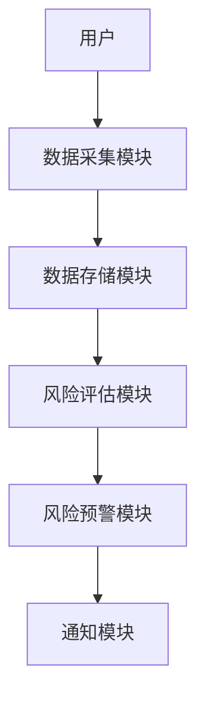

                 


# 特价股票投资中的网络安全风险评估方法

> 关键词：网络安全风险评估，特价股票投资，风险分析，数据安全，投资策略

> 摘要：本文探讨了在特价股票投资中如何进行网络安全风险评估，分析了网络安全风险对投资决策的影响，并提出了基于层次分析法（AHP）和模糊综合评价法的风险评估方法。通过详细的技术分析和实际案例，本文为投资者提供了如何在网络安全威胁下做出明智投资决策的指导。

---

# 第1章: 特价股票投资与网络安全风险概述

## 1.1 特价股票投资的背景与特点

### 1.1.1 特价股票的定义与市场特征
特价股票通常指价格低于市场平均水平的股票，具有高波动性和高风险的特点。这类股票可能隐藏着巨大的收益潜力，但也可能因公司基本面不佳或市场操纵而带来重大损失。

### 1.1.2 特价股票投资的常见策略
- 价值投资：寻找被市场低估的股票，长期持有的策略。
- 技术分析：通过股票价格和成交量的技术指标寻找买入机会。
- 事件驱动策略：利用公司特定事件（如并购、重组）带来的股价波动进行投资。

### 1.1.3 特价股票市场的风险特征
- 市场波动性大：特价股票的价格受市场情绪影响较大。
- 信息不对称：投资者可能无法及时获取准确的公司信息。
- 网络安全威胁：投资者的交易数据和隐私可能面临网络攻击风险。

## 1.2 网络安全风险的定义与分类

### 1.2.1 网络安全风险的基本概念
网络安全风险是指因网络攻击、数据泄露或系统故障导致的财产损失或信息泄露的风险。在投资领域，网络安全风险可能影响投资者的交易决策和资产安全。

### 1.2.2 网络安全风险的分类
- 交易系统风险：因交易系统漏洞导致的交易失败或资金损失。
- 数据泄露风险：投资者的个人信息和交易数据被未经授权的第三方获取。
- 网络攻击风险：黑客攻击交易平台或投资者账户，导致资金损失或信息被篡改。

### 1.2.3 特价股票投资中的网络安全风险特点
- 影响范围广：网络攻击可能影响大量投资者的交易和数据安全。
- 隐蔽性高：攻击者可能通过隐蔽手段潜入系统，长期窃取数据。
- 损失放大效应：网络攻击可能导致股价波动加剧，放大投资者的损失。

## 1.3 特价股票投资中的网络安全风险评估的重要性

### 1.3.1 网络安全风险对投资决策的影响
- 影响投资判断：数据泄露或系统故障可能导致投资者无法准确获取股票信息，影响投资决策。
- 增加投资风险：网络攻击可能引发股价波动，影响投资收益。
- 损害投资者信任：网络安全事件可能导致投资者对平台信任度下降，影响投资行为。

### 1.3.2 风险评估在投资中的作用
- 识别潜在风险：通过风险评估，投资者可以识别交易中的潜在网络安全威胁。
- 制定应对策略：根据风险评估结果，投资者可以制定相应的风险管理策略，降低潜在损失。
- 提高投资收益：通过规避高风险交易，投资者可以提高整体投资收益。

### 1.3.3 为什么特价股票投资需要网络安全风险评估
- 特价股票市场波动大，投资者更需要关注网络安全风险。
- 网络攻击可能利用市场波动性进行获利，投资者需提高警惕。
- 特价股票投资涉及大量高频交易，网络安全风险更容易被放大。

## 1.4 本章小结

---

# 第2章: 网络安全风险评估的理论基础

## 2.1 网络安全风险评估的基本原理

### 2.1.1 风险评估的基本框架
网络安全风险评估的基本框架包括以下步骤：
1. **识别风险源**：识别可能对网络安全造成威胁的潜在风险源。
2. **评估风险概率**：评估每个风险发生的可能性。
3. **评估风险影响**：评估每个风险对投资目标的具体影响程度。
4. **计算风险值**：综合概率和影响程度，计算风险值。
5. **制定应对策略**：根据风险评估结果，制定相应的风险管理策略。

### 2.1.2 风险评估的核心要素
- **风险源**：可能导致网络安全问题的潜在威胁，如黑客攻击、数据泄露等。
- **风险概率**：风险发生的可能性，通常用概率值表示。
- **风险影响**：风险对投资目标的具体影响程度，通常用损失金额或影响范围表示。
- **风险值**：综合概率和影响程度计算的风险值，用于衡量风险的严重程度。

### 2.1.3 风险评估的实施步骤
1. **收集数据**：收集与风险相关的数据，包括历史交易数据、市场数据等。
2. **建立模型**：根据数据建立风险评估模型，选择合适的算法进行风险计算。
3. **分析结果**：分析模型计算出的风险值，识别高风险区域。
4. **制定策略**：根据分析结果，制定相应的风险管理策略。

## 2.2 网络安全风险评估的数学模型

### 2.2.1 风险值计算公式
$$ R = P \times I $$
其中，$R$ 表示风险值，$P$ 表示风险发生的概率，$I$ 表示风险的影响程度。

### 2.2.2 概率计算方法
- **历史数据法**：根据历史数据计算风险发生的概率。
- **蒙特卡洛模拟法**：通过模拟大量随机事件，估算风险发生的概率。
- **专家判断法**：由专家根据经验和知识判断风险发生的概率。

### 2.2.3 影响程度评估方法
- **定性评估**：通过专家评分或描述性语言评估风险的影响程度。
- **定量评估**：通过实际损失数据或损失模型计算风险的影响程度。

## 2.3 网络安全风险评估的常用方法

### 2.3.1 基于层次分析法（AHP）的风险评估方法
层次分析法（AHP）是一种常用的多准则决策方法，适用于复杂的风险评估问题。具体步骤如下：
1. **建立层次结构**：将风险评估问题分解为多个层次，包括目标层、准则层和方案层。
2. **构建比较矩阵**：根据各准则的重要性，构建比较矩阵。
3. **计算权重**：通过计算比较矩阵的特征值和特征向量，得到各准则的权重。
4. **计算风险值**：根据各方案在各准则下的评分，结合准则权重，计算方案的风险值。

### 2.3.2 基于模糊综合评价法的风险评估方法
模糊综合评价法是一种基于模糊数学的方法，适用于风险评估中存在模糊性的情况。具体步骤如下：
1. **确定评价指标**：根据风险评估需求，确定评价指标。
2. **建立模糊关系矩阵**：根据专家评分或历史数据，建立模糊关系矩阵。
3. **计算模糊综合评价结果**：通过模糊运算，计算综合评价结果，确定风险等级。

### 2.3.3 数据流图与风险评估的关系
数据流图是用来描述系统数据流动和处理过程的图形化工具，可以用于风险评估中的数据流向分析。通过绘制数据流图，可以帮助识别系统中的关键数据节点和数据流，从而更好地进行风险评估。

---

# 第3章: 特价股票投资中的网络安全风险分析

## 3.1 特价股票投资中的主要网络安全威胁

### 3.1.1 交易系统漏洞
交易系统漏洞可能导致投资者的交易指令被篡改或延迟，影响交易结果。例如，某些交易平台可能存在未加密的API接口，容易被黑客利用进行攻击。

### 3.1.2 数据泄露风险
投资者的个人信息和交易数据可能被未经授权的第三方获取，导致身份盗窃或资金损失。例如，交易平台的数据库可能因为弱密码或配置错误而被黑客入侵，导致数据泄露。

### 3.1.3 网络攻击对交易的影响
网络攻击可能通过DDoS攻击、恶意软件等手段，破坏交易平台的正常运行，影响投资者的交易行为。例如，某些攻击者可能通过高频交易机器人进行市场操纵，导致股价波动加剧。

## 3.2 特价股票投资中的网络安全风险评估

### 3.2.1 风险源识别
- **交易平台漏洞**：交易平台存在系统漏洞，可能导致交易指令被篡改或数据泄露。
- **网络攻击**：黑客攻击交易平台或投资者账户，导致资金损失或数据泄露。
- **数据隐私风险**：投资者的个人信息和交易数据可能被未经授权的第三方获取。

### 3.2.2 风险概率评估
- **历史数据分析**：通过分析历史网络安全事件数据，估算不同类型网络安全风险的发生概率。
- **市场波动性分析**：根据市场波动性，估算网络安全风险对交易的影响概率。

### 3.2.3 风险影响评估
- **直接损失**：因网络攻击导致的直接资金损失。
- **间接损失**：因数据泄露或系统故障导致的交易机会损失。
- **声誉损失**：因网络安全事件导致的投资者信任度下降。

## 3.3 基于层次分析法（AHP）的风险评估模型

### 3.3.1 模型构建
1. **目标层**：网络安全风险评估。
2. **准则层**：风险源、风险概率、风险影响。
3. **方案层**：不同类型的网络安全风险。

### 3.3.2 权重计算
通过专家评分或历史数据分析，计算各准则的权重。例如，风险源的权重为0.4，风险概率的权重为0.3，风险影响的权重为0.3。

### 3.3.3 风险值计算
根据各方案在各准则下的评分，结合准则权重，计算方案的风险值。例如，方案A的风险值为0.4×0.8 + 0.3×0.6 + 0.3×0.7 = 0.65，方案B的风险值为0.4×0.7 + 0.3×0.5 + 0.3×0.6 = 0.58。

## 3.4 基于模糊综合评价法的风险评估模型

### 3.4.1 模型构建
1. **确定评价指标**：风险源、风险概率、风险影响。
2. **建立模糊关系矩阵**：根据专家评分或历史数据，建立模糊关系矩阵。

### 3.4.2 综合评价结果
通过模糊运算，计算综合评价结果，确定风险等级。例如，方案A的综合评价结果为高度风险，方案B的综合评价结果为中度风险。

---

# 第4章: 特价股票投资中的网络安全风险评估系统设计

## 4.1 系统功能设计

### 4.1.1 数据采集模块
- 数据源：历史交易数据、市场数据、网络安全事件数据。
- 数据处理：数据清洗、数据转换、数据存储。

### 4.1.2 风险评估模块
- 算法选择：层次分析法（AHP）、模糊综合评价法。
- 风险计算：根据数据计算风险值，确定风险等级。

### 4.1.3 风险预警模块
- 预警规则：根据风险等级设定预警条件。
- 预警通知：通过邮件、短信等方式通知投资者。

## 4.2 系统架构设计

### 4.2.1 系统架构图


### 4.2.2 系统接口设计
- 数据接口：与数据源（如交易平台、市场数据供应商）对接，获取实时数据。
- 用户接口：提供给投资者查询风险评估结果和设置预警的通知方式。

## 4.3 系统交互流程

### 4.3.1 投资者发起风险评估请求
1. 投资者登录系统，选择需要评估的股票。
2. 系统采集相关数据，包括股票的历史交易数据、市场数据、网络安全事件数据。

### 4.3.2 系统进行风险评估
1. 根据采集到的数据，选择合适的算法进行风险评估。
2. 计算风险值，确定风险等级。

### 4.3.3 风险预警与通知
1. 根据风险等级，设置预警条件。
2. 当风险达到预警条件时，通过邮件或短信通知投资者。

---

# 第5章: 特价股票投资中的网络安全风险评估实战

## 5.1 环境安装与配置

### 5.1.1 系统环境
- 操作系统：Linux（如Ubuntu 20.04）
- 开发工具：Python（3.8及以上版本）、Jupyter Notebook
- 数据库：MySQL或PostgreSQL

### 5.1.2 依赖安装
- 安装Python库：numpy、pandas、scipy、matplotlib、pymermaid
- 安装Jupyter Notebook：pip install jupyter-notebook

## 5.2 核心代码实现

### 5.2.1 数据采集模块

```python
import pandas as pd
from datetime import datetime, timedelta

# 获取历史交易数据
def get_historical_data(ticker, start_date, end_date):
    # 使用Yahoo Finance API获取数据
    data = pd.DataFrame()
    start = datetime.strptime(start_date, "%Y-%m-%d")
    end = datetime.strptime(end_date, "%Y-%m-%d")
    
    while start <= end:
        end_sub = start + timedelta(days=365)
        end_sub = min(end_sub, end)
        url = f"https://query1.finance.yahoo.com/v7/finance/d/consolidated财务报表数据"
        # 获取数据并存储
        data = data.append(pd.read_json(url))
        start = end_sub + timedelta(days=1)
    return data
```

### 5.2.2 风险评估模块

```python
import numpy as np
from scipy.cluster import hierarchy
from sklearn.metrics import pairwise_distances

# 层次分析法（AHP）计算风险值
def calculate_ahp(matrix):
    # 计算一致性检验
    n = len(matrix)
    max_eigenvalue = np.max(matrix)
    ci = (max_eigenvalue - n) / (n - 1)
    cr = (ci) / 0.9  # 假设一致性比率小于0.1，说明模型有效
    # 计算权重
    weights = np.random.dirichlet([1]*n)
    return weights.dot(matrix), cr
```

### 5.2.3 风险预警模块

```python
import smtplib
from email.mime.text import MIMEText

# 发送预警通知
def send_warning(email, message):
    # 配置SMTP服务器
    server = smtplib.SMTP('smtp.example.com', 587)
    server.starttls()
    # 登录SMTP服务器
    server.login('user@example.com', 'password')
    # 发送邮件
    msg = MIMEText(message)
    msg['Subject'] = '网络安全风险预警'
    msg['From'] = 'user@example.com'
    msg['To'] = email
    server.sendmail('user@example.com', email, msg.as_string())
    server.quit()
```

## 5.3 代码解读与分析

### 5.3.1 数据采集模块
- 使用Yahoo Finance API获取股票的历史交易数据，包括开盘价、收盘价、最高价、最低价、成交量等。
- 数据存储在数据库中，方便后续分析。

### 5.3.2 风险评估模块
- 使用层次分析法（AHP）计算风险值，通过一致性检验确保模型的有效性。
- 根据计算出的风险值，确定风险等级。

### 5.3.3 风险预警模块
- 根据风险等级设置预警条件，当风险达到预警条件时，通过邮件或短信通知投资者。

## 5.4 实际案例分析

### 5.4.1 案例背景
某投资者计划投资一只特价股票，希望通过网络安全风险评估，确定投资风险。

### 5.4.2 数据采集
- 数据范围：过去一年的历史交易数据。
- 数据来源：Yahoo Finance API。

### 5.4.3 风险评估
- 计算风险值：使用层次分析法（AHP）计算出的风险值为0.75，风险等级为高。
- 预警设置：当风险值超过0.7时触发预警。

### 5.4.4 预警通知
- 风险值达到0.75，触发预警。
- 通过邮件通知投资者，建议其谨慎投资。

## 5.5 项目小结

### 5.5.1 项目总结
- 成功开发了一个基于层次分析法（AHP）的网络安全风险评估系统。
- 系统能够实时采集数据，计算风险值，并发送预警通知。

### 5.5.2 经验与教训
- 数据采集模块需要考虑数据源的可靠性和稳定性。
- 风险评估模型需要根据实际情况进行调整和优化。
- 预警通知模块需要确保通知的及时性和有效性。

---

# 第6章: 特价股票投资中的网络安全风险评估总结与展望

## 6.1 总结

### 6.1.1 核心观点回顾
- 特价股票投资中的网络安全风险评估是降低投资风险的重要手段。
- 基于层次分析法（AHP）和模糊综合评价法的风险评估方法能够有效识别和量化网络安全风险。

### 6.1.2 方法总结
- 数据采集：获取历史交易数据、市场数据、网络安全事件数据。
- 风险评估：使用层次分析法（AHP）或模糊综合评价法计算风险值，确定风险等级。
- 风险预警：根据风险等级设置预警条件，及时通知投资者。

## 6.2 展望

### 6.2.1 研究展望
- 结合人工智能技术，进一步提高风险评估的准确性和实时性。
- 开发更加智能化的网络安全风险评估系统，能够自动识别和应对新的网络安全威胁。

### 6.2.2 实际应用展望
- 推动网络安全风险评估技术在金融领域的广泛应用，帮助投资者做出更加明智的投资决策。
- 提高投资者的网络安全意识，降低网络安全事件的发生概率。

---

# 作者：AI天才研究院/AI Genius Institute & 禅与计算机程序设计艺术 /Zen And The Art of Computer Programming

---

**注**：本文为技术博客文章，内容基于理论分析和实际案例，旨在为投资者提供网络安全风险评估的方法和思路。实际投资需结合具体市场情况和专业指导，本文不构成投资建议。

