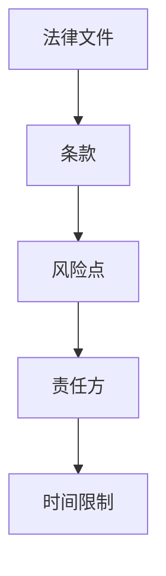
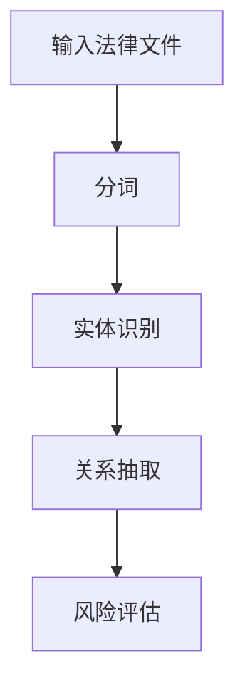
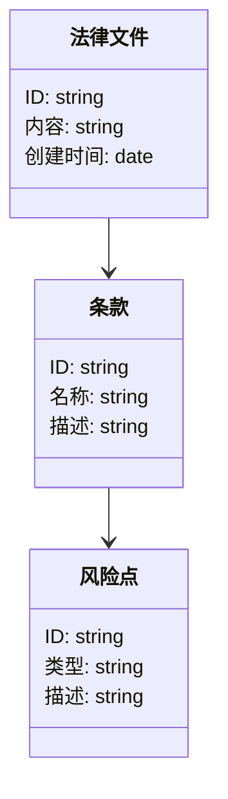
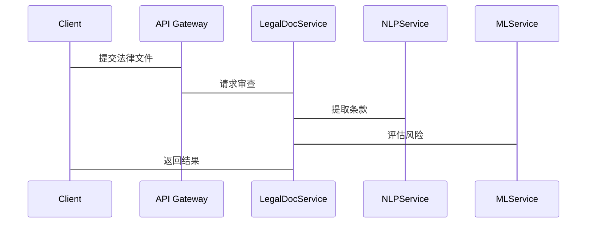

                 


# AI Agent在企业法律文件审查与风险识别中的自动化应用

## 关键词：AI Agent，法律文件审查，风险识别，自动化应用，自然语言处理，机器学习，知识图谱

## 摘要：随着人工智能技术的飞速发展，AI Agent在企业法律文件审查与风险识别中的应用日益广泛。本文从AI Agent的基本概念出发，详细探讨其在法律文件审查中的优势，分析其核心算法原理，并通过实际案例展示其在系统架构设计与项目实现中的具体应用。通过本文，读者将深入了解AI Agent如何通过自然语言处理、机器学习和知识图谱等技术，实现法律文件审查的智能化与自动化，从而提升企业的法律风险管理能力。

---

## 第一章：AI Agent与法律文件审查的背景介绍

### 1.1 AI Agent的基本概念

#### 1.1.1 AI Agent的定义与特点
AI Agent（人工智能代理）是指能够感知环境、执行任务并做出决策的智能实体。它通过传感器获取信息，利用算法进行分析，并通过执行器完成目标。AI Agent具有以下特点：
- **自主性**：能够在没有外部干预的情况下独立运作。
- **反应性**：能够实时感知环境并做出响应。
- **目标导向性**：所有操作均围绕特定目标展开。
- **学习能力**：能够通过数据不断优化自身的决策能力。

#### 1.1.2 AI Agent在企业中的应用场景
AI Agent在企业中的应用非常广泛，尤其是在法律文件审查、客户服务、供应链管理等领域。本文重点探讨AI Agent在法律文件审查中的应用。

#### 1.1.3 法律文件审查的现状与挑战
法律文件审查是一项复杂且耗时的任务，通常涉及合同、法规、条款等多种类型的文件。传统的人工审查方式存在以下问题：
- **效率低下**：人工审查需要大量时间，尤其是在处理大量文件时。
- **人为错误**：审查人员可能因疏忽而遗漏关键条款。
- **成本高昂**：需要大量专业人员参与，增加了企业的运营成本。

### 1.2 企业法律文件审查的核心问题

#### 1.2.1 法律文件审查的关键环节
法律文件审查通常包括以下关键环节：
1. **文件识别**：识别需要审查的文件类型。
2. **条款抽取**：从文件中提取关键条款和条件。
3. **风险评估**：评估条款中潜在的风险点。
4. **建议生成**：根据评估结果提出修改建议。

#### 1.2.2 传统法律文件审查的痛点
- **时间成本**：人工审查需要大量时间，尤其是在处理大量文件时。
- **一致性问题**：不同审查人员可能对同一文件有不同的理解，导致结果不一致。
- **知识依赖**：需要依赖专业法律人员的知识和经验。

#### 1.2.3 AI技术在法律文件审查中的潜力
AI技术可以通过以下方式解决传统审查的痛点：
- **自动化处理**：利用AI算法自动识别和抽取关键条款。
- **一致性保证**：通过统一的算法确保审查结果的一致性。
- **知识库支持**：利用知识图谱等技术提供丰富的法律知识支持。

### 1.3 AI Agent在法律文件审查中的优势

#### 1.3.1 提高审查效率
AI Agent可以通过自动化处理大幅提高审查效率，尤其是在处理大量文件时，能够快速完成任务。

#### 1.3.2 减少人为错误
AI Agent通过算法分析文件内容，能够减少人为疏忽导致的错误，提高审查的准确性。

#### 1.3.3 实现智能化与自动化
AI Agent可以通过学习和优化，不断提高审查的智能化水平，例如通过自然语言处理技术理解文件内容，通过机器学习算法预测潜在风险。

### 1.4 本章小结
本章介绍了AI Agent的基本概念及其在企业中的应用场景，重点分析了法律文件审查的现状与挑战，并探讨了AI技术在其中的潜力与优势。通过本章的介绍，读者可以初步了解AI Agent在法律文件审查中的重要性。

---

## 第二章：AI Agent的核心概念与技术原理

### 2.1 AI Agent的核心原理

#### 2.1.1 自然语言处理（NLP）在AI Agent中的作用
自然语言处理（NLP）是AI Agent实现法律文件审查的重要技术。通过NLP，AI Agent能够理解文件中的文本内容，并从中提取关键信息。例如，利用分词技术将文件内容分解为词语，利用句法分析技术理解句子的结构。

#### 2.1.2 机器学习在AI Agent中的应用
机器学习是AI Agent的核心技术之一。通过机器学习算法，AI Agent可以学习法律文件中的模式和规律，并根据这些模式预测潜在风险。例如，可以利用文本分类算法将文件分为不同的类别，利用回归算法预测风险的严重程度。

#### 2.1.3 知识图谱在法律文件分析中的价值
知识图谱是一种用于表示知识的数据结构，能够将法律文件中的实体、关系和属性以图形化的方式表示。通过知识图谱，AI Agent可以更好地理解文件内容，并快速识别潜在风险。例如，可以将公司、合同条款、责任方等实体通过知识图谱进行关联，从而实现对文件的深入分析。

### 2.2 核心技术对比与特征分析

#### 2.2.1 NLP与传统文本处理的对比
| 技术 | NLP | 传统文本处理 |
|------|------|--------------|
| 功能 | 理解文本内容 | 简单文本处理（如分词） |
| 方法 | 基于深度学习模型 | 基于规则 |
| 应用 | 智能问答、情感分析 | 文本统计、简单分类 |

#### 2.2.2 机器学习与规则引擎的优劣分析
| 技术 | 机器学习 | 规则引擎 |
|------|----------|----------|
| 优点 | 能够自动学习模式，适应性强 | 简单易懂，易于部署 |
| 缺点 | 需要大量数据支持，计算成本高 | 难以处理复杂场景 |
| 应用 | 风险预测、分类 | 简单条件判断 |

#### 2.2.3 知识图谱与传统数据库的差异
| 特性 | 知识图谱 | 传统数据库 |
|------|----------|--------------|
| 结构 | 图结构 | 行结构 |
| 可扩展性 | 高 | 低 |
| 查询复杂性 | 高 | 低 |
| 应用 | 实体关联分析 | 简单查询 |

### 2.3 ER实体关系图架构



### 2.4 本章小结
本章详细介绍了AI Agent的核心概念与技术原理，重点分析了NLP、机器学习和知识图谱在法律文件审查中的应用，并通过对比分析和实体关系图展示了这些技术的特点与优势。

---

## 第三章：AI Agent的算法原理

### 3.1 算法原理概述

#### 3.1.1 基于深度学习的文本分类
文本分类是法律文件审查中的常见任务。例如，可以将合同分为“有效”和“无效”两类。常用的算法包括支持向量机（SVM）和长短期记忆网络（LSTM）。

#### 3.1.2 基于规则的文本匹配
文本匹配是通过预定义的规则来匹配特定的文本模式。例如，可以匹配“违约责任”这一特定条款。

#### 3.1.3 基于知识图谱的实体识别
实体识别是通过知识图谱来识别文件中的实体，并建立它们之间的关系。例如，识别合同中的“甲方”和“乙方”，并建立它们之间的关联。

### 3.2 算法流程图



### 3.3 算法实现

#### 3.3.1 文本分类算法
```python
from sklearn.feature_extraction.text import TfidfVectorizer
from sklearn.svm import SVC

# 加载数据
texts = [...]  # 文本数据
labels = [...]  # 标签

# 特征提取
vectorizer = TfidfVectorizer()
X = vectorizer.fit_transform(texts)

# 训练模型
model = SVC()
model.fit(X, labels)

# 预测
test_text = "违约责任"
test_X = vectorizer.transform([test_text])
print(model.predict(test_X))
```

#### 3.3.2 实体识别算法
```python
import spacy

# 加载模型
nlp = spacy.load("en_core_web_sm")

# 文本处理
doc = nlp("This is a test document.")

# 实体识别
for ent in doc.ents:
    print(ent.text, ent.label_)
```

### 3.4 本章小结
本章详细介绍了AI Agent的算法原理，重点讲解了文本分类、文本匹配和实体识别的具体实现方法，并通过Python代码示例展示了这些算法的应用。

---

## 第四章：AI Agent的系统分析与架构设计

### 4.1 项目场景介绍
本项目旨在开发一个基于AI Agent的法律文件审查系统，能够自动识别和抽取法律文件中的关键条款，并评估潜在风险。

### 4.2 系统功能设计

#### 4.2.1 领域模型设计


#### 4.2.2 系统架构设计
```mermaid
graph LR
    Client --> API Gateway
    API Gateway --> LegalDocService
    LegalDocService --> NLPService
    LegalDocService --> MLService
    MLService --> KnowledgeGraph
```

### 4.3 系统接口设计
- **输入接口**：接收法律文件并进行预处理。
- **输出接口**：输出审查结果，包括识别的条款和潜在风险。

### 4.4 系统交互设计


### 4.5 本章小结
本章详细介绍了AI Agent的系统分析与架构设计，重点讲解了项目的场景、功能设计、系统架构和接口设计，并通过图表展示了系统的整体结构。

---

## 第五章：AI Agent的项目实战

### 5.1 环境安装
需要安装以下工具和库：
- Python 3.8+
- Jupyter Notebook
- spacy
- scikit-learn
- networkx

### 5.2 系统核心实现

#### 5.2.1 环境安装
```bash
pip install spacy scikit-learn networkx
python -m spacy download en_core_web_sm
```

#### 5.2.2 核心代码实现

##### 5.2.2.1 文本分类实现
```python
from sklearn.feature_extraction.text import TfidfVectorizer
from sklearn.svm import SVC

def train_classifier(train_texts, train_labels):
    vectorizer = TfidfVectorizer()
    X = vectorizer.fit_transform(train_texts)
    model = SVC()
    model.fit(X, train_labels)
    return model, vectorizer

def predict(model, vectorizer, test_text):
    test_X = vectorizer.transform([test_text])
    return model.predict(test_X)
```

##### 5.2.2.2 实体识别实现
```python
import spacy

def extract_entities(text):
    nlp = spacy.load("en_core_web_sm")
    doc = nlp(text)
    entities = []
    for ent in doc.ents:
        entities.append((ent.text, ent.label_))
    return entities
```

##### 5.2.2.3 风险评估实现
```python
from sklearn.metrics.pairwise import cosine_similarity

def assess_risk(similarity_matrix):
    return [max(similarity_matrix[i]) for i in range(len(similarity_matrix))]
```

### 5.3 案例分析与详细讲解

#### 5.3.1 案例分析
假设我们有一个合同文件，需要识别其中的违约责任条款。通过上述代码，我们可以实现以下步骤：
1. **文本分类**：将合同文件分为“有效”和“无效”两类。
2. **实体识别**：识别合同中的“甲方”和“乙方”。
3. **风险评估**：评估合同中的违约责任条款的风险等级。

#### 5.3.2 代码应用解读与分析
通过上述代码，我们可以实现合同文件的自动审查，识别关键条款，并评估潜在风险。这大大提高了审查效率，减少了人为错误。

### 5.4 项目小结
本章通过实际案例展示了AI Agent在法律文件审查中的应用，并详细讲解了系统的实现过程。通过本章的学习，读者可以掌握AI Agent的核心技术及其在实际项目中的应用。

---

## 第六章：AI Agent的最佳实践与未来展望

### 6.1 最佳实践 tips
- **数据隐私保护**：在处理法律文件时，需要严格保护数据隐私，避免数据泄露。
- **模型优化**：通过不断优化模型参数和增加训练数据，提高审查的准确性。
- **人机协同**：AI Agent可以辅助人类审查人员，但最终决策仍需由专业人员完成。

### 6.2 小结
通过本文的学习，读者可以全面了解AI Agent在法律文件审查中的应用，掌握其核心技术和实现方法。

### 6.3 注意事项
- **数据质量问题**：确保训练数据的质量，避免因数据偏差导致模型错误。
- **模型解释性**：在实际应用中，需要确保模型的可解释性，以便于问题排查和优化。

### 6.4 拓展阅读
- 推荐阅读《Python机器学习实战》和《自然语言处理入门》。

### 6.5 未来展望
随着AI技术的不断发展，AI Agent在法律文件审查中的应用将更加广泛。未来的研究方向包括：
- **多语言支持**：支持多种语言的法律文件审查。
- **动态更新**：实现模型的动态更新，以适应法律法规的变化。
- **智能交互**：通过人机交互技术，提高审查的效率和用户体验。

---

## 作者：AI天才研究院/AI Genius Institute & 禅与计算机程序设计艺术/Zen And The Art of Computer Programming

---

通过本文的详细讲解，读者可以全面了解AI Agent在企业法律文件审查与风险识别中的自动化应用，掌握其核心技术与实现方法。希望本文能够为相关领域的研究和实践提供有价值的参考。

