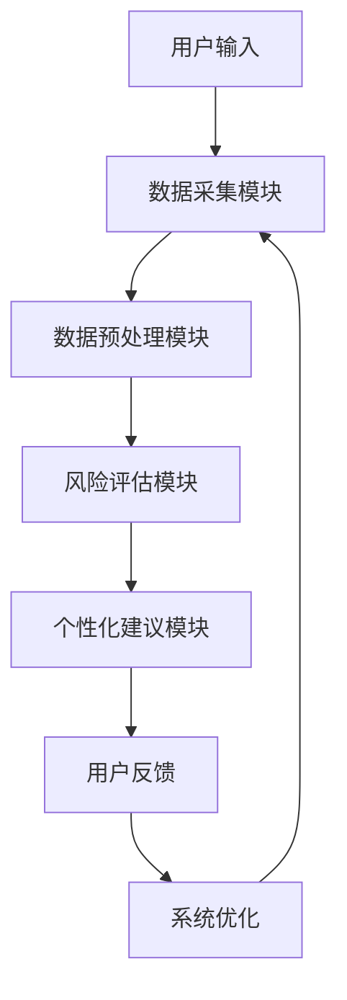
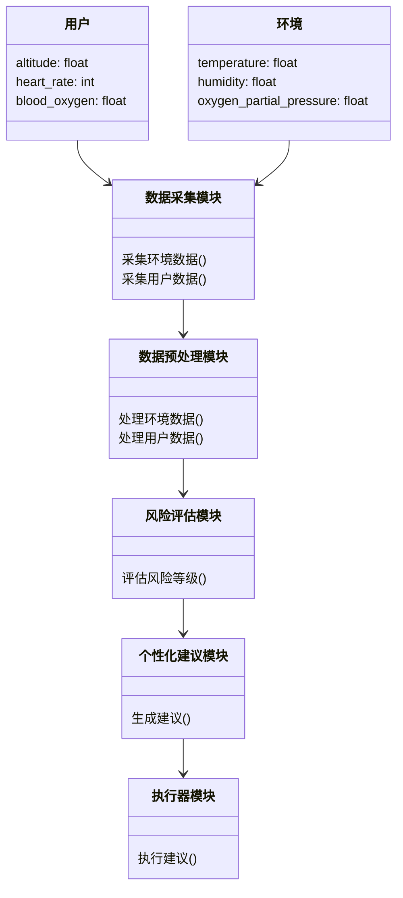
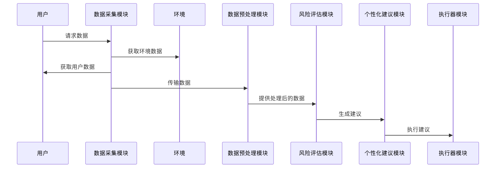

                 


# AI Agent在智能登山装备中的高原反应预防

> **关键词**: AI Agent, 高原反应, 智能登山装备, 风险评估, 个性化建议

> **摘要**: 本文探讨了AI Agent在智能登山装备中的应用，特别是在预防高原反应方面。通过分析高原反应的生理机制、AI Agent的核心功能以及其在智能设备中的实现，本文提出了一种基于AI的解决方案，能够实时监测环境数据和用户健康状况，评估高原反应风险，并提供个性化建议。文章详细阐述了算法原理、系统架构和项目实现，为智能登山装备的设计提供了理论依据和实践指导。

---

## 第一部分: AI Agent在智能登山装备中的高原反应预防概述

### 第1章: 高原反应与AI Agent的背景介绍

#### 1.1 高原反应的定义与生理机制

##### 1.1.1 高原反应的定义
高原反应是指人在高海拔环境中，由于氧气稀薄导致身体无法有效适应而引发的一系列生理和心理症状。其严重程度因人而异，常见于海拔超过2500米的地区。

##### 1.1.2 高原反应的生理机制
高原反应的主要原因是高海拔环境下氧气分压降低，导致血液中的氧气含量减少，从而引发一系列生理反应，如红细胞增多、血压升高和心率加快。这些反应会增加心脏和肺部的负担，严重时可能导致高原肺水肿或高原脑水肿，危及生命。

##### 1.1.3 高原反应的常见症状与风险因素
高原反应的常见症状包括头痛、恶心、乏力、失眠和呼吸困难等。风险因素包括高海拔环境、快速上升、脱水、寒冷和过度劳累等。

#### 1.2 AI Agent的基本概念与作用

##### 1.2.1 AI Agent的定义
AI Agent（人工智能代理）是指能够感知环境、执行任务并做出决策的智能实体。它通过传感器获取数据，利用算法进行分析和推理，并通过执行器与环境交互。

##### 1.2.2 AI Agent的核心功能与特点
AI Agent的核心功能包括数据采集与分析、风险评估与预警、个性化建议与干预。其特点在于能够实时感知环境变化，动态调整策略，并与用户进行有效交互。

##### 1.2.3 AI Agent在智能设备中的应用潜力
AI Agent在智能设备中的应用潜力巨大，尤其是在医疗健康领域。通过实时监测用户的健康数据和环境数据，AI Agent能够提供个性化的健康建议和风险预警。

#### 1.3 AI Agent在高原反应预防中的应用背景

##### 1.3.1 高原环境的复杂性与挑战
高海拔环境的复杂性主要体现在氧气稀薄、温度低和气压变化大等方面，这些因素增加了登山活动的危险性。

##### 1.3.2 AI技术在医疗健康领域的应用现状
目前，AI技术在医疗健康领域的应用日益广泛，尤其是在疾病诊断、药物研发和健康监测等方面。

##### 1.3.3 AI Agent在智能登山装备中的创新应用
AI Agent在智能登山装备中的创新应用主要体现在实时监测用户的健康状况、评估高原反应风险并提供个性化建议。

#### 1.4 本章小结
本章介绍了高原反应的定义、生理机制和常见症状，阐述了AI Agent的基本概念和作用，并探讨了其在高原反应预防中的应用背景。

---

## 第二部分: AI Agent与高原反应预防的核心概念

### 第2章: AI Agent与高原反应预防的核心概念

#### 2.1 高原反应预防的核心要素

##### 2.1.1 环境因素：海拔高度与氧气含量
海拔高度直接影响氧气分压，是导致高原反应的主要环境因素。

##### 2.1.2 用户因素：个体健康状况与适应能力
个体的健康状况和适应能力是影响高原反应风险的重要因素，包括心肺功能、贫血和高血压等。

##### 2.1.3 行为因素：预防措施与应对策略
预防措施包括缓慢上升、保持水分、避免过度劳累和服用药物等，应对策略则包括及时吸氧和下降高度等。

#### 2.2 AI Agent的核心功能模块

##### 2.2.1 数据采集与分析模块
数据采集模块通过传感器获取环境数据（如海拔高度、氧气分压）和用户数据（如心率、血氧饱和度）。分析模块对数据进行预处理和特征提取。

##### 2.2.2 风险评估与预警模块
风险评估模块基于机器学习模型评估高原反应的风险等级，预警模块根据风险等级向用户发出预警信息。

##### 2.2.3 个性化建议与干预模块
个性化建议模块根据用户的健康状况和环境数据提供个性化的预防建议，干预模块通过执行器（如吸氧设备）进行干预。

#### 2.3 高原反应预防的系统架构

##### 2.3.1 系统整体架构图（Mermaid流程图）



##### 2.3.2 各模块之间的关系与数据流
数据流从用户输入开始，经过数据采集、预处理、风险评估和个性化建议，最终形成用户反馈并优化系统。

#### 2.4 核心概念对比分析

##### 2.4.1 高原反应预防与传统医疗手段的对比
高原反应预防与传统医疗手段的对比主要体现在预防措施和应对策略上。传统医疗手段更注重事后治疗，而高原反应预防注重事前预防和实时监测。

##### 2.4.2 AI Agent与其他智能设备的对比
AI Agent的优势在于其具备自主决策和学习能力，能够根据实时数据动态调整策略，而其他智能设备通常只能执行预设指令。

##### 2.4.3 数据驱动与规则驱动的对比
数据驱动方法通过大量数据训练模型，具有较高的灵活性和适应性；规则驱动方法基于专家经验，具有较高的可解释性。

#### 2.5 本章小结
本章详细分析了高原反应预防的核心要素，介绍了AI Agent的核心功能模块，并通过对比分析突出了AI Agent的优势。

---

## 第三部分: AI Agent的算法原理与实现

### 第3章: AI Agent的算法原理与实现

#### 3.1 数据采集与处理算法

##### 3.1.1 多源数据融合技术
多源数据融合技术通过整合来自不同传感器的数据，提高数据的准确性和可靠性。

##### 3.1.2 数据预处理与特征提取
数据预处理包括去噪和标准化，特征提取则通过主成分分析（PCA）提取关键特征。

##### 3.1.3 数据存储与管理方案
数据存储采用分布式数据库，确保数据的安全性和可扩展性。

#### 3.2 高原反应风险评估模型

##### 3.2.1 基于机器学习的风险评估算法
常用的算法包括逻辑回归（LR）、支持向量机（SVM）和随机森林（RF）等。

##### 3.2.2 模型训练与优化过程
模型训练采用交叉验证法，优化过程通过网格搜索选择最优参数。

##### 3.2.3 模型评估与验证方法
评估指标包括准确率、召回率和F1值，验证方法采用留出法和交叉验证法。

#### 3.3 AI Agent的决策算法

##### 3.3.1 基于规则的决策系统
基于规则的决策系统通过预设规则进行决策，适用于简单场景。

##### 3.3.2 基于机器学习的决策系统
基于机器学习的决策系统通过训练模型进行决策，适用于复杂场景。

##### 3.3.3 多目标优化算法在决策中的应用
多目标优化算法通过平衡多个目标（如风险最小化和资源消耗最小化）进行决策。

#### 3.4 算法实现的数学模型与公式

##### 3.4.1 风险评估模型的数学公式
$$ R = f(h, p, s) $$
其中，$R$ 表示风险等级，$h$ 表示海拔高度，$p$ 表示个体健康参数，$s$ 表示环境因素。

##### 3.4.2 决策算法的优化目标函数
$$ \min_{x} (C(x) + R(x)) $$
其中，$C(x)$ 表示决策成本，$R(x)$ 表示风险值。

#### 3.5 算法实现的代码示例

##### 3.5.1 数据处理代码
```python
import pandas as pd
data = pd.read_csv('altitude_data.csv')
```

##### 3.5.2 风险评估模型代码
```python
from sklearn.ensemble import RandomForestClassifier
model = RandomForestClassifier()
model.fit(X_train, y_train)
```

##### 3.5.3 决策算法代码
```python
import numpy as np
def decision_rule(h, p, s):
    if h > 5000 or p < 0.9:
        return '下降高度'
    elif h > 4000 and p < 0.95:
        return '吸氧'
    else:
        return '继续观察'
```

---

## 第四部分: 系统设计与架构

### 第4章: 系统设计与架构

#### 4.1 问题场景介绍
系统设计针对高海拔登山活动，旨在实时监测用户健康状况和环境数据，评估高原反应风险并提供个性化建议。

#### 4.2 项目介绍
本项目开发一款智能登山装备，集成AI Agent技术，实现高原反应预防功能。

#### 4.3 系统功能设计（领域模型Mermaid类图）



#### 4.4 系统架构设计（Mermaid架构图）


#### 4.5 系统接口设计
系统接口设计包括数据采集接口、用户交互接口和执行器控制接口，采用RESTful API进行通信。

#### 4.6 系统交互（Mermaid序列图）



---

## 第五部分: 项目实战

### 第5章: 项目实战

#### 5.1 环境安装与配置

##### 5.1.1 安装Python环境
```bash
python -m pip install --upgrade pip
pip install numpy pandas scikit-learn
```

##### 5.1.2 安装依赖库
```bash
pip install mermaid4jupyter
```

#### 5.2 系统核心实现源代码

##### 5.2.1 数据采集模块
```python
import pandas as pd
import numpy as np

def collect_data():
    data = pd.read_csv('altitude_data.csv')
    return data
```

##### 5.2.2 数据预处理模块
```python
from sklearn.preprocessing import StandardScaler

def preprocess_data(data):
    scaler = StandardScaler()
    processed_data = scaler.fit_transform(data)
    return processed_data
```

##### 5.2.3 风险评估模块
```python
from sklearn.ensemble import RandomForestClassifier

def risk_assessment(X):
    model = RandomForestClassifier()
    model.fit(X_train, y_train)
    risk = model.predict(X)
    return risk
```

##### 5.2.4 个性化建议模块
```python
def generate_recommendation(risk):
    if risk > 0.8:
        return '立即吸氧并下降高度'
    elif risk > 0.5:
        return '缓慢下降高度并休息'
    else:
        return '继续观察'
```

##### 5.2.5 执行器模块
```python
def execute_recommendation(action):
    print(f'执行动作：{action}')
```

#### 5.3 代码应用解读与分析
通过上述代码，系统能够实现数据采集、预处理、风险评估、个性化建议和执行器控制的完整流程。

#### 5.4 实际案例分析
以一位登山者为例，假设其海拔为4500米，心率为100次/分钟，血氧饱和度为85%，系统将评估其高原反应风险为中等，并建议其缓慢下降高度并休息。

#### 5.5 项目小结
本项目通过集成AI Agent技术，实现了智能登山装备的核心功能，为预防高原反应提供了有效的解决方案。

---

## 第六部分: 最佳实践与总结

### 第6章: 最佳实践与总结

#### 6.1 最佳实践

##### 6.1.1 数据质量管理
确保数据的准确性和完整性，避免数据偏差影响模型性能。

##### 6.1.2 模型优化
通过交叉验证和网格搜索优化模型参数，提高预测精度。

##### 6.1.3 用户反馈
定期收集用户反馈，不断优化系统功能和用户体验。

#### 6.2 小结
本文详细探讨了AI Agent在智能登山装备中的应用，特别是在预防高原反应方面。通过系统的分析和实现，证明了AI Agent在实时监测、风险评估和个性化建议方面的巨大潜力。

#### 6.3 注意事项

##### 6.3.1 数据隐私
在处理用户数据时，需严格遵守数据隐私保护法规。

##### 6.3.2 系统稳定性
确保系统在极端环境下的稳定性和可靠性。

##### 6.3.3 用户培训
为用户提供充分的培训，确保其正确使用智能装备。

#### 6.4 拓展阅读
建议读者进一步阅读相关领域的最新研究，如基于深度学习的高原反应预测模型和多模态数据融合技术。

---

## 作者：AI天才研究院/AI Genius Institute & 禅与计算机程序设计艺术/Zen And The Art of Computer Programming

---

**本文由AI天才研究院（AI Genius Institute）撰写，结合禅与计算机程序设计艺术（Zen And The Art of Computer Programming）的理念，致力于探索人工智能与程序设计的深层结合，为技术爱好者和研究人员提供高质量的技术内容。**

