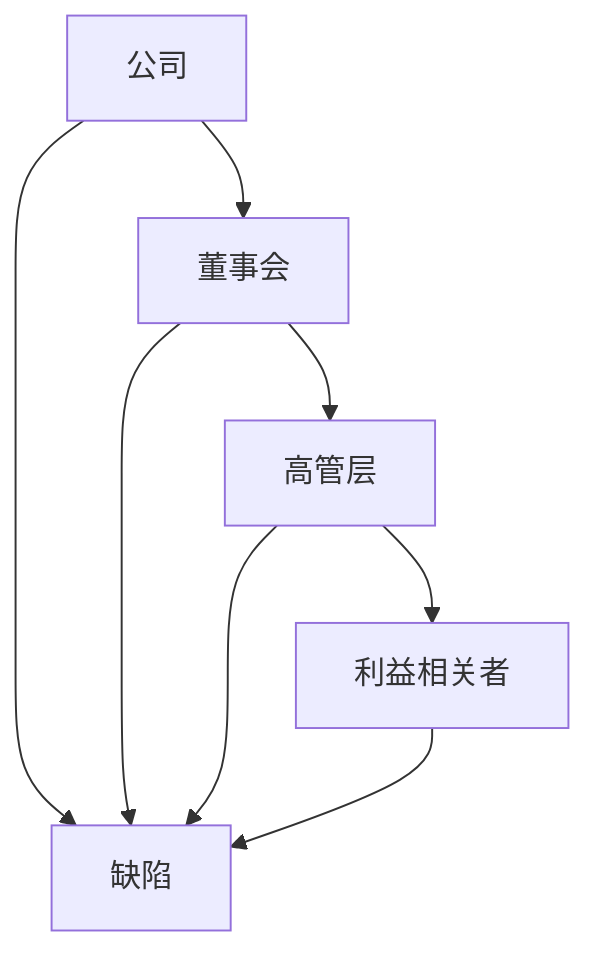
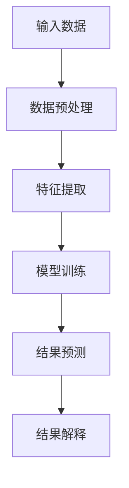
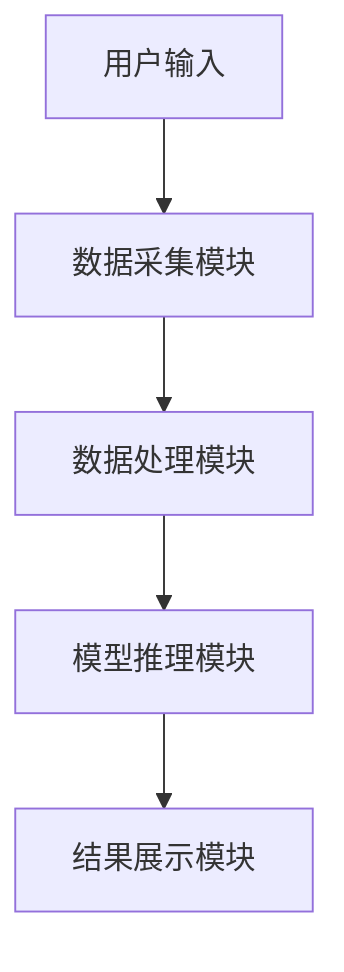
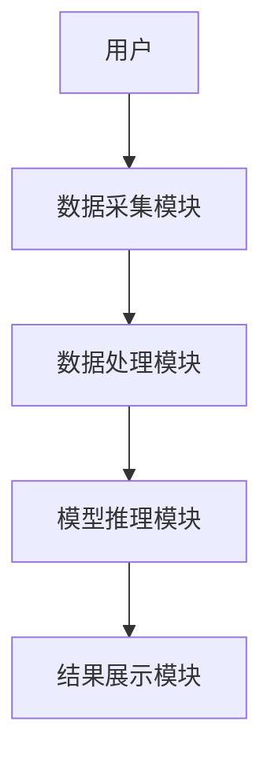

                 


# AI驱动的公司治理缺陷识别与改善建议

> 关键词：公司治理、AI技术、缺陷识别、系统架构、改善建议

> 摘要：随着人工智能技术的快速发展，公司治理中的缺陷识别与改善已成为企业优化管理和提升竞争力的重要手段。本文从公司治理的基本概念出发，详细分析了AI技术在公司治理缺陷识别中的应用，探讨了缺陷识别的核心算法原理，并提出了基于AI的改善建议系统设计方案。本文结合实际案例，深入剖析了AI驱动的公司治理缺陷识别与改善的具体实现，为企业提供了实用的参考与借鉴。

---

# 第一部分: AI驱动的公司治理缺陷识别背景

# 第1章: 公司治理缺陷概述

## 1.1 公司治理的基本概念

### 1.1.1 公司治理的定义与核心要素

公司治理是企业管理的重要组成部分，主要涉及公司股东、董事会、高管层以及利益相关者之间的权利、义务和责任分配。核心要素包括：

- **股东权利**：股东对公司的所有权和收益权。
- **董事会职责**：制定战略、监督高管、确保合规性。
- **高管层责任**：执行战略、管理日常运营。
- **利益相关者关系**：与股东、客户、员工、监管机构等建立良好关系。

### 1.1.2 公司治理的主要问题与挑战

公司治理中常见的问题包括：

- **决策失误**：董事会或高管层决策不科学，导致公司损失。
- **利益冲突**：股东与管理层的利益冲突。
- **监管不力**：内部审计和外部监管不足，导致合规性问题。
- **信息不对称**：股东和利益相关者对公司运营了解不足。

### 1.1.3 公司治理缺陷的分类与影响

公司治理缺陷可以分为以下几类：

1. **战略缺陷**：战略规划不合理，导致公司发展方向错误。
2. **组织缺陷**：组织架构不合理，职责不清。
3. **管理缺陷**：管理方式落后，缺乏有效的监督机制。
4. **合规缺陷**：违反相关法律法规，面临法律风险。

## 1.2 AI技术在公司治理中的应用背景

### 1.2.1 AI技术的发展与公司治理的结合

人工智能技术的快速发展为公司治理带来了新的可能性。AI技术可以通过数据分析、模式识别、自然语言处理等方式，帮助公司发现治理中的问题并提出改进建议。

### 1.2.2 AI在公司治理中的潜在价值

- **提高决策效率**：通过数据挖掘和机器学习，AI可以辅助董事会和高管层做出更科学的决策。
- **优化组织结构**：AI可以帮助识别组织中的低效环节，提出优化建议。
- **增强合规性**：AI可以通过自动化监控和预警，确保公司行为符合相关法律法规。

### 1.2.3 当前公司治理中的技术空白

尽管AI技术在公司治理中展现出巨大潜力，但目前仍存在以下技术空白：

- **缺乏统一的缺陷识别标准**：不同公司对治理缺陷的定义和分类存在差异。
- **数据隐私问题**：治理缺陷识别需要处理敏感数据，如何保护数据隐私是一个挑战。
- **AI模型的可解释性**：复杂的AI模型在公司治理中的应用需要较高的可解释性，否则难以获得管理层的信任。

## 1.3 本章小结

本章介绍了公司治理的基本概念、主要问题与挑战，以及AI技术在公司治理中的应用背景。通过分析当前公司治理中的技术空白，为后续的AI驱动缺陷识别与改善奠定了基础。

---

# 第二部分: AI驱动的公司治理缺陷识别方法

# 第2章: 公司治理缺陷识别的核心概念

## 2.1 公司治理缺陷识别的定义与目标

### 2.1.1 缺陷识别的定义

公司治理缺陷识别是指通过技术手段发现公司治理中的不足之处，并对其进行分类和描述。

### 2.1.2 缺陷识别的目标与意义

- **目标**：识别公司治理中的缺陷，为后续改善提供依据。
- **意义**：通过缺陷识别，企业可以提前发现潜在问题，避免更大的损失。

### 2.1.3 缺陷识别的边界与外延

- **边界**：仅关注公司治理相关的问题，不涉及公司运营的其他方面。
- **外延**：涵盖公司治理的各个方面，包括战略、组织、管理和合规等。

## 2.2 AI驱动缺陷识别的核心要素

### 2.2.1 数据来源与处理

- **数据来源**：包括公司内部数据（如财务报表、组织架构图）和外部数据（如行业趋势、法律法规）。
- **数据处理**：需要进行数据清洗、特征提取和数据增强。

### 2.2.2 缺陷识别算法的选择

- **算法选择依据**：根据缺陷类型和数据特性选择合适的算法。
- **常用算法**：包括决策树、随机森林、支持向量机（SVM）和深度学习模型。

### 2.2.3 结果解释与反馈机制

- **结果解释**：将AI识别出的缺陷进行分类和描述，便于管理层理解。
- **反馈机制**：根据缺陷识别结果，动态调整治理策略。

## 2.3 缺陷识别的核心概念联系

### 2.3.1 核心概念原理

通过分析公司治理的各个要素，构建缺陷识别的数学模型。例如，利用图论模型分析组织架构中的权力分配问题。

### 2.3.2 核心概念属性特征对比表

| 属性 | 战略缺陷 | 组织缺陷 | 管理缺陷 | 合规缺陷 |
|------|----------|----------|----------|----------|
| 特征 | 战略规划不合理 | 组织架构不合理 | 管理方式落后 | 违反法律法规 |

### 2.3.3 实体关系图（ER图）架构



---

# 第3章: AI驱动缺陷识别的算法原理

## 3.1 缺陷识别算法概述

### 3.1.1 常见的缺陷识别算法

- **决策树**：适合分类问题，能够清晰展示缺陷类型之间的关系。
- **随机森林**：通过集成学习提高缺陷识别的准确性。
- **支持向量机（SVM）**：适用于高维数据的分类问题。
- **深度学习模型**：如LSTM和Transformer，适合处理复杂的治理缺陷识别任务。

### 3.1.2 算法选择的依据与标准

- **数据特性**：数据量、数据维度和数据类型。
- **缺陷类型**：不同类型的缺陷可能需要不同的算法。
- **计算资源**：算法的复杂度和运行时间。

## 3.2 缺陷识别算法的数学模型

### 3.2.1 算法流程图（Mermaid）



### 3.2.2 数据预处理公式

$$ x' = \frac{x - \mu}{\sigma} $$

其中，$\mu$ 是均值，$\sigma$ 是标准差。

### 3.2.3 模型训练公式

$$ y = \sum_{i=1}^{n} w_i x_i + b $$

其中，$w_i$ 是权重，$x_i$ 是输入特征，$b$ 是偏置。

### 3.2.4 结果预测公式

$$ p = \text{softmax}(y) $$

其中，$y$ 是模型输出，$\text{softmax}$ 是归一化指数函数。

## 3.3 算法实现与代码示例

### 3.3.1 环境安装

需要安装以下库：

- `numpy`
- `pandas`
- `scikit-learn`
- `matplotlib`

### 3.3.2 核心代码实现

```python
import numpy as np
from sklearn.tree import DecisionTreeClassifier
from sklearn.model_selection import train_test_split
from sklearn.metrics import accuracy_score

# 示例数据集
X = np.array([[1, 2], [3, 4], [5, 6], [7, 8]])
y = np.array([0, 1, 0, 1])

# 数据分割
X_train, X_test, y_train, y_test = train_test_split(X, y, test_size=0.25)

# 模型训练
model = DecisionTreeClassifier()
model.fit(X_train, y_train)

# 模型预测
y_pred = model.predict(X_test)

# 模型评估
print("Accuracy:", accuracy_score(y_test, y_pred))
```

### 3.3.3 代码解读与分析

- **数据预处理**：对输入数据进行标准化处理，确保模型训练的稳定性。
- **模型选择**：选择决策树算法，适合缺陷分类问题。
- **模型训练**：利用训练数据训练模型，并保存训练好的模型。
- **模型预测**：使用测试数据进行预测，并输出预测结果。
- **模型评估**：计算准确率，评估模型性能。

---

# 第三部分: 公司治理缺陷改善建议系统设计

# 第4章: 缺陷改善建议系统架构设计

## 4.1 系统功能设计

### 4.1.1 系统功能模块划分

- **数据采集模块**：采集公司治理相关数据。
- **数据处理模块**：对数据进行清洗和预处理。
- **模型推理模块**：利用AI模型识别治理缺陷。
- **结果展示模块**：将识别结果以可视化形式展示。

### 4.1.2 功能模块的交互流程



### 4.1.3 功能模块的实现方式

- **数据采集模块**：通过API接口获取公司治理数据。
- **数据处理模块**：使用Pandas进行数据清洗和特征提取。
- **模型推理模块**：加载预训练好的模型，进行缺陷识别。
- **结果展示模块**：将缺陷识别结果以图表形式展示。

## 4.2 系统架构设计

### 4.2.1 系统架构图（Mermaid）



### 4.2.2 系统架构设计说明

- **分层设计**：将系统划分为数据采集层、数据处理层、模型推理层和结果展示层。
- **模块化设计**：每个功能模块相对独立，便于维护和升级。

## 4.3 系统接口设计

### 4.3.1 接口定义与规范

- **输入接口**：接收公司治理相关数据。
- **输出接口**：输出缺陷识别结果和改善建议。

### 4.3.2 接口交互流程


## 4.4 系统交互流程图（Mermaid）


---

# 第5章: 项目实战与案例分析

## 5.1 项目介绍

本项目旨在利用AI技术识别公司治理中的缺陷，并提出改善建议。通过实际案例分析，验证系统的有效性和实用性。

## 5.2 实际案例分析

### 5.2.1 案例背景

某公司由于战略规划不合理，导致连续亏损。通过AI技术识别出战略缺陷，并提出优化建议。

### 5.2.2 数据处理与分析

- **数据预处理**：清洗和标准化公司治理数据。
- **模型训练**：利用决策树算法识别战略缺陷。
- **结果展示**：通过可视化工具展示缺陷识别结果。

### 5.2.3 缺陷改善建议

- **战略调整**：重新制定公司战略规划。
- **组织优化**：调整组织架构，提高管理效率。

## 5.3 系统实现与代码解读

### 5.3.1 环境安装

需要安装以下库：

- `numpy`
- `pandas`
- `scikit-learn`
- `matplotlib`

### 5.3.2 核心代码实现

```python
import numpy as np
from sklearn.tree import DecisionTreeClassifier
from sklearn.model_selection import train_test_split
from sklearn.metrics import accuracy_score

# 示例数据集
X = np.array([[1, 2], [3, 4], [5, 6], [7, 8]])
y = np.array([0, 1, 0, 1])

# 数据分割
X_train, X_test, y_train, y_test = train_test_split(X, y, test_size=0.25)

# 模型训练
model = DecisionTreeClassifier()
model.fit(X_train, y_train)

# 模型预测
y_pred = model.predict(X_test)

# 模型评估
print("Accuracy:", accuracy_score(y_test, y_pred))
```

### 5.3.3 代码解读与分析

- **数据预处理**：对输入数据进行标准化处理，确保模型训练的稳定性。
- **模型选择**：选择决策树算法，适合缺陷分类问题。
- **模型训练**：利用训练数据训练模型，并保存训练好的模型。
- **模型预测**：使用测试数据进行预测，并输出预测结果。
- **模型评估**：计算准确率，评估模型性能。

---

# 第6章: 最佳实践与注意事项

## 6.1 最佳实践

### 6.1.1 数据隐私保护

在处理公司治理数据时，必须遵守数据隐私保护相关法律法规，确保数据安全。

### 6.1.2 模型可解释性

AI模型的可解释性是公司治理缺陷识别的重要因素，管理层需要能够理解模型的输出结果。

### 6.1.3 持续优化

定期更新模型和优化系统，确保缺陷识别的准确性和改善建议的有效性。

## 6.2 小结

通过本文的分析和实践，我们可以看到AI技术在公司治理缺陷识别中的巨大潜力。然而，实际应用中仍需注意数据隐私、模型可解释性和系统优化等问题。

## 6.3 注意事项

- **数据隐私**：确保数据处理符合相关法律法规。
- **模型解释性**：提高模型的可解释性，便于管理层理解。
- **系统维护**：定期更新模型和优化系统，确保其稳定性和准确性。

## 6.4 拓展阅读

建议读者进一步阅读以下内容：

- **相关书籍**：《人工智能：一种现代的方法》
- **技术文档**：机器学习在企业治理中的应用
- **学术论文**：基于深度学习的公司治理缺陷识别研究

---

# 作者：AI天才研究院/AI Genius Institute & 禅与计算机程序设计艺术 /Zen And The Art of Computer Programming

