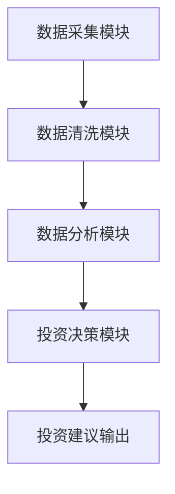

                 


# 价值投资中的智慧城市发展机遇

> **关键词**：价值投资、智慧城市、投资机会、算法分析、案例研究、数学模型

> **摘要**：  
本文探讨了智慧城市背景下价值投资的发展机遇，从智慧城市的核心概念、价值投资的基本原理，到智慧城市中的具体投资机会分析，结合算法模型和实际案例，深入剖析智慧城市建设中的投资价值，为投资者提供数据驱动的决策支持。文章结合技术分析与投资策略，系统地展示了如何在智慧城市建设中识别和把握投资机会。

---

## 第一部分: 智慧城市与价值投资的背景与概念

### 第1章: 智慧城市的发展历程与现状

#### 1.1 智慧城市的概念与定义

##### 1.1.1 智慧城市的起源与发展

智慧城市的概念起源于20世纪末，随着信息技术的快速发展，城市化进程的加速，人们对城市智能化管理的需求日益增长。2000年左右，国际社会开始关注智能城市（Smart City）的概念，将其定义为通过技术手段优化资源配置、提高城市运行效率的新型城市模式。2010年后，随着物联网、大数据、人工智能等技术的成熟，智慧城市的建设在全球范围内逐步铺开。

**核心概念术语说明**：  
- **智慧城市**：通过先进的信息技术和数据驱动的方式，实现城市资源的优化配置和高效管理。  
- **智能化管理**：利用大数据、人工智能等技术，提升城市管理的自动化和决策的科学性。  
- **可持续发展**：智慧城市的核心目标之一是实现资源的高效利用和环境的可持续发展。

##### 1.1.2 智慧城市的定义与核心特征

智慧城市的定义在学术界和产业界有多种表述，但核心特征包括以下几个方面：  
1. **数据驱动**：以数据为核心，通过数据采集、分析和应用，实现城市管理的智能化。  
2. **技术融合**：整合物联网、大数据、人工智能、区块链等技术，构建城市数字化平台。  
3. **服务导向**：以居民需求为导向，提供个性化、高效的城市服务。  
4. **协同共享**：各部门、企业和居民之间的数据和资源实现共享，提升城市整体效率。  

##### 1.1.3 智慧城市与传统城市的主要区别

| 特性                | 传统城市             | 智慧城市             |
|---------------------|----------------------|----------------------|
| 数据利用            | 依赖人工经验         | 数据驱动决策         |
| 技术应用            | 单一化、分散化       | 多技术融合、系统化    |
| 服务模式            | 线下服务为主         | 线上线下结合          |
| 管理效率            | 低效、信息孤岛       | 高效、协同共享        |

**问题背景**：  
随着城市化进程的加快，传统城市管理模式面临资源浪费、环境污染、交通拥堵等问题。如何通过技术创新解决这些问题，成为智慧城市建设的核心目标。

**问题解决**：  
通过智慧城市建设，利用技术手段优化资源配置，提升城市运行效率，实现城市的可持续发展。

**边界与外延**：  
智慧城市的边界主要集中在城市规划、交通、能源、医疗等领域，其外延则涉及技术创新、政策支持和居民参与。

**概念结构与核心要素**：  
智慧城市的建设包括感知层、网络层、平台层和应用层四个核心要素，通过数据流实现各层的协同工作。  
- **感知层**：数据采集（如传感器、摄像头）。  
- **网络层**：数据传输（如5G、物联网）。  
- **平台层**：数据处理与存储（如大数据平台）。  
- **应用层**：服务提供（如智慧交通、智慧医疗）。  

**ER实体关系图**：  
```mermaid
erDiagram
    actor 城市管理者 {
        string 城市规划
        string 资源分配
    }
    actor 技术供应商 {
        string 技术开发
        string 数据分析
    }
    actor 居民 {
        string 服务需求
        string 数据反馈
    }
    城市管理者 --> 技术供应商 : 委托开发
    技术供应商 --> 城市管理者 : 提供技术支持
    居民 --> 城市管理者 : 提出需求
    居民 --> 技术供应商 : 使用服务
```

---

#### 1.2 智慧城市的主要领域与应用场景

##### 1.2.1 智慧交通

**背景**：  
传统交通系统存在资源浪费和效率低下的问题。通过智慧交通系统，可以实现交通资源的优化配置。  

**应用场景**：  
- **智能交通信号灯**：通过实时数据分析优化信号灯配时。  
- **智慧停车**：通过APP实现停车位的实时查询与预订。  
- **自动驾驶**：通过5G和AI技术实现无人驾驶。  

##### 1.2.2 智慧能源

**背景**：  
能源浪费和环境污染是传统能源管理的主要问题。通过智慧能源系统，可以实现能源的高效利用。  

**应用场景**：  
- **智能电网**：通过实时数据优化电力分配。  
- **可再生能源管理**：通过太阳能、风能等可再生能源的智能调配。  

##### 1.2.3 智慧医疗

**背景**：  
医疗资源分配不均和看病难是传统医疗系统的痛点。通过智慧医疗，可以实现医疗资源的高效分配。  

**应用场景**：  
- **远程医疗**：通过互联网实现远程问诊。  
- **医疗数据共享**：通过区块链技术实现医疗数据的安全共享。  

##### 1.2.4 智慧教育

**背景**：  
教育资源分配不均和教育模式单一化是传统教育的主要问题。通过智慧教育，可以实现教育资源的均衡分配。  

**应用场景**：  
- **在线教育**：通过互联网提供在线课程。  
- **智能化教学工具**：通过AI技术实现个性化教学。  

##### 1.2.5 智慧社区

**背景**：  
社区管理效率低下和居民服务体验差是传统社区的主要问题。通过智慧社区，可以实现社区管理的智能化。  

**应用场景**：  
- **智能门禁**：通过人脸识别实现社区出入管理。  
- **社区服务**：通过APP实现社区服务的智能化管理。  

---

#### 1.3 智慧城市发展的驱动因素

##### 1.3.1 技术进步

**背景**：  
信息技术的快速发展为智慧城市的建设提供了技术支撑。  

**驱动因素**：  
- **大数据技术**：通过海量数据的分析和处理，提升城市管理的精准性。  
- **人工智能**：通过AI技术实现城市管理的智能化。  
- **物联网技术**：通过物联设备实现城市资源的实时监测和管理。  

##### 1.3.2 政策支持

**背景**：  
政府政策的引导和扶持是智慧城市建设的重要推动力。  

**政策支持**：  
- **政策文件**：各级政府出台智慧城市建设的政策文件。  
- **资金支持**：政府通过财政拨款和专项资金支持智慧城市建设。  

##### 1.3.3 社会需求

**背景**：  
随着城市化进程的加快，人们对城市服务的需求日益多样化。  

**社会需求**：  
- **居民需求**：居民对高效、便捷的城市服务需求增加。  
- **企业需求**：企业对智能化管理的需求增加。  

##### 1.3.4 经济发展的推动

**背景**：  
经济发展为智慧城市建设提供了资金和技术支持。  

**经济推动**：  
- **技术创新**：经济发展推动技术创新，为智慧城市建设提供技术支持。  
- **产业升级**：智慧城市建设推动传统产业的转型升级。  

---

### 第2章: 价值投资的基本原理与方法

#### 2.1 价值投资的定义与核心理念

##### 2.1.1 价值投资的起源

**背景**：  
价值投资的理论起源于20世纪初，由本杰明·格雷厄姆和戴维·多德提出。  

**核心理念**：  
- **内在价值**：通过分析企业的基本面，确定其内在价值。  
- **安全边际**：以低于内在价值的价格买入股票，确保投资的安全性。  

##### 2.1.2 价值投资的核心理念

**核心理念**：  
- **长期投资**：关注企业的长期价值，而非短期价格波动。  
- **基本面分析**：通过分析企业的财务状况、行业地位和竞争优势，确定其投资价值。  
- **安全边际**：以合理的价格买入，避免过度风险。  

##### 2.1.3 价值投资与其它投资策略的区别

| 投资策略 | 价值投资          | 技术分析        | 股票投机         |
|----------|-------------------|----------------|-----------------|
| 核心理念 | 基本面分析        | 技术指标        | 市场情绪         |
| 时间框架 | 长期              | 短期或中短期    | 极短期          |
| 风险控制 | 严格控制风险      | 依赖技术指标    | 风险较高         |

---

#### 2.2 价值投资的主要方法与工具

##### 2.2.1 基本面分析

**方法**：  
- **财务指标分析**：分析企业的收入、利润、资产负债表等财务指标。  
- **行业分析**：分析企业的行业地位和竞争优势。  

**工具**：  
- **财务报表**：通过企业的财务报表分析其财务状况。  
- **行业报告**：通过行业报告分析企业的行业地位。  

##### 2.2.2 财务指标分析

**核心指标**：  
- **市盈率（P/E）**：用于衡量股票的估值。  
- **市净率（P/B）**：用于衡量股票的估值。  
- **股息率**：用于衡量股票的分红能力。  

##### 2.2.3 行业分析与竞争分析

**步骤**：  
1. **行业分析**：分析行业的市场规模、增长潜力和竞争格局。  
2. **竞争分析**：分析企业在行业中的竞争优势和劣势。  

##### 2.2.4 市场情绪分析

**工具**：  
- **市场情绪指标**：通过分析市场的成交量、投资者情绪等指标，判断市场的整体情绪。  

---

#### 2.3 价值投资的实施步骤与流程

##### 2.3.1 确定投资目标

**步骤**：  
1. **确定投资目标**：根据自身的投资目标和风险承受能力，确定投资领域。  
2. **制定投资计划**：根据投资目标，制定详细的投资计划。  

##### 2.3.2 数据收集与分析

**步骤**：  
1. **数据收集**：收集企业的财务数据、行业数据等。  
2. **数据分析**：通过数据分析，确定企业的投资价值。  

##### 2.3.3 投资决策与风险评估

**步骤**：  
1. **投资决策**：根据分析结果，做出投资决策。  
2. **风险评估**：评估投资的风险，制定风险控制措施。  

##### 2.3.4 投资组合的构建与优化

**步骤**：  
1. **投资组合构建**：根据投资目标和风险评估结果，构建投资组合。  
2. **投资组合优化**：根据市场变化和企业情况，优化投资组合。  

---

## 第二部分: 智慧城市中的价值投资机会分析

### 第3章: 智慧城市中的投资机会与价值评估

#### 3.1 智慧城市主要领域的投资机会

##### 3.1.1 智慧交通的投资机会

**分析**：  
智慧交通是智慧城市建设的重要组成部分，随着智慧交通系统的建设，相关企业将面临更多的投资机会。  

**投资机会**：  
- **智能交通系统**：投资智能交通系统的企业将面临较大的市场空间。  
- **自动驾驶技术**：随着自动驾驶技术的成熟，相关企业将面临更多的投资机会。  

##### 3.1.2 智慧能源的投资机会

**分析**：  
智慧能源是智慧城市建设的重要组成部分，随着能源结构的调整和技术创新，智慧能源领域将面临更多的投资机会。  

**投资机会**：  
- **智能电网**：投资智能电网的企业将面临较大的市场空间。  
- **可再生能源**：随着可再生能源的普及，相关企业将面临更多的投资机会。  

##### 3.1.3 智慧医疗的投资机会

**分析**：  
智慧医疗是智慧城市建设的重要组成部分，随着医疗技术的创新和政策支持，智慧医疗领域将面临更多的投资机会。  

**投资机会**：  
- **远程医疗**：投资远程医疗的企业将面临较大的市场空间。  
- **医疗信息化**：随着医疗信息化的推进，相关企业将面临更多的投资机会。  

##### 3.1.4 智慧教育的投资机会

**分析**：  
智慧教育是智慧城市建设的重要组成部分，随着教育技术的创新和政策支持，智慧教育领域将面临更多的投资机会。  

**投资机会**：  
- **在线教育**：投资在线教育的企业将面临较大的市场空间。  
- **教育信息化**：随着教育信息化的推进，相关企业将面临更多的投资机会。  

##### 3.1.5 智慧社区的投资机会

**分析**：  
智慧社区是智慧城市建设的重要组成部分，随着社区管理的智能化和居民需求的多样化，智慧社区领域将面临更多的投资机会。  

**投资机会**：  
- **智能社区管理**：投资智能社区管理的企业将面临较大的市场空间。  
- **社区服务**：随着社区服务的智能化，相关企业将面临更多的投资机会。  

---

#### 3.2 智慧城市投资机会的价值评估

##### 3.2.1 投资项目的财务可行性分析

**步骤**：  
1. **财务数据收集**：收集投资项目的财务数据。  
2. **财务指标分析**：分析投资项目的财务指标，如净现值、内部收益率等。  

##### 3.2.2 投资项目的市场潜力评估

**步骤**：  
1. **市场需求分析**：分析投资项目的市场需求。  
2. **市场竞争分析**：分析投资项目的市场竞争情况。  

##### 3.2.3 投资项目的竞争环境分析

**步骤**：  
1. **竞争对手分析**：分析投资项目的竞争对手。  
2. **竞争优势分析**：分析投资项目的竞争优势。  

##### 3.2.4 投资项目的政策风险评估

**步骤**：  
1. **政策环境分析**：分析投资项目的政策环境。  
2. **政策风险评估**：评估投资项目的政策风险。  

---

#### 3.3 智慧城市投资机会的算法分析

##### 3.3.1 投资项目的现金流分析

**数学模型**：  
$$ \text{净现值} = \sum_{t=0}^{n} \frac{C_t}{(1 + r)^t} $$  
其中，$C_t$ 是第 $t$ 年的现金流，$r$ 是折现率。  

##### 3.3.2 投资项目的内在价值评估

**数学模型**：  
$$ \text{内在价值} = \frac{C_1}{r - g} $$  
其中，$C_1$ 是第一年的现金流，$r$ 是折现率，$g$ 是现金流增长率。  

##### 3.3.3 投资项目的市场估值分析

**数学模型**：  
$$ \text{市盈率} = \frac{\text{股票价格}}{\text{每股收益}} $$  
$$ \text{市净率} = \frac{\text{股票价格}}{\text{每股净资产}} $$  

---

## 第4章: 智慧城市价值投资的算法实现与案例分析

#### 4.1 智慧城市价值投资的算法实现

##### 4.1.1 算法设计

**步骤**：  
1. **数据收集**：收集智慧城市建设相关企业的财务数据和市场数据。  
2. **数据清洗**：对收集到的数据进行清洗和预处理。  
3. **数据分析**：通过数据分析，确定投资项目的内在价值。  
4. **风险评估**：通过风险评估，确定投资项目的可行性。  

##### 4.1.2 算法实现

**Python代码示例**：  
```python
import pandas as pd
import numpy as np

# 数据收集
data = pd.read_csv('智慧城市数据.csv')

# 数据清洗
data.dropna()  # 删除缺失值
data = data[ data['收入'] > 0 ]  # 过滤收入为正的数据

# 数据分析
data['市盈率'] = data['股价'] / data['每股收益']
data['市净率'] = data['股价'] / data['每股净资产']

# 风险评估
data['贝塔系数'] = data['股票收益率'] / data['市场收益率']

# 投资决策
data['投资建议'] = np.where(data['市盈率'] < data['行业平均市盈率'], '买入', '观望')
```

---

#### 4.2 智慧城市价值投资的案例分析

##### 4.2.1 案例背景

**案例背景**：  
某智慧交通企业，计划投资智能交通系统，通过数据分析和算法模型，评估项目的投资价值。  

##### 4.2.2 数据分析与计算

**计算过程**：  
1. **财务数据收集**：收集企业的财务数据，包括收入、利润、资产负债表等。  
2. **财务指标计算**：计算企业的市盈率、市净率等财务指标。  
3. **内在价值评估**：通过现金流分析，评估企业的内在价值。  
4. **投资建议**：根据分析结果，制定投资建议。  

##### 4.2.3 投资决策

**投资建议**：  
- **买入建议**：如果企业的市盈率低于行业平均市盈率，且内在价值较高，建议买入。  
- **观望建议**：如果企业的市盈率高于行业平均市盈率，或内在价值较低，建议观望。  

---

## 第5章: 智慧城市价值投资的系统架构与实现

#### 5.1 系统架构设计

##### 5.1.1 系统功能设计

**功能模块**：  
- **数据采集模块**：实现数据的采集和预处理。  
- **数据分析模块**：实现数据的分析和计算。  
- **投资决策模块**：实现投资决策的支持。  

##### 5.1.2 系统架构图

**系统架构图**：  


---

## 第6章: 智慧城市价值投资的未来趋势与挑战

#### 6.1 未来趋势

##### 6.1.1 技术进步对投资的影响

**趋势分析**：  
随着技术的不断进步，智慧城市建设将更加智能化和数据化，价值投资将更加依赖于技术分析和数据驱动的决策。  

##### 6.1.2 政策变化对投资的影响

**趋势分析**：  
政策的变化将对智慧城市建设产生重要影响，投资者需要密切关注政策变化，及时调整投资策略。  

#### 6.2 智慧城市价值投资的挑战

##### 6.2.1 技术风险

**挑战分析**：  
技术风险主要来自于技术的不确定性和技术的快速变化，投资者需要具备较强的技术分析能力。  

##### 6.2.2 市场风险

**挑战分析**：  
市场风险主要来自于市场的波动性和市场的不确定性，投资者需要具备较强的风险控制能力。  

---

## 附录: 价值投资中的智慧城市发展机遇

#### 附录A: 相关术语解释

- **智慧城市**：通过技术手段优化资源配置和提高城市运行效率的城市发展模式。  
- **价值投资**：通过基本面分析和内在价值评估，以合理的价格买入并长期持有的投资策略。  

#### 附录B: 参考文献

1. 格雷厄姆，B. (1974). 《智慧的投资者》.  
2. 多德，D. (1934). 《安全边际》.  
3. 《中国智慧城市建设指南》.  

---

## 作者：AI天才研究院/AI Genius Institute & 禅与计算机程序设计艺术 /Zen And The Art of Computer Programming

