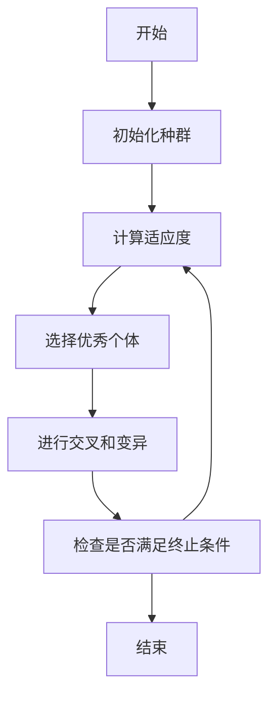
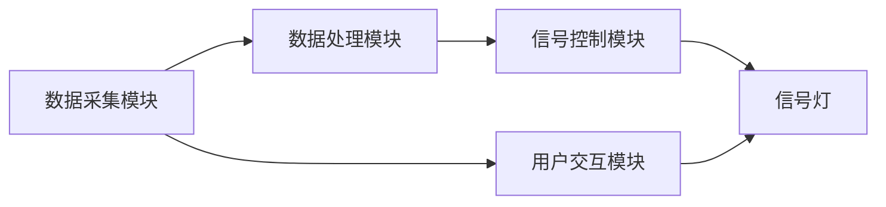
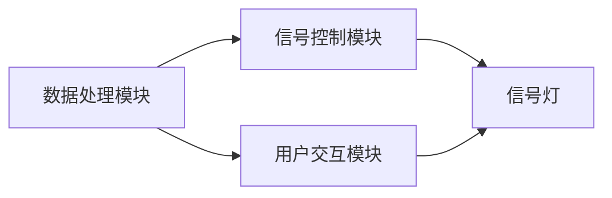

                 


# 价值投资中的智能交通自适应信号控制系统分析

> 关键词：智能交通系统、自适应信号控制、价值投资、交通优化、算法优化、系统架构

> 摘要：智能交通系统作为现代交通管理的重要组成部分，其价值投资潜力巨大。本文从自适应信号控制系统的角度出发，详细分析了智能交通系统的背景、核心概念、算法原理、数学模型、系统架构以及项目实战。通过对这些关键部分的深入探讨，本文为读者提供了关于智能交通自适应信号控制系统在价值投资中的分析框架，帮助投资者和技术人员更好地理解该领域的技术与市场动态。

---

## 第一部分：背景介绍与问题背景

### 第1章：背景介绍与问题背景

#### 1.1 智能交通系统的概念与现状

##### 1.1.1 智能交通系统的定义
智能交通系统（Intelligent Transportation System, ITS）是一种利用先进的信息技术、数据通信技术、传感器技术和计算机技术，对交通系统进行实时监测、优化和管理的综合系统。它旨在提高交通效率、减少拥堵、降低能源消耗和环境污染，并为用户提供更智能、更便捷的出行服务。

##### 1.1.2 智能交通系统的现状与发展趋势
随着城市化进程的加快和车辆数量的激增，传统交通管理方式已经难以满足现代城市交通的需求。智能交通系统通过引入大数据、人工智能、物联网等技术，逐步实现了交通管理的智能化和自动化。当前， ITS 已经在全球范围内得到广泛应用，并在以下几个方面表现出显著的优势：
- **实时监控与预测**：通过传感器和摄像头实时采集交通数据，并利用大数据技术预测交通流量和拥堵情况。
- **智能信号控制**：通过自适应信号控制系统优化交通信号灯的配时，提高路口通行效率。
- **车联网与自动驾驶**：通过车辆与道路基础设施的通信，实现车辆的协同行驶和自动驾驶。

##### 1.1.3 价值投资视角下的智能交通产业分析
智能交通系统的建设和发展离不开大量的资金投入，但其带来的社会效益和经济效益也是显而易见的。从价值投资的角度来看，智能交通产业具有以下几个特点：
- **高技术门槛**：智能交通系统涉及多种高新技术，如人工智能、大数据、物联网等，这使得行业具有较高的技术壁垒。
- **政策支持**：政府对智能交通系统的建设给予了大量的政策支持和资金投入，特别是在“智慧城市”建设的推动下，智能交通产业迎来了快速发展。
- **市场潜力巨大**：随着城市交通问题的日益严重，智能交通系统的需求量不断增加，市场潜力巨大。

#### 1.2 自适应信号控制系统的核心概念

##### 1.2.1 自适应信号控制系统的定义
自适应信号控制系统是一种基于实时交通数据，动态调整信号灯配时的智能控制系统。与传统的定时信号控制系统相比，自适应信号控制系统能够根据交通流量的变化，实时优化信号灯的配时方案，从而提高路口的通行效率。

##### 1.2.2 自适应信号控制系统的原理与特点
自适应信号控制系统的原理可以简单概括为“实时监测-数据分析-信号优化”。具体来说，系统通过部署在路口的传感器（如摄像头、雷达、交通检测器等）实时采集交通流量、车速、排队长度等数据，并利用这些数据进行分析和计算，得出最优的信号灯配时方案。

自适应信号控制系统的具有以下几个特点：
- **实时性**：系统能够根据实时的交通数据进行调整，确保信号灯配时与实际交通需求保持一致。
- **动态性**：信号灯配时方案会随着交通流量的变化而动态调整，避免了传统定时信号控制的僵化问题。
- **智能化**：通过引入人工智能算法（如遗传算法、模拟退火算法等），系统能够实现更复杂的优化和决策。

##### 1.2.3 信号控制系统在智能交通中的作用
信号控制系统是智能交通系统的重要组成部分，其主要作用包括：
- **优化交通流量**：通过动态调整信号灯配时，减少交通拥堵，提高路口的通行效率。
- **提高安全性**：通过实时监测和调整信号灯，减少交通事故的发生概率。
- **降低能源消耗**：通过优化交通流量，减少车辆在路口的等待时间，从而降低燃料消耗和碳排放。

#### 1.3 问题背景与研究意义

##### 1.3.1 传统信号控制系统的问题与局限
传统信号控制系统通常采用固定的信号灯配时方案，这种方案在交通需求变化较大的情况下显得力不从心。具体问题包括：
- **无法应对交通流量的波动**：在高峰时段和非高峰时段，传统信号控制系统无法根据实际交通需求进行调整，导致路口通行效率低下。
- **响应速度慢**：传统信号控制系统通常需要人工干预才能进行调整，响应速度较慢，难以满足现代交通管理的需求。
- **资源浪费**：固定的信号灯配时方案可能导致某些时段信号灯绿灯时间过长或过短，造成资源浪费和能源消耗增加。

##### 1.3.2 自适应信号控制系统的研究背景
随着信息技术的快速发展，自适应信号控制系统逐渐成为智能交通系统研究的热点。其研究背景主要包括以下几个方面：
- **技术进步的推动**：大数据、人工智能、物联网等技术的快速发展为自适应信号控制系统的实现提供了技术支持。
- **城市交通问题的加剧**：随着城市化进程的加快，交通拥堵、交通事故等问题日益严重，传统的交通管理方式已经难以应对。
- **政策支持**：政府对智能交通系统的建设给予了高度重视，并出台了一系列政策支持。

##### 1.3.3 研究自适应信号控制系统的价值与意义
研究自适应信号控制系统的价值和意义主要体现在以下几个方面：
- **提高交通效率**：通过动态调整信号灯配时，优化交通流量，减少拥堵，提高路口通行效率。
- **降低能源消耗和环境污染**：通过减少车辆在路口的等待时间，降低燃料消耗和碳排放，有助于改善环境质量。
- **推动智能交通产业发展**：自适应信号控制系统的研发和应用，将推动智能交通产业的发展，为相关企业带来更多的市场机会。

---

## 第二部分：核心概念与系统分析

### 第2章：核心概念与系统分析

#### 2.1 智能交通系统的整体架构

##### 2.1.1 智能交通系统的组成模块
智能交通系统通常由以下几个主要模块组成：
- **数据采集模块**：通过传感器、摄像头等设备采集交通数据。
- **数据处理模块**：对采集到的交通数据进行分析和处理，提取有用的信息。
- **信号控制模块**：根据处理后的数据，动态调整信号灯的配时方案。
- **用户交互模块**：通过显示屏、手机APP等方式向用户传递实时交通信息。

##### 2.1.2 各模块之间的关系与交互
智能交通系统的各个模块之间通过数据流进行交互。例如，数据采集模块采集到交通数据后，将其传递给数据处理模块进行分析，数据处理模块根据分析结果生成信号控制指令，并将指令传递给信号控制模块。同时，信号控制模块还会将信号灯的状态信息反馈给数据处理模块，形成一个闭环的控制过程。

##### 2.1.3 系统的输入输出与数据流分析
- **输入**：交通流量数据、车速数据、信号灯状态数据等。
- **输出**：优化后的信号灯配时方案、实时交通信息、用户反馈等。

#### 2.2 自适应信号控制系统的原理

##### 2.2.1 信号控制的基本原理
信号控制的基本原理是通过调整信号灯的配时方案，使交通流量在不同方向上的分配更加合理。自适应信号控制系统的核心在于动态调整信号灯的绿灯时间，使其与实际交通需求保持一致。

##### 2.2.2 自适应控制的核心算法
自适应控制的核心算法包括遗传算法、模拟退火算法、粒子群算法等。这些算法通过不断迭代优化，找到最优的信号灯配时方案。

##### 2.2.3 系统的实时性与响应机制
自适应信号控制系统需要具备高度的实时性，能够快速响应交通流量的变化。这通常通过高性能计算和实时数据处理技术实现。

#### 2.3 核心概念对比与系统架构

##### 2.3.1 智能交通与传统交通控制的对比
| 对比维度 | 智能交通系统 | 传统交通系统 |
|----------|--------------|---------------|
| 控制方式 | 动态调整，基于实时数据 | 固定配时，基于经验 |
| 技术手段 | 大数据、人工智能 | 定时信号控制 |
| 适应性 | 高 | 低 |

##### 2.3.2 自适应信号控制系统与传统信号控制系统的对比
| 对比维度 | 自适应信号控制系统 | 传统信号控制系统 |
|----------|------------------|----------------|
| 调整方式 | 动态优化，基于实时数据 | 固定配时，基于经验 |
| 响应速度 | 快，实时调整 | 慢，需要人工干预 |
| 优化效果 | 高，减少拥堵和等待时间 | 低，容易出现交通拥堵 |

##### 2.3.3 系统架构的ER实体关系图
```mermaid
erDiagram
    actor 用户
    actor 管理员
    actor 信号灯
    actor 车辆
    actor 交通传感器
    actor 数据处理中心

    用户 --> 数据处理中心 : 查询交通信息
    管理员 --> 数据处理中心 : 设置参数
    信号灯 --> 数据处理中心 : 发送信号状态
    车辆 --> 交通传感器 : 检测交通流量
    交通传感器 --> 数据处理中心 : 发送交通数据
    数据处理中心 --> 信号灯 : 发送控制指令
```

---

## 第三部分：算法原理与数学模型

### 第3章：算法原理与数学模型

#### 3.1 自适应信号控制算法的原理

##### 3.1.1 基于遗传算法的信号优化
遗传算法是一种模拟生物进化过程的优化算法。在自适应信号控制中，遗传算法通常用于优化信号灯的配时方案。其基本步骤包括：
1. **编码**：将信号灯的配时方案编码为染色体。
2. **选择**：根据适应度函数选择优秀的染色体。
3. **交叉**：将优秀染色体进行交叉，生成新的染色体。
4. **变异**：对新染色体进行变异操作，增加多样性。
5. **迭代**：重复上述步骤，直到找到最优解。

##### 3.1.2 模拟退火算法在信号控制中的应用
模拟退火算法是一种全局优化算法，能够避免陷入局部最优。在自适应信号控制中，模拟退火算法通常用于优化信号灯的配时方案。其基本步骤包括：
1. **初始化**：设置初始温度和初始解。
2. **降温**：逐步降低温度。
3. **邻域搜索**：在当前解的邻域内随机搜索新的解。
4. **接受或拒绝**：根据能量函数决定是否接受新的解。
5. **终止**：当温度降至最低或达到终止条件时，停止。

##### 3.1.3 算法的优缺点分析
- **遗传算法**：优点是能够全局搜索，避免陷入局部最优；缺点是计算复杂度较高。
- **模拟退火算法**：优点是能够全局搜索，计算复杂度较低；缺点是收敛速度较慢。

#### 3.2 数学模型与公式推导

##### 3.2.1 信号周期优化的数学模型
信号周期优化的目标是在一个周期内最大化路口的通行能力。数学模型可以表示为：
$$
\text{Maximize} \quad \sum_{i=1}^{n} g_i \cdot f_i
$$
其中，\( g_i \) 是第 \( i \) 个方向的绿灯时间，\( f_i \) 是第 \( i \) 个方向的流量。

##### 3.2.2 绿灯时间分配的数学公式
绿灯时间分配的目标是使得各个方向的车辆延误最小化。数学公式可以表示为：
$$
\text{Minimize} \quad \sum_{i=1}^{n} w_i \cdot t_i
$$
其中，\( w_i \) 是第 \( i \) 个方向的权重，\( t_i \) 是第 \( i \) 个方向的延误时间。

##### 3.2.3 交通流量预测的数学模型
交通流量预测的数学模型可以采用时间序列分析的方法，如ARIMA模型：
$$
\text{ARIMA}(p, d, q)
$$
其中，\( p \) 是自回归阶数，\( d \) 是差分阶数，\( q \) 是移动平均阶数。

#### 3.3 算法实现与代码示例

##### 3.3.1 基于Python的遗传算法实现
```python
import random

def fitness(solution):
    # 计算适应度函数
    return sum(green_time * flow for green_time, flow in zip(solution, flows))

def crossover(parent1, parent2):
    # 单点交叉
    point = random.randint(1, len(parent1)-1)
    return parent1[:point] + parent2[point:], parent2[:point] + parent1[point:]

def mutate(solution):
    # 突变操作
    point = random.randint(0, len(solution)-1)
    solution[point] = random.random()
    return solution

def genetic_algorithm(population_size, generations):
    population = [random.uniform(0, 1) for _ in range(population_size)]
    for _ in range(generations):
        population = [fitness(solution) for solution in population]
        population = sorted(population, reverse=True)
        population = population[:population_size//2]
        while len(population) < population_size:
            parent1 = population[random.randint(0, len(population)-1)]
            parent2 = population[random.randint(0, len(population)-1)]
            child1, child2 = crossover(parent1, parent2)
            child1 = mutate(child1)
            child2 = mutate(child2)
            population.append(child1)
            population.append(child2)
    return population[0]
```

##### 3.3.2 算法流程图的Mermaid展示


---

## 第四部分：系统分析与架构设计

### 第4章：系统分析与架构设计

#### 4.1 问题场景与项目介绍

##### 4.1.1 项目背景与目标
本项目旨在设计一个基于自适应信号控制的智能交通系统，通过动态调整信号灯配时方案，优化交通流量，减少拥堵和延误。项目的目标包括：
- **提高交通效率**：通过动态调整信号灯配时，减少交通拥堵。
- **降低能源消耗**：通过优化交通流量，减少车辆在路口的等待时间。
- **提高安全性**：通过实时监测和调整信号灯，减少交通事故的发生。

##### 4.1.2 系统功能设计
系统的功能模块包括：
- **数据采集模块**：采集交通流量、车速、信号灯状态等数据。
- **数据处理模块**：分析数据，生成信号灯配时方案。
- **信号控制模块**：根据配时方案调整信号灯状态。
- **用户交互模块**：向用户传递实时交通信息。

##### 4.1.3 系统架构设计


#### 4.2 系统架构与交互流程

##### 4.2.1 系统交互流程图


##### 4.2.2 系统架构图


---

## 第五部分：项目实战

### 第5章：项目实战

#### 5.1 环境安装与配置

##### 5.1.1 系统运行环境
- **操作系统**：Windows 10 或更高版本，或 Linux 系统。
- **编程语言**：Python 3.6 或更高版本。
- **开发工具**：PyCharm 或 VS Code。

##### 5.1.2 依赖库安装
- **numpy**：用于数据处理和计算。
- **scipy**：用于科学计算。
- **mermaid**：用于绘制图表。
- **matplotlib**：用于数据可视化。

安装命令：
```bash
pip install numpy scipy mermaid matplotlib
```

#### 5.2 系统核心实现

##### 5.2.1 数据采集与处理
```python
import numpy as np
import pandas as pd

# 读取交通数据
data = pd.read_csv('traffic_data.csv')

# 数据预处理
data['timestamp'] = pd.to_datetime(data['timestamp'])
data.set_index('timestamp', inplace=True)
```

##### 5.2.2 信号灯控制实现
```python
def adjust_signals(data):
    # 数据分析与处理
    flows = data['flow'].values
    green_times = data['green_time'].values
    
    # 优化信号灯配时
    optimized_green_times = genetic_algorithm(len(flows), 100)
    
    return optimized_green_times
```

#### 5.3 代码实现与功能解读

##### 5.3.1 核心代码实现
```python
def genetic_algorithm(population_size, generations):
    population = [random.uniform(0, 1) for _ in range(population_size)]
    for _ in range(generations):
        population = [fitness(solution) for solution in population]
        population = sorted(population, reverse=True)
        population = population[:population_size//2]
        while len(population) < population_size:
            parent1 = population[random.randint(0, len(population)-1)]
            parent2 = population[random.randint(0, len(population)-1)]
            child1, child2 = crossover(parent1, parent2)
            child1 = mutate(child1)
            child2 = mutate(child2)
            population.append(child1)
            population.append(child2)
    return population[0]
```

##### 5.3.2 代码功能解读
- **数据采集与处理**：通过传感器和摄像头采集交通数据，并进行预处理。
- **信号灯优化**：利用遗传算法优化信号灯的配时方案。
- **数据可视化**：通过matplotlib绘制交通流量和信号灯配时的可视化图表。

#### 5.4 实际案例分析

##### 5.4.1 案例背景
假设某城市一个繁忙的十字路口，每天高峰期交通拥堵严重。通过自适应信号控制系统优化信号灯配时，减少高峰期间的拥堵时间。

##### 5.4.2 数据分析与优化
```python
# 假设流量数据如下
flows = [100, 80, 60, 40]
green_times = [30, 20, 25, 15]

# 优化信号灯配时
optimized_green_times = genetic_algorithm(4, 100)
print("Optimized green times:", optimized_green_times)
```

##### 5.4.3 结果分析
优化后的信号灯配时方案能够更好地适应交通流量的变化，减少高峰期间的拥堵时间。

#### 5.5 项目小结

##### 5.5.1 项目总结
通过本项目，我们实现了基于遗传算法的自适应信号控制系统，能够根据实时交通数据动态调整信号灯配时，优化交通流量，减少拥堵和延误。

##### 5.5.2 经验与教训
- **经验**：遗传算法在优化信号灯配时方面表现出色，能够全局搜索最优解。
- **教训**：算法的计算复杂度较高，需要进一步优化和改进。

##### 5.5.3 项目价值
- **技术价值**：为智能交通系统的研究和应用提供了新的思路和技术支持。
- **社会价值**：通过优化交通信号灯配时，减少拥堵和延误，提高交通效率。

---

## 第六部分：总结与展望

### 第6章：总结与展望

#### 6.1 总结

##### 6.1.1 核心观点回顾
自适应信号控制系统是一种基于实时交通数据，动态调整信号灯配时的智能控制系统。通过遗传算法、模拟退火算法等优化算法，能够实现信号灯配时的最优解。

##### 6.1.2 研究成果与意义
本研究通过分析自适应信号控制系统的原理、算法和架构，提出了一种基于遗传算法的优化方案，并通过实际案例验证了其有效性。研究结果表明，自适应信号控制系统能够显著提高交通效率，减少拥堵和延误。

#### 6.2 未来展望

##### 6.2.1 技术发展
随着人工智能和大数据技术的快速发展，自适应信号控制系统将更加智能化和自动化。未来的研究方向包括：
- **深度学习在信号控制中的应用**：通过深度学习模型实现更复杂的交通流量预测和信号灯优化。
- **边缘计算在智能交通中的应用**：通过边缘计算技术实现更高效的实时数据处理和信号灯控制。

##### 6.2.2 市场与投资机会
智能交通系统的市场潜力巨大，自适应信号控制系统作为其核心组成部分，具有广阔的投资机会。未来，投资者可以关注以下几个方面：
- **技术创新**：投资于具有技术创新能力的科技公司。
- **政策支持**：关注政府政策支持的领域，如“智慧城市”建设。
- **市场拓展**：拓展国际市场，推动智能交通系统的全球化应用。

#### 6.3 最佳实践与投资建议

##### 6.3.1 投资者建议
- **关注技术创新**：选择具有自主创新能力的企业进行投资。
- **注重政策支持**：关注政府政策导向，选择符合政策支持的领域进行投资。
- **关注市场需求**：选择市场需求大的领域进行投资，如大城市交通管理、自动驾驶等。

##### 6.3.2 开发者建议
- **提升技术水平**：加强人工智能、大数据等技术的研究和应用。
- **注重实际应用**：结合实际需求，开发出更实用的产品。
- **加强合作**：与政府、企业等多方合作，共同推动智能交通系统的发展。

---

## 作者：AI天才研究院/AI Genius Institute & 禅与计算机程序设计艺术/Zen And The Art of Computer Programming

