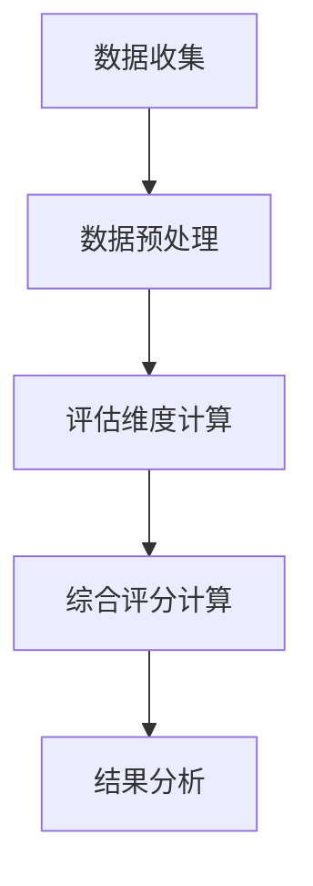
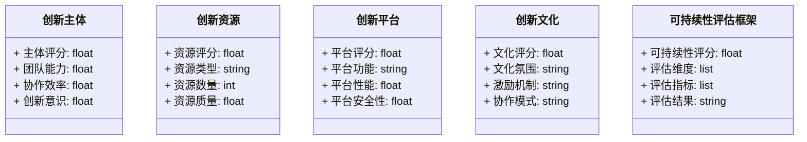
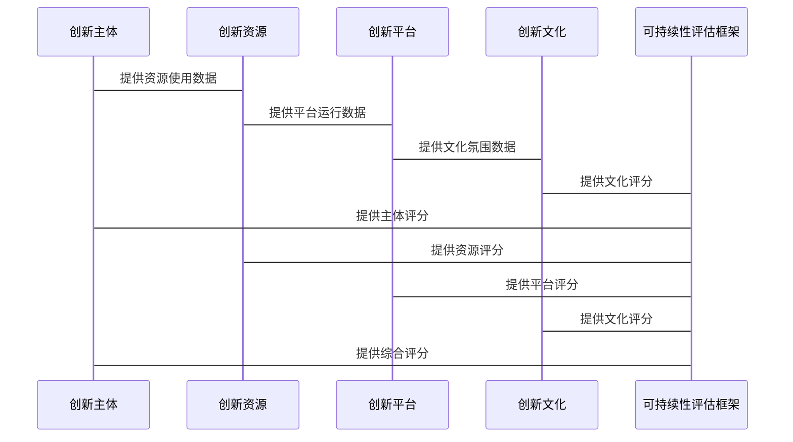

                 


# 彼得林奇对公司创新生态系统可持续性评估框架

## 关键词：创新生态系统，可持续性评估，彼得·林奇，企业创新，生态系统评估

## 摘要：本文从彼得·林奇的视角出发，构建了一个创新生态系统可持续性评估框架，涵盖了背景介绍、核心概念、算法原理、系统架构、项目实战及最佳实践等方面。通过详细分析创新生态系统的核心要素、评估维度和系统架构，结合实际案例和代码示例，提出了一个具有可操作性的评估框架，为企业管理者提供参考。

---

## 第一部分: 背景与概述

### 第1章: 创新生态系统与可持续性评估框架概述

#### 1.1 创新生态系统的基本概念

##### 1.1.1 创新生态系统的定义
创新生态系统是指一个由企业内部的创新主体（如研发团队、产品部门）、外部合作伙伴（如供应商、客户、合作伙伴）以及创新支持系统（如技术平台、数据资源）共同构成的动态网络系统。其目的是通过协同创新，推动企业持续创新，提升竞争力。

##### 1.1.2 创新生态系统的核心要素
创新生态系统由以下核心要素组成：
- **创新主体**：包括研发团队、产品经理、工程师等直接参与创新的人员。
- **创新资源**：包括技术资源、数据资源、资金支持等。
- **创新平台**：包括企业内部的技术平台、协作工具、数据中台等。
- **创新文化**：包括企业的创新价值观、激励机制、协作模式等。

##### 1.1.3 创新生态系统与企业可持续发展的关系
创新生态系统是企业实现可持续发展的核心驱动力。通过构建高效的创新生态系统，企业可以更快响应市场需求，优化资源配置，降低创新成本，提升创新能力，从而实现长期的可持续发展。

#### 1.2 可持续性评估框架的背景与意义

##### 1.2.1 可持续性评估的定义
可持续性评估是指对一个系统或过程在一定时间内是否能够持续满足目标、适应变化、保持稳定性的评估。在企业创新生态系统中，可持续性评估的核心在于判断创新系统是否能够长期为企业创造价值。

##### 1.2.2 企业创新生态系统中可持续性评估的重要性
- **优化资源配置**：通过评估，企业可以发现创新资源的浪费或不足，优化资源配置。
- **降低创新风险**：通过评估，企业可以识别创新过程中的潜在风险，提前制定应对策略。
- **提升创新效率**：通过评估，企业可以优化创新流程，提升创新效率。

##### 1.2.3 彼得·林奇视角下的创新生态系统评估
彼得·林奇作为投资专家，强调企业创新生态系统的核心在于创新文化的建立和创新资源的高效利用。他提出，企业创新生态系统评估的关键在于：
- **创新文化的评估**：包括创新价值观、激励机制、协作模式等。
- **创新资源的评估**：包括技术资源、数据资源、资金支持等。
- **创新成果的评估**：包括创新产品的市场表现、创新项目的成功率等。

### 第2章: 问题背景与目标设定

#### 2.1 企业创新生态系统中的问题与挑战

##### 2.1.1 创新生态系统中的主要问题
- **创新资源分配不合理**：部分企业存在资源浪费或资源不足的情况，导致创新效率低下。
- **创新文化缺失**：部分企业缺乏创新文化，员工缺乏创新动力。
- **创新平台不完善**：部分企业的创新平台功能单一，无法支持多维度的创新活动。

##### 2.1.2 可持续性评估的核心问题
- **如何量化创新生态系统的可持续性**：创新生态系统是一个复杂的系统，如何将其量化是关键问题。
- **如何平衡短期目标与长期目标**：企业在追求短期创新成果的同时，需要考虑长期的可持续发展。

##### 2.1.3 企业创新生态系统的边界与外延
- **边界**：企业创新生态系统的边界包括企业的组织结构、资源分配、创新平台、创新文化等。
- **外延**：企业创新生态系统的外延包括与外部合作伙伴的协同创新、行业趋势对企业创新的影响等。

#### 2.2 可持续性评估的目标与范围

##### 2.2.1 评估目标的设定
- **优化创新生态系统**：通过评估，发现创新生态系统中的问题，提出改进建议。
- **提升创新效率**：通过评估，优化创新流程，提升创新效率。
- **降低创新风险**：通过评估，识别创新过程中的潜在风险，制定应对策略。

##### 2.2.2 评估范围的界定
- **内部创新主体**：包括研发团队、产品经理、工程师等。
- **外部合作伙伴**：包括供应商、客户、合作伙伴等。
- **创新平台与资源**：包括技术平台、数据资源、资金支持等。
- **创新文化与协作模式**：包括创新价值观、激励机制、协作模式等。

##### 2.2.3 评估框架的核心要素与组成
- **创新主体评估**：包括创新团队的能力、协作效率等。
- **创新资源评估**：包括技术资源的充足性、数据资源的质量等。
- **创新平台评估**：包括创新平台的功能完善性、使用效率等。
- **创新文化评估**：包括创新文化的氛围、员工创新积极性等。

---

## 第二部分: 核心概念与联系

### 第3章: 创新生态系统的核心概念与联系

#### 3.1 核心概念原理

##### 3.1.1 创新生态系统的组成要素
创新生态系统由以下组成要素构成：
- **创新主体**：包括研发团队、产品经理、工程师等。
- **创新资源**：包括技术资源、数据资源、资金支持等。
- **创新平台**：包括技术平台、协作工具、数据中台等。
- **创新文化**：包括创新价值观、激励机制、协作模式等。

##### 3.1.2 可持续性评估的核心维度
可持续性评估的核心维度包括：
- **创新效率**：包括创新项目的完成时间、创新成本等。
- **创新成果**：包括创新产品的市场表现、创新项目的成功率等。
- **创新可持续性**：包括创新资源的可持续性、创新文化的持续性等。

##### 3.1.3 创新生态系统与可持续性评估的关联
创新生态系统与可持续性评估密切相关。通过评估创新生态系统的可持续性，可以判断创新系统是否能够长期为企业创造价值。创新生态系统中的各个要素相互作用，共同影响创新系统的可持续性。

#### 3.2 核心概念属性特征对比

##### 3.2.1 创新生态系统与传统管理模式的对比
| 对比维度 | 创新生态系统 | 传统管理模式 |
|----------|---------------|---------------|
| 管理目标 | 提升创新能力 | 优化企业运营 |
| 管理主体 | 创新团队、外部合作伙伴 | 管理层、职能部门 |
| 管理方式 | 协同创新、动态调整 | 严格执行、层级管理 |

##### 3.2.2 可持续性评估与传统财务评估的对比
| 对比维度 | 可持续性评估 | 传统财务评估 |
|----------|---------------|---------------|
| 评估目标 | 判断创新系统的可持续性 | 评估企业的财务状况 |
| 评估对象 | 创新生态系统 | 企业的财务数据 |
| 评估维度 | 创新效率、创新成果、创新可持续性 | 资产、负债、利润 |

##### 3.2.3 创新生态系统中各要素的属性特征分析
- **创新主体**：创新主体的属性特征包括专业能力、协作能力、创新意识等。
- **创新资源**：创新资源的属性特征包括资源的充足性、资源的多样性、资源的可用性等。
- **创新平台**：创新平台的属性特征包括功能完善性、使用效率、安全性等。
- **创新文化**：创新文化的属性特征包括文化氛围、员工创新积极性、协作模式等。

#### 3.3 ER实体关系图架构

##### 3.3.1 实体关系图
```mermaid
er
  entity 创新生态系统 {
    key: ID
    attribute: 创新能力, 组织结构, 资源分配
  }
  
  entity 可持续性评估框架 {
    key: ID
    attribute: 评估维度, 评估指标, 评估结果
  }
  
  entity 创新主体 {
    key: ID
    attribute: 团队能力, 协作效率, 创新意识
  }
  
  entity 创新资源 {
    key: ID
    attribute: 资源类型, 资源数量, 资源质量
  }
  
  entity 创新平台 {
    key: ID
    attribute: 平台功能, 平台性能, 平台安全性
  }
  
  entity 创新文化 {
    key: ID
    attribute: 文化氛围, 激励机制, 协作模式
  }
```

##### 3.3.2 实体关系图说明
- **创新生态系统**：与 **可持续性评估框架** 有联系，通过评估框架可以判断创新生态系统的可持续性。
- **创新主体**：创新主体与 **创新资源** 有联系，创新资源为创新主体提供支持。
- **创新平台**：创新平台与 **创新主体** 有联系，创新主体使用创新平台进行创新活动。
- **创新文化**：创新文化与 **创新主体** 有联系，创新文化影响创新主体的行为。

---

## 第三部分: 算法原理与数学模型

### 第4章: 算法原理与数学模型

#### 4.1 算法原理

##### 4.1.1 算法流程
1. **数据收集**：收集创新生态系统的相关数据，包括创新主体的性能数据、创新资源的使用情况、创新平台的运行状态等。
2. **数据预处理**：对收集到的数据进行清洗、标准化处理。
3. **评估维度计算**：根据创新生态系统的评估维度，计算各个维度的评分。
4. **综合评分计算**：根据各个维度的评分，计算创新生态系统的综合评分。
5. **结果分析**：根据综合评分，判断创新生态系统的可持续性。

##### 4.1.2 算法流程图


##### 4.1.3 算法实现代码
```python
def calculate_sustainability_score(innovation_system):
    # 评估维度计算
   主体_score = innovation_system['主体评分']
    资源_score = innovation_system['资源评分']
    平台_score = innovation_system['平台评分']
    文化_score = innovation_system['文化评分']
    
    # 综合评分计算
    total_score = (主体_score + 资源_score + 平台_score + 文化_score) / 4
    return total_score

# 示例数据
innovation_system = {
    '主体评分': 85,
    '资源评分': 90,
    '平台评分': 80,
    '文化评分': 85
}

# 计算可持续性评分
sustainability_score = calculate_sustainability_score(innovation_system)
print(f"可持续性评分: {sustainability_score}")
```

#### 4.2 数学模型

##### 4.2.1 创新生态系统的可持续性评分公式
$$ \text{可持续性评分} = \frac{\text{主体评分} + \text{资源评分} + \text{平台评分} + \text{文化评分}}{4} $$

##### 4.2.2 各评估维度的评分公式
- **主体评分**：主体评分基于创新团队的能力、协作效率、创新意识等指标，采用加权平均法计算。
$$ \text{主体评分} = \alpha \times \text{团队能力} + \beta \times \text{协作效率} + \gamma \times \text{创新意识} $$
- **资源评分**：资源评分基于创新资源的充足性、多样性、可用性等指标，采用层次分析法计算。
$$ \text{资源评分} = \sum_{i=1}^{n} w_i \times r_i $$
其中，$w_i$ 为资源 $i$ 的权重，$r_i$ 为资源 $i$ 的评分。
- **平台评分**：平台评分基于创新平台的功能完善性、性能、安全性等指标，采用模糊综合评价法计算。
$$ \text{平台评分} = \sum_{i=1}^{m} w_i \times p_i $$
其中，$w_i$ 为平台 $i$ 的权重，$p_i$ 为平台 $i$ 的评分。
- **文化评分**：文化评分基于创新文化的氛围、激励机制、协作模式等指标，采用专家打分法计算。
$$ \text{文化评分} = \sum_{j=1}^{k} w_j \times c_j $$
其中，$w_j$ 为文化 $j$ 的权重，$c_j$ 为文化 $j$ 的评分。

---

## 第四部分: 系统分析与架构设计

### 第5章: 系统分析与架构设计

#### 5.1 问题场景介绍

##### 5.1.1 系统目标
- **优化创新生态系统**：通过评估，发现创新生态系统中的问题，提出改进建议。
- **提升创新效率**：通过优化创新流程，提升创新效率。
- **降低创新风险**：通过评估，识别创新过程中的潜在风险，制定应对策略。

##### 5.1.2 系统范围
- **内部创新主体**：包括研发团队、产品经理、工程师等。
- **外部合作伙伴**：包括供应商、客户、合作伙伴等。
- **创新平台与资源**：包括技术平台、数据资源、资金支持等。
- **创新文化与协作模式**：包括创新文化的氛围、员工创新积极性等。

#### 5.2 系统功能设计

##### 5.2.1 领域模型


##### 5.2.2 系统架构设计


#### 5.3 接口设计与交互流程图

##### 5.3.1 接口设计
- **创新主体接口**：提供创新主体的性能数据，包括团队能力、协作效率、创新意识等。
- **创新资源接口**：提供创新资源的使用情况，包括资源类型、资源数量、资源质量等。
- **创新平台接口**：提供创新平台的运行状态，包括平台功能、平台性能、平台安全性等。
- **创新文化接口**：提供创新文化的氛围数据，包括文化氛围、激励机制、协作模式等。

##### 5.3.2 交互流程图


---

## 第五部分: 项目实战

### 第6章: 项目实战

#### 6.1 环境安装与配置

##### 6.1.1 系统环境要求
- **操作系统**：Windows 10 或更高版本，或 macOS 10.15 或更高版本，或 Linux 系统。
- **编程语言**：Python 3.6 或更高版本。
- **开发工具**：建议使用 PyCharm 或 VS Code 进行开发。
- **依赖库**：需要安装 Mermaid、pandas、numpy 等库。

##### 6.1.2 安装依赖库
```bash
pip install mermaid-django
pip install pandas
pip install numpy
```

#### 6.2 系统核心实现

##### 6.2.1 核心代码实现
```python
import pandas as pd
import numpy as np

class InnovationSystem:
    def __init__(self):
        self.subject_score = 0
        self.resource_score = 0
        self.platform_score = 0
        self.culture_score = 0
        self.sustainability_score = 0

    def calculate_subject_score(self, team_ability, collaboration_efficiency, innovation意识):
        self.subject_score = (team_ability + collaboration_efficiency + innovation_意识) / 3

    def calculate_resource_score(self, resource_type, resource_quantity, resource_quality):
        self.resource_score = (resource_type + resource_quantity + resource_quality) / 3

    def calculate_platform_score(self, platform_function, platform_performance, platform_security):
        self.platform_score = (platform_function + platform_performance + platform_security) / 3

    def calculate_culture_score(self, culture_atmosphere, motivation_mechanism, collaboration_mode):
        self.culture_score = (culture_atmosphere + motivation_mechanism + collaboration_mode) / 3

    def calculate_sustainability_score(self):
        self.sustainability_score = (self.subject_score + self.resource_score + self.platform_score + self.culture_score) / 4

# 示例应用
innovation_system = InnovationSystem()
innovation_system.calculate_subject_score(85, 90, 80)
innovation_system.calculate_resource_score(85, 85, 90)
innovation_system.calculate_platform_score(80, 85, 85)
innovation_system.calculate_culture_score(85, 85, 85)
innovation_system.calculate_sustainability_score()
print(f"可持续性评分: {innovation_system.sustainability_score}")
```

##### 6.2.2 代码应用解读
上述代码实现了一个创新生态系统的评估框架，包括创新主体、创新资源、创新平台、创新文化的评分计算，以及综合评分的计算。通过示例应用，可以发现创新生态系统的可持续性评分与各评估维度的评分密切相关。

#### 6.3 实际案例分析

##### 6.3.1 案例背景
某科技公司希望对其创新生态系统进行可持续性评估，以优化创新流程，提升创新效率。

##### 6.3.2 案例分析
根据上述代码，假设某科技公司的创新主体评分为85，创新资源评分为90，创新平台评分为80，创新文化评分为85。则综合评分计算如下：
$$ \text{可持续性评分} = \frac{85 + 90 + 80 + 85}{4} = 85 $$

##### 6.3.3 分析结论
可持续性评分为85分，表明该科技公司的创新生态系统具有较高的可持续性，但在创新平台方面存在一定的优化空间。

#### 6.4 项目小结

##### 6.4.1 项目成果
- **实现了一个创新生态系统的可持续性评估框架**。
- **提供了创新主体、创新资源、创新平台、创新文化的评分计算方法**。
- **实现了综合评分的计算方法**。

##### 6.4.2 项目经验总结
- **创新生态系统的核心在于创新文化的建立和创新资源的高效利用**。
- **可持续性评估框架的实现需要结合企业的实际情况，进行定制化开发**。

---

## 第六部分: 最佳实践与总结

### 第7章: 最佳实践与总结

#### 7.1 最佳实践

##### 7.1.1 小结
通过本文的分析，我们可以得出以下结论：
- **创新生态系统的核心在于创新文化的建立和创新资源的高效利用**。
- **可持续性评估框架的实现需要结合企业的实际情况，进行定制化开发**。

##### 7.1.2 注意事项
- **定期评估创新生态系统的可持续性**：企业需要定期对创新生态系统进行评估，发现潜在问题，提出改进建议。
- **注重创新文化的建设**：创新文化是创新生态系统的核心，企业需要通过激励机制、协作模式等手段，营造良好的创新文化氛围。
- **优化创新平台的功能**：创新平台是创新生态系统的重要组成部分，企业需要不断优化创新平台的功能，提升创新效率。

##### 7.1.3 拓展阅读
- **《创新者的窘境》**：讲述了企业在创新过程中可能面临的困境及应对策略。
- **《彼得·林奇的投资哲学》**：通过彼得·林奇的视角，探讨企业创新生态系统的核心要素。

#### 7.2 作者总结
本文从彼得·林奇的视角出发，构建了一个创新生态系统可持续性评估框架，涵盖了背景介绍、核心概念、算法原理、系统架构、项目实战及最佳实践等方面。通过详细分析创新生态系统的核心要素、评估维度和系统架构，结合实际案例和代码示例，提出了一个具有可操作性的评估框架，为企业管理者提供参考。

---

## 作者信息

作者：AI天才研究院/AI Genius Institute & 禅与计算机程序设计艺术 /Zen And The Art of Computer Programming

---

以上是《彼得林奇对公司创新生态系统可持续性评估框架》的技术博客文章内容，涵盖从背景到实战的详细分析，结合理论与实践，为企业创新生态系统可持续性评估提供了系统的参考框架。

