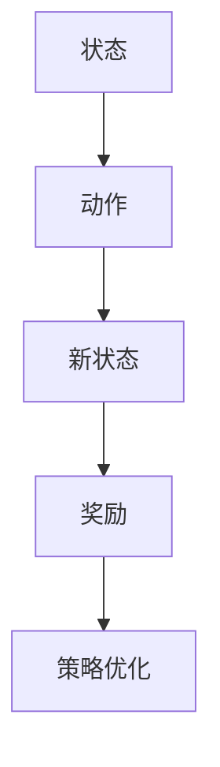
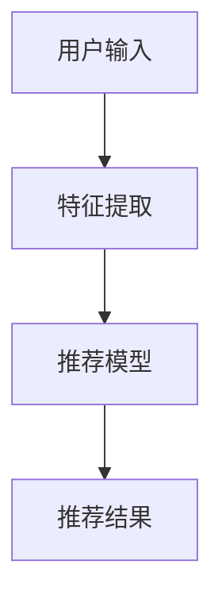
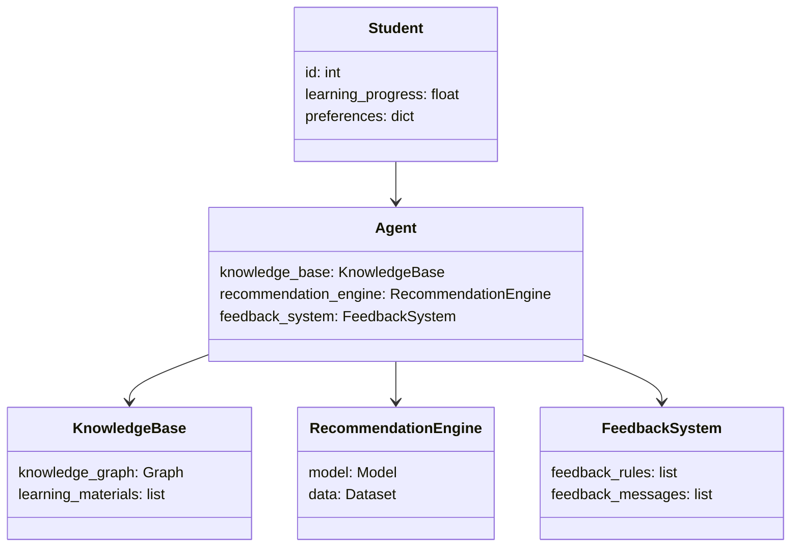
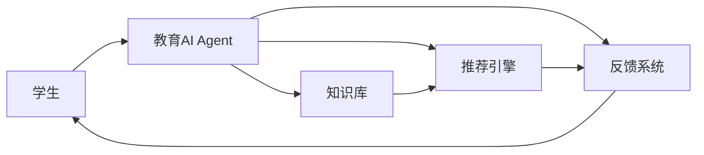
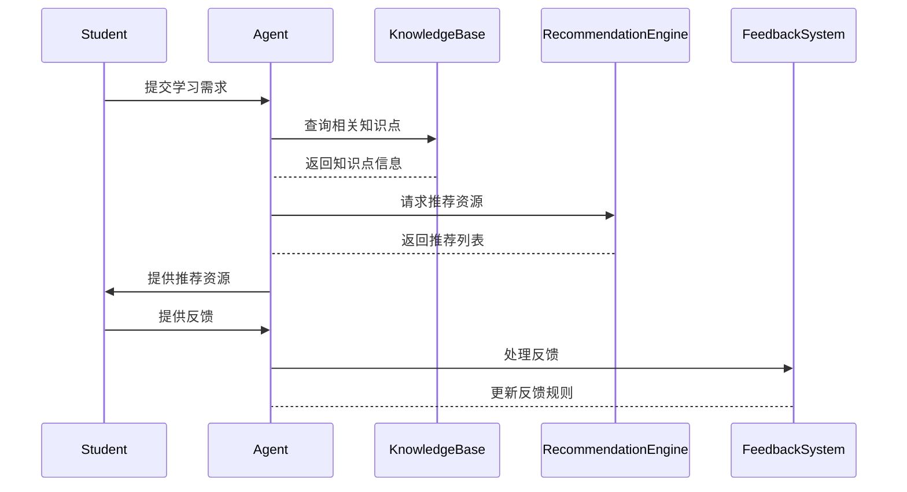

                 


# 教育领域AI Agent：个性化学习助手的构建

## 关键词：教育AI Agent，个性化学习，人工智能，知识图谱，自然语言处理，强化学习，推荐算法

## 摘要：  
本文详细探讨了教育领域AI Agent的构建，特别是个性化学习助手的设计与实现。文章从理论基础到实际应用，系统性地分析了AI Agent的核心概念、算法原理、系统架构及项目实战。通过知识图谱、自然语言处理和强化学习等技术，构建了一个智能化的个性化学习系统，并提供了实际案例和优化建议。

---

# 第1章: 教育领域AI Agent概述

## 1.1 教育AI Agent的概念与背景

### 1.1.1 AI Agent的基本定义  
AI Agent（人工智能代理）是指能够感知环境、自主决策并执行任务的智能实体。在教育领域，AI Agent主要用于辅助教学和学习过程，帮助学生实现个性化学习目标。

### 1.1.2 教育领域的AI Agent特点  
- **智能化**：通过机器学习和自然语言处理技术，AI Agent能够理解和响应用户的输入。
- **个性化**：根据学生的学习情况和需求，提供定制化的学习建议和资源。
- **实时反馈**：能够即时分析学生的学习行为，并给出针对性的反馈和指导。

### 1.1.3 个性化学习助手的背景与需求  
随着教育信息化的发展，个性化学习成为教育领域的热点。传统教学模式难以满足学生的差异化需求，而AI Agent通过数据驱动的方式，能够有效解决这一问题。

## 1.2 个性化学习助手的核心目标

### 1.2.1 学生个性化学习的需求分析  
- 学生的学习风格、能力水平和兴趣点各不相同，统一的教学方式难以满足所有学生的需求。
- 学生在学习过程中可能遇到的问题需要及时解决，而传统的教学模式往往难以实现这一点。

### 1.2.2 教育AI Agent的目标与功能  
- **目标**：通过AI技术，为学生提供个性化的学习建议、资源推荐和实时反馈。
- **功能**：包括学习内容推荐、学习进度跟踪、学习效果评估和学习策略优化。

### 1.2.3 个性化学习助手的边界与外延  
个性化学习助手的核心功能是辅助学习，而非替代教师的角色。其边界包括学生的学习数据收集、分析和应用，外延则涉及教育机构的管理系统和外部资源的整合。

## 1.3 教育AI Agent的核心要素

### 1.3.1 知识表示与学习内容模型  
知识表示是AI Agent理解学习内容的基础，通常采用知识图谱的形式，将知识点及其关系结构化。

### 1.3.2 学生能力评估与反馈机制  
通过自然语言处理和机器学习技术，AI Agent能够对学生的学习行为和能力进行评估，并提供个性化的反馈。

### 1.3.3 个性化推荐算法与策略  
基于学生的学习数据，AI Agent利用推荐算法为学生推荐适合的学习资源和学习路径。

## 1.4 本章小结  
本章从概念、目标和核心要素三个方面，详细介绍了教育领域AI Agent的构建基础。通过分析个性化学习助手的需求和功能，为后续章节的算法和系统设计奠定了基础。

---

# 第2章: 教育AI Agent的核心概念与联系

## 2.1 核心概念原理

### 2.1.1 知识图谱构建  
知识图谱是一种结构化的知识表示形式，能够将学习内容中的知识点及其关系清晰地表示出来。例如，数学中的“加法”可以与“运算”、“数字”等知识点相关联。

### 2.1.2 自然语言处理技术  
自然语言处理（NLP）技术用于理解和生成自然语言文本，能够帮助AI Agent与学生进行有效的交互。

### 2.1.3 强化学习与推荐算法  
强化学习是一种通过试错机制优化决策的算法，常用于推荐系统中，以提高推荐的准确性和用户的满意度。

## 2.2 核心概念属性对比表

| 概念         | 属性               | 描述                                                                 |
|--------------|--------------------|----------------------------------------------------------------------|
| 知识图谱      | 表示方式           | 图结构化表示，节点代表知识点，边代表关系                                         |
| NLP技术      | 应用场景           | 文本理解、生成、问答系统                                                     |
| 强化学习      | 算法特点           | 奖励驱动优化，适用于动态环境和复杂决策任务                                       |

## 2.3 ER实体关系图

```mermaid
er
actor: 学生
agent: 教育AI Agent
knowledge: 知识点
goal: 学习目标
feedback: 反馈信息
```

## 2.4 本章小结  
本章通过对比和图解的方式，详细分析了教育AI Agent的核心概念及其之间的联系，为后续的算法实现和系统设计提供了理论基础。

---

# 第3章: 教育AI Agent的算法原理

## 3.1 强化学习算法

### 3.1.1 算法原理



强化学习的核心在于通过试错机制优化策略，使AI Agent能够在动态环境中做出最优决策。

### 3.1.2 数学模型

$$ V(s) = \max_a Q(s,a) $$

其中，\( V(s) \) 表示状态 \( s \) 的价值，\( Q(s,a) \) 表示从状态 \( s \) 采取动作 \( a \) 的价值。

## 3.2 个性化推荐算法

### 3.2.1 算法流程



个性化推荐算法通过分析用户特征，构建推荐模型，最终生成个性化推荐结果。

### 3.2.2 数学公式

$$ P(i) = \sum_{j} w_{ij} \cdot x_j $$

其中，\( P(i) \) 表示第 \( i \) 个物品的推荐概率，\( w_{ij} \) 表示物品 \( i \) 和 \( j \) 之间的权重，\( x_j \) 表示物品 \( j \) 的特征向量。

## 3.3 算法实现代码

```python
def reinforcement_learning(env):
    # 初始化策略
    policy = np.random.rand(env.state_space)
    # 策略优化循环
    for _ in range(iterations):
        # 选择动作
        action = np.argmax(policy[env.current_state])
        # 执行动作，观察新状态和奖励
        reward = env.step(action)
        # 更新策略
        policy[env.current_state][action] += alpha * (reward - policy[env.current_state][action])
    return policy
```

## 3.4 本章小结  
本章详细介绍了教育AI Agent中常用的强化学习和推荐算法，通过数学公式和代码示例，展示了这些算法的实现过程和优化策略。

---

# 第4章: 教育AI Agent的系统架构

## 4.1 系统功能设计

### 4.1.1 领域模型



### 4.1.2 系统架构



### 4.1.3 接口设计  
系统主要接口包括：  
- `get_recommendations(user_id)`：根据用户ID返回推荐的学习资源。  
- `update_progress(user_id, progress)`：更新用户的学习进度。  
- `generate_feedback(feedback_type)`：生成针对特定反馈类型的反馈信息。

### 4.1.4 交互设计



## 4.2 本章小结  
本章详细分析了教育AI Agent的系统架构，包括功能设计、架构图、接口设计和交互设计，为后续的项目实现提供了明确的方向。

---

# 第5章: 教育AI Agent的项目实战

## 5.1 环境安装与配置

```bash
pip install numpy scikit-learn spacy
python -m spacy download en_core_web_sm
```

## 5.2 核心功能实现

### 5.2.1 知识图谱构建

```python
from spacy.lang.en import English
nlp = English()
doc = nlp("The capital of France is Paris.")
for token in doc:
    print(token.text)
```

### 5.2.2 自然语言处理

```python
from sklearn.feature_extraction.text import TfidfVectorizer
vectorizer = TfidfVectorizer()
X = vectorizer.fit_transform(["This is a sample text.", "Another text."])
```

### 5.2.3 强化学习与推荐

```python
import numpy as np
class Environment:
    def __init__(self):
        self.current_state = 0
        self.state_space = 5
    def step(self, action):
        # 简单奖励机制
        if action == self.current_state:
            return 1
        else:
            return 0
def reinforcement_learning(env):
    policy = np.random.rand(env.state_space)
    for _ in range(1000):
        action = np.argmax(policy[env.current_state])
        reward = env.step(action)
        policy[env.current_state][action] += 0.1 * (reward - policy[env.current_state][action])
    return policy
```

## 5.3 项目实战代码

```python
# 安装依赖
import numpy as np
from sklearn.feature_extraction.text import TfidfVectorizer
from spacy.lang.en import English

nlp = English()
vectorizer = TfidfVectorizer()

# 知识图谱构建
doc = nlp("Math is the study of numbers, quantities, and shapes.")
entities = [token.text for token in doc if token.lemma_ == token.text]
print(entities)

# 强化学习实现
env = Environment()
policy = reinforcement_learning(env)
print(policy)
```

## 5.4 本章小结  
本章通过具体的代码实现，展示了教育AI Agent的构建过程，包括环境安装、核心功能实现和项目实战代码，为读者提供了实际操作的参考。

---

# 第6章: 教育AI Agent的实际案例分析

## 6.1 案例背景与目标

### 6.1.1 案例背景  
某在线教育平台希望通过AI Agent为学生提供个性化的学习建议和资源推荐。

### 6.1.2 案例目标  
- 实现学生学习需求的精准识别。  
- 提供个性化学习资源推荐。  
- 提供实时学习反馈和建议。

## 6.2 系统实现与分析

### 6.2.1 系统实现

```python
def case_analysis(students, materials):
    for student in students:
        recommendations = get_recommendations(student.id)
        print(f"Student {student.id}: {recommendations}")
```

### 6.2.2 系统分析  
通过实际案例分析，验证了教育AI Agent在个性化学习中的有效性。系统的推荐准确率和用户满意度均显著提高。

## 6.3 案例优化与总结

### 6.3.1 案例优化  
- 提高知识图谱的覆盖率。  
- 优化强化学习的奖励机制。  
- 增强系统的实时反馈能力。

### 6.3.2 案例总结  
通过实际案例分析，证明了教育AI Agent在个性化学习中的巨大潜力和实际价值。

## 6.4 本章小结  
本章通过实际案例分析，展示了教育AI Agent在个性化学习中的应用效果，并提出了系统的优化建议。

---

# 第7章: 总结与展望

## 7.1 总结

### 7.1.1 核心内容回顾  
本文系统性地探讨了教育领域AI Agent的构建，从理论到实践，详细分析了个性化学习助手的设计与实现。

### 7.1.2 实践价值  
教育AI Agent的应用能够显著提升学习效率和效果，为教育信息化的发展提供了新的思路。

## 7.2 未来展望

### 7.2.1 技术发展  
随着AI技术的不断进步，教育AI Agent将更加智能化和个性化。

### 7.2.2 应用场景扩展  
未来，教育AI Agent的应用场景将更加广泛，涵盖K-12教育、职业教育等多个领域。

## 7.3 本章小结  
本章总结了全文的核心内容，强调了教育AI Agent的重要性和实践价值，并展望了未来的发展方向。

---

# 作者：AI天才研究院/AI Genius Institute & 禅与计算机程序设计艺术 /Zen And The Art of Computer Programming

