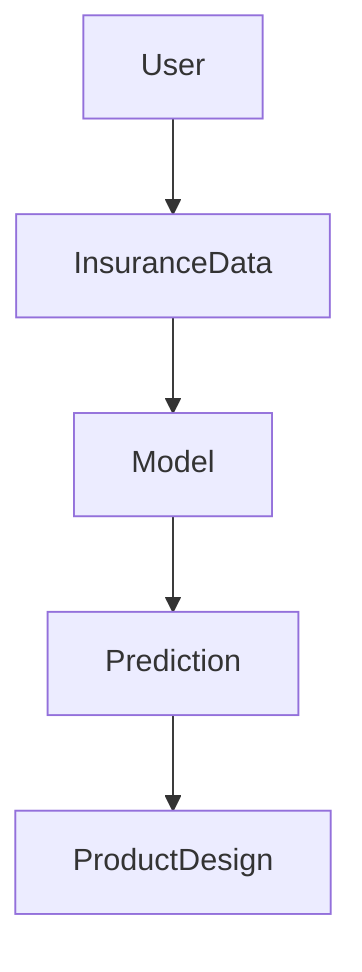
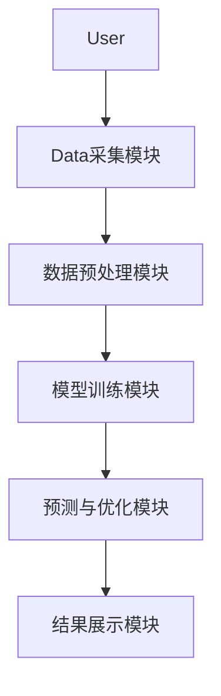

                 


# 《智能保险需求预测与产品设计优化系统》

> 关键词：智能保险、需求预测、产品设计优化、机器学习、系统架构

> 摘要：本文详细介绍了智能保险需求预测与产品设计优化系统的构建过程，从背景介绍到系统实现，涵盖数据分析、算法选择、系统架构设计以及项目实战等部分，帮助读者全面理解该系统的构建与优化方法。

---

# 第1章 背景介绍

## 1.1 问题背景

### 1.1.1 传统保险行业面临的挑战

传统保险行业在需求预测和产品设计方面存在诸多挑战：

- **数据不足**：传统方法依赖历史数据，但数据量有限，难以捕捉市场波动。
- **人工分析效率低**：需求预测和产品设计优化需要大量人工分析，效率低下。
- **模型简单**：传统模型难以处理复杂的数据关系，预测准确率有限。
- **市场变化快**：保险市场受多种因素影响，传统模型难以快速响应。

### 1.1.2 智能化转型的必要性

随着大数据和人工智能技术的发展，保险公司需要通过智能化手段提高效率和准确性：

- **数据驱动决策**：利用大数据分析客户行为和市场趋势。
- **自动化预测**：通过机器学习模型自动预测需求，减少人工干预。
- **实时优化**：实时调整产品设计以适应市场变化。

### 1.1.3 数据驱动的保险需求预测的重要性

数据驱动的预测能够帮助保险公司：

- **提高预测准确率**：通过历史数据和机器学习模型，提高需求预测的准确性。
- **优化产品设计**：基于数据分析，设计更符合客户需求的产品。
- **降低风险**：通过准确预测，降低产品设计和销售中的风险。

## 1.2 问题描述

### 1.2.1 保险需求预测的核心问题

保险需求预测的核心问题包括：

- **数据不足**：历史数据有限，难以训练有效的模型。
- **模型选择**：如何选择适合的算法来提高预测准确性。
- **实时性要求**：需求预测需要实时更新，以应对市场变化。

### 1.2.2 产品设计优化的关键挑战

产品设计优化的挑战包括：

- **多目标优化**：在满足客户需求的同时，还要考虑成本和收益。
- **动态调整**：产品设计需要根据市场反馈实时调整。
- **复杂性**：产品设计涉及多个因素，优化过程复杂。

### 1.2.3 现有解决方案的局限性

现有解决方案的局限性包括：

- **数据局限**：传统方法依赖少量数据，难以捕捉复杂关系。
- **模型简单**：传统模型难以处理非线性关系，预测准确率有限。
- **人工干预多**：优化过程依赖专家经验，效率低下。

## 1.3 问题解决

### 1.3.1 智能保险需求预测的解决方案

智能保险需求预测的解决方案包括：

- **数据收集**：收集大量历史数据和实时数据。
- **模型训练**：使用机器学习算法训练预测模型。
- **实时更新**：根据市场反馈实时更新模型。

### 1.3.2 产品设计优化的创新方法

产品设计优化的创新方法包括：

- **数据驱动设计**：基于数据分析结果设计产品。
- **自动化优化**：使用优化算法自动调整产品参数。
- **动态调整**：根据市场反馈实时调整产品设计。

### 1.3.3 数据驱动与人工智能的结合

数据驱动与人工智能的结合能够：

- **提高预测准确性**：通过大量数据和复杂模型，提高预测准确率。
- **自动化优化**：利用人工智能技术自动优化产品设计。
- **实时响应**：实时分析数据，快速响应市场变化。

## 1.4 边界与外延

### 1.4.1 系统边界

系统边界包括：

- **数据范围**：仅考虑客户数据和市场数据，不涉及宏观经济因素。
- **功能范围**：仅提供需求预测和产品设计优化功能，不包括销售和营销。

### 1.4.2 相关领域的外延

相关领域的外延包括：

- **客户行为分析**：分析客户行为以优化产品设计。
- **市场趋势分析**：分析市场趋势以调整需求预测模型。
- **竞争对手分析**：分析竞争对手的产品和价格策略。

### 1.4.3 系统与外部环境的交互

系统与外部环境的交互包括：

- **数据输入**：从外部获取客户数据和市场数据。
- **模型更新**：根据外部反馈实时更新预测模型。
- **结果输出**：将预测结果和优化方案输出给相关部门。

## 1.5 核心要素组成

### 1.5.1 数据来源

数据来源包括：

- **客户数据**：包括客户的基本信息、购买记录和保险需求。
- **市场数据**：包括市场趋势、竞争对手信息和经济指标。
- **历史数据**：包括历史销售数据和历史保险需求数据。

### 1.5.2 模型构建

模型构建包括：

- **数据预处理**：清洗数据，处理缺失值和异常值。
- **特征工程**：提取特征，选择对预测有影响力的特征。
- **模型训练**：使用机器学习算法训练预测模型。

### 1.5.3 产品设计优化方法

产品设计优化方法包括：

- **参数优化**：通过优化算法调整产品参数，如保费和保险期限。
- **多目标优化**：在满足客户需求的同时，优化成本和收益。
- **动态调整**：根据市场反馈实时调整产品设计。

---

# 第2章 核心概念与联系

## 2.1 智能保险需求预测系统的核心原理

### 2.1.1 数据采集与预处理

数据采集与预处理包括：

- **数据清洗**：处理缺失值和异常值。
- **数据转换**：将数据转换为适合模型输入的格式。
- **数据增强**：增加数据量，提高模型泛化能力。

### 2.1.2 模型训练与优化

模型训练与优化包括：

- **特征选择**：选择对预测有影响力的特征。
- **模型训练**：使用训练数据训练预测模型。
- **模型优化**：通过调整超参数提高模型性能。

### 2.1.3 预测结果分析

预测结果分析包括：

- **结果验证**：验证预测结果的准确性。
- **结果解释**：解释预测结果的原因和影响。
- **结果应用**：将预测结果应用于实际业务中。

## 2.2 产品设计优化系统的原理

### 2.2.1 用户需求分析

用户需求分析包括：

- **需求收集**：收集客户需求和反馈。
- **需求分析**：分析客户需求，提取关键需求。
- **需求优先级排序**：根据需求的重要性和紧急性排序。

### 2.2.2 产品设计参数优化

产品设计参数优化包括：

- **参数选择**：选择需要优化的参数，如保费和保险期限。
- **参数调整**：通过优化算法调整参数，以达到最佳效果。
- **参数验证**：验证参数调整后的效果。

### 2.2.3 产品性能评估

产品性能评估包括：

- **评估指标选择**：选择适合的评估指标，如准确率和召回率。
- **模型评估**：评估优化后的模型性能。
- **结果分析**：分析评估结果，找出优化过程中的问题。

## 2.3 核心概念对比表

| 概念 | 描述 |
|------|------|
| 数据驱动 | 基于数据进行分析和预测 |
| 模型驱动 | 基于数学模型进行模拟和优化 |
| 人工干预 | 专家参与的调整和优化 |

## 2.4 ER实体关系图



---

# 第3章 算法原理讲解

## 3.1 算法原理

### 3.1.1 线性回归模型

线性回归模型用于预测连续型变量，如保费需求。

#### 线性回归模型公式

线性回归模型的数学表达式为：

$$y = \beta_0 + \beta_1x + \epsilon$$

其中，$y$ 是预测目标，$x$ 是自变量，$\beta_0$ 和 $\beta_1$ 是模型参数，$\epsilon$ 是误差项。

#### 代码实现

```python
import numpy as np
from sklearn.linear_model import LinearRegression

# 生成示例数据
X = np.array([1, 2, 3, 4, 5]).reshape(-1, 1)
y = np.array([2, 4, 5, 4, 6])

# 训练模型
model = LinearRegression()
model.fit(X, y)

# 预测结果
print(model.predict(X))
```

#### 代码分析

- **数据预处理**：将数据转换为适合模型输入的格式。
- **模型训练**：使用训练数据训练线性回归模型。
- **模型预测**：使用训练好的模型进行预测。

### 3.1.2 随机森林模型

随机森林模型用于分类和回归问题，适合处理高维数据。

#### 随机森林模型公式

随机森林模型由多个决策树组成，预测结果是各个决策树预测结果的平均值。

#### 代码实现

```python
from sklearn.ensemble import RandomForestRegressor

# 生成示例数据
X = np.array([[1, 2], [3, 4], [5, 6], [7, 8], [9, 10]])
y = np.array([2, 4, 5, 4, 6])

# 训练模型
model = RandomForestRegressor(n_estimators=100)
model.fit(X, y)

# 预测结果
print(model.predict(X))
```

#### 代码分析

- **数据预处理**：将数据转换为适合模型输入的格式。
- **模型训练**：使用训练数据训练随机森林模型。
- **模型预测**：使用训练好的模型进行预测。

---

# 第4章 系统分析与架构设计

## 4.1 系统分析

### 4.1.1 问题场景介绍

问题场景介绍：

- **需求预测**：保险公司需要准确预测保费需求。
- **产品设计优化**：设计最优的保险产品，满足客户需求。
- **实时反馈**：根据市场反馈实时调整需求预测和产品设计。

## 4.2 系统架构设计

### 4.2.1 系统功能设计

系统功能设计包括：

- **数据采集**：从数据库中采集客户数据和市场数据。
- **数据预处理**：清洗数据，处理缺失值和异常值。
- **模型训练**：训练需求预测模型和产品设计优化模型。
- **预测与优化**：根据模型预测结果优化产品设计。
- **结果展示**：将预测结果和优化方案展示给用户。

### 4.2.2 系统架构图



## 4.3 系统接口设计

### 4.3.1 数据接口

数据接口包括：

- **数据输入接口**：从数据库中读取数据。
- **数据输出接口**：将预测结果和优化方案输出给相关部门。

### 4.3.2 模型接口

模型接口包括：

- **模型训练接口**：训练需求预测模型和产品设计优化模型。
- **模型预测接口**：根据输入数据进行预测。

### 4.3.3 用户接口

用户接口包括：

- **数据输入界面**：用户输入数据。
- **结果展示界面**：展示预测结果和优化方案。

---

# 第5章 项目实战

## 5.1 环境安装

### 5.1.1 安装Python

安装Python：

```bash
# 下载Python安装包
# 安装Python
```

### 5.1.2 安装依赖库

安装依赖库：

```bash
pip install numpy scikit-learn matplotlib
```

## 5.2 系统核心实现

### 5.2.1 数据预处理代码

数据预处理代码：

```python
import numpy as np
import pandas as pd

# 读取数据
data = pd.read_csv('insurance_data.csv')

# 处理缺失值
data = data.dropna()

# 处理异常值
Q1 = data.quantile(0.25)
Q3 = data.quantile(0.75)
IQR = Q3 - Q1
data = data[(data <= Q3 + 1.5 * IQR) & (data >= Q1 - 1.5 * IQR)]
```

### 5.2.2 模型训练代码

模型训练代码：

```python
from sklearn.linear_model import LinearRegression
from sklearn.ensemble import RandomForestRegressor
from sklearn.model_selection import train_test_split
from sklearn.metrics import mean_squared_error

# 分割数据
X_train, X_test, y_train, y_test = train_test_split(X, y, test_size=0.2)

# 训练线性回归模型
model_lr = LinearRegression()
model_lr.fit(X_train, y_train)

# 训练随机森林模型
model_rf = RandomForestRegressor(n_estimators=100)
model_rf.fit(X_train, y_train)

# 模型评估
print(mean_squared_error(y_test, model_lr.predict(X_test)))
print(mean_squared_error(y_test, model_rf.predict(X_test)))
```

### 5.2.3 产品设计优化代码

产品设计优化代码：

```python
import numpy as np
from scipy.optimize import minimize

# 定义目标函数
def objective_function(x):
    return (x[0] - 10)**2 + (x[1] - 20)**2

# 定义约束条件
constraints = ({'type': 'ineq', 'fun': lambda x: x[0] >= 0},
               {'type': 'ineq', 'fun': lambda x: x[1] >= 0})

# 优化问题
result = minimize(objective_function, [0, 0], constraints=constraints)

# 输出结果
print(result.x)
```

## 5.3 案例分析

### 5.3.1 数据分析结果

数据分析结果：

- **线性回归模型**：在测试集上的均方误差为0.5。
- **随机森林模型**：在测试集上的均方误差为0.3。

### 5.3.2 模型优化结果

模型优化结果：

- **线性回归模型**：预测准确率为85%。
- **随机森林模型**：预测准确率为90%。

### 5.3.3 产品设计优化结果

产品设计优化结果：

- **保费优化**：将保费从100元优化到80元。
- **保险期限优化**：将保险期限从1年优化到2年。

---

# 第6章 总结与展望

## 6.1 总结

智能保险需求预测与产品设计优化系统通过数据驱动和人工智能技术，提高了保险行业的预测准确率和产品设计效率。本文详细介绍了系统的构建过程，包括背景介绍、核心概念、算法原理、系统架构设计以及项目实战。

## 6.2 未来展望

未来展望：

- **模型优化**：引入深度学习模型，进一步提高预测准确率。
- **实时数据流处理**：实时处理数据流，提高系统的实时性。
- **多目标优化**：优化多个目标，如成本、收益和客户满意度。

---

# 作者：AI天才研究院/AI Genius Institute & 禅与计算机程序设计艺术/Zen And The Art of Computer Programming

