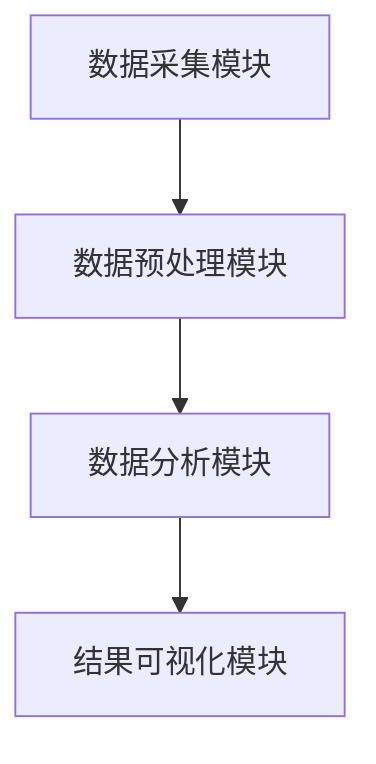
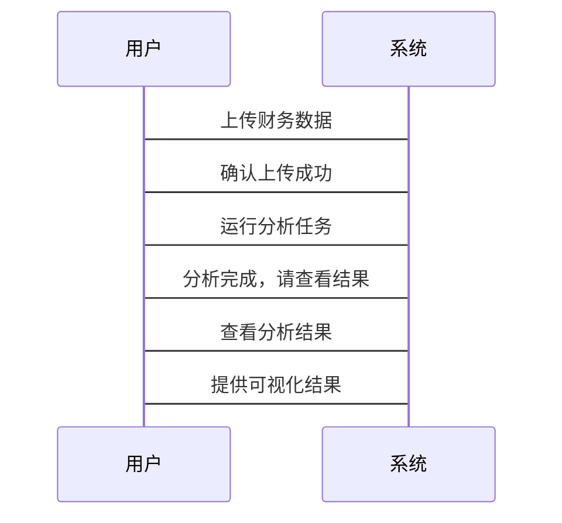

                 


# 《智能财务报表分析与解读》

## 关键词：智能财务报表分析、财务数据分析、人工智能、机器学习、自然语言处理、时间序列分析

## 摘要：智能财务报表分析是将人工智能技术应用于财务数据解读的新兴领域，通过机器学习、自然语言处理和时间序列分析等方法，实现对财务报表的智能化理解和分析，为企业决策提供更高效和准确的支持。本文将从背景、核心概念、算法原理、系统设计、项目实战等多方面深入探讨智能财务报表分析的实现方法和应用价值。

---

# 第一部分: 智能财务报表分析与解读的背景与概述

## 第1章: 财务报表分析的背景与意义

### 1.1 财务报表分析的重要性

#### 1.1.1 财务报表分析的定义与作用
财务报表分析是通过对企业的财务报表（如资产负债表、利润表、现金流量表等）进行解读，评估企业的财务状况、经营成果和现金流量情况。它是企业决策、投资评估和风险管理的重要工具。

#### 1.1.2 传统财务报表分析的局限性
传统财务报表分析主要依赖人工操作，效率低下且容易受到主观因素的影响。此外，传统方法难以处理海量数据和复杂场景，限制了分析的深度和广度。

#### 1.1.3 智能技术在财务报表分析中的应用前景
随着人工智能技术的发展，智能财务报表分析能够快速处理大量数据，发现潜在的财务风险和机会，为企业决策提供更精准的支持。

### 1.2 智能财务报表分析的背景

#### 1.2.1 大数据时代的财务分析需求
在大数据时代，企业产生的财务数据量急剧增加，传统的分析方法难以满足高效处理的需求。

#### 1.2.2 人工智能技术的发展与应用
人工智能技术（如机器学习、自然语言处理）的快速发展为财务报表分析提供了新的可能性。

#### 1.2.3 智能财务报表分析的核心价值
智能财务报表分析能够通过自动化处理、深度学习和智能预测，显著提高财务分析的效率和准确性。

### 1.3 智能财务报表分析的意义

#### 1.3.1 提高财务分析效率
通过自动化数据处理和智能算法，智能财务报表分析能够快速完成传统方法难以完成的任务。

#### 1.3.2 增强财务分析的准确性
智能算法能够基于大量数据进行建模和预测，减少人为误差，提高分析结果的准确性。

#### 1.3.3 为企业决策提供更有力支持
智能财务报表分析能够识别财务数据中的潜在趋势和风险，为企业的战略决策提供数据支持。

### 1.4 本章小结
本章从背景和意义两个方面介绍了智能财务报表分析的重要性。传统方法的局限性促使我们寻求更高效的技术手段，而人工智能技术的发展为智能财务分析提供了坚实的基础。

---

# 第二部分: 智能财务报表分析的核心概念与联系

## 第2章: 智能财务报表分析的核心概念

### 2.1 智能财务报表分析的定义与特点

#### 2.1.1 智能财务报表分析的定义
智能财务报表分析是利用人工智能技术对财务报表数据进行智能化处理和分析，以提取有价值的信息并支持决策的过程。

#### 2.1.2 智能财务报表分析的核心特点
- 数据驱动：基于大量财务数据进行分析。
- 自动化：从数据采集到结果输出的全流程自动化。
- 深度学习：通过机器学习模型挖掘数据中的复杂关系。
- 实时性：能够实时处理和分析财务数据，提供即时反馈。

### 2.2 智能财务报表分析的原理

#### 2.2.1 数据采集与预处理
智能财务分析的第一步是数据采集，包括从企业系统中提取财务数据，并进行清洗和标准化处理。

#### 2.2.2 数据特征提取
通过对财务数据进行特征提取，识别关键指标和潜在的财务风险因素。

#### 2.2.3 数据建模与分析
利用机器学习算法（如线性回归、随机森林）对提取的特征进行建模，生成预测结果或分类标签。

### 2.3 智能财务报表分析的核心要素

#### 2.3.1 数据源的选择与整合
选择合适的财务数据源（如财务报表、交易数据）并进行整合，确保数据的完整性和一致性。

#### 2.3.2 分析模型的构建与优化
根据业务需求选择合适的机器学习模型，并通过调参和优化提高模型的性能。

#### 2.3.3 结果解读与可视化
将分析结果以直观的方式呈现，如图表、仪表盘等，帮助用户快速理解分析结果。

### 2.4 本章小结
本章详细介绍了智能财务报表分析的核心概念和原理，强调了数据驱动和自动化分析的重要性，并为后续章节奠定了理论基础。

---

# 第三部分: 智能财务报表分析的算法原理

## 第3章: 常见的智能财务分析算法

### 3.1 机器学习在财务分析中的应用

#### 3.1.1 线性回归模型
线性回归是一种常用的回归算法，适用于预测连续型财务指标，如收入预测。

##### 线性回归的数学模型
$$ y = \beta_0 + \beta_1 x + \epsilon $$

##### 线性回归的实现步骤
1. 数据预处理：标准化特征。
2. 模型训练：最小二乘法求解系数。
3. 模型评估：计算均方误差（MSE）或R²值。

##### 示例代码
```python
import pandas as pd
from sklearn.linear_model import LinearRegression
from sklearn.metrics import mean_squared_error

# 加载数据
data = pd.read_csv('financial_data.csv')

# 特征和目标变量
X = data[['revenue', 'expenses']]
y = data['profit']

# 模型训练
model = LinearRegression()
model.fit(X, y)

# 预测
y_pred = model.predict(X)

# 评估
mse = mean_squared_error(y, y_pred)
print(f"均方误差: {mse}")
```

#### 3.1.2 支持向量机（SVM）
SVM适用于分类问题，如财务风险分类（正常 vs. 风险）。

##### SVM的数学模型
$$ \text{目标函数: } \min_{w,b,\xi} \frac{1}{2}||w||^2 + C\sum_{i=1}^n \xi_i $$
$$ \text{约束条件: } y_i(w \cdot x_i + b) \geq 1 - \xi_i, \xi_i \geq 0 $$

##### 示例代码
```python
from sklearn import svm

# 数据准备
X = data[['asset', 'liability']]
y = data['risk'].astype('int')

# 模型训练
model = svm.SVC()
model.fit(X, y)

# 预测
y_pred = model.predict(X)

# 评估
print(f"准确率: {model.score(X, y)}")
```

#### 3.1.3 随机森林与决策树
随机森林适用于分类和回归问题，具有较高的鲁棒性。

##### 示例代码
```python
from sklearn.ensemble import RandomForestClassifier

# 数据准备
X = data[['revenue', 'expenses', 'profit']]
y = data['status'].astype('int')

# 模型训练
model = RandomForestClassifier(n_estimators=100)
model.fit(X, y)

# 预测
y_pred = model.predict(X)

# 评估
print(f"准确率: {model.score(X, y)}")
```

### 3.2 自然语言处理（NLP）在财务报表分析中的应用

#### 3.2.1 词嵌入模型（如Word2Vec）
词嵌入模型可以将财务报告中的文本转化为向量表示，用于情感分析或主题分类。

##### 示例代码
```python
from gensim.models import Word2Vec

# 训练词嵌入模型
sentences = ["The company's revenue increased by 10%", "Net profit margin improved significantly"]
model = Word2Vec(sentences, vector_size=10, window=2, min_count=1, workers=2)

# 获取词向量
vector = model.wv['revenue']
print(f"词向量: {vector}")
```

#### 3.2.2 语言模型（如BERT）
BERT模型可以用于财务文本的理解和分析，如财务报告的实体识别。

##### 示例代码
```python
from transformers import BertTokenizer, BertModel

# 加载预训练模型
tokenizer = BertTokenizer.from_pretrained('bert-base-uncased')
model = BertModel.from_pretrained('bert-base-uncased')

# 编码文本
inputs = tokenizer("The company's revenue increased by 10%", return_tensors='pt')
outputs = model(**inputs)
print(f"编码结果: {outputs.last_hidden_state}")
```

#### 3.2.3 文本分类与情感分析
通过对财务报告文本进行分类，识别潜在的财务风险。

##### 示例代码
```python
from sklearn.feature_extraction.text import TfidfVectorizer
from sklearn.svm import SVC

# 数据准备
text_data = data['report_text']
labels = data['risk_level']

# 特征提取
vectorizer = TfidfVectorizer()
X = vectorizer.fit_transform(text_data)

# 模型训练
model = SVC()
model.fit(X, labels)

# 预测
X_test = vectorizer.transform(["The company's revenue is growing steadily"])
y_pred = model.predict(X_test)
print(f"预测结果: {y_pred}")
```

### 3.3 时间序列分析在财务预测中的应用

#### 3.3.1 ARIMA模型
ARIMA模型适用于时间序列预测，如股票价格预测。

##### 示例代码
```python
from statsmodels.tsa.arima_model import ARIMA

# 数据准备
data = [100, 105, 110, 115, 120]  # 示例数据

# 模型训练
model = ARIMA(data, order=(1, 1, 0))
model_fit = model.fit(disp=0)

# 预测
forecast = model_fit.forecast(steps=5)
print(f"预测结果: {forecast}")
```

#### 3.3.2 LSTM网络
LSTM适用于复杂的时间序列数据，如外汇汇率预测。

##### 示例代码
```python
import numpy as np
from tensorflow.keras.models import Sequential
from tensorflow.keras.layers import LSTM, Dense

# 数据准备
data = np.array([100, 105, 110, 115, 120], dtype=np.float32)
data = data.reshape((1, 5, 1))

# 模型训练
model = Sequential()
model.add(LSTM(50, input_shape=(5, 1)))
model.add(Dense(1))
model.compile(loss='mean_squared_error', optimizer='adam')
model.fit(data, data, epochs=5, verbose=0)

# 预测
new_data = np.array([120, 125, 130], dtype=np.float32)
new_data = new_data.reshape((1, 3, 1))
forecast = model.predict(new_data)
print(f"预测结果: {forecast}")
```

#### 3.3.3 Prophet模型
Prophet模型适用于非专业的时间序列预测，如销售预测。

##### 示例代码
```python
from fbprophet import Prophet

# 数据准备
data = {'ds': ['2020-01', '2020-02', '2020-03', '2020-04'], 'y': [100, 110, 120, 130]}
model = Prophet()
model.fit(data)

# 预测
future = model.make_future_forecast(5)
forecast = model.predict(future)
print(f"预测结果: {forecast}")
```

### 3.4 本章小结
本章介绍了几种常用的智能财务分析算法，包括机器学习、自然语言处理和时间序列分析。每种算法都有其适用场景和实现方法，企业可以根据具体需求选择合适的算法进行分析。

---

# 第四部分: 智能财务报表分析的系统分析与架构设计

## 第4章: 智能财务报表分析系统的架构设计

### 4.1 系统功能设计

#### 4.1.1 系统功能模块
- 数据采集模块：从财务系统中提取数据。
- 数据预处理模块：清洗和标准化数据。
- 数据分析模块：应用机器学习模型进行分析。
- 结果可视化模块：以图表形式展示分析结果。

#### 4.1.2 系统功能流程
1. 数据采集模块接收财务数据。
2. 数据预处理模块对数据进行清洗和标准化。
3. 数据分析模块应用机器学习模型进行预测或分类。
4. 结果可视化模块将结果以图表形式展示。

#### 4.1.3 功能模块的相互关系
数据流从数据采集模块开始，经过预处理模块，再到数据分析模块，最后在可视化模块中呈现。

### 4.2 系统架构设计

#### 4.2.1 系统架构图


#### 4.2.2 系统架构说明
系统采用模块化设计，各模块之间通过数据接口进行交互，确保系统的可扩展性和可维护性。

### 4.3 系统接口设计

#### 4.3.1 数据接口
- 数据输入接口：接收财务数据。
- 数据输出接口：将分析结果传递给可视化模块。

#### 4.3.2 API设计
- `/api/v1/data/upload`：上传财务数据。
- `/api/v1/analysis/run`：运行分析任务。
- `/api/v1/results/view`：查看分析结果。

### 4.4 系统交互流程

#### 4.4.1 用户与系统交互流程
1. 用户通过网页界面上传财务数据。
2. 系统接收数据并进行预处理。
3. 系统运行分析任务，生成结果。
4. 用户查看分析结果并进行反馈。

#### 4.4.2 系统交互图


### 4.5 本章小结
本章详细介绍了智能财务报表分析系统的架构设计，包括功能模块、系统架构、接口设计和交互流程。通过模块化设计，确保系统的灵活性和可扩展性。

---

# 第五部分: 智能财务报表分析的项目实战

## 第5章: 智能财务报表分析项目的实施

### 5.1 环境安装与配置

#### 5.1.1 安装Python环境
- 安装Python 3.8或更高版本。
- 安装Jupyter Notebook用于开发和测试。

#### 5.1.2 安装依赖库
- `pip install pandas scikit-learn gensim transformers fbprophet`

### 5.2 系统核心实现

#### 5.2.1 数据采集与预处理
```python
import pandas as pd

# 数据加载
data = pd.read_csv('financial_data.csv')

# 数据清洗
data.dropna(inplace=True)
data = data[~data['revenue'].isnull()]
```

#### 5.2.2 数据分析与建模
```python
from sklearn.ensemble import RandomForestClassifier

# 特征选择
X = data[['revenue', 'expenses', 'asset']]
y = data['profit_status'].astype('int')

# 模型训练
model = RandomForestClassifier(n_estimators=100)
model.fit(X, y)

# 预测
y_pred = model.predict(X)
print(f"准确率: {model.score(X, y)}")
```

#### 5.2.3 结果可视化
```python
import matplotlib.pyplot as plt

# 可视化预测结果
plt.scatter(y, y_pred)
plt.xlabel('真实值')
plt.ylabel('预测值')
plt.show()
```

### 5.3 案例分析与解读

#### 5.3.1 案例背景
某企业希望利用智能财务分析技术预测下一季度的收入。

#### 5.3.2 数据准备
数据包括过去四个季度的收入、支出和利润情况。

#### 5.3.3 模型训练与预测
```python
from sklearn.linear_model import LinearRegression

# 数据准备
train_data = data[['revenue', 'expenses']]
train_labels = data['profit']

# 模型训练
model = LinearRegression()
model.fit(train_data, train_labels)

# 预测
new_data = [[150000, 120000]]
prediction = model.predict(new_data)
print(f"预测利润: {prediction}")
```

#### 5.3.4 结果解读
通过模型预测，企业可以提前了解下一季度的利润情况，制定相应的经营策略。

### 5.4 本章小结
本章通过一个实际案例，展示了智能财务报表分析项目的实施过程，包括环境配置、数据处理、模型训练和结果解读。

---

# 第六部分: 智能财务报表分析的最佳实践与总结

## 第6章: 智能财务报表分析的最佳实践

### 6.1 最佳实践

#### 6.1.1 数据质量控制
确保数据的准确性和完整性，避免因数据问题导致分析结果偏差。

#### 6.1.2 模型选择与优化
根据具体业务需求选择合适的算法，并通过调参和优化提高模型性能。

#### 6.1.3 结果可视化与解释
将分析结果以直观的方式呈现，帮助用户更好地理解和应用分析结果。

### 6.2 小结

#### 6.2.1 项目总结
智能财务报表分析通过自动化处理和深度学习，显著提高了财务分析的效率和准确性。

#### 6.2.2 经验教训
- 数据预处理是关键，需投入足够的时间和精力。
- 模型选择需结合业务需求，避免盲目追求复杂算法。

### 6.3 注意事项

#### 6.3.1 数据隐私与安全
在处理财务数据时，需注意数据的隐私和安全，防止数据泄露。

#### 6.3.2 模型的可解释性
复杂的模型可能难以解释，需权衡模型的准确性和可解释性。

### 6.4 拓展阅读

#### 6.4.1 推荐书籍
- 《机器学习实战》
- 《Python机器学习》

#### 6.4.2 推荐博客与资源
- Analytics Vidhya
- Towards Data Science

### 6.5 本章小结
本章总结了智能财务报表分析项目的最佳实践，强调了数据质量、模型选择和结果可视化的重要性，并提供了相关的拓展资源。

---

# 作者：AI天才研究院/AI Genius Institute & 禅与计算机程序设计艺术 /Zen And The Art of Computer Programming

---

通过以上内容，我们系统地介绍了智能财务报表分析的背景、核心概念、算法原理、系统设计和项目实战。希望读者能够通过本文，深入了解智能财务报表分析的实现方法和应用价值，并能够在实际工作中加以应用。

