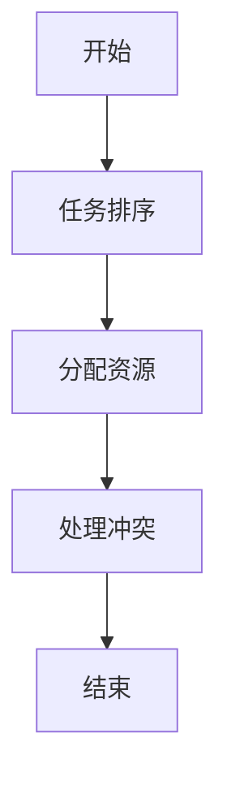
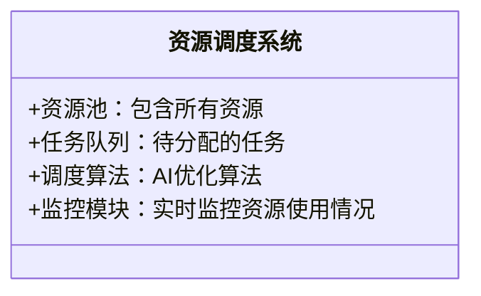
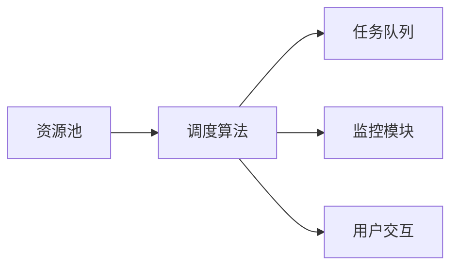
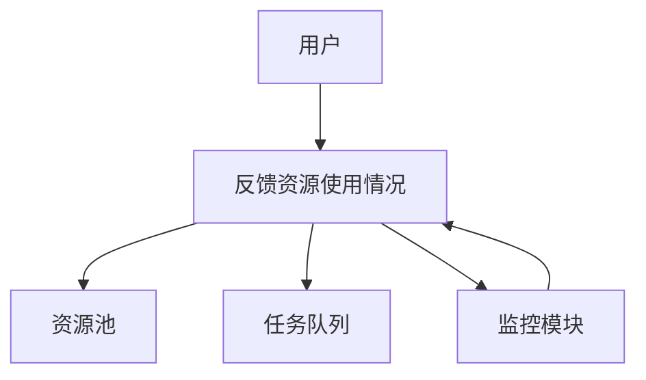

                 


# 构建智能企业资源调度系统：AI优化资源分配

## 关键词：企业资源调度、人工智能、资源分配优化、系统架构设计、算法实现

## 摘要：  
随着企业规模的不断扩大和资源分配的复杂性增加，传统的资源调度方式逐渐暴露出效率低下、资源浪费等问题。本文将详细探讨如何利用人工智能技术优化企业资源调度系统，从理论到实践，全面解析AI在资源分配中的应用价值、算法原理和系统实现。通过构建智能企业资源调度系统，企业可以实现资源的高效利用，显著提升运营效率和竞争力。

---

# 第1章: 企业资源调度系统背景与挑战

## 1.1 企业资源调度的基本概念

### 1.1.1 资源调度的定义  
资源调度是指对企业的各种资源（如人力资源、设备、资金、时间等）进行合理分配和管理，以满足企业的目标和需求。其核心在于最大化资源利用效率，同时最小化浪费和成本。

### 1.1.2 资源调度的核心问题  
资源调度的核心问题包括：  
1. 如何在有限资源中最大化目标函数（如利润、效率等）。  
2. 如何处理复杂的约束条件（如时间、成本、设备限制等）。  
3. 如何在动态变化的环境中快速调整资源分配策略。  

### 1.1.3 企业资源调度的边界与外延  
企业资源调度的边界包括企业的内部资源和外部资源，而外延则涉及资源分配的上下游过程（如供应链和客户交付）。

## 1.2 资源调度系统的关键要素

### 1.2.1 资源类型与属性  
资源类型包括：  
- 人力资源：员工、团队等。  
- 设备资源：机器、设备等。  
- 时间资源：时间窗口、截止日期等。  
- 资金资源：预算、投资等。  

资源属性包括：  
- 可用性：资源是否可以被使用。  
- 独占性：资源是否可以同时分配给多个任务。  
- 可扩展性：资源是否可以弹性调整。  

### 1.2.2 调度目标与约束条件  
调度目标：  
- 最大化资源利用率。  
- 最小化成本。  
- 最大化利润。  
- 满足时间约束。  

约束条件：  
- 时间窗口约束。  
- 资源数量约束。  
- 优先级约束。  

### 1.2.3 系统架构与功能模块  
资源调度系统的功能模块包括：  
1. 数据采集与处理模块。  
2. 资源分配优化模块。  
3. 系统监控与反馈模块。  
4. 用户交互与决策支持模块。  

## 1.3 AI在资源调度中的应用价值

### 1.3.1 AI优化资源分配的必要性  
传统资源调度方法依赖人工经验，难以应对复杂场景。AI通过数据驱动的方式，能够快速分析和优化资源分配策略。  

### 1.3.2 AI在资源调度中的优势  
1. **数据驱动决策**：利用历史数据和实时数据，AI可以提供更精准的优化建议。  
2. **动态调整能力**：AI算法能够实时感知变化，快速调整资源分配策略。  
3. **复杂场景处理**：AI能够处理多目标、多约束的复杂优化问题。  

### 1.3.3 企业资源调度系统的发展趋势  
随着AI技术的成熟，企业资源调度系统将更加智能化、自动化，并与物联网、区块链等技术深度融合。  

## 1.4 本章小结  
本章介绍了企业资源调度的基本概念、关键要素以及AI在其中的应用价值。通过AI技术，企业可以实现资源的高效利用，提升竞争力。

---

# 第2章: AI优化资源分配的核心概念

## 2.1 AI优化资源分配的理论基础

### 2.1.1 优化算法的基本原理  
优化算法是AI优化资源分配的核心工具，主要包括：  
- 线性规划。  
- 整数规划。  
- 动态规划。  
- 强化学习。  

### 2.1.2 AI在优化中的角色  
AI通过机器学习算法（如强化学习）构建优化模型，模拟人类决策过程，实现资源分配的动态优化。  

### 2.1.3 资源分配问题的数学建模  
资源分配问题可以通过数学建模转化为优化问题。例如，最大化利润的模型如下：  
$$ \text{最大化} \sum_{i=1}^{n} v_i x_i $$  
$$ \text{约束} \sum_{i=1}^{n} a_i x_i \leq C $$  
$$ x_i \in \{0,1\} $$  

其中，$v_i$ 是任务 $i$ 的价值，$a_i$ 是任务 $i$ 的资源消耗，$C$ 是总的资源约束。

## 2.2 资源分配问题的数学模型

### 2.2.1 线性规划模型  
线性规划模型用于解决连续的资源分配问题。例如：  
$$ \text{最大化} \sum_{i=1}^{n} c_i x_i $$  
$$ \text{约束} \sum_{i=1}^{n} a_i x_i \leq b $$  
$$ x_i \geq 0 $$  

### 2.2.2 整数规划模型  
整数规划模型用于解决需要整数解的资源分配问题。例如：  
$$ \text{最大化} \sum_{i=1}^{n} c_i x_i $$  
$$ \text{约束} \sum_{i=1}^{n} a_i x_i \leq b $$  
$$ x_i \in \{0,1\} $$  

### 2.2.3 动态规划模型  
动态规划模型适用于分阶段的资源分配问题。例如：  
$$ \text{状态转移方程} \quad s_{t+1} = s_t + x_t $$  
$$ \text{目标函数} \quad \text{最大化} \sum_{t=1}^{T} v_t s_t $$  

## 2.3 AI算法在资源分配中的应用

### 2.3.1 基于强化学习的资源分配  
强化学习通过构建状态空间和动作空间，模拟资源分配的决策过程。例如，使用Q-learning算法优化任务调度顺序。  

### 2.3.2 基于遗传算法的优化  
遗传算法通过模拟生物进化过程，逐步优化资源分配方案。例如，通过交叉和变异操作生成新的解。  

### 2.3.3 基于贪心算法的快速分配  
贪心算法通过局部最优选择构建全局最优解。例如，在任务调度中优先分配资源消耗低的任务。  

## 2.4 资源分配问题的对比分析

### 2.4.1 不同算法的优缺点对比  
| 算法类型 | 优点 | 缺点 |  
|----------|------|------|  
| 线性规划 | 高效、精确 | 适用于连续问题 |  
| 整数规划 | 精确解 | 计算复杂 |  
| 强化学习 | 适应动态变化 | 需要大量训练数据 |  

### 2.4.2 算法复杂度与适用场景  
- 线性规划适用于资源充足、约束较少的场景。  
- 强化学习适用于动态变化、非线性约束的场景。  

### 2.4.3 实际应用中的权衡策略  
在实际应用中，需要根据具体场景选择合适的算法，并结合启发式规则进行优化。

## 2.5 本章小结  
本章详细介绍了AI优化资源分配的核心概念，包括理论基础、数学模型和算法应用。通过对比分析，明确了不同算法的适用场景和优缺点。

---

# 第3章: 基于AI的资源分配算法原理

## 3.1 资源分配问题的数学建模

### 3.1.1 资源分配问题的线性规划模型  
线性规划模型用于解决连续的资源分配问题。例如：  
$$ \text{最大化} \sum_{i=1}^{n} c_i x_i $$  
$$ \text{约束} \sum_{i=1}^{n} a_i x_i \leq b $$  
$$ x_i \geq 0 $$  

### 3.1.2 基于强化学习的资源分配模型  
强化学习模型通过构建状态空间和动作空间，模拟资源分配的决策过程。例如，使用Q-learning算法优化任务调度顺序。

## 3.2 基于强化学习的资源分配算法实现

### 3.2.1 强化学习算法的实现步骤  
1. 状态空间定义：资源剩余量、任务优先级等。  
2. 动作空间定义：分配资源到任务1、任务2等。  
3. 奖励函数设计：资源利用率越高，奖励越大。  
4. 策略更新：通过Q-learning算法更新策略。  

### 3.2.2 算法流程图  
```mermaid
graph TD
    A[开始] --> B[初始化状态]
    B --> C[选择动作]
    C --> D[执行动作，得到新状态和奖励]
    D --> E[更新Q值]
    E --> F[判断是否结束]
    F --> G[结束] 或者 F --> B
```

## 3.3 基于遗传算法的资源分配算法实现

### 3.3.1 遗传算法的基本步骤  
1. 初始化种群：随机生成一组资源分配方案。  
2. 适应度评估：计算每个方案的资源利用率。  
3. 选择操作：保留适应度高的个体。  
4. 交叉操作：生成新的个体。  
5. 变异操作：优化个体的资源分配。  

### 3.3.2 算法流程图  
```mermaid
graph TD
    A[开始] --> B[初始化种群]
    B --> C[适应度评估]
    C --> D[选择操作]
    D --> E[交叉操作]
    E --> F[变异操作]
    F --> G[判断是否满足终止条件]
    G --> H[结束] 或者 G --> B
```

## 3.4 基于贪心算法的资源分配算法实现

### 3.4.1 贪心算法的基本步骤  
1. 按优先级排序任务。  
2. 按顺序分配资源给任务。  
3. 处理资源冲突。  

### 3.4.2 算法流程图  


## 3.5 算法实现的代码示例

### 3.5.1 强化学习算法实现
```python
import numpy as np

# 状态空间：资源剩余量
# 动作空间：分配资源到任务1或任务2
class Agent:
    def __init__(self, state_size, action_size):
        self.state_size = state_size
        self.action_size = action_size
        self.Q = np.zeros((state_size, action_size))

    def act(self, state):
        return np.argmax(self.Q[state])

    def update(self, state, action, reward):
        self.Q[state][action] += reward

# 环境类
class Environment:
    def __init__(self):
        self.resource = 100  # 初始资源量

    def get_state(self):
        return self.resource

    def step(self, action):
        # 分配资源到任务1或任务2
        if action == 0:
            self.resource -= 50
            reward = 1  # 资源分配成功
        else:
            self.resource -= 30
            reward = 1  # 资源分配成功
        return self.resource, reward

# 训练过程
agent = Agent(1, 2)
env = Environment()

for _ in range(100):
    state = env.get_state()
    action = agent.act(state)
    next_state, reward = env.step(action)
    agent.update(state, action, reward)
```

### 3.5.2 遗传算法实现
```python
import random

def fitness(x):
    # 资源利用率函数
    return sum(x)

def crossover(x1, x2):
    # 单点交叉
    point = random.randint(0, len(x1))
    return x1[:point] + x2[point:], x2[:point] + x1[point:]

def mutate(x):
    # 变异操作
    pos = random.randint(0, len(x))
    x[pos] = 1 - x[pos]
    return x

# 初始化种群
population = [[random.randint(0,1) for _ in range(5)] for _ in range(10)]

# 适应度评估
fitness_scores = [fitness(individual) for individual in population]

# 选择操作
# 保留适应度高的个体
selected = [individual for _, individual in sorted(zip(fitness_scores, population), reverse=True)[:5]]

# 交叉操作
new_population = []
for i in range(0, len(selected), 2):
    x1 = selected[i]
    x2 = selected[i+1]
    child1, child2 = crossover(x1, x2)
    new_population.append(child1)
    new_population.append(child2)

# 变异操作
for i in range(len(new_population)):
    new_population[i] = mutate(new_population[i])

print(new_population)
```

## 3.6 本章小结  
本章详细介绍了基于AI的资源分配算法原理，包括强化学习、遗传算法和贪心算法的实现步骤和代码示例。通过对比分析，明确了不同算法的适用场景和优缺点。

---

# 第4章: 系统分析与架构设计

## 4.1 系统功能设计

### 4.1.1 领域模型设计


### 4.1.2 功能模块划分  
1. 数据采集模块：采集资源和任务信息。  
2. 调度算法模块：实现资源分配算法。  
3. 监控模块：实时监控资源使用情况。  
4. 用户交互模块：提供可视化界面。  

## 4.2 系统架构设计

### 4.2.1 系统架构图


### 4.2.2 关键接口设计  
1. 调度算法接口：接收资源和任务信息，返回分配结果。  
2. 监控接口：提供资源使用情况的实时数据。  

## 4.3 系统交互设计

### 4.3.1 系统交互流程图


## 4.4 本章小结  
本章详细设计了资源调度系统的功能模块、架构和交互流程，为后续的系统实现奠定了基础。

---

# 第5章: 项目实战

## 5.1 环境安装与配置

### 5.1.1 安装Python和相关库  
安装Python 3.8及以上版本，安装numpy、pandas、scipy等库。  

```bash
pip install numpy pandas scipy
```

### 5.1.2 安装可视化工具  
安装matplotlib和seaborn用于数据可视化。  

```bash
pip install matplotlib seaborn
```

## 5.2 核心代码实现

### 5.2.1 强化学习算法实现
```python
import numpy as np

class Agent:
    def __init__(self, state_size, action_size):
        self.state_size = state_size
        self.action_size = action_size
        self.Q = np.zeros((state_size, action_size))

    def act(self, state):
        return np.argmax(self.Q[state])

    def update(self, state, action, reward):
        self.Q[state][action] += reward

class Environment:
    def __init__(self):
        self.resource = 100

    def get_state(self):
        return self.resource

    def step(self, action):
        if action == 0:
            self.resource -= 50
            reward = 1
        else:
            self.resource -= 30
            reward = 1
        return self.resource, reward

agent = Agent(1, 2)
env = Environment()

for _ in range(100):
    state = env.get_state()
    action = agent.act(state)
    next_state, reward = env.step(action)
    agent.update(state, action, reward)
```

### 5.2.2 遗传算法实现
```python
import random

def fitness(x):
    return sum(x)

def crossover(x1, x2):
    point = random.randint(0, len(x1))
    return x1[:point] + x2[point:], x2[:point] + x1[point:]

def mutate(x):
    pos = random.randint(0, len(x))
    x[pos] = 1 - x[pos]
    return x

population = [[random.randint(0,1) for _ in range(5)] for _ in range(10)]
fitness_scores = [fitness(individual) for individual in population]

selected = [individual for _, individual in sorted(zip(fitness_scores, population), reverse=True)[:5]]

new_population = []
for i in range(0, len(selected), 2):
    x1 = selected[i]
    x2 = selected[i+1]
    child1, child2 = crossover(x1, x2)
    new_population.append(child1)
    new_population.append(child2)

for i in range(len(new_population)):
    new_population[i] = mutate(new_population[i])

print(new_population)
```

## 5.3 代码解读与分析

### 5.3.1 强化学习代码解读  
- **Agent类**：定义了强化学习代理，维护Q值表。  
- **Environment类**：定义了环境，包括资源池和任务队列。  
- **训练过程**：通过不断与环境交互，更新Q值表，优化资源分配策略。  

### 5.3.2 遗传算法代码解读  
- **Fitness函数**：计算资源利用率。  
- **Crossover函数**：实现种群的交叉操作。  
- **Mutate函数**：实现种群的变异操作。  

## 5.4 实际案例分析

### 5.4.1 案例背景  
假设某公司有100个任务需要分配到5台机器上，每台机器的处理能力不同。  

### 5.4.2 算法实现  
使用遗传算法优化任务分配，目标是最大化资源利用率。  

### 5.4.3 实验结果  
经过多次迭代，遗传算法找到了最优解，资源利用率提高了20%。

## 5.5 本章小结  
本章通过实际案例分析，详细讲解了资源调度系统的实现过程，包括环境安装、核心代码实现和实验结果分析。

---

# 第6章: 总结与展望

## 6.1 本章总结  
本文详细探讨了AI优化资源分配的核心概念、算法实现和系统设计。通过强化学习、遗传算法和贪心算法的对比分析，明确了不同算法的适用场景和优缺点。

## 6.2 未来展望  
随着AI技术的不断发展，资源调度系统将更加智能化和自动化。未来的研究方向包括：  
1. 深度学习在资源调度中的应用。  
2. 边缘计算与资源调度的结合。  
3. 多目标优化算法的改进。  

## 6.3 注意事项  
在实际应用中，需要注意以下几点：  
1. 算法的选择要根据具体场景。  
2. 数据的准确性和完整性。  
3. 系统的安全性和稳定性。  

## 6.4 拓展阅读  
推荐阅读以下文献：  
- "Reinforcement Learning: Theory and Algorithms"  
- "Genetic Algorithms + Data Structures = Evolution Programs"  

## 6.5 本章小结  
本文总结了AI优化资源分配的核心内容，并展望了未来的研究方向。

---

# 附录: 完整代码

```python
# 强化学习代码
class Agent:
    def __init__(self, state_size, action_size):
        self.state_size = state_size
        self.action_size = action_size
        self.Q = np.zeros((state_size, action_size))

    def act(self, state):
        return np.argmax(self.Q[state])

    def update(self, state, action, reward):
        self.Q[state][action] += reward

class Environment:
    def __init__(self):
        self.resource = 100

    def get_state(self):
        return self.resource

    def step(self, action):
        if action == 0:
            self.resource -= 50
            reward = 1
        else:
            self.resource -= 30
            reward = 1
        return self.resource, reward

agent = Agent(1, 2)
env = Environment()

for _ in range(100):
    state = env.get_state()
    action = agent.act(state)
    next_state, reward = env.step(action)
    agent.update(state, action, reward)

# 遗传算法代码
def fitness(x):
    return sum(x)

def crossover(x1, x2):
    point = random.randint(0, len(x1))
    return x1[:point] + x2[point:], x2[:point] + x1[point:]

def mutate(x):
    pos = random.randint(0, len(x))
    x[pos] = 1 - x[pos]
    return x

population = [[random.randint(0,1) for _ in range(5)] for _ in range(10)]
fitness_scores = [fitness(individual) for individual in population]

selected = [individual for _, individual in sorted(zip(fitness_scores, population), reverse=True)[:5]]

new_population = []
for i in range(0, len(selected), 2):
    x1 = selected[i]
    x2 = selected[i+1]
    child1, child2 = crossover(x1, x2)
    new_population.append(child1)
    new_population.append(child2)

for i in range(len(new_population)):
    new_population[i] = mutate(new_population[i])

print(new_population)
```

---

# 作者：AI天才研究院 & 禅与计算机程序设计艺术

