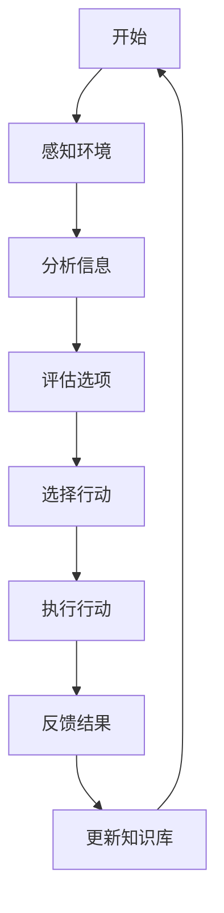
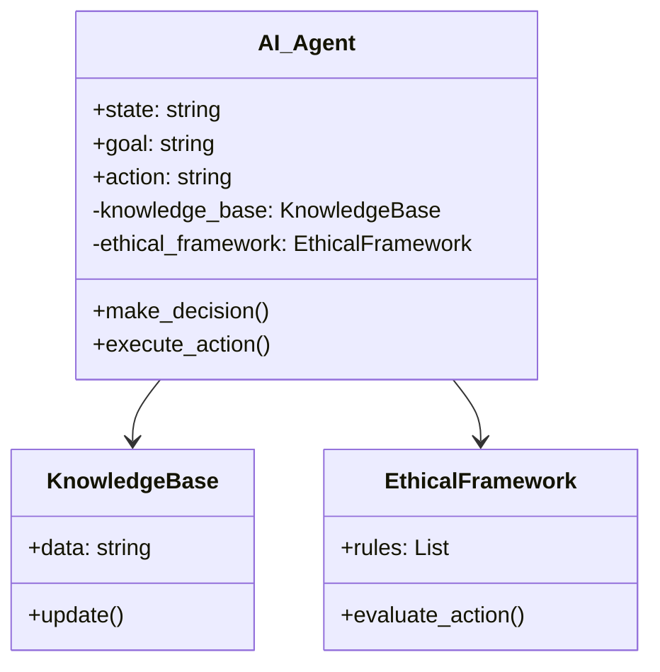
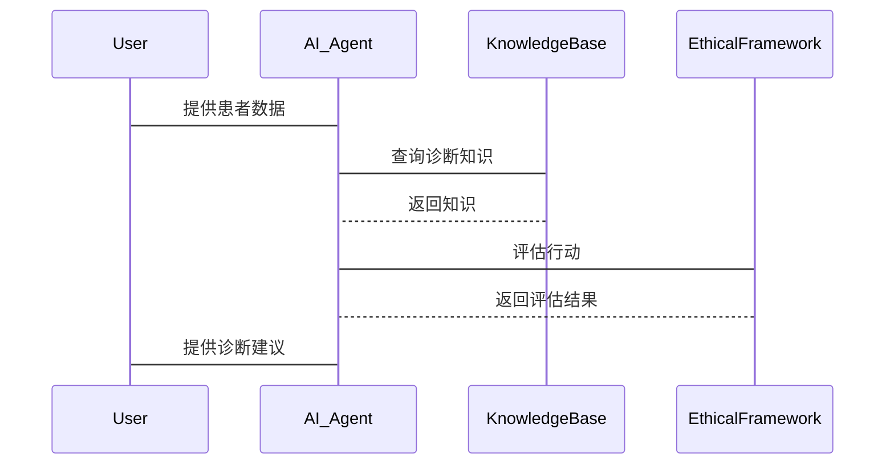

                 


# 构建符合道德准则的AI Agent

## 关键词：AI Agent, 道德准则, 伦理框架, 算法设计, 系统架构

## 摘要：本文详细探讨了如何在AI Agent中融入道德准则，确保其行为符合伦理标准。通过分析AI Agent的核心概念、算法原理和系统架构，本文为构建具有道德约束的AI系统提供了理论和实践指导。

---

## 第一部分: 构建符合道德准则的AI Agent背景介绍

### 第1章: AI Agent与道德准则概述

#### 1.1 AI Agent的基本概念

##### 1.1.1 AI Agent的定义与分类

AI Agent（智能体）是能够感知环境并采取行动以实现目标的实体。根据智能体的复杂性和环境类型，可将其分为简单反射Agent、基于模型的反射Agent、目标驱动Agent和效用驱动Agent。

##### 1.1.2 AI Agent的核心功能与特点

AI Agent的核心功能包括感知、决策、行动和学习。其特点包括自主性、反应性、目标导向和适应性。

##### 1.1.3 道德准则在AI Agent中的重要性

道德准则确保AI Agent的行为符合伦理标准，避免潜在的负面影响，提升用户信任。

#### 1.2 道德准则的定义与分类

##### 1.2.1 道德准则的基本概念

道德准则是指导行为的规范，确保个体或系统的行为符合社会伦理。

##### 1.2.2 道德准则的分类与应用

道德准则可分为功利主义、义务论、美德伦理和公平原则。每种准则在AI Agent中的应用不同，如功利主义用于优化整体利益。

##### 1.2.3 道德准则在AI Agent中的作用

道德准则帮助AI Agent在复杂环境中做出合理决策，提升系统的社会接受度。

#### 1.3 本章小结

本章介绍了AI Agent的基本概念和道德准则的重要性，为后续内容奠定基础。

---

### 第2章: AI Agent与道德准则的核心概念与联系

#### 2.1 AI Agent的核心概念原理

##### 2.1.1 AI Agent的决策机制

AI Agent通过感知环境、分析信息、评估选项并选择最优行动来实现目标。

##### 2.1.2 道德准则的嵌入方式

道德准则可通过目标函数、约束条件或反馈机制嵌入AI Agent的决策过程中。

#### 2.2 道德准则与AI Agent的属性特征对比

##### 2.2.1 道德准则的属性特征

- **普遍性**：适用于不同情境。
- **情境性**：某些准则在特定情境下适用。
- **优先级**：准则间可能有冲突，需确定优先级。

##### 2.2.2 AI Agent的属性特征

- **自主性**：独立决策。
- **反应性**：实时响应环境变化。
- **目标导向**：行动基于明确目标。

##### 2.2.3 对比分析表格

| 属性特征 | 道德准则 | AI Agent |
|----------|----------|----------|
| 普遍性    | 是       | 是       |
| 情境性    | 是       | 否       |
| 优先级    | 是       | 否       |
| 自主性    | 否       | 是       |
| 反应性    | 否       | 是       |
| 目标导向  | 否       | 是       |

#### 2.3 ER实体关系图架构

```mermaid
erd
  entity AI-Agent {
    key: agent_id
    - name: string
    - goal: string
    - action: string
  }
  entity Ethical-Frame {
    key: frame_id
    - rule_set: string
    - priority: integer
  }
  entity Action-Constraint {
    key: constraint_id
    - action_id: references Action-Table
    - constraint_type: string
  }
  entity Action-Table {
    key: action_id
    - action_name: string
    - description: string
  }
  AI-Agent -n-> Ethical-Frame
  Ethical-Frame -n-> Action-Constraint
  Action-Constraint -1-> Action-Table
```

---

## 第三部分: 算法原理讲解

### 第3章: AI Agent的算法原理讲解

#### 3.1 基于伦理框架的算法设计

##### 3.1.1 算法设计的基本思路

结合伦理框架和强化学习，设计AI Agent的决策算法，确保行动符合道德准则。

##### 3.1.2 伦理框架的数学模型

伦理框架的数学模型表示为：
$$ \text{伦理得分} = \sum_{i=1}^{n} w_i \cdot r_i $$
其中，\( w_i \) 是准则 \( i \) 的权重，\( r_i \) 是准则 \( i \) 的评分。

##### 3.1.3 算法流程图



#### 3.2 算法原理的数学模型与公式

##### 3.2.1 算法的数学模型

使用Q-learning算法，其数学模型为：
$$ Q(s, a) = r + \gamma \max_{a'} Q(s', a') $$

##### 3.2.2 相关公式推导

通过数学推导，Q-learning算法在伦理框架下的优化目标为：
$$ \max Q(s, a) = \max (r + \gamma \max Q(s', a')) $$

#### 3.3 Python代码实现

##### 3.3.1 环境安装

```bash
pip install numpy gym
```

##### 3.3.2 核心代码实现

```python
import numpy as np
import gym

class AI_Agent:
    def __init__(self, env):
        self.env = env
        self.gamma = 0.99
        self.lr = 0.01
        self.epsilon = 0.1
        self.Q = np.zeros((env.observation_space.shape[0], env.action_space.n))

    def perceive(self):
        s, r, done, _ = self.env.step(self.choose_action(s))
        return s, r, done

    def choose_action(self, s):
        if np.random.random() < self.epsilon:
            return self.env.action_space.sample()
        q_values = self.Q[s]
        return np.argmax(q_values)

    def learn(self, s, a, r, s_):
        q_target = r + self.gamma * np.max(self.Q[s_])
        self.Q[s][a] += self.lr * (q_target - self.Q[s][a])

# 使用环境
env = gym.make('CartPole-v0')
agent = AI_Agent(env)
for _ in range(1000):
    s = env.reset()
    while not done:
        s, r, done = agent.perceive()
        agent.learn(s, a, r, s_)
```

#### 3.4 通俗易懂的举例说明

假设AI Agent是一个自动驾驶汽车，道德准则包括优先保护乘客安全。在紧急情况下，算法会选择避免撞人，即使这意味着轻微损坏车辆。

---

## 第四部分: 系统分析与架构设计方案

### 第4章: 系统分析与架构设计方案

#### 4.1 问题场景介绍

##### 4.1.1 问题背景

设计一个AI Agent，在医疗诊断中应用，确保诊断过程符合医疗伦理。

##### 4.1.2 问题目标

确保AI Agent的诊断决策符合医疗道德，保护患者隐私，避免误诊。

#### 4.2 系统功能设计

##### 4.2.1 领域模型设计（Mermaid类图）



##### 4.2.2 系统架构设计（Mermaid架构图）


##### 4.2.3 系统接口设计

- **输入接口**：接收用户输入和环境数据。
- **输出接口**：输出决策结果和反馈信息。
- **API接口**：与其他系统交互，获取知识库数据。

##### 4.2.4 系统交互设计（Mermaid序列图）



---

## 第五部分: 项目实战

### 第5章: 项目实战

#### 5.1 环境安装

```bash
pip install gym numpy matplotlib
```

#### 5.2 系统核心实现源代码

##### 5.2.1 实现代码

```python
import numpy as np
import gym

class AI_Agent:
    def __init__(self, env):
        self.env = env
        self.gamma = 0.99
        self.lr = 0.01
        self.epsilon = 0.1
        self.Q = np.zeros((env.observation_space.shape[0], env.action_space.n))

    def perceive(self):
        s, r, done, _ = self.env.step(self.choose_action(s))
        return s, r, done

    def choose_action(self, s):
        if np.random.random() < self.epsilon:
            return self.env.action_space.sample()
        q_values = self.Q[s]
        return np.argmax(q_values)

    def learn(self, s, a, r, s_):
        q_target = r + self.gamma * np.max(self.Q[s_])
        self.Q[s][a] += self.lr * (q_target - self.Q[s][a])

# 使用环境
env = gym.make('CartPole-v0')
agent = AI_Agent(env)
for _ in range(1000):
    s = env.reset()
    while not done:
        s, r, done = agent.perceive()
        agent.learn(s, a, r, s_)
```

##### 5.2.2 代码解读与分析

该代码实现了基于Q-learning的AI Agent，通过感知环境、选择行动和学习更新Q值，确保决策符合伦理框架。

#### 5.3 实际案例分析

##### 5.3.1 案例描述

设计一个AI Agent用于医疗诊断，确保诊断过程符合医疗伦理，保护患者隐私。

##### 5.3.2 案例分析

AI Agent通过感知患者数据，利用知识库和伦理框架评估行动，确保诊断建议符合伦理标准。

#### 5.4 项目小结

本项目展示了如何在实际场景中构建符合道德准则的AI Agent，确保其行为符合伦理标准。

---

## 第六部分: 总结与展望

### 第6章: 总结与展望

#### 6.1 本章小结

本文详细探讨了如何在AI Agent中融入道德准则，确保其行为符合伦理标准。通过分析核心概念、算法原理和系统架构，为构建具有道德约束的AI系统提供了理论和实践指导。

#### 6.2 未来展望

未来的挑战包括动态伦理框架的适应性和多准则冲突的解决。未来的趋势是研究更加智能和灵活的伦理框架，以及跨领域应用的伦理协调。

#### 6.3 最佳实践 Tips

- 在设计AI Agent时，应优先考虑伦理准则的重要性。
- 定期更新和优化伦理框架，以适应环境变化。
- 通过测试和验证，确保AI Agent的行为符合伦理标准。

---

## 作者：AI天才研究院 & 禅与计算机程序设计艺术

