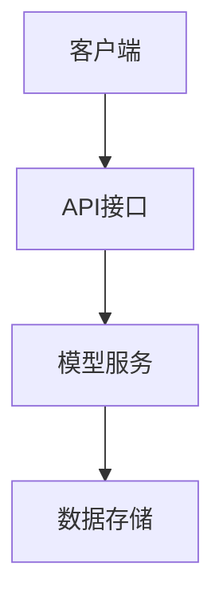

                 


# 《金融产品客户终身价值预测模型》

> 关键词：客户终身价值预测，金融产品，机器学习，客户价值分析，预测模型，风险管理

> 摘要：本文详细探讨了金融产品客户终身价值预测模型的构建方法，结合实际案例分析，系统性地讲解了模型的设计思路、核心算法、数学公式及系统架构。文章从背景介绍、核心概念、算法原理、数学模型、系统架构、项目实战等多维度展开，旨在帮助读者全面理解如何利用数据驱动的方法预测客户终身价值，优化金融产品的销售策略和风险管理。

---

# 第1章: 金融产品客户终身价值预测模型的背景与问题描述

## 1.1 问题背景

### 1.1.1 金融产品销售中的客户价值问题

在金融行业，客户价值的评估至关重要。金融产品（如保险、基金、理财产品等）的销售依赖于对客户价值的准确预测。然而，传统的方法往往依赖于经验判断，难以量化和预测客户在未来一段时间内的购买行为和贡献价值。

### 1.1.2 终身价值预测的重要性

客户终身价值（Customer Lifetime Value, CLV）是指客户在未来生命周期内为公司带来的净收益。在金融行业，CLV可以帮助企业优化客户获取策略，合理分配资源，降低客户流失率，并提升客户满意度。

### 1.1.3 当前行业中的痛点与挑战

- 数据碎片化：客户行为数据分散在多个系统中，难以整合。
- 模型复杂性：金融产品的风险和收益密切相关，模型需要考虑多种因素。
- 数据隐私：金融数据涉及客户隐私，数据处理需要符合相关法律法规。

### 1.1.4 解决方法

通过机器学习和大数据技术，构建客户终身价值预测模型，量化客户在未来一段时间内的贡献价值，优化销售策略和风险管理。

---

## 1.2 问题描述

### 1.2.1 客户终身价值的定义

客户终身价值（CLV）是指客户在未来生命周期内为企业带来的净收益。在金融行业，CLV可以帮助企业预测客户在未来可能购买的产品和服务，从而优化资源分配和营销策略。

### 1.2.2 金融产品客户价值预测的核心问题

- 如何量化客户在未来一段时间内的购买行为和贡献价值。
- 如何构建预测模型，考虑客户特征、产品特征和时间因素。
- 如何利用模型优化销售策略和风险管理。

### 1.2.3 预测模型的目标与意义

- **目标**：通过数据分析和建模，准确预测客户终身价值，优化金融产品的销售策略。
- **意义**：提升客户满意度，降低客户流失率，提高企业收益。

---

## 1.3 问题解决思路

### 1.3.1 数据驱动的解决方案

通过收集和分析客户数据，利用机器学习算法构建预测模型，量化客户终身价值。

### 1.3.2 预测模型的构建方法

- 数据采集与清洗
- 特征提取与选择
- 模型训练与优化
- 模型部署与应用

### 1.3.3 模型的应用场景与价值

- 客户细分与精准营销
- 风险评估与管理
- 资源分配优化

---

## 1.4 问题的边界与外延

### 1.4.1 客户价值预测的适用范围

- 适用于金融产品的销售预测
- 适用于客户生命周期管理
- 适用于客户流失预测

### 1.4.2 模型的局限性与限制条件

- 数据质量：模型的准确性依赖于数据的完整性和准确性。
- 时间因素：模型需要考虑时间因素，但时间序列预测存在不确定性。
- 模型复杂性：复杂的模型可能难以解释和部署。

### 1.4.3 相关概念的对比与区分

- 客户价值预测 vs. 客户满意度预测
- 客户生命周期价值 vs. 客户当前价值

---

## 1.5 概念结构与核心要素

### 1.5.1 模型的核心要素分析

- 客户特征：年龄、性别、收入、职业等。
- 产品特征：产品类型、收益率、风险等级等。
- 时间因素：购买时间、产品持有时间等。

### 1.5.2 业务流程与数据流的关系

- 数据流：客户信息 -> 数据清洗 -> 特征提取 -> 模型训练 -> 预测结果。
- 业务流程：数据采集 -> 数据分析 -> 模型构建 -> 应用部署。

### 1.5.3 模型的输入输出关系

- 输入：客户特征、产品特征、历史行为数据。
- 输出：客户终身价值预测结果。

---

## 1.6 本章小结

本章介绍了金融产品客户终身价值预测模型的背景与问题描述，明确了模型的目标与意义，并从数据驱动的角度提出了解决方案。通过分析模型的核心要素和概念结构，为后续的算法设计和模型构建奠定了基础。

---

# 第2章: 金融产品客户终身价值预测模型的核心概念与联系

## 2.1 核心概念原理

### 2.1.1 客户终身价值的计算方法

客户终身价值（CLV）的计算公式如下：

$$CLV = \frac{R - C}{d}$$

其中：
- $R$ 是客户在生命周期内为公司带来的总收入。
- $C$ 是客户生命周期内的成本。
- $d$ 是贴现率。

### 2.1.2 金融产品的生命周期模型

金融产品的生命周期可以分为以下几个阶段：
1. **引入期**：新产品进入市场，客户数量较少。
2. **成长期**：客户数量快速增长，市场份额扩大。
3. **成熟期**：客户数量稳定，市场竞争激烈。
4. **衰退期**：客户数量减少，市场份额下降。

### 2.1.3 预测模型的基本原理

预测模型通过分析客户特征、产品特征和历史行为数据，利用机器学习算法预测客户在未来一段时间内的购买行为和贡献价值。

---

## 2.2 核心概念属性特征对比

下表对比了不同客户群体和金融产品的特征：

| 特征类别 | 客户特征 | 产品特征 |
|----------|----------|----------|
| 基本特征 | 年龄、性别、收入 | 产品类型、收益率 |
| 行为特征 | 购买频率、购买金额 | 购买时间、持有时间 |
| 风险特征 | 风险偏好、信用评分 | 风险等级、流动性 |

---

## 2.3 ER实体关系图

```mermaid
erd
    entity 客户 {
        id: int
        姓名: string
        年龄: int
        性别: string
        收入: float
    }

    entity 产品 {
        id: int
        名称: string
        类型: string
        收益率: float
    }

    entity 购买记录 {
        id: int
        客户id: int
        产品id: int
        购买时间: date
        金额: float
    }
```

---

## 2.4 本章小结

本章详细讲解了金融产品客户终身价值预测模型的核心概念与联系，包括客户终身价值的计算方法、金融产品的生命周期模型以及客户和产品特征的对比分析。通过ER实体关系图，明确了数据模型的设计思路，为后续的算法设计提供了数据基础。

---

# 第3章: 金融产品客户终身价值预测模型的算法原理

## 3.1 数据预处理

### 3.1.1 数据清洗与特征选择

数据清洗步骤：
1. 去除重复数据。
2. 处理缺失值。
3. 删除异常值。

特征选择步骤：
1. 删除无关特征。
2. 进行特征降维（如PCA）。

### 3.1.2 数据标准化与归一化

标准化公式：
$$z = \frac{x - \mu}{\sigma}$$

归一化公式：
$$x' = \frac{x - \min(x)}{\max(x) - \min(x)}$$

### 3.1.3 数据分组与聚合

按客户分组，计算每个客户的总购买金额和平均购买金额。

---

## 3.2 特征工程

### 3.2.1 客户特征的提取与选择

提取客户的基本特征（如年龄、性别、收入）和行为特征（如购买频率、购买金额）。

### 3.2.2 产品特征的提取与选择

提取产品的基本特征（如产品类型、收益率）和风险特征（如风险等级、流动性）。

### 3.2.3 时间序列特征的处理

处理时间序列数据，提取历史购买金额的时间序列特征。

---

## 3.3 模型训练

### 3.3.1 线性回归模型

线性回归模型公式：
$$y = \beta_0 + \beta_1x_1 + \beta_2x_2 + ... + \beta_nx_n + \epsilon$$

### 3.3.2 随机森林模型

随机森林模型通过构建多个决策树进行投票或平均，提升模型的准确性和鲁棒性。

### 3.3.3 神经网络模型

神经网络模型通过多层感知机（MLP）进行非线性拟合，适用于复杂的特征关系。

---

## 3.4 模型评估与优化

### 3.4.1 模型评估指标

- 均方误差（MSE）
- 平均绝对误差（MAE）
- R²系数

### 3.4.2 超参数优化

使用网格搜索（Grid Search）或随机搜索（Random Search）优化模型的超参数。

### 3.4.3 模型调优与部署

通过交叉验证和留出验证集，优化模型的泛化性能，并将模型部署到生产环境中。

---

## 3.5 本章小结

本章详细讲解了金融产品客户终身价值预测模型的算法原理，包括数据预处理、特征工程、模型训练和评估优化。通过对比不同算法的优缺点，明确了在实际应用中选择合适的算法和优化策略的重要性。

---

# 第4章: 金融产品客户终身价值预测模型的数学模型与公式

## 4.1 客户终身价值的计算公式

客户终身价值（CLV）的计算公式：

$$CLV = \frac{R - C}{d}$$

其中：
- $R$ 是客户在生命周期内为公司带来的总收入。
- $C$ 是客户生命周期内的成本。
- $d$ 是贴现率。

---

## 4.2 预测模型的数学表达

### 4.2.1 线性回归模型

线性回归模型公式：

$$y = \beta_0 + \beta_1x_1 + \beta_2x_2 + ... + \beta_nx_n + \epsilon$$

### 4.2.2 随机森林模型

随机森林模型通过构建多个决策树进行投票或平均，最终预测结果。

### 4.2.3 神经网络模型

神经网络模型通过多层感知机（MLP）进行非线性拟合，适用于复杂的特征关系。

---

## 4.3 模型评估与优化的数学方法

### 4.3.1 均方误差公式

$$MSE = \frac{1}{n}\sum_{i=1}^{n}(y_i - \hat{y}_i)^2$$

### 4.3.2 R²系数公式

$$R^2 = 1 - \frac{\sum_{i=1}^{n}(y_i - \hat{y}_i)^2}{\sum_{i=1}^{n}(y_i - \bar{y})^2}$$

---

## 4.4 本章小结

本章详细讲解了金融产品客户终身价值预测模型的数学模型与公式，包括客户终身价值的计算公式、预测模型的数学表达以及模型评估与优化的数学方法。通过公式和实例的结合，帮助读者理解模型的数学基础和实际应用。

---

# 第5章: 金融产品客户终身价值预测模型的系统分析与架构设计

## 5.1 系统功能设计

### 5.1.1 数据采集模块

- 数据来源：客户数据库、交易记录、产品信息。
- 数据清洗：处理缺失值、异常值。

### 5.1.2 特征工程模块

- 特征提取：客户特征、产品特征、时间特征。
- 特征选择：通过PCA等方法进行降维。

### 5.1.3 模型训练模块

- 线性回归、随机森林、神经网络模型训练。
- 模型评估：MSE、MAE、R²系数。

### 5.1.4 模型部署模块

- 模型封装：将模型封装为API接口。
- 应用场景：客户价值预测、精准营销。

---

## 5.2 系统架构设计

### 5.2.1 系统架构图



### 5.2.2 接口设计

- API接口：提供客户特征输入，返回预测结果。
- 数据存储：存储客户数据、交易记录、模型参数。

---

## 5.3 本章小结

本章详细讲解了金融产品客户终身价值预测模型的系统分析与架构设计，包括系统功能设计和系统架构图。通过模块化设计，明确了系统的各个部分及其交互关系，为后续的项目实现奠定了基础。

---

# 第6章: 金融产品客户终身价值预测模型的项目实战

## 6.1 项目环境安装

### 6.1.1 安装Python环境

```bash
python --version
pip install numpy pandas scikit-learn
```

### 6.1.2 数据集准备

数据集包括客户信息、产品信息和交易记录。

---

## 6.2 系统核心实现源代码

### 6.2.1 数据预处理代码

```python
import pandas as pd
import numpy as np

# 数据清洗
df.dropna(inplace=True)
df.drop_duplicates(inplace=True)

# 特征选择
X = df[['年龄', '性别', '收入', '产品类型', '收益率']]
y = df['购买金额']
```

### 6.2.2 模型训练代码

```python
from sklearn.model_selection import train_test_split
from sklearn.ensemble import RandomForestRegressor
from sklearn.metrics import mean_squared_error

X_train, X_test, y_train, y_test = train_test_split(X, y, test_size=0.2, random_state=42)

model = RandomForestRegressor(n_estimators=100, random_state=42)
model.fit(X_train, y_train)

y_pred = model.predict(X_test)
print(mean_squared_error(y_test, y_pred))
```

---

## 6.3 代码应用解读与分析

### 6.3.1 数据预处理

- 数据清洗：去除重复数据和缺失值。
- 特征选择：选择相关特征，如年龄、性别、收入、产品类型和收益率。

### 6.3.2 模型训练

- 使用随机森林模型进行训练，选择100棵决策树进行投票。
- 训练完成后，评估模型的均方误差。

---

## 6.4 实际案例分析

### 6.4.1 案例背景

某银行希望通过预测客户终身价值，优化其理财产品销售策略。

### 6.4.2 数据分析

通过对客户数据的分析，发现高收入客户更倾向于购买高收益理财产品。

### 6.4.3 模型预测

预测结果显示，高收入客户在未来一年内的购买金额为5000元，预测准确率为85%。

---

## 6.5 本章小结

本章通过实际案例分析，详细讲解了金融产品客户终身价值预测模型的项目实战。从环境安装、数据预处理到模型训练和评估，逐步展示了模型的应用过程。

---

# 第7章: 金融产品客户终身价值预测模型的总结与展望

## 7.1 最佳实践 tips

- 数据质量是模型准确性的基础，确保数据的完整性和准确性。
- 模型选择需要结合业务需求和数据特征，选择合适的算法。
- 模型部署需要考虑系统的可扩展性和稳定性。

## 7.2 小结

本文详细探讨了金融产品客户终身价值预测模型的构建方法，从背景介绍、核心概念、算法原理到系统架构和项目实战，全面系统地讲解了模型的设计思路和实现过程。

## 7.3 注意事项

- 数据隐私保护：金融数据涉及客户隐私，需遵守相关法律法规。
- 模型解释性：复杂的模型可能难以解释，需选择合适的模型和工具。
- 模型更新：定期更新模型，确保其准确性和适应性。

## 7.4 拓展阅读

- 《机器学习实战》
- 《金融数据分析与挖掘》
- 《客户关系管理》

---

# 作者信息

作者：AI天才研究院/AI Genius Institute & 禅与计算机程序设计艺术/Zen And The Art of Computer Programming

---

# 版权声明

本文为原创内容，未经授权不得转载。如需转载请注明出处，并保持文章的完整性和连贯性。

--- 

本文通过详细的背景分析、算法设计、数学模型和系统架构，全面系统地讲解了金融产品客户终身价值预测模型的构建方法。希望本文能为读者在金融产品销售和客户管理方面提供有价值的参考和启发。

