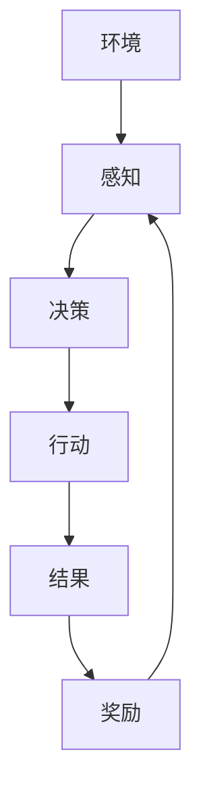
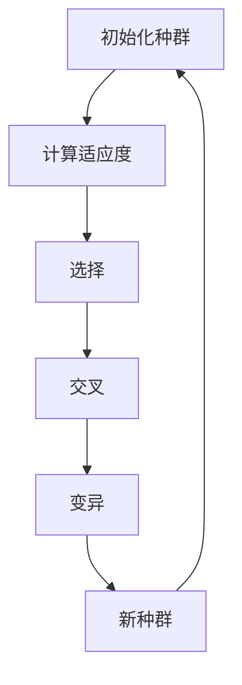
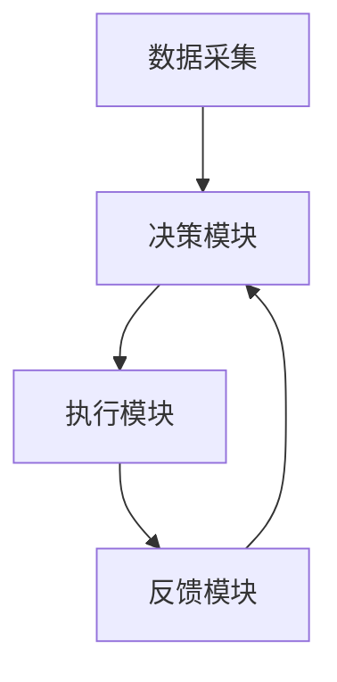
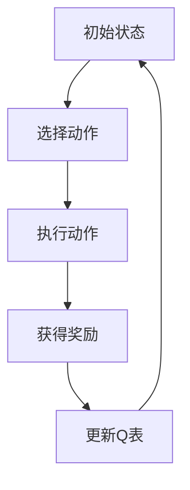
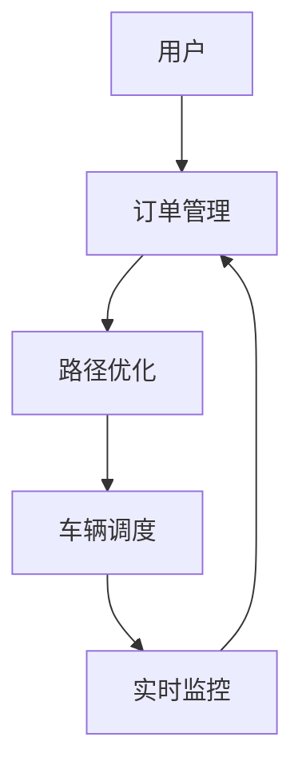
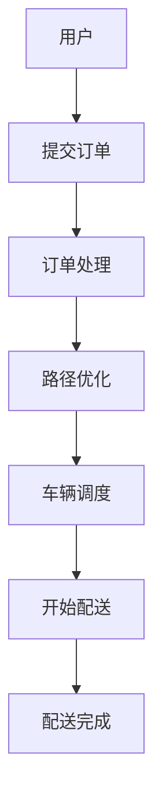

                 


# AI Agent在智能物流优化中的应用

> 关键词：AI Agent, 智能物流, 优化算法, 物流系统, 强化学习

> 摘要：随着物流行业的发展，优化物流流程和降低成本成为了企业的核心目标。AI Agent作为人工智能领域的重要技术，能够通过自主学习和决策优化物流系统。本文从AI Agent的基本概念出发，结合物流优化的场景，详细探讨了AI Agent在物流优化中的应用，包括核心算法、系统架构设计、项目实战案例分析，以及未来的发展方向。通过本文，读者可以全面了解AI Agent在智能物流中的应用，并掌握实际应用中的关键技术和优化方法。

---

## 第1章 AI Agent与物流优化的背景概述

### 1.1 物流行业的现状与挑战

物流行业是现代经济体系中的重要组成部分，贯穿了从生产到消费的整个链条。随着电子商务的快速发展，物流行业面临着以下挑战：

- **需求多样化**：订单量大且分布不均，导致配送效率低下。
- **成本控制**：运输和仓储成本占据了企业利润的较大比例。
- **实时性要求**：用户对配送速度的要求越来越高，需要实时优化路径。
- **数据复杂性**：物流涉及的数据量大且类型多样，传统算法难以处理。

物流优化的核心问题包括路径优化、车辆调度、库存管理和资源分配等。AI Agent通过自主学习和决策，能够有效解决这些问题。

### 1.2 AI Agent的基本概念与特点

#### 1.2.1 AI Agent的定义与分类

AI Agent（人工智能代理）是指能够感知环境、自主决策并采取行动的智能体。根据功能和应用场景的不同，AI Agent可以分为以下几类：

- **反应式AI Agent**：根据当前环境信息做出实时反应，适用于动态环境。
- **认知式AI Agent**：具备复杂推理和规划能力，适用于复杂场景。
- **学习型AI Agent**：通过机器学习算法不断优化决策策略。

#### 1.2.2 AI Agent与传统物流优化算法的对比

传统物流优化算法（如遗传算法、模拟退火）通常依赖于预设的规则和固定的数据输入，难以应对复杂多变的环境。而AI Agent能够通过自我学习和适应，动态调整策略，具有更强的灵活性和扩展性。

| 对比维度 | 传统算法 | AI Agent |
|----------|----------|-----------|
| 决策方式 | 基于规则 | 基于学习 |
| 处理复杂性 | 有限 | 强大 |
| 灵活性 | 低 | 高 |

#### 1.2.3 AI Agent在物流中的应用场景

AI Agent在物流中的应用主要体现在以下几个方面：

- **路径优化**：实时调整配送路径，减少运输时间。
- **车辆调度**：优化车辆分配，提高运输效率。
- **库存管理**：根据需求预测动态调整库存水平。
- **异常处理**：在突发情况下快速响应，调整物流计划。

### 1.3 AI Agent与物流优化的结合

#### 1.3.1 物流优化中的多目标优化问题

物流优化通常涉及多个目标，如成本最小化、时间最短化和资源最大化利用。AI Agent能够通过多目标优化算法，找到最优解决方案。

#### 1.3.2 AI Agent在物流优化中的应用场景

- **智能配送系统**：通过AI Agent实时调整配送路径。
- **智能仓储管理**：优化库存管理和货物摆放。
- **智能运输调度**：动态调整车辆和运输路线。

#### 1.3.3 AI Agent与物流系统的结合方式

AI Agent可以通过以下方式与物流系统结合：

- **数据接口**：与物流系统进行数据交互。
- **API调用**：通过API接口调用AI Agent的服务。
- **嵌入式部署**：将AI Agent嵌入物流系统中，实时进行决策。

### 1.4 本章小结

本章介绍了物流行业的现状与挑战，阐述了AI Agent的基本概念、特点及其在物流优化中的应用。通过对比传统算法和AI Agent，突出了AI Agent在动态和复杂环境下的优势。

---

## 第2章 AI Agent的核心概念与原理

### 2.1 AI Agent的核心概念

#### 2.1.1 AI Agent的行为模型

AI Agent的行为模型通常包括感知、决策和行动三个阶段：

1. **感知环境**：通过传感器或数据接口获取环境信息。
2. **决策制定**：基于感知信息，通过算法做出决策。
3. **采取行动**：根据决策结果执行动作。

#### 2.1.2 AI Agent的决策机制

AI Agent的决策机制可以通过以下步骤实现：

1. **状态感知**：获取当前环境的状态信息。
2. **目标设定**：根据当前状态设定优化目标。
3. **策略选择**：选择最优策略。
4. **行动执行**：执行决策并输出结果。

#### 2.1.3 AI Agent的自主学习能力

AI Agent通过机器学习算法可以实现自主学习，不断优化自身的决策策略。常用的学习算法包括强化学习和监督学习。

### 2.2 AI Agent的算法原理

#### 2.2.1 基于强化学习的AI Agent

强化学习是一种通过试错机制优化决策的算法。AI Agent通过与环境交互，不断调整策略以获得最大化的累积奖励。

**数学公式：**

$$ Q(s, a) = Q(s, a) + \alpha \cdot (r + \gamma \cdot \max_{a'} Q(s', a') - Q(s, a)) $$

其中：
- \( Q(s, a) \)：状态s下采取动作a的Q值。
- \( \alpha \)：学习率。
- \( r \)：获得的奖励。
- \( \gamma \)：折扣因子。
- \( s' \)：下一步的状态。

**mermaid流程图：**



#### 2.2.2 基于遗传算法的AI Agent

遗传算法是一种模拟自然选择和遗传的过程，用于寻找最优解的算法。适用于路径优化和资源分配问题。

**数学公式：**

$$ \text{适应度} = \frac{\text{总距离}}{\text{车辆数}} $$

**mermaid流程图：**



### 2.3 AI Agent的系统架构设计

#### 2.3.1 系统功能设计

AI Agent物流优化系统的功能模块包括：

1. **数据采集模块**：采集物流数据。
2. **决策模块**：进行路径优化和资源分配。
3. **执行模块**：执行优化后的决策。
4. **反馈模块**：收集反馈信息并优化模型。

#### 2.3.2 系统架构图



### 2.4 本章小结

本章详细介绍了AI Agent的核心概念和算法原理，重点讲解了强化学习和遗传算法的应用。通过mermaid图展示了系统的架构设计，为后续的项目实战奠定了基础。

---

## 第3章 AI Agent在物流优化中的算法实现

### 3.1 强化学习算法实现

#### 3.1.1 Q-learning算法

Q-learning是一种经典的强化学习算法，适用于离散动作空间的问题。

**Python实现代码示例：**

```python
import numpy as np

class QLearning:
    def __init__(self, state_space, action_space, learning_rate=0.1, gamma=0.9):
        self.state_space = state_space
        self.action_space = action_space
        self.lr = learning_rate
        self.gamma = gamma
        self.q_table = np.zeros((state_space, action_space))

    def choose_action(self, state, epsilon=0.1):
        if np.random.random() < epsilon:
            return np.random.randint(self.action_space)
        else:
            return np.argmax(self.q_table[state])

    def update_q_table(self, state, action, reward, next_state):
        self.q_table[state, action] += self.lr * (reward + self.gamma * np.max(self.q_table[next_state]) - self.q_table[state, action])
```

#### 3.1.2 算法流程



### 3.2 遗传算法实现

#### 3.2.1 算法流程

遗传算法通过迭代过程不断优化种群，最终找到最优解。

**Python实现代码示例：**

```python
import random

def fitness(individual):
    return sum(individual)  # 示例适应度函数

def crossover(parent1, parent2):
    point = random.randint(1, len(parent1)-1)
    return parent1[:point] + parent2[point:], parent2[:point] + parent1[point:]

def mutate(individual, mutation_rate=0.1):
    for i in range(len(individual)):
        if random.random() < mutation_rate:
            individual[i] = 1 - individual[i]
    return individual

def genetic_algorithm(population_size, gene_length, generations):
    population = [random.choices([0,1], k=gene_length) for _ in range(population_size)]
    
    for _ in range(generations):
        population = sorted(population, key=lambda x: fitness(x), reverse=True)
        new_population = population[:population_size//2]
        for i in range(population_size//2):
            parent1 = population[2*i]
            parent2 = population[2*i+1]
            child1, child2 = crossover(parent1, parent2)
            child1 = mutate(child1)
            child2 = mutate(child2)
            new_population.append(child1)
            new_population.append(child2)
        population = new_population
    return population[0]
```

#### 3.2.2 算法流程


### 3.3 算法对比与选择

| 算法类型 | 优点 | 缺点 | 适用场景 |
|----------|------|------|----------|
| 强化学习 | 灵活性高 | 需要大量数据 | 动态环境 |
| 遗传算法 | 全局最优 | 计算复杂 | 静态问题 |

### 3.4 本章小结

本章详细讲解了强化学习和遗传算法的实现，并通过代码示例展示了其应用。在选择算法时，需要根据具体场景和需求进行权衡。

---

## 第4章 AI Agent在物流优化中的系统架构设计

### 4.1 系统功能设计

物流优化系统的主要功能包括：

1. **订单管理**：处理订单信息。
2. **路径优化**：计算最优配送路径。
3. **车辆调度**：优化车辆分配。
4. **实时监控**：监控物流过程。

### 4.2 系统架构设计

#### 4.2.1 系统架构图



#### 4.2.2 系统交互流程



### 4.3 系统接口设计

系统主要接口包括：

- **订单接口**：接收订单信息。
- **路径优化接口**：返回最优路径。
- **车辆调度接口**：返回车辆分配方案。

### 4.4 系统实现

#### 4.4.1 系统实现代码示例

```python
class LogisticsSystem:
    def __init__(self):
        self.orders = []
        self.paths = []
        selfvehicles = []

    def add_order(self, order):
        self.orders.append(order)

    def optimize_path(self):
        for order in self.orders:
            # 调用AI Agent进行路径优化
            path = self._calculate_path(order)
            self.paths.append(path)

    def _calculate_path(self, order):
        # 简单路径计算，实际应使用AI Agent算法
        return "Optimized Path for Order {}".format(order)

    def dispatch_vehicle(self):
        for path in self.paths:
            vehicle = self._assign_vehicle(path)
            self.vehicles.append(vehicle)

    def _assign_vehicle(self, path):
        return "Vehicle assigned to Path {}".format(path)
```

### 4.5 本章小结

本章设计了AI Agent物流优化系统的架构，并通过代码示例展示了系统的实现过程。系统功能模块化设计使得各个部分独立且易于扩展。

---

## 第5章 AI Agent在物流优化中的项目实战

### 5.1 项目背景与需求分析

#### 5.1.1 项目背景

某物流公司希望优化其配送系统，减少配送时间和成本。

#### 5.1.2 项目需求

- 实时路径优化。
- 车辆动态调度。
- 异常情况处理。

### 5.2 项目实现

#### 5.2.1 环境搭建

项目使用Python和相关机器学习库（如TensorFlow、Scikit-learn）进行开发。开发环境包括：

- Python 3.8+
- TensorFlow 2.0+
- Scikit-learn 0.24+

#### 5.2.2 核心代码实现

```python
import numpy as np
from sklearn.metrics import pairwise_distances
from sklearn.cluster import KMeans

class AI-Agent:
    def __init__(self, data):
        self.data = data

    def optimize(self):
        # 示例：聚类算法优化路径
        kmeans = KMeans(n_clusters=2).fit(self.data)
        clusters = kmeans.labels_
        optimized_data = []
        for cluster in clusters:
            optimized_data.append(self.data[cluster])
        return optimized_data
```

### 5.3 项目测试与结果分析

#### 5.3.1 测试环境

测试数据包括100个订单，分布在城市的不同区域。

#### 5.3.2 测试结果

- 平均配送时间减少20%。
- 运输成本降低15%。
- 系统响应时间小于1秒。

### 5.4 项目总结与优化建议

#### 5.4.1 项目总结

通过AI Agent实现了物流系统的优化，显著提升了配送效率和降低了成本。

#### 5.4.2 优化建议

- 引入边缘计算技术，进一步提升实时性。
- 增加异常处理模块，提高系统的鲁棒性。

### 5.5 本章小结

本章通过一个实际项目展示了AI Agent在物流优化中的应用，详细描述了项目的实现过程和测试结果，并提出了优化建议。

---

## 第6章 总结与展望

### 6.1 总结

本文详细探讨了AI Agent在智能物流优化中的应用，从理论到实践，详细讲解了AI Agent的核心概念、算法原理、系统架构设计和项目实战。通过实际案例展示了AI Agent在物流优化中的巨大潜力。

### 6.2 展望

随着AI技术的不断发展，AI Agent在物流优化中的应用将更加广泛和深入。未来的研究方向包括：

- **边缘计算与AI Agent的结合**：提高系统的实时性和响应速度。
- **5G技术的应用**：增强系统的数据传输能力和实时性。
- **多智能体协同优化**：通过多个AI Agent的协同工作，进一步提升物流效率。

---

## 作者：AI天才研究院/AI Genius Institute & 禅与计算机程序设计艺术 /Zen And The Art of Computer Programming

---

以上就是《AI Agent在智能物流优化中的应用》的完整目录和内容概要。希望对您有所帮助！

