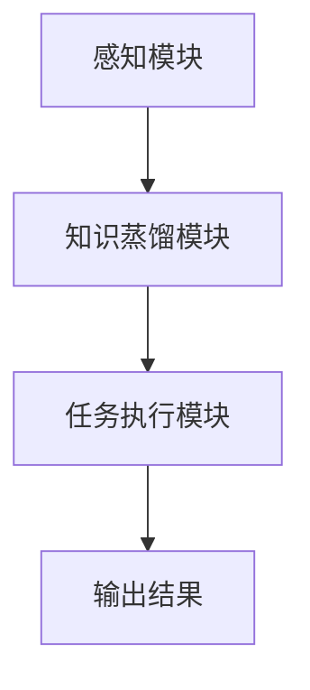

                 


# AI Agent的知识蒸馏：从大模型到轻量级应用

> 关键词：知识蒸馏、AI Agent、大模型、轻量级应用、模型压缩、迁移学习

> 摘要：本文深入探讨了知识蒸馏技术在AI Agent中的应用，详细介绍了如何通过知识蒸馏将大模型压缩为轻量级模型，以提升其在实际场景中的部署和应用效率。文章从知识蒸馏的基本原理出发，结合AI Agent的特点，分析了知识蒸馏的核心算法、系统架构设计以及实际项目中的应用案例。通过理论与实践相结合的方式，本文为读者提供了一套完整的知识蒸馏解决方案，帮助AI Agent更好地服务于现实场景。

---

# 引言

随着人工智能技术的快速发展，大模型（如GPT系列、BERT系列）在自然语言处理领域取得了显著的成果。然而，这些大模型通常参数量庞大、计算复杂度高，难以在资源受限的场景（如移动设备、边缘计算）中高效部署。与此同时，AI Agent作为一种能够自主感知环境、执行任务的智能体，正在广泛应用于机器人、自动驾驶、智能助手等领域。如何将大模型的知识高效地迁移到轻量级AI Agent中，成为当前技术研究的热点问题。

知识蒸馏作为一种有效的模型压缩技术，通过将大模型的知识迁移到小模型中，显著降低了模型的计算复杂度，同时保持了较高的性能。本文将从知识蒸馏的基本原理出发，结合AI Agent的特点，系统地探讨如何通过知识蒸馏将大模型压缩为轻量级模型，并在实际场景中高效应用。

---

# 第一部分：知识蒸馏与AI Agent概述

## 第1章：知识蒸馏的基本概念

### 1.1 知识蒸馏的定义与核心目标

知识蒸馏（Knowledge Distillation）是一种模型压缩技术，旨在将大型模型（教师模型）的知识迁移到小型模型（学生模型）中。其核心目标是通过知识蒸馏，使得学生模型能够继承教师模型的性能，同时显著降低模型的复杂度。

### 1.2 AI Agent的定义与特点

AI Agent（人工智能代理）是一种能够感知环境、自主决策并执行任务的智能实体。它具有以下特点：
- **自主性**：能够在没有外部干预的情况下自主决策。
- **反应性**：能够实时感知环境并做出响应。
- **目标导向性**：以特定目标为导向，执行任务。
- **学习能力**：能够通过学习优化自身行为。

### 1.3 知识蒸馏在AI Agent中的应用背景

随着AI Agent应用场景的不断扩大，如何在资源受限的环境中高效部署AI Agent成为一个重要挑战。知识蒸馏技术为这一问题提供了解决方案：
- **降低计算复杂度**：通过蒸馏技术，将大模型的复杂知识迁移到轻量级模型中。
- **提升部署效率**：轻量级模型在资源受限的环境中运行更高效。
- **适应性更强**：轻量级模型更容易根据具体场景进行定制化部署。

---

## 第2章：知识蒸馏的核心原理

### 2.1 知识蒸馏的基本原理

知识蒸馏的核心思想是通过教师模型（大模型）对学生模型（小模型）进行知识迁移。具体步骤如下：
1. **教师模型训练**：首先训练一个性能强大的教师模型。
2. **蒸馏过程**：通过蒸馏过程，将教师模型的知识迁移到学生模型中。
3. **学生模型优化**：通过优化蒸馏过程，提升学生模型的性能。

### 2.2 知识蒸馏的关键算法

知识蒸馏的主要算法包括软蒸馏（Soft Distillation）和硬蒸馏（Hard Distillation）：
- **软蒸馏**：教师模型输出概率分布，学生模型通过最小化概率分布的KL散度进行学习。
- **硬蒸馏**：教师模型输出类别标签，学生模型通过最小化类别标签的交叉熵损失进行学习。

### 2.3 知识蒸馏的数学模型

知识蒸馏的核心数学模型是KL散度的最小化。具体公式如下：

$$
L = \lambda L_{\text{distill}} + (1-\lambda)L_{\text{original}}
$$

其中：
- $L_{\text{distill}}$ 是蒸馏损失，表示学生模型输出与教师模型输出之间的差距。
- $L_{\text{original}}$ 是原始损失，表示学生模型输出与真实标签之间的差距。
- $\lambda$ 是蒸馏系数，控制蒸馏损失和原始损失的权重。

---

# 第二部分：AI Agent的系统架构与设计

## 第3章：AI Agent的系统架构

### 3.1 系统模块划分

AI Agent的系统架构通常包括以下几个模块：
1. **感知模块**：负责感知环境信息（如视觉、听觉输入）。
2. **知识蒸馏模块**：负责将教师模型的知识迁移到学生模型中。
3. **任务执行模块**：负责根据感知信息和蒸馏后的知识执行任务。

### 3.2 系统架构设计

以下是AI Agent的系统架构设计图：



---

## 第4章：知识蒸馏模块的设计

### 4.1 知识蒸馏模块的功能

知识蒸馏模块的主要功能包括：
1. **教师模型输出获取**：从教师模型获取概率分布或类别标签。
2. **蒸馏损失计算**：计算学生模型输出与教师模型输出之间的KL散度或交叉熵损失。
3. **蒸馏过程优化**：通过优化算法（如Adam）最小化蒸馏损失。

### 4.2 知识蒸馏模块的实现

以下是知识蒸馏模块的实现代码：

```python
import torch
import torch.nn as nn
import torch.optim as optim

class Distiller:
    def __init__(self, teacher, student):
        self.teacher = teacher
        self.student = student
        self.criterion = nn.KLDivLoss()
        self.optimizer = optim.Adam(self.student.parameters(), lr=1e-3)

    def forward(self, inputs):
        # 教师模型输出
        teacher_outputs = self.teacher(inputs)
        # 学生模型输出
        student_outputs = self.student(inputs)
        return teacher_outputs, student_outputs

    def loss(self, teacher_outputs, student_outputs):
        # 蒸馏损失
        distill_loss = self.criterion(torch.log_softmax(student_outputs, dim=1),
                                      torch.softmax(teacher_outputs, dim=1))
        return distill_loss

    def optimize(self, inputs, labels):
        # 前向传播
        teacher_outputs, student_outputs = self.forward(inputs)
        # 计算蒸馏损失
        distill_loss = self.loss(teacher_outputs, student_outputs)
        # 后向传播和优化
        self.optimizer.zero_grad()
        distill_loss.backward()
        self.optimizer.step()
        return distill_loss.item()
```

---

## 第5章：AI Agent的系统实现

### 5.1 系统实现的整体流程

AI Agent的系统实现流程如下：
1. **教师模型训练**：训练一个性能强大的教师模型。
2. **知识蒸馏**：通过Distiller类将教师模型的知识迁移到学生模型中。
3. **任务执行**：学生模型在实际场景中执行任务。

### 5.2 系统实现的代码示例

以下是AI Agent的系统实现代码：

```python
import torch
import torch.nn as nn
import torch.optim as optim

class Teacher(nn.Module):
    def __init__(self):
        super(Teacher, self).__init__()
        self.fc = nn.Linear(10, 1)

    def forward(self, x):
        return torch.sigmoid(x)

class Student(nn.Module):
    def __init__(self):
        super(Student, self).__init__()
        self.fc = nn.Linear(10, 1)

    def forward(self, x):
        return torch.sigmoid(x)

class AI_Agent:
    def __init__(self):
        self.teacher = Teacher()
        self.student = Student()
        self.distiller = Distiller(self.teacher, self.student)

    def train(self, inputs, labels):
        loss = self.distiller.optimize(inputs, labels)
        return loss

    def execute_task(self, inputs):
        output = self.student(inputs)
        return output
```

---

## 第6章：项目实战与案例分析

### 6.1 项目实战

**环境安装：**
- 安装PyTorch和相关依赖：
  ```bash
  pip install torch torchvision
  ```

**代码实现：**
以下是项目的完整代码：

```python
import torch
import torch.nn as nn
import torch.optim as optim

class Teacher(nn.Module):
    def __init__(self):
        super(Teacher, self).__init__()
        self.fc = nn.Linear(10, 1)

    def forward(self, x):
        return torch.sigmoid(x)

class Student(nn.Module):
    def __init__(self):
        super(Student, self).__init__()
        self.fc = nn.Linear(10, 1)

    def forward(self, x):
        return torch.sigmoid(x)

class Distiller:
    def __init__(self, teacher, student):
        self.teacher = teacher
        self.student = student
        self.criterion = nn.KLDivLoss()
        self.optimizer = optim.Adam(self.student.parameters(), lr=1e-3)

    def forward(self, inputs):
        teacher_outputs = self.teacher(inputs)
        student_outputs = self.student(inputs)
        return teacher_outputs, student_outputs

    def loss(self, teacher_outputs, student_outputs):
        distill_loss = self.criterion(torch.log_softmax(student_outputs, dim=1),
                                      torch.softmax(teacher_outputs, dim=1))
        return distill_loss

    def optimize(self, inputs, labels):
        teacher_outputs, student_outputs = self.forward(inputs)
        distill_loss = self.loss(teacher_outputs, student_outputs)
        self.optimizer.zero_grad()
        distill_loss.backward()
        self.optimizer.step()
        return distill_loss.item()

class AI_Agent:
    def __init__(self):
        self.teacher = Teacher()
        self.student = Student()
        self.distiller = Distiller(self.teacher, self.student)

    def train(self, inputs, labels):
        return self.distiller.optimize(inputs, labels)

    def execute_task(self, inputs):
        return self.student(inputs)

# 示例用法
if __name__ == "__main__":
    agent = AI_Agent()
    inputs = torch.randn(1, 10)
    labels = torch.ones(1)
    loss = agent.train(inputs, labels)
    print("Training Loss:", loss)
    output = agent.execute_task(inputs)
    print("Output:", output)
```

### 6.2 案例分析

**案例：文本分类任务**

**环境准备：**
- 数据集：使用MNIST手写数字识别数据集。
- 教师模型：一个简单的全连接网络。
- 学生模型：一个轻量级的全连接网络。

**代码实现：**
以下是文本分类任务的实现代码：

```python
import torch
import torch.nn as nn
import torch.optim as optim
import torchvision
import torchvision.transforms as transforms

transform = transforms.Compose([
    transforms.ToTensor(),
    transforms.Normalize((0.1307, ), (0.3081, )),
])

trainset = torchvision.datasets.MNIST(root='./data', train=True, download=True, transform=transform)
trainloader = torch.utils.data.DataLoader(trainset, batch_size=64, shuffle=True, num_workers=2)

class Teacher(nn.Module):
    def __init__(self):
        super(Teacher, self).__init__()
        self.fc = nn.Linear(28*28, 10)

    def forward(self, x):
        x = x.view(-1, 28*28)
        return torch.log_softmax(x, dim=1)

class Student(nn.Module):
    def __init__(self):
        super(Student, self).__init__()
        self.fc = nn.Linear(28*28, 10)

    def forward(self, x):
        x = x.view(-1, 28*28)
        return torch.log_softmax(x, dim=1)

class Distiller:
    def __init__(self, teacher, student):
        self.teacher = teacher
        self.student = student
        self.criterion = nn.KLDivLoss()
        self.optimizer = optim.Adam(self.student.parameters(), lr=1e-3)

    def forward(self, inputs):
        teacher_outputs = self.teacher(inputs)
        student_outputs = self.student(inputs)
        return teacher_outputs, student_outputs

    def loss(self, teacher_outputs, student_outputs):
        distill_loss = self.criterion(student_outputs, teacher_outputs)
        return distill_loss

    def optimize(self, inputs, labels):
        teacher_outputs, student_outputs = self.forward(inputs)
        distill_loss = self.loss(teacher_outputs, student_outputs)
        self.optimizer.zero_grad()
        distill_loss.backward()
        self.optimizer.step()
        return distill_loss.item()

# 初始化AI Agent
agent = AI_Agent()
agent.teacher = Teacher()
agent.student = Student()
agent.distiller = Distiller(agent.teacher, agent.student)

# 训练AI Agent
for epoch in range(10):
    for batch_idx, (inputs, labels) in enumerate(trainloader):
        loss = agent.distiller.optimize(inputs, labels)
        print(f"Epoch: {epoch}, Batch: {batch_idx}, Loss: {loss}")

# 执行任务
test_input = torch.randn(1, 1, 28, 28)
output = agent.execute_task(test_input)
print("Output:", output)
```

---

## 第7章：知识蒸馏的最佳实践

### 7.1 知识蒸馏的实践经验

1. **选择合适的教师模型**：教师模型的性能直接影响蒸馏效果，建议选择经过充分训练的大型模型。
2. **合理设置蒸馏系数**：蒸馏系数$\lambda$的设置需要根据具体任务调整，通常在0.5到1之间。
3. **优化蒸馏过程**：可以通过调整学习率、批量大小等超参数优化蒸馏过程。
4. **结合迁移学习**：在资源受限的场景中，可以结合迁移学习进一步优化模型性能。

### 7.2 注意事项

- **数据分布的影响**：知识蒸馏的效果与数据分布密切相关，需要确保教师模型和学生模型在相同的数据分布上进行训练。
- **模型复杂度的平衡**：蒸馏后的学生模型需要在轻量级和性能之间找到平衡点。
- **场景适应性**：不同场景对模型的要求不同，需要根据具体需求调整蒸馏策略。

---

## 第8章：总结与展望

### 8.1 本文总结

本文系统地探讨了知识蒸馏技术在AI Agent中的应用，从理论到实践，详细介绍了如何通过知识蒸馏将大模型压缩为轻量级模型，并在实际场景中高效部署。通过具体案例分析和代码实现，展示了知识蒸馏技术的强大能力。

### 8.2 未来展望

随着AI技术的不断发展，知识蒸馏技术将在AI Agent领域发挥更重要的作用。未来的研究方向包括：
- **多模态知识蒸馏**：将多种模态（如图像、文本、语音）的知识迁移到轻量级模型中。
- **动态蒸馏**：根据实时需求动态调整蒸馏过程，提升模型的适应性。
- **联邦蒸馏**：在分布式环境下，通过联邦学习实现知识蒸馏。

---

# 结语

知识蒸馏技术为AI Agent的轻量化部署提供了重要解决方案。通过本文的探讨，我们不仅掌握了知识蒸馏的核心原理，还通过具体案例展示了其在实际场景中的应用。未来，随着技术的不断发展，知识蒸馏将在更多领域发挥重要作用，为人工智能技术的落地应用提供更强大的技术支持。

---

# 作者：AI天才研究院/Zen And The Art of Computer Programming

---

感谢您的阅读，希望本文对您理解知识蒸馏技术在AI Agent中的应用有所帮助！

