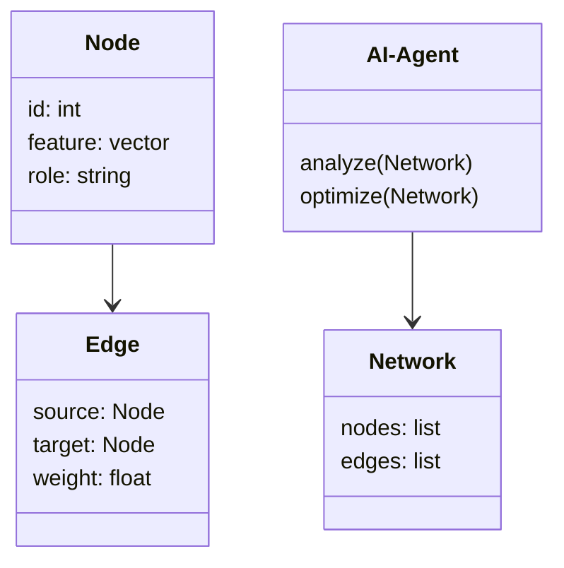
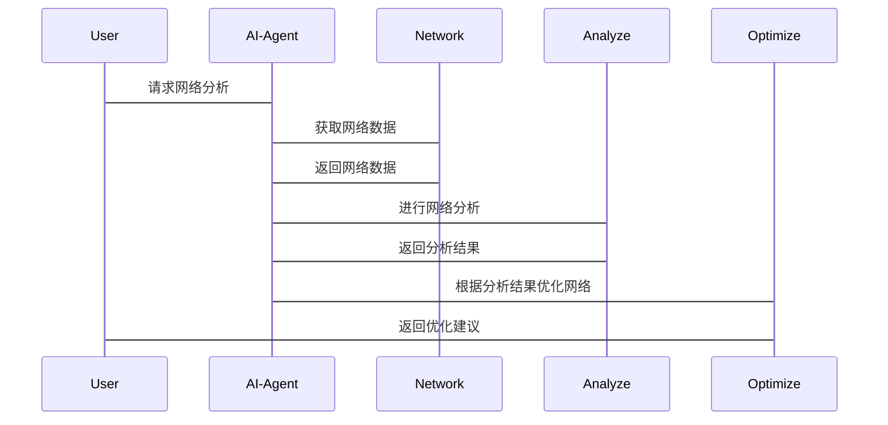

                 


# 企业AI Agent的图神经网络在组织网络分析中的应用

> **关键词**：企业AI Agent，图神经网络，组织网络分析，节点嵌入，图论，深度学习

> **摘要**：  
本文深入探讨了企业AI Agent如何利用图神经网络进行组织网络分析。通过结合图论与深度学习技术，AI Agent能够有效处理复杂的企业网络结构，识别关键节点、预测网络行为，并优化组织协作效率。文章从图神经网络的基本原理出发，分析其在组织网络中的应用价值，结合实际案例，详细讲解了AI Agent的设计与实现过程，并展望了未来的发展方向。

---

# 第1章: 企业AI Agent与图神经网络概述

## 1.1 问题背景与定义

### 1.1.1 企业组织网络分析的背景
企业组织网络指的是企业内部员工、部门、项目之间的交互关系网络。随着企业规模的扩大，组织网络的复杂性也在不断增加，传统的基于规则的分析方法难以应对动态变化的网络结构。如何利用现代技术手段高效分析和优化组织网络，成为企业数字化转型中的重要课题。

### 1.1.2 AI Agent的定义与特点
AI Agent（人工智能代理）是一种能够感知环境、自主决策并执行任务的智能实体。与传统软件相比，AI Agent具有以下特点：
- **自主性**：能够在没有外部干预的情况下独立运行。
- **反应性**：能够实时感知环境变化并做出响应。
- **学习能力**：通过数据学习和优化，提升任务执行效率。
- **协作性**：能够与其他AI Agent或人类用户进行高效协作。

### 1.1.3 图神经网络的核心概念
图神经网络（Graph Neural Network, GNN）是一种专门用于处理图结构数据的深度学习模型。其核心思想是通过节点之间的关系（边）来建模全局网络结构，并利用节点特征（属性）进行预测或分类。

---

## 1.2 图神经网络与组织网络分析的结合

### 1.2.1 图神经网络的优势
图神经网络在处理复杂网络结构时具有以下优势：
- **全局视角**：能够同时考虑节点的局部特征和全局网络结构。
- **动态适应性**：能够处理动态变化的网络结构。
- **节点表示学习**：通过嵌入技术，将复杂网络结构转化为低维向量表示。

### 1.2.2 组织网络分析的挑战
企业在组织网络分析中面临以下挑战：
- **数据稀疏性**：部分节点之间的关系可能缺失。
- **动态变化**：组织结构和员工角色可能频繁调整。
- **复杂性**：大型企业的组织网络通常包含数千个节点，计算复杂度较高。

### 1.2.3 AI Agent在组织网络中的作用
AI Agent可以通过图神经网络对组织网络进行实时分析，帮助企业识别关键节点、预测网络行为、优化资源分配，并提高组织协作效率。

---

## 1.3 本章小结

本章介绍了企业AI Agent和图神经网络的基本概念，并探讨了它们在组织网络分析中的结合方式。通过分析图神经网络的优势和组织网络分析的挑战，我们明确了AI Agent在这一领域的独特价值。

---

# 第2章: 图神经网络的核心概念与原理

## 2.1 图论基础

### 2.1.1 图的基本概念
图（Graph）由节点（Vertex）和边（Edge）组成，用于描述事物之间的关系。例如，在企业组织网络中，节点可以代表员工，边可以代表员工之间的协作关系。

### 2.1.2 图的表示方法
图的表示方法包括邻接矩阵（Adjacency Matrix）和邻接表（Adjacency List）。邻接矩阵适用于小规模图的表示，而邻接表更适合大规模图。

### 2.1.3 图的属性与特征
图的属性包括节点度数（Degree）、中心性（Centrality）、社群结构（Community Structure）等。这些属性可以帮助我们更好地理解图的结构特征。

---

## 2.2 图神经网络的基本原理

### 2.2.1 图神经网络的定义
图神经网络是一种基于图结构数据的深度学习模型，其核心思想是通过传播节点特征信息，生成全局网络表示。

### 2.2.2 图神经网络的核心算法
图神经网络的核心算法包括：
- **Graph Convolutional Network (GCN)**：基于图卷积操作的模型。
- **Graph Attention Network (GAT)**：基于注意力机制的模型。
- **GraphSAGE**：通过归纳式学习方法生成节点表示。

### 2.2.3 图神经网络的训练过程
图神经网络的训练过程包括以下步骤：
1. **输入层**：输入图的节点特征和边信息。
2. **隐藏层**：通过卷积操作或注意力机制生成节点表示。
3. **输出层**：根据任务需求（如分类、聚类）生成最终结果。

---

## 2.3 组织网络的图表示

### 2.3.1 组织网络的节点与边
在组织网络中，节点可以表示员工、部门或项目，边可以表示员工之间的协作关系或部门之间的依赖关系。

### 2.3.2 组织网络的权重与属性
边的权重反映了节点之间的关系强度，节点属性可能包括员工的职位、技能、绩效等。

### 2.3.3 组织网络的动态变化
组织网络是一个动态系统，节点和边的属性可能随时间变化。

---

## 2.4 AI Agent的设计与实现

### 2.4.1 AI Agent的基本架构
AI Agent的基本架构包括感知模块、决策模块和执行模块：
- **感知模块**：负责采集组织网络的数据。
- **决策模块**：基于图神经网络对数据进行分析，生成决策。
- **执行模块**：根据决策结果执行相关操作。

### 2.4.2 AI Agent的核心算法
AI Agent的核心算法是基于图神经网络的节点表示学习和关系推理。

### 2.4.3 AI Agent与图神经网络的结合
AI Agent通过调用图神经网络模型，对组织网络进行实时分析，并根据分析结果优化组织结构和资源分配。

---

## 2.5 本章小结

本章详细讲解了图神经网络的核心概念与原理，并探讨了其在组织网络表示中的应用。通过对图论基础和图神经网络算法的分析，我们为后续章节的深入讨论奠定了基础。

---

# 第3章: 图神经网络算法原理与实现

## 3.1 图神经网络的数学模型

### 3.1.1 图的邻接矩阵表示
邻接矩阵是一个$n \times n$的矩阵，其中$n$是图的节点数。矩阵元素$a_{ij}$表示节点$i$和节点$j$之间的边是否存在。

$$
A = \begin{bmatrix}
0 & 1 & 0 \\
1 & 0 & 1 \\
0 & 1 & 0
\end{bmatrix}
$$

### 3.1.2 图的节点表示与嵌入
节点嵌入（Node Embedding）是将节点特征映射到低维空间的过程。常见的节点嵌入方法包括：
- **one-hot编码**：将节点表示为稀疏向量。
- **Word2Vec**：基于上下文的节点嵌入方法。
- **DeepWalk**：基于随机游走的节点嵌入方法。

### 3.1.3 图的传播与聚合机制
图传播机制（Propagation）是通过边信息将节点特征传播到整个图中。常见的传播方法包括：
- **卷积传播**：基于局部邻居信息进行特征聚合。
- **注意力传播**：基于节点的重要性进行特征加权。

---

## 3.2 常见图神经网络算法

### 3.2.1 GCN（Graph Convolutional Network）
GCN是一种基于卷积操作的图神经网络，其核心思想是将节点特征通过邻接矩阵传播到整个图中。

$$
h_i^{(l+1)} = \sigma(\sum_{j} A_{ij} h_j^{(l)})
$$

其中，$h_i^{(l)}$表示节点$i$在第$l$层的特征，$\sigma$是激活函数。

### 3.2.2 GAT（Graph Attention Network）
GAT是一种基于注意力机制的图神经网络，其核心思想是通过注意力权重对节点特征进行加权聚合。

$$
\alpha_{ij} = \text{softmax}(\frac{h_i^{(l)} \cdot h_j^{(l)}}{\sqrt{d}})
$$

其中，$\alpha_{ij}$是节点$i$和节点$j$之间的注意力权重，$d$是节点特征的维度。

### 3.2.3 GNN（Graph Neural Network）
GNN是一种通用的图神经网络框架，支持多种传播和聚合方法。

---

## 3.3 图神经网络的实现步骤

### 3.3.1 数据预处理
数据预处理包括：
- **节点特征提取**：将节点属性转换为数值形式。
- **边信息处理**：构建邻接矩阵或邻接表。
- **数据归一化**：对节点特征进行归一化处理。

### 3.3.2 模型训练
模型训练包括：
- **网络架构设计**：选择合适的图神经网络模型。
- **超参数调优**：优化学习率、批量大小等参数。
- **模型训练**：使用训练数据对模型进行训练。

### 3.3.3 模型推理
模型推理包括：
- **节点表示生成**：通过模型生成节点嵌入。
- **关系推理**：基于节点嵌入进行关系推理。

---

## 3.4 本章小结

本章详细讲解了图神经网络的数学模型和常见算法，并探讨了其实现步骤。通过对GCN、GAT和GNN等算法的分析，我们为后续章节的深入讨论奠定了算法基础。

---

# 第4章: 组织网络分析与AI Agent的系统架构设计

## 4.1 问题场景介绍

### 4.1.1 问题背景
企业在组织网络分析中面临以下问题：
- **复杂性**：组织网络规模大，结构复杂。
- **动态性**：组织结构和员工角色动态变化。
- **实时性**：需要实时分析和优化。

### 4.1.2 问题描述
我们需要设计一个基于AI Agent的系统，能够实时分析企业组织网络的结构和行为，并优化资源分配和协作效率。

---

## 4.2 系统功能设计

### 4.2.1 领域模型类图
领域模型类图展示了系统的主要实体及其关系。以下是领域模型类图的Mermaid表示：



### 4.2.2 系统架构图
系统架构图展示了系统的整体架构。以下是系统架构图的Mermaid表示：


---

## 4.3 系统接口设计

### 4.3.1 接口定义
系统接口包括：
- **数据接口**：用于获取组织网络的数据。
- **分析接口**：用于调用AI Agent进行网络分析。
- **优化接口**：用于根据分析结果优化组织网络。

### 4.3.2 接口交互流程图
以下是接口交互流程图的Mermaid表示：



---

## 4.4 本章小结

本章详细设计了基于AI Agent的组织网络分析系统的功能架构和接口设计。通过对领域模型类图和系统架构图的分析，我们明确了系统的主要组成部分及其交互关系。

---

# 第5章: 项目实战与案例分析

## 5.1 环境搭建

### 5.1.1 环境要求
- **操作系统**：Linux/Windows/MacOS
- **编程语言**：Python 3.7+
- **深度学习框架**：TensorFlow/PyTorch
- **依赖库**：networkx、numpy、scikit-learn

### 5.1.2 安装依赖
```bash
pip install networkx numpy scikit-learn tensorflow
```

---

## 5.2 核心实现

### 5.2.1 数据预处理
```python
import networkx as nx
import numpy as np

# 创建组织网络
G = nx.Graph()
G.add_nodes_from(["A", "B", "C", "D"])
G.add_edges_from([("A", "B"), ("B", "C"), ("C", "D"), ("D", "A")])
```

### 5.2.2 模型训练
```python
import tensorflow as tf
from tensorflow.keras import layers

# 定义图神经网络模型
class GNN(tf.keras.Model):
    def __init__(self):
        super(GNN, self).__init__()
        self.gcn = layers.GraphConvolution(units=16)
        self.dense = layers.Dense(1)

    def call(self, inputs):
        x = self.gcn(inputs)
        x = self.dense(x)
        return x

model = GNN()
model.compile(optimizer=tf.keras.optimizers.Adam(), loss=tf.keras.losses.MeanSquaredError())
```

### 5.2.3 模型推理
```python
# 调用模型进行网络分析
prediction = model.predict(network_data)
```

---

## 5.3 案例分析

### 5.3.1 案例背景
某企业希望优化其部门协作效率，通过AI Agent对组织网络进行分析，识别关键节点并优化资源分配。

### 5.3.2 数据分析
通过图神经网络模型，我们发现部门之间的协作效率低下，关键节点的负载过高。

### 5.3.3 优化建议
根据分析结果，我们提出了以下优化建议：
- 增加关键节点的资源分配。
- 优化部门之间的协作流程。

---

## 5.4 本章小结

本章通过实际案例分析，展示了基于AI Agent的组织网络分析系统的应用价值。通过对数据预处理、模型训练和模型推理的详细讲解，我们为读者提供了从理论到实践的完整指导。

---

# 第6章: 总结与展望

## 6.1 核心内容总结
本文深入探讨了企业AI Agent如何利用图神经网络进行组织网络分析。通过结合图论与深度学习技术，AI Agent能够有效处理复杂的企业网络结构，识别关键节点、预测网络行为，并优化组织协作效率。

## 6.2 技术优缺点分析
### 6.2.1 优势
- **高效性**：图神经网络能够高效处理大规模图结构数据。
- **准确性**：基于深度学习的模型具有较高的预测精度。
- **动态性**：能够适应组织网络的动态变化。

### 6.2.2 劣势
- **计算复杂度高**：处理大规模图结构需要较高的计算资源。
- **模型解释性差**：深度学习模型的解释性较弱。

## 6.3 未来发展方向
### 6.3.1 技术层面
- **模型优化**：进一步优化图神经网络模型，降低计算复杂度。
- **多模态数据融合**：结合文本、图像等多种数据源，提升模型性能。
- **实时性提升**：优化模型推理速度，支持实时分析。

### 6.3.2 应用层面
- **跨行业应用**：将图神经网络技术应用于更多行业，如金融、医疗等。
- **智能化决策**：结合强化学习技术，实现更智能的决策优化。

## 6.4 最佳实践 Tips
- **数据预处理**：确保数据质量，减少数据稀疏性的影响。
- **模型调优**：通过交叉验证优化模型参数。
- **实时监控**：建立实时监控机制，及时发现和处理网络异常。

## 6.5 本章小结

本文总结了企业AI Agent图神经网络在组织网络分析中的应用，并展望了未来的发展方向。通过对技术优缺点的分析，我们为读者提供了全面的视角。

---

# 作者：AI天才研究院/AI Genius Institute & 禅与计算机程序设计艺术 /Zen And The Art of Computer Programming

