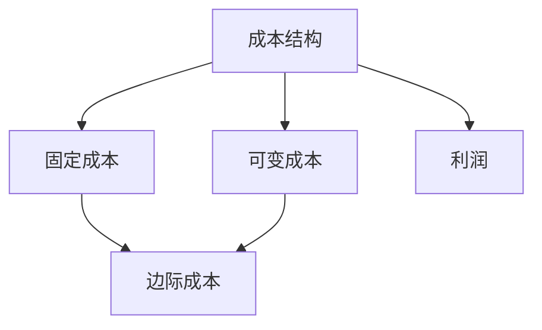
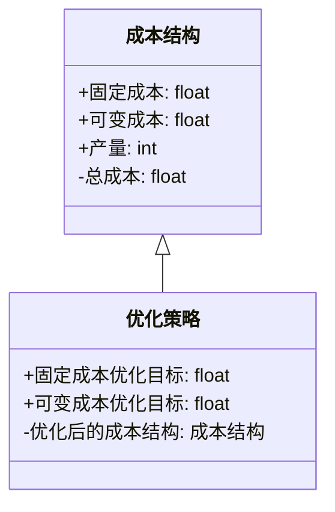
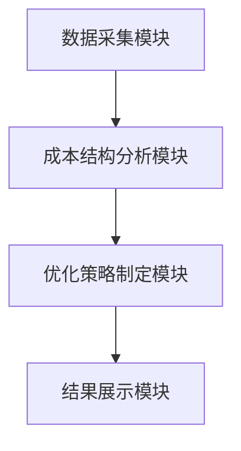

                 


# 彼得林奇如何分析公司的成本结构优化对长期竞争力的影响

> 关键词：彼得林奇，成本结构，竞争力，优化，企业成本分析

> 摘要：本文深入探讨了彼得林奇如何分析公司的成本结构优化对长期竞争力的影响。通过详细分析成本结构的核心概念、优化方法、数学模型、系统架构设计以及实际案例，本文为读者提供了全面的视角，帮助企业在竞争激烈的市场中优化成本结构，提升长期竞争力。

---

## 第一部分：成本结构优化的背景与重要性

### 第1章：成本结构优化的背景与核心概念

#### 1.1 成本结构优化的背景

##### 1.1.1 企业成本结构的基本概念
企业的成本结构是企业运营过程中所产生的一系列成本的组合。这些成本可以分为固定成本和可变成本两大类。固定成本是指在一定范围内不随产量变化的成本，如租金、 salaries 等；可变成本则是随产量变化的成本，如原材料成本、直接人工成本等。彼得林奇认为，成本结构的优化是企业提升竞争力的关键因素之一。

##### 1.1.2 成本结构优化的重要性
优化成本结构是企业提高利润、增强市场竞争力的重要手段。通过优化成本结构，企业可以降低单位产品的成本，提高边际利润率，从而在价格竞争中占据优势。此外，优化成本结构还可以增强企业的财务灵活性，使其在面对经济波动时更具抗风险能力。

##### 1.1.3 彼得林奇分析方法的核心思想
彼得林奇在其投资分析中强调，企业成本结构的优化是评估企业长期竞争力的重要指标。他认为，一个优化的成本结构不仅能够降低企业的运营成本，还能够提高企业的生产效率和市场响应能力。彼得林奇的分析方法注重从企业的财务报表中提取成本结构的相关信息，并结合行业特点和市场环境进行综合评估。

#### 1.2 成本结构优化的边界与外延

##### 1.2.1 成本结构的定义与组成要素
成本结构的定义是企业在生产过程中所发生的各项成本的总和。其组成要素主要包括：
1. **固定成本**：如厂房租金、设备折旧、管理人员工资等。
2. **可变成本**：如原材料采购成本、直接人工成本等。
3. **其他成本**：如物流成本、研发成本等。

##### 1.2.2 优化的边界条件
成本结构优化的边界条件是指企业在进行成本结构优化时需要考虑的各种限制因素。这些因素包括：
1. **市场需求**：企业在优化成本结构时需要考虑市场需求的变化，避免因成本过低而导致产品质量下降。
2. **技术限制**：企业的技术水平和生产设备的限制可能影响成本结构优化的实施。
3. **行业特点**：不同行业的成本结构优化方法和目标可能不同，例如制造业与服务业的成本结构优化方式就存在显著差异。

##### 1.2.3 成本结构优化的外延领域
成本结构优化的外延领域是指企业在优化成本结构过程中可能涉及的其他相关领域。例如：
1. **供应链管理**：通过优化供应链管理，降低采购成本和物流成本。
2. **生产流程优化**：通过改进生产流程，提高生产效率，降低单位产品成本。
3. **技术创新**：通过引入新技术，降低生产成本，提高产品质量。

#### 1.3 成本结构优化的核心要素

##### 1.3.1 固定成本与可变成本
固定成本是指在一定产量范围内不随产量变化的成本，如厂房租金、设备折旧、管理人员工资等。可变成本则是指随产量变化的成本，如原材料采购成本、直接人工成本等。彼得林奇认为，固定成本和可变成本的合理搭配是优化成本结构的关键。

##### 1.3.2 边际成本与规模效应
边际成本是指每增加一单位产品所增加的成本。规模效应是指随着生产规模的扩大，单位产品的平均成本逐渐降低的现象。彼得林奇强调，企业应通过合理规划生产规模，充分利用规模效应，降低边际成本，从而提高竞争力。

##### 1.3.3 成本结构对竞争力的影响
成本结构的优化直接影响企业的竞争力。优化的成本结构能够降低单位产品成本，提高边际利润率，从而在价格竞争中占据优势。此外，优化的成本结构还可以增强企业的财务灵活性，使其在面对经济波动时更具抗风险能力。

---

## 第2章：成本结构优化的核心概念与联系

### 2.1 成本结构优化的核心原理

#### 2.1.1 成本结构优化的基本原理
成本结构优化的基本原理是通过合理分配和调整固定成本和可变成本的比例，降低单位产品成本，提高企业的整体盈利能力。彼得林奇认为，企业应根据市场需求和自身实际情况，制定合理的成本结构优化策略。

#### 2.1.2 彼得林奇分析方法的核心要素
彼得林奇的分析方法的核心要素包括：
1. **成本结构分析**：通过分析企业的成本结构，评估其优化潜力。
2. **市场需求分析**：结合市场需求，制定合理的生产计划和成本结构优化策略。
3. **竞争环境分析**：通过分析竞争对手的成本结构，制定差异化竞争策略。

#### 2.1.3 成本结构优化与企业竞争力的关系
成本结构优化与企业竞争力之间存在密切关系。优化的成本结构能够降低企业的运营成本，提高生产效率，从而增强企业的市场竞争力。此外，优化的成本结构还能够提高企业的财务灵活性，使其在面对市场变化时更具应对能力。

### 2.2 成本结构优化的核心概念对比

#### 2.2.1 成本结构与利润的关系
成本结构与利润之间的关系可以通过以下公式表示：
$$ 利润 = 收入 - 成本 $$

其中，收入是企业销售产品的总收入，成本是企业的总成本。通过优化成本结构，企业可以降低总成本，从而提高利润。

#### 2.2.2 固定成本与可变成本的对比
固定成本和可变成本的对比可以通过以下表格展示：

| 成本类型 | 特性描述 |
|----------|----------|
| 固定成本 | 不随产量变化，如厂房租金、设备折旧 |
| 可变成本 | 随产量变化，如原材料采购成本、直接人工成本 |

#### 2.2.3 边际成本与规模效应的对比
边际成本与规模效应的对比可以通过以下表格展示：

| 概念 | 特性描述 |
|------|----------|
| 边际成本 | 每增加一单位产品所增加的成本 |
| 规模效应 | 随着生产规模的扩大，单位产品成本逐渐降低的现象 |

### 2.3 成本结构优化的ER实体关系图

以下是一个简单的ER实体关系图，展示了成本结构优化的核心要素：



---

## 第3章：成本结构优化的算法原理

### 3.1 成本结构优化的数学模型

#### 3.1.1 成本结构优化的基本数学模型
成本结构优化的基本数学模型可以表示为：
$$ C = FC + VC \times Q $$

其中：
- \( C \) 表示总成本
- \( FC \) 表示固定成本
- \( VC \) 表示单位可变成本
- \( Q \) 表示产量

通过调整 \( FC \) 和 \( VC \) 的比例，企业可以优化其成本结构，降低单位产品成本。

#### 3.1.2 边际成本与规模效应的数学模型
边际成本与规模效应的数学模型可以表示为：
$$ MC = \frac{\Delta C}{\Delta Q} $$

其中：
- \( MC \) 表示边际成本
- \( \Delta C \) 表示总成本的变化
- \( \Delta Q \) 表示产量的变化

通过分析边际成本的变化，企业可以评估规模效应对其成本结构的影响。

#### 3.1.3 优化的数学模型与实际案例
以下是一个实际案例的分析：

假设某制造企业的固定成本为 $100,000，可变成本为 $20 per unit，产量为 $5,000 units。则总成本为：
$$ C = 100,000 + 20 \times 5,000 = 200,000 $$

如果企业通过优化生产流程，将可变成本降低至 $18 per unit，同时产量增加至 $6,000 units，则新的总成本为：
$$ C = 100,000 + 18 \times 6,000 = 208,000 $$

通过比较可以看出，尽管产量增加，但单位可变成本的降低使得总成本有所下降，从而提高了企业的竞争力。

---

## 第4章：成本结构优化的系统分析与架构设计

### 4.1 成本结构优化的系统分析

#### 4.1.1 问题场景介绍
在分析企业的成本结构优化问题时，首先需要明确企业的成本结构现状、市场需求和竞争环境。例如，某制造企业当前的固定成本较高，且可变成本占比较高，需要通过优化成本结构来提高竞争力。

#### 4.1.2 项目介绍
本项目旨在通过分析企业的成本结构，制定合理的优化策略，降低单位产品成本，提高企业的整体盈利能力。

### 4.2 系统功能设计

#### 4.2.1 领域模型（Mermaid 类图）
以下是一个简单的领域模型类图，展示了成本结构优化的核心要素：



#### 4.2.2 系统架构设计（Mermaid 架构图）
以下是一个简单的系统架构图，展示了成本结构优化系统的总体架构：



---

## 第5章：成本结构优化的项目实战

### 5.1 项目实战环境配置

#### 5.1.1 环境要求
本项目需要以下环境和工具：
- Python 3.8 或更高版本
- Mermaid 插件（用于生成图表）
- 数据分析工具（如 Excel 或 Python 的 Pandas 库）

### 5.2 核心代码实现

#### 5.2.1 Python 代码实现
以下是一个简单的 Python 代码示例，用于计算成本结构优化前后的总成本：

```python
# 成本结构优化前的总成本计算
fixed_cost = 100000
variable_cost = 20
quantity = 5000
total_cost = fixed_cost + variable_cost * quantity
print("优化前的总成本为：", total_cost)

# 成本结构优化后的总成本计算
optimized_variable_cost = 18
optimized_quantity = 6000
optimized_total_cost = fixed_cost + optimized_variable_cost * optimized_quantity
print("优化后的总成本为：", optimized_total_cost)
```

#### 5.2.2 代码应用解读与分析
通过上述代码，我们可以计算出优化前后的总成本，从而评估成本结构优化的效果。例如，优化前的总成本为 $200,000，优化后的总成本为 $208,000，可以看出，尽管产量增加，但单位可变成本的降低使得总成本有所下降，从而提高了企业的竞争力。

### 5.3 实际案例分析

#### 5.3.1 案例介绍
假设某制造企业当前的固定成本为 $100,000，可变成本为 $20 per unit，产量为 $5,000 units。企业希望通过优化成本结构，降低单位可变成本，并提高产量，从而提高整体盈利能力。

#### 5.3.2 案例分析
通过优化生产流程，企业将可变成本降低至 $18 per unit，并将产量提高至 $6,000 units。新的总成本为：
$$ C = 100,000 + 18 \times 6,000 = 208,000 $$

与优化前的总成本 $200,000 相比，总成本增加了 $8,000，但由于产量增加，单位产品成本有所下降，从而提高了企业的竞争力。

### 5.4 项目小结

#### 5.4.1 项目总结
通过本项目，我们了解了成本结构优化的基本原理和实际应用。通过优化固定成本和可变成本的比例，企业可以降低单位产品成本，提高整体盈利能力。

#### 5.4.2 项目成果
本项目的主要成果包括：
- 制定了成本结构优化的具体策略
- 通过 Python 代码计算优化前后的总成本
- 通过实际案例分析，验证了成本结构优化的效果

---

## 第6章：成本结构优化的最佳实践与小结

### 6.1 最佳实践

#### 6.1.1 成本结构优化的关键点
1. **固定成本与可变成本的合理搭配**：企业应根据市场需求和自身实际情况，合理分配固定成本和可变成本的比例。
2. **规模效应的充分利用**：通过扩大生产规模，充分利用规模效应，降低单位产品成本。
3. **技术创新与流程优化**：通过引入新技术和优化生产流程，降低生产成本，提高生产效率。

#### 6.1.2 实施优化时的注意事项
1. **市场需求的波动性**：企业在优化成本结构时，应充分考虑市场需求的变化，避免因成本过低而导致产品质量下降。
2. **技术与管理的支持**：优化成本结构需要技术支持和管理优化，企业应加强技术研发和管理能力。
3. **竞争环境的变化**：企业应密切关注竞争环境的变化，及时调整成本结构优化策略。

### 6.2 小结

#### 6.2.1 关键点回顾
- 成本结构优化是企业提升竞争力的关键因素之一。
- 固定成本和可变成本的合理搭配是优化成本结构的核心。
- 规模效应和技术创新是降低成本结构的重要手段。

#### 6.2.2 注意事项
- 企业在优化成本结构时，应充分考虑市场需求的变化和技术发展的趋势。
- 优化成本结构需要技术支持和管理优化，企业应加强技术研发和管理能力。

### 6.3 拓展阅读

#### 6.3.1 推荐书籍
1. 《彼得林奇选股艺术》：深入探讨彼得林奇的投资理念和选股方法。
2. 《成本会计学》：系统介绍成本会计的基本原理和应用方法。

#### 6.3.2 推荐博客
1. 彼得林奇投资博客：http://peter Lynch.com
2. 成本管理博客：http://costmanagement.org

---

## 第7章：总结与展望

### 7.1 总结

#### 7.1.1 成本结构优化的重要性
成本结构优化是企业提升竞争力的关键因素之一。通过优化成本结构，企业可以降低单位产品成本，提高边际利润率，从而在价格竞争中占据优势。

#### 7.1.2 优化成本结构的具体策略
- 合理分配固定成本和可变成本的比例。
- 充分利用规模效应，降低单位产品成本。
- 通过技术创新和流程优化，降低生产成本，提高生产效率。

### 7.2 未来展望

#### 7.2.1 成本结构优化的趋势
随着技术的不断发展，成本结构优化将更加注重技术创新和智能化管理。例如，通过引入人工智能技术，企业可以实现智能化的成本预测和优化。

#### 7.2.2 技术创新对成本结构优化的影响
技术创新将对成本结构优化产生深远影响。例如，通过引入物联网技术，企业可以实现对生产过程的实时监控和优化，从而降低生产成本。

---

## 作者：AI天才研究院/AI Genius Institute & 禅与计算机程序设计艺术 /Zen And The Art of Computer Programming

---

以上是《彼得林奇如何分析公司的成本结构优化对长期竞争力的影响》的完整目录大纲和部分文章内容。

