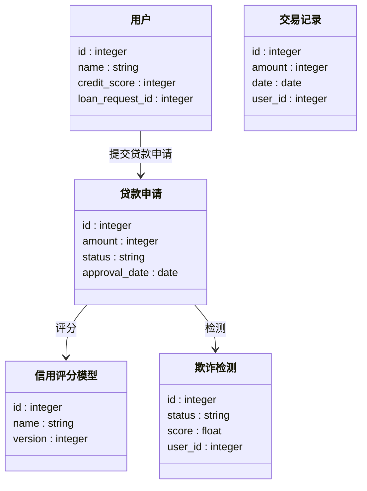
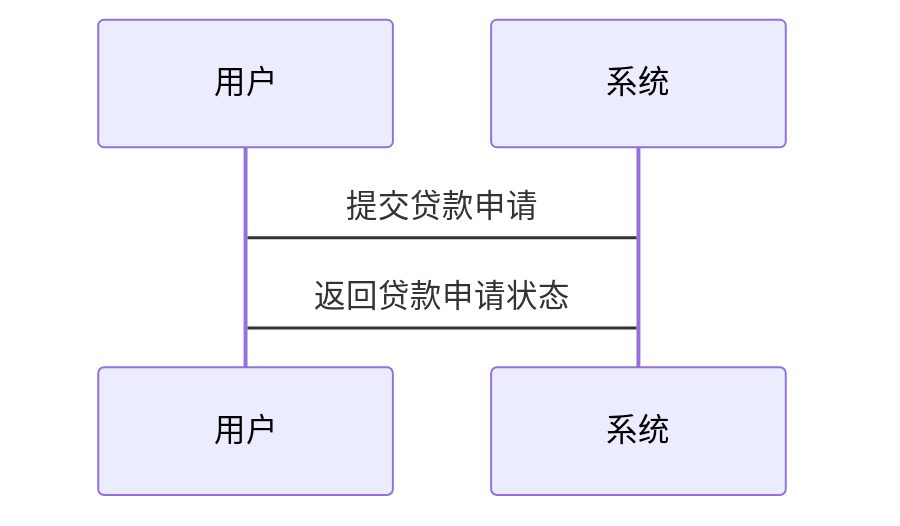

                 


# 智能个人信贷审批系统

## 关键词：智能信贷审批系统、人工智能、机器学习、金融系统、信用评分

## 摘要：  
智能个人信贷审批系统是一种结合人工智能技术的金融系统，用于自动化评估个人信用风险。通过机器学习模型和自然语言处理技术，系统能够快速、准确地对个人信贷申请进行审批，解决传统信贷审批中的低效和误差问题。本文将详细介绍智能个人信贷审批系统的背景、核心概念、算法原理、系统架构设计、项目实战以及最佳实践。

---

# 第一部分: 智能个人信贷审批系统概述

## 第1章: 智能个人信贷审批系统的背景与问题背景

### 1.1 问题背景

#### 1.1.1 传统信贷审批的痛点
传统信贷审批过程中，银行或金融机构通常依赖人工审核，存在以下问题：
- **效率低**：人工审核流程繁琐，耗时长，无法满足海量信贷申请的需求。
- **误差高**：人为判断容易受到主观因素影响，导致审批结果不准确。
- **成本高**：需要大量人工成本，且难以进行大规模并行处理。

#### 1.1.2 人工智能在金融领域的应用趋势
人工智能技术的快速发展为金融行业带来了新的机遇，特别是在信贷审批领域：
- **数据驱动决策**：通过机器学习模型分析海量数据，提高审批效率和准确性。
- **自动化流程**：利用自动化技术减少人工干预，降低运营成本。
- **实时处理**：通过实时数据分析，快速做出信贷审批决策。

#### 1.1.3 智能信贷审批的必要性
智能信贷审批系统的引入能够解决传统信贷审批中的痛点，满足现代金融行业对高效、精准审批的需求。通过人工智能技术，系统能够快速处理大量信贷申请，减少人为错误，提升客户体验。

---

### 1.2 问题描述

#### 1.2.1 信贷审批的核心流程
信贷审批的核心流程包括以下步骤：
1. **申请提交**：用户提交信贷申请，包括个人基本信息、财务数据等。
2. **数据收集与预处理**：系统收集申请人的信用历史、收入证明、负债情况等数据，并进行清洗和标准化。
3. **信用评分**：基于机器学习模型对申请人进行信用评分，评估其还款能力和风险。
4. **审批决策**：根据信用评分和规则引擎，系统自动做出信贷审批决策（批准或拒绝）。
5. **结果反馈**：将审批结果反馈给申请人。

#### 1.2.2 传统信贷审批的效率瓶颈
传统信贷审批过程中存在以下效率瓶颈：
- **人工审核**：需要大量时间进行人工审核和验证。
- **数据孤岛**：不同数据源之间缺乏整合，导致数据不完整或重复。
- **规则复杂**：传统信贷审批规则繁多，难以快速适应市场变化。

#### 1.2.3 数据驱动的信贷审批需求
智能信贷审批系统需要基于海量数据进行分析，包括：
- **结构化数据**：如信用报告、财务数据。
- **非结构化数据**：如社交媒体数据、文本数据。
- **实时数据**：如实时交易数据、行为数据。

---

### 1.3 问题解决

#### 1.3.1 智能信贷审批的解决方案
智能信贷审批系统通过以下方式解决传统信贷审批的痛点：
- **自动化处理**：利用自动化技术快速处理信贷申请，减少人工干预。
- **机器学习模型**：通过训练机器学习模型，提高信用评分的准确性和效率。
- **实时决策**：基于实时数据和模型预测，快速做出信贷审批决策。

#### 1.3.2 人工智能在信贷审批中的具体应用
人工智能在信贷审批中的具体应用包括：
- **信用评分模型**：使用机器学习算法（如逻辑回归、随机森林、梯度提升树）对申请人进行信用评分。
- **欺诈检测**：通过异常检测技术识别欺诈行为。
- **文本分析**：利用自然语言处理技术分析非结构化数据（如合同文本、社交媒体评论）。

#### 1.3.3 智能信贷审批系统的边界与外延
智能信贷审批系统的边界包括：
- **输入**：信贷申请数据、历史交易数据、外部数据源（如央行征信数据）。
- **输出**：信贷审批结果、信用评分、欺诈风险评分。
- **外部依赖**：第三方数据源、云计算平台、数据库。

---

### 1.4 概念结构与核心要素

#### 1.4.1 系统的核心概念
智能信贷审批系统的核心概念包括：
- **信贷申请**：用户的信贷申请信息。
- **信用评分**：基于机器学习模型对申请人进行评分。
- **欺诈检测**：识别欺诈行为。
- **审批决策**：系统根据评分和规则做出审批决策。

#### 1.4.2 核心要素的组成与关系
智能信贷审批系统的核心要素包括：
- **申请人信息**：包括基本信息、财务数据、信用历史等。
- **信用评分模型**：用于对申请人进行信用评分。
- **规则引擎**：基于评分和规则做出审批决策。
- **外部数据源**：如央行征信数据、社交网络数据。

#### 1.4.3 系统的架构与功能模块
智能信贷审批系统的架构包括以下功能模块：
- **数据采集模块**：负责采集信贷申请数据和外部数据。
- **数据预处理模块**：对数据进行清洗和标准化。
- **信用评分模块**：基于机器学习模型对申请人进行信用评分。
- **欺诈检测模块**：识别欺诈行为。
- **审批决策模块**：基于评分和规则做出审批决策。
- **结果反馈模块**：将审批结果反馈给申请人。

---

## 第2章: 智能个人信贷审批系统的核心概念与联系

### 2.1 核心概念原理

#### 2.1.1 人工智能在信贷审批中的应用原理
人工智能在信贷审批中的应用原理如下：
- **数据收集**：收集申请人信息、财务数据、信用历史等。
- **特征提取**：从数据中提取有用的特征（如收入、负债、信用历史）。
- **模型训练**：使用机器学习算法训练信用评分模型。
- **模型预测**：基于训练好的模型对申请人进行信用评分。
- **决策制定**：根据评分和规则做出审批决策。

#### 2.1.2 机器学习在信用评分中的作用
机器学习在信用评分中的作用包括：
- **特征选择**：自动选择重要的特征，提高模型的准确性。
- **模型训练**：训练分类模型（如逻辑回归、随机森林）进行信用评分。
- **模型评估**：评估模型的性能（如准确率、召回率、F1分数）。

#### 2.1.3 自然语言处理在信贷审批中的应用
自然语言处理在信贷审批中的应用包括：
- **文本分析**：分析合同文本、社交媒体评论等非结构化数据。
- **情感分析**：识别文本中的情感倾向，评估申请人的信用风险。
- **实体识别**：从文本中提取关键实体（如公司名称、地址）。

---

### 2.2 概念属性特征对比表格

| 概念       | 传统信贷审批 | 智能信贷审批 |
|------------|--------------|--------------|
| **审批效率** | 低效         | 高效         |
| **审批准确率** | 低           | 高           |
| **人工干预** | 高           | 低           |
| **处理时间** | 长           | 短           |
| **数据依赖** | 单一         | 多源         |

---

### 2.3 ER实体关系图

```mermaid
erDiagram
    user[用户] {
        id : integer
        name : string
        credit_score : integer
        loan_request_id : integer
    }
    loan_request[贷款申请] {
        id : integer
        amount : integer
        status : string
        approval_date : date
    }
    credit_score_model[信用评分模型] {
        id : integer
        name : string
        version : integer
    }
    transaction[交易记录] {
        id : integer
        amount : integer
        date : date
        user_id : integer
    }
    fraud_detection[欺诈检测] {
        id : integer
        status : string
        score : float
        user_id : integer
    }
```

---

## 第3章: 智能个人信贷审批系统的算法原理

### 3.1 算法原理概述

#### 3.1.1 信用评分模型
信用评分模型是智能信贷审批系统的核心算法之一。常用的信用评分模型包括：
- **逻辑回归**：用于分类问题，预测申请人违约的概率。
- **随机森林**：基于决策树的集成学习方法，适合处理高维数据。
- **梯度提升树**：如XGBoost、LightGBM，适合处理分类和回归问题。

#### 3.1.2 欺诈检测算法
欺诈检测算法用于识别欺诈行为，常用的算法包括：
- **聚类算法**：如K-Means，用于发现异常交易。
- **异常检测算法**：如Isolation Forest，用于识别异常行为。
- **监督学习算法**：如逻辑回归、随机森林，用于分类欺诈行为。

#### 3.1.3 文本分析算法
文本分析算法用于处理非结构化数据，常用的算法包括：
- **TF-IDF**：用于提取文本关键词。
- **词嵌入**：如Word2Vec、GloVe，用于表示文本数据。
- **情感分析**：用于识别文本中的情感倾向。

---

### 3.2 算法实现与优化

#### 3.2.1 信用评分模型的实现
以下是一个基于逻辑回归的信用评分模型的实现示例：

```python
import pandas as pd
from sklearn.model_selection import train_test_split
from sklearn.linear_model import LogisticRegression
from sklearn.metrics import accuracy_score

# 加载数据
data = pd.read_csv('credit_data.csv')

# 数据预处理
X = data.drop('default', axis=1)
y = data['default']

# 划分训练集和测试集
X_train, X_test, y_train, y_test = train_test_split(X, y, test_size=0.2, random_state=42)

# 训练逻辑回归模型
model = LogisticRegression()
model.fit(X_train, y_train)

# 预测
y_pred = model.predict(X_test)

# 评估准确率
print('Accuracy:', accuracy_score(y_test, y_pred))
```

#### 3.2.2 模型优化
模型优化包括以下几个方面：
- **特征选择**：使用特征重要性分析选择关键特征。
- **超参数调优**：使用网格搜索（Grid Search）或随机搜索（Random Search）优化模型参数。
- **模型融合**：使用集成学习方法（如投票法、加权法）提升模型性能。

---

## 第4章: 智能个人信贷审批系统的系统分析与架构设计

### 4.1 系统应用场景

#### 4.1.1 零售银行
智能信贷审批系统可以应用于零售银行，帮助银行快速处理个人信贷申请，提高客户满意度。

#### 4.1.2 消费金融
在消费金融领域，智能信贷审批系统可以用于评估客户的信用风险，支持消费信贷产品的审批。

#### 4.1.3 小微企业贷款
对于小微企业贷款，智能信贷审批系统可以通过分析企业的财务数据和市场表现，快速做出信贷决策。

---

### 4.2 系统功能设计

#### 4.2.1 领域模型
以下是系统领域的模型：



#### 4.2.2 系统架构设计
以下是系统的架构设计图：


#### 4.2.3 系统接口设计
以下是系统的接口设计：



---

## 第5章: 智能个人信贷审批系统的项目实战

### 5.1 环境安装

#### 5.1.1 安装Python环境
建议使用Anaconda或Miniconda来安装Python环境。具体安装步骤如下：
1. 下载并安装Anaconda：[https://www.anaconda.com](https://www.anaconda.com)
2. 使用命令 `conda create -n myenv python=3.8` 创建虚拟环境。
3. 激活虚拟环境：`conda activate myenv`

#### 5.1.2 安装依赖库
安装以下依赖库：
- `pandas`：用于数据处理
- `scikit-learn`：用于机器学习
- `mermaid`：用于绘制图表
- `jupyter`：用于数据探索

---

### 5.2 系统核心实现

#### 5.2.1 信用评分模型的实现
以下是一个基于逻辑回归的信用评分模型的实现示例：

```python
import pandas as pd
from sklearn.model_selection import train_test_split
from sklearn.linear_model import LogisticRegression
from sklearn.metrics import accuracy_score

# 加载数据
data = pd.read_csv('credit_data.csv')

# 数据预处理
X = data.drop('default', axis=1)
y = data['default']

# 划分训练集和测试集
X_train, X_test, y_train, y_test = train_test_split(X, y, test_size=0.2, random_state=42)

# 训练逻辑回归模型
model = LogisticRegression()
model.fit(X_train, y_train)

# 预测
y_pred = model.predict(X_test)

# 评估准确率
print('Accuracy:', accuracy_score(y_test, y_pred))
```

#### 5.2.2 欺诈检测的实现
以下是一个基于Isolation Forest的欺诈检测实现示例：

```python
import pandas as pd
from sklearn.ensemble import IsolationForest
from sklearn.metrics import accuracy_score

# 加载数据
data = pd.read_csv('fraud_data.csv')

# 数据预处理
X = data.drop('is_fraud', axis=1)
y = data['is_fraud']

# 划分训练集和测试集
X_train, X_test, y_train, y_test = train_test_split(X, y, test_size=0.2, random_state=42)

# 训练Isolation Forest模型
model = IsolationForest(n_estimators=100, random_state=42)
model.fit(X_train, y_train)

# 预测
y_pred = model.predict(X_test)

# 转换预测结果为二进制标签
y_pred = [0 if x == 1 else 1 for x in y_pred]

# 评估准确率
print('Accuracy:', accuracy_score(y_test, y_pred))
```

---

### 5.3 代码应用解读与分析

#### 5.3.1 信用评分模型的解读
信用评分模型的实现代码如下：
1. **数据加载**：使用 `pandas` 加载数据。
2. **数据预处理**：删除目标变量 `default`，并将数据划分为训练集和测试集。
3. **模型训练**：使用逻辑回归模型进行训练。
4. **模型预测**：对测试集进行预测。
5. **模型评估**：计算准确率。

#### 5.3.2 欺诈检测的解读
欺诈检测的实现代码如下：
1. **数据加载**：使用 `pandas` 加载数据。
2. **数据预处理**：删除目标变量 `is_fraud`，并将数据划分为训练集和测试集。
3. **模型训练**：使用Isolation Forest模型进行训练。
4. **模型预测**：对测试集进行预测，并将预测结果转换为二进制标签。
5. **模型评估**：计算准确率。

---

### 5.4 实际案例分析

#### 5.4.1 信用评分案例
假设我们有以下数据：

| id | income | debt | default |
|----|--------|------|---------|
| 1  | 50000  | 20000| 0       |
| 2  | 60000  | 30000| 1       |
| 3  | 40000  | 10000| 0       |
| 4  | 70000  | 40000| 1       |

通过逻辑回归模型，我们可以预测每个申请人的违约概率。

---

### 5.5 项目小结

通过本章的项目实战，我们详细讲解了智能个人信贷审批系统的实现过程，包括环境安装、系统核心功能的实现、代码解读与分析以及实际案例的分析。通过这些内容，读者可以深入了解智能信贷审批系统的实现细节，并能够将其应用于实际场景中。

---

## 第6章: 智能个人信贷审批系统的最佳实践

### 6.1 小结
智能个人信贷审批系统的引入能够显著提高信贷审批的效率和准确性。通过人工智能技术的应用，系统能够快速处理海量数据，并基于机器学习模型做出精准的信贷审批决策。

---

### 6.2 注意事项

#### 6.2.1 数据隐私与安全
在实际应用中，需要注意数据隐私和安全问题，确保数据不会被泄露或滥用。

#### 6.2.2 模型解释性
为了提高模型的透明度，需要确保模型具有良好的解释性，方便业务人员理解和使用。

#### 6.2.3 模型更新与维护
为了保证模型的准确性，需要定期更新模型，并根据市场变化进行调整。

---

### 6.3 拓展阅读

#### 6.3.1 推荐书籍
- 《机器学习实战》
- 《Python机器学习》
- 《数据挖掘导论》

#### 6.3.2 推荐博客与文章
- [机器学习入门](https://www.machinelearning mastery.com)
- [Python数据科学](https://towardsdatascience.com)
- [深度学习](https://www.deeplearning.cn)

---

## 作者：AI天才研究院/AI Genius Institute & 禅与计算机程序设计艺术 /Zen And The Art of Computer Programming

---

以上是《智能个人信贷审批系统》的完整目录大纲和文章内容，希望对您有所帮助！

