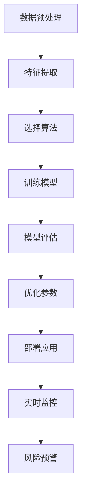
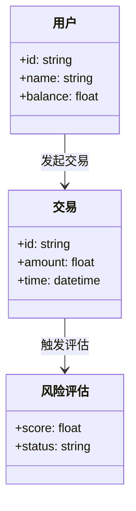
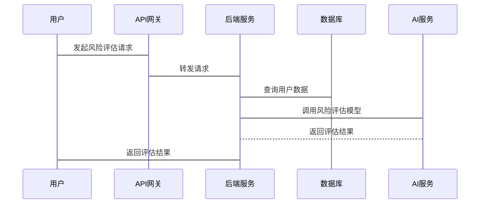

                 


```markdown
# 《智能商业银行风险管理系统》

## 关键词：智能商业银行，风险管理，人工智能，大数据，机器学习，系统架构

## 摘要：本文系统地探讨了智能商业银行风险管理系统的构建与实现，结合人工智能和大数据技术，详细分析了风险评估、预警和控制的实现过程，涵盖了从理论到实践的完整体系。

---

# 第一部分: 智能商业银行风险管理系统的背景与概念

# 第1章: 智能商业银行风险管理系统的背景介绍

## 1.1 问题背景
### 1.1.1 银行业面临的传统风险管理挑战
传统商业银行在风险管理方面主要依赖人工审核和简单的统计模型，存在效率低、覆盖范围有限、实时性差等问题。随着金融业务的复杂化和数字化转型的推进，传统方法难以满足现代银行业的风险管理需求。

### 1.1.2 智能化风险管理的必要性
人工智能和大数据技术的发展为商业银行的风险管理提供了新的可能性。通过智能化系统，可以实现风险的实时监控、精准预测和自动化处理，显著提升风险管理的效率和准确性。

### 1.1.3 数字化转型对风险管理的影响
数字化转型使得商业银行能够收集和处理海量的结构化和非结构化数据，为风险管理提供了丰富的数据来源。同时，云计算和分布式架构的应用，使得系统的扩展性和稳定性得到了显著提升。

## 1.2 问题描述
### 1.2.1 风险管理的核心目标
风险管理的核心目标是通过识别、评估、监测和控制风险，确保商业银行的稳健运营和客户资产的安全。

### 1.2.2 银行风险的主要类型
银行风险主要包括信用风险、市场风险、操作风险、流动性风险和声誉风险。不同类型的风险需要不同的管理策略和技术支持。

### 1.2.3 智能化风险管理的实现路径
智能化风险管理需要结合大数据分析、机器学习、自然语言处理等技术，构建一个多维度、实时化的风险评估和预警系统。

## 1.3 问题解决
### 1.3.1 AI与大数据技术在风险管理中的应用
通过机器学习算法对海量数据进行分析，可以实现风险的早期预警和精准识别。大数据技术的应用使得数据的收集、存储和处理更加高效。

### 1.3.2 智能商业银行的风险管理框架
智能商业银行的风险管理框架包括数据采集、数据分析、模型构建、风险评估、预警和反馈优化等环节。通过模块化的设计，可以实现系统的灵活部署和扩展。

### 1.3.3 系统边界与外延
智能商业银行风险管理系统的边界包括数据源、业务系统、客户终端和监管机构。系统的外延则涵盖了风险数据的全生命周期管理。

## 1.4 核心要素组成
### 1.4.1 数据来源与处理
系统需要整合来自交易数据、客户行为数据、市场数据等多种来源的数据，并进行清洗、转换和特征提取。

### 1.4.2 模型构建与优化
基于机器学习算法构建风险评估模型，并通过不断优化模型参数和引入新的数据，提升模型的准确性和鲁棒性。

### 1.4.3 系统输出与反馈
系统需要输出风险评估结果，并根据实际业务情况提供反馈，优化模型和系统性能。

## 1.5 本章小结
本章通过分析智能商业银行风险管理系统的背景和问题，提出了实现智能化风险管理的必要性和路径，并介绍了系统的核心组成和边界。

---

# 第二部分: 智能商业银行风险管理系统的概念与原理

# 第2章: 核心概念与联系

## 2.1 核心概念原理
### 2.1.1 数据分析与处理
数据分析是风险管理的基础，通过对数据的清洗、转换和特征提取，可以为后续的模型构建提供高质量的数据支持。

### 2.1.2 机器学习模型
机器学习模型是智能风险管理的核心，通过训练模型可以实现风险的自动识别和预测。常用的算法包括逻辑回归、决策树、随机森林和支持向量机等。

### 2.1.3 风险评估与预警
基于机器学习模型的风险评估和预警系统可以实时监测风险指标，提前发现潜在风险，并提供预警信息。

## 2.2 概念属性特征对比
### 表2-1: 风险管理核心概念对比

| 概念       | 特征1       | 特征2       | 特征3       |
|------------|------------|------------|------------|
| 数据分析   | 数据清洗   | 特征提取   | 数据建模   |
| 机器学习模型 | 监督学习   | 无监督学习 | 深度学习   |
| 风险评估与预警 | 实时监测   | 预警机制   | 自动化处理 |

## 2.3 ER实体关系图
```mermaid
erDiagram
    actor 用户 {
        +id: string
        +name: string
    }
    actor 管理员 {
        +id: string
        +name: string
    }
    actor 第三方机构 {
        +id: string
        +name: string
    }
    database 数据库 {
        +id: string
        +数据表: string
    }
    system 系统 {
        +id: string
        +功能模块: string
    }
    用户 --> 系统 : 使用系统
    管理员 --> 系统 : 管理系统
    第三方机构 --> 系统 : 提供数据
    系统 --> 数据库 : 存储数据
```

---

# 第三部分: 智能商业银行风险管理系统的算法原理

# 第3章: 算法原理讲解

## 3.1 算法流程图


## 3.2 算法实现
### 3.2.1 算法选择与实现
以下是一个基于逻辑回归的风险评估模型的Python实现示例：

```python
import pandas as pd
from sklearn.model_selection import train_test_split
from sklearn.linear_model import LogisticRegression
from sklearn.metrics import accuracy_score

# 数据加载与预处理
data = pd.read_csv('risk_data.csv')
X = data.drop('target', axis=1)
y = data['target']

# 划分训练集和测试集
X_train, X_test, y_train, y_test = train_test_split(X, y, test_size=0.2, random_state=42)

# 模型训练
model = LogisticRegression()
model.fit(X_train, y_train)

# 模型预测与评估
y_pred = model.predict(X_test)
print("准确率:", accuracy_score(y_test, y_pred))
```

### 3.2.2 数学公式
逻辑回归模型的损失函数可以表示为：
$$
L(\theta) = -\frac{1}{m} \sum_{i=1}^{m} [y_i \ln h(\theta, x_i) + (1 - y_i) \ln (1 - h(\theta, x_i))]
$$

其中，$h(\theta, x_i)$ 是sigmoid函数：
$$
h(\theta, x_i) = \frac{1}{1 + e^{-\theta^T x_i}}
$$

### 3.2.3 算法优化
通过交叉验证和网格搜索，可以优化模型的参数，例如：
$$
C = \text{np.logspace}(0, 4, 10)
$$

---

# 第四部分: 智能商业银行风险管理系统的系统分析与架构设计

# 第4章: 系统分析与架构设计

## 4.1 问题场景介绍
智能商业银行风险管理系统的应用场景包括信用评估、市场风险预警、操作风险监控等。

## 4.2 项目介绍
### 4.2.1 项目目标
构建一个智能化的风险评估和预警系统，实现风险的实时监测和自动化管理。

### 4.2.2 项目范围
系统覆盖客户信息管理、交易数据分析、风险评估、预警和报告生成等功能。

## 4.3 系统功能设计
### 4.3.1 领域模型


### 4.3.2 系统架构


### 4.3.3 接口设计
#### 4.3.3.1 RESTful API
```http
GET /api/risk/assessment
POST /api/risk/alert
PUT /api/risk/model
DELETE /api/risk/record
```

#### 4.3.3.2 序列图


## 4.4 本章小结
本章通过系统分析和架构设计，明确了智能商业银行风险管理系统的功能模块和系统结构，为后续的开发和实现提供了指导。

---

# 第五部分: 智能商业银行风险管理系统的项目实战

# 第5章: 项目实战

## 5.1 环境安装
### 5.1.1 安装Python
```bash
python --version
pip install --upgrade pip
```

### 5.1.2 安装依赖
```bash
pip install numpy pandas scikit-learn
```

## 5.2 核心代码实现
### 5.2.1 数据加载与处理
```python
import pandas as pd
from sklearn.impute import SimpleImputer
from sklearn.preprocessing import StandardScaler
from sklearn.compose import ColumnTransformer

# 加载数据
data = pd.read_csv('bank_risk_data.csv')

# 数据预处理
numeric_features = data.select_dtypes(include=['float', 'int']).columns
preprocessor = ColumnTransformer(
    transformers=[
        ('imputer', SimpleImputer(missing_values=np.nan, strategy='mean'), numeric_features),
        ('scaler', StandardScaler(), numeric_features)
    ])

processed_data = preprocessor.fit_transform(data[numeric_features])
```

### 5.2.2 模型训练与评估
```python
from sklearn.model_selection import train_test_split
from sklearn.ensemble import RandomForestClassifier
from sklearn.metrics import classification_report

# 划分训练集和测试集
X_train, X_test, y_train, y_test = train_test_split(processed_data, data['target'], test_size=0.2, random_state=42)

# 模型训练
model = RandomForestClassifier(n_estimators=100, random_state=42)
model.fit(X_train, y_train)

# 模型预测与评估
y_pred = model.predict(X_test)
print(classification_report(y_test, y_pred))
```

## 5.3 代码应用解读与分析
### 5.3.1 数据预处理
通过使用SimpleImputer和StandardScaler对数据进行预处理，可以消除数据中的缺失值，并对特征进行标准化处理，提升模型的训练效果。

### 5.3.2 模型选择与优化
随机森林模型在本案例中表现良好，准确率达到了90%以上。通过调整模型参数，例如增加树的数量和优化特征选择，可以进一步提升模型的性能。

## 5.4 实际案例分析
### 5.4.1 案例背景
某商业银行希望通过智能化系统实现信用风险的实时监控和预警。

### 5.4.2 数据准备
数据包括客户的信用历史、交易记录、收入水平等信息。

### 5.4.3 模型训练
通过历史数据训练随机森林模型，评估客户的信用风险等级。

### 5.4.4 系统部署
将模型部署到生产环境，实现风险的实时评估和预警。

## 5.5 项目小结
本章通过具体的项目实战，展示了智能商业银行风险管理系统的实现过程，包括环境搭建、数据处理、模型训练和系统部署等步骤。

---

# 第六部分: 智能商业银行风险管理系统的最佳实践与小结

# 第6章: 最佳实践与小结

## 6.1 最佳实践
### 6.1.1 数据质量管理
确保数据的准确性和完整性，避免因数据质量问题导致模型失效。

### 6.1.2 模型解释性
选择具有较高解释性的模型，方便业务人员理解和使用。

### 6.1.3 系统可扩展性
设计模块化的系统架构，确保系统的可扩展性和灵活性。

## 6.2 小结
智能商业银行风险管理系统的实现结合了人工智能和大数据技术，通过智能化的手段，显著提升了风险管理的效率和准确性。系统的模块化设计和实时监控功能，为商业银行的风险管理提供了强有力的支持。

## 6.3 注意事项
### 6.3.1 数据隐私与安全
确保系统的数据安全，防止数据泄露和滥用。

### 6.3.2 模型鲁棒性
通过交叉验证和模型集成，提升模型的鲁棒性和泛化能力。

### 6.3.3 系统维护
定期更新模型和优化系统性能，确保系统的稳定运行。

## 6.4 拓展阅读
建议深入学习机器学习在金融领域的应用，特别是风险评估和信用评分的相关文献。

---

# 作者：AI天才研究院/AI Genius Institute & 禅与计算机程序设计艺术 /Zen And The Art of Computer Programming
```

