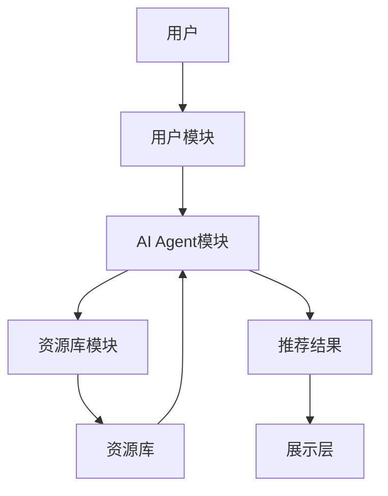

                 


# 智能图书馆：AI Agent的资源推荐系统

> 关键词：智能图书馆，AI Agent，资源推荐系统，协同过滤，知识图谱，多智能体系统，个性化推荐

> 摘要：智能图书馆利用AI Agent技术，通过智能化的资源推荐系统，为用户提供高效、精准的服务。本文深入探讨AI Agent在资源推荐中的应用，分析其核心算法、系统架构，并通过项目实战展示其实现过程，最后总结其优化与扩展的方向。

---

# 第1章: 智能图书馆的背景与概念

## 1.1 智能图书馆的定义与特点

### 1.1.1 智能图书馆的定义
智能图书馆是一种结合了人工智能技术的现代化图书馆管理模式，通过AI技术实现资源的智能化管理和推荐服务。其核心目标是为用户提供个性化的资源推荐和高效的查询服务。

### 1.1.2 智能图书馆的核心特点
- **智能化**：通过AI算法实现自动化推荐和管理。
- **个性化**：根据用户需求提供定制化服务。
- **高效性**：快速定位用户所需资源。
- **动态性**：实时更新推荐结果，适应用户行为变化。

### 1.1.3 智能图书馆与传统图书馆的区别
| 特性            | 智能图书馆                 | 传统图书馆               |
|-----------------|---------------------------|--------------------------|
| 管理模式        | 自动化、智能化               | 人工管理、固定流程       |
| 资源推荐        | 个性化、精准推荐             | 普通推荐、基于分类       |
| 用户体验        | 高效、便捷                 | 繁杂、耗时               |

## 1.2 AI Agent的基本概念

### 1.2.1 什么是AI Agent
AI Agent（智能代理）是一种能够感知环境并采取行动以实现目标的计算机系统。它可以理解用户需求，主动提供服务，并通过与环境和其他Agent的交互来优化结果。

### 1.2.2 AI Agent的核心特征
- **自主性**：无需人工干预，自动执行任务。
- **反应性**：能够感知环境变化并做出响应。
- **目标导向性**：基于目标进行决策和行动。
- **学习能力**：通过数据不断优化自身行为。

### 1.2.3 AI Agent的应用场景
- **资源推荐**：根据用户行为推荐相关资源。
- **自动化管理**：自动整理和分类资源。
- **智能交互**：通过自然语言处理与用户互动。

## 1.3 智能图书馆中AI Agent的角色

### 1.3.1 AI Agent在资源推荐中的作用
- **需求分析**：通过分析用户行为和偏好，生成个性化推荐。
- **资源匹配**：基于用户需求，快速匹配相关资源。
- **反馈优化**：根据用户反馈调整推荐策略，提升推荐准确率。

### 1.3.2 AI Agent与其他技术的结合
- **知识图谱**：构建资源之间的语义关联，提升推荐精度。
- **多智能体系统**：多个AI Agent协同工作，共同完成复杂任务。
- **自然语言处理**：通过NLP技术实现智能交互。

### 1.3.3 智能图书馆的未来发展趋势
- **智能化升级**：进一步提升AI Agent的自主性和学习能力。
- **多模态推荐**：结合图像、视频等多种媒介，提供更丰富的推荐内容。
- **实时性增强**：优化推荐速度，实现准实时反馈。

---

# 第2章: AI Agent的资源推荐系统

## 2.1 资源推荐系统的背景

### 2.1.1 资源推荐系统的定义
资源推荐系统是一种通过分析用户行为和偏好，推荐相关资源的系统。其核心目标是提高用户满意度和资源利用率。

### 2.1.2 资源推荐系统的应用场景
- **图书馆**：推荐书籍、论文等资源。
- **在线教育平台**：推荐课程和学习资料。
- **电商平台**：推荐商品和相关内容。

### 2.1.3 资源推荐系统的核心问题
- **数据稀疏性**：用户行为数据不足，导致推荐准确率低。
- **冷启动问题**：新用户或新资源难以快速获得推荐。
- **动态变化**：用户偏好和资源内容可能随时间变化。

## 2.2 AI Agent在资源推荐中的优势

### 2.2.1 AI Agent的学习能力
AI Agent可以通过机器学习算法不断优化推荐策略，提升推荐准确率。

### 2.2.2 AI Agent的自适应能力
AI Agent能够实时感知环境变化，动态调整推荐策略，适应用户需求变化。

### 2.2.3 AI Agent的实时性与准确性
通过实时数据分析和反馈机制，AI Agent可以快速生成准确的推荐结果。

## 2.3 资源推荐系统的分类

### 2.3.1 基于协同过滤的推荐系统
协同过滤是一种基于用户相似性或物品相似性的推荐方法。

#### 1. 基于用户的协同过滤
- **算法原理**：通过分析用户行为，找到与目标用户相似的用户，推荐这些用户喜欢的资源。
- **优点**：推荐结果更贴近用户需求。
- **缺点**：计算复杂度高，难以处理大规模数据。

#### 2. 基于物品的协同过滤
- **算法原理**：分析物品之间的相似性，推荐与目标物品相似的资源。
- **优点**：计算复杂度较低，适合大规模数据。
- **缺点**：难以捕捉用户个性化需求。

### 2.3.2 基于内容的推荐系统
基于内容的推荐系统通过分析资源的内容特征，推荐与用户兴趣相符的资源。

#### 1. 文本分析
- **算法原理**：使用自然语言处理技术提取资源的内容特征，如关键词、主题等。
- **优点**：推荐结果与用户兴趣高度相关。
- **缺点**：需要大量高质量的内容特征提取。

### 2.3.3 混合推荐系统
混合推荐系统结合协同过滤和基于内容的推荐方法，通过融合两种方法的优势，提升推荐准确率。

---

# 第3章: 智能图书馆的系统架构

## 3.1 智能图书馆的系统组成

### 3.1.1 用户模块
- **功能**：接收用户请求，分析用户需求。
- **输入**：用户查询、用户行为数据。
- **输出**：推荐结果、反馈信息。

### 3.1.2 资源库模块
- **功能**：存储和管理各种资源，如书籍、论文、期刊等。
- **输入**：资源上传、更新请求。
- **输出**：资源信息、资源特征。

### 3.1.3 AI Agent模块
- **功能**：分析用户需求，匹配资源，生成推荐结果。
- **输入**：用户需求、资源特征。
- **输出**：推荐列表、反馈结果。

## 3.2 系统功能设计

### 3.2.1 用户需求分析
- **需求解析**：通过自然语言处理技术，解析用户查询的意图。
- **用户画像**：基于历史行为数据，构建用户画像，分析用户的兴趣和偏好。

### 3.2.2 资源匹配算法
- **协同过滤算法**：基于用户相似性和物品相似性，匹配相关资源。
- **内容分析算法**：基于资源内容特征，推荐相关资源。

### 3.2.3 推荐结果展示
- **推荐列表**：按优先级展示推荐资源。
- **反馈收集**：收集用户反馈，优化推荐策略。

## 3.3 系统架构图

### 3.3.1 系统架构的层次结构


### 3.3.2 模块之间的交互关系
- 用户模块接收用户请求，传递给AI Agent模块。
- AI Agent模块分析需求，查询资源库模块获取资源信息。
- 资源库模块返回资源信息，AI Agent模块生成推荐结果。
- 推荐结果传递给展示层，供用户查看。

## 3.4 系统的可扩展性

### 3.4.1 功能扩展
- **多模态推荐**：结合图像、视频等多种资源类型，提供更丰富的推荐内容。
- **实时推荐**：优化推荐算法，实现准实时反馈。

### 3.4.2 组件扩展
- **分布式架构**：通过分布式计算提升系统处理能力。
- **模块化设计**：便于功能扩展和维护。

---

# 第4章: AI Agent的算法实现

## 4.1 算法原理

### 4.1.1 协同过滤算法

#### 4.1.1.1 基于用户的协同过滤
- **数学模型**：
  $$ sim(u, v) = \frac{\sum_{i} (r_{u,i} - \bar{r}_u)(r_{v,i} - \bar{r}_v)}{\sqrt{\sum_{i} (r_{u,i} - \bar{r}_u)^2} \cdot \sqrt{\sum_{i} (r_{v,i} - \bar{r}_v)^2}} $$
  其中，$sim(u, v)$ 表示用户 $u$ 和 $v$ 的相似度，$r_{u,i}$ 表示用户 $u$ 对物品 $i$ 的评分，$\bar{r}_u$ 表示用户 $u$ 的平均评分。

- **优点**：推荐结果与用户需求高度相关。
- **缺点**：计算复杂度高，难以处理大规模数据。

#### 4.1.1.2 基于物品的协同过滤
- **数学模型**：
  $$ sim(i, j) = \frac{\sum_{u} (r_{u,i} - \bar{r}_i)(r_{u,j} - \bar{r}_j)}{\sqrt{\sum_{u} (r_{u,i} - \bar{r}_i)^2} \cdot \sqrt{\sum_{u} (r_{u,j} - \bar{r}_j)^2}} $$
  其中，$sim(i, j)$ 表示物品 $i$ 和 $j$ 的相似度，$r_{u,i}$ 表示用户 $u$ 对物品 $i$ 的评分，$\bar{r}_i$ 表示物品 $i$ 的平均评分。

- **优点**：计算复杂度低，适合大规模数据。
- **缺点**：难以捕捉用户个性化需求。

### 4.1.2 基于内容的推荐算法

#### 4.1.2.1 文本分析
- **关键词提取**：使用TF-IDF算法提取文本中的关键词。
- **主题建模**：使用LDA主题模型分析文本主题。

#### 4.1.2.2 资源特征提取
- **向量表示**：将资源内容转化为向量表示，如Word2Vec、TF-IDF等。

#### 4.1.2.3 相似度计算
- **余弦相似度**：
  $$ sim(v1, v2) = \frac{v1 \cdot v2}{\|v1\| \|v2\|} $$
  其中，$v1$ 和 $v2$ 分别是两个资源的向量表示。

### 4.1.3 混合推荐算法

#### 4.1.3.1 组件权重分配
- **线性组合**：根据实验结果，为协同过滤和基于内容的推荐结果分配不同的权重。

#### 4.1.3.2 综合评分计算
- **公式**：
  $$ score = \alpha \cdot score_{cf} + (1 - \alpha) \cdot score_{content} $$
  其中，$\alpha$ 是协同过滤的权重，$score_{cf}$ 是协同过滤的评分，$score_{content}$ 是基于内容的评分。

## 4.2 算法实现

### 4.2.1 协同过滤算法的实现

#### 4.2.1.1 数据预处理
- **数据清洗**：去除缺失值和异常值。
- **数据归一化**：对评分数据进行归一化处理。

#### 4.2.1.2 相似度计算
- 使用Python实现基于用户的协同过滤算法，计算用户之间的相似度。

#### 4.2.1.3 推荐生成
- 根据相似用户的评分，生成推荐列表。

### 4.2.2 基于内容的推荐算法的实现

#### 4.2.2.1 资源特征提取
- 使用自然语言处理技术，提取资源内容的关键词和主题。

#### 4.2.2.2 相似度计算
- 使用余弦相似度计算资源之间的相似度。

#### 4.2.2.3 推荐生成
- 根据相似度排序，生成推荐列表。

### 4.2.3 混合推荐算法的实现

#### 4.2.3.1 组件权重分配
- 根据实验结果，为协同过滤和基于内容的推荐结果分配权重。

#### 4.2.3.2 综合评分计算
- 根据公式计算综合评分，生成最终的推荐列表。

---

# 第5章: 项目实战

## 5.1 环境安装

### 5.1.1 安装Python
- 安装Python 3.8以上版本。
- 安装必要的Python包，如pandas、numpy、scikit-learn、nltk等。

### 5.1.2 安装依赖
- 使用pip安装所需的第三方库：
  ```bash
  pip install pandas numpy scikit-learn nltk
  ```

## 5.2 系统核心实现

### 5.2.1 协同过滤算法的实现

#### 5.2.1.1 数据预处理
```python
import pandas as pd
import numpy as np

# 读取数据
data = pd.read_csv('ratings.csv')

# 数据清洗
data.dropna(inplace=True)

# 数据归一化
data['rating'] = (data['rating'] - data['rating'].mean()) / data['rating'].std()
```

#### 5.2.1.2 相似度计算
```python
from sklearn.metrics.pairwise import cosine_similarity

# 计算用户相似度矩阵
user_similarity = cosine_similarity(data[['rating1', 'rating2', 'rating3', 'rating4', 'rating5']])
```

#### 5.2.1.3 推荐生成
```python
def get_recommendations(user_id, user_similarity, data):
    # 找到与目标用户相似度最高的用户
    similar_users = np.argsort(user_similarity[user_id])[::-1]
    
    # 根据相似用户的评分，生成推荐列表
    recommendations = []
    for user in similar_users:
        recommendations.append(data.iloc[user]['item'])
    
    return recommendations
```

### 5.2.2 基于内容的推荐算法的实现

#### 5.2.2.1 资源特征提取
```python
from sklearn.feature_extraction.text import TfidfVectorizer

# 初始化向量器
vectorizer = TfidfVectorizer()

# 提取关键词特征
tfidf_matrix = vectorizer.fit_transform(data['content'])
```

#### 5.2.2.2 相似度计算
```python
# 计算余弦相似度
item_similarity = cosine_similarity(tfidf_matrix)
```

#### 5.2.2.3 推荐生成
```python
def get_content_recommendations(item_id, item_similarity, data):
    # 找到与目标物品相似度最高的物品
    similar_items = np.argsort(item_similarity[item_id])[::-1]
    
    # 根据相似物品的评分，生成推荐列表
    recommendations = []
    for item in similar_items:
        recommendations.append(data.iloc[item]['item'])
    
    return recommendations
```

### 5.2.3 混合推荐算法的实现

#### 5.2.3.1 组件权重分配
```python
alpha = 0.6  # 协同过滤的权重
beta = 0.4  # 基于内容的权重
```

#### 5.2.3.2 综合评分计算
```python
def get_hybrid_recommendations(user_id, alpha, beta, data):
    # 协同过滤推荐
    cf_recommendations = get_recommendations(user_id, user_similarity, data)
    
    # 基于内容的推荐
    content_recommendations = get_content_recommendations(user_id, item_similarity, data)
    
    # 综合评分
    hybrid_recommendations = []
    for i in range(len(cf_recommendations)):
        hybrid_recommendations.append((cf_recommendations[i], alpha))
    for i in range(len(content_recommendations)):
        hybrid_recommendations.append((content_recommendations[i], beta))
    
    # 排序
    hybrid_recommendations.sort(key=lambda x: -(x[1]))
    
    return [rec[0] for rec in hybrid_recommendations]
```

## 5.3 代码实现

### 5.3.1 协同过滤算法的实现
```python
import pandas as pd
import numpy as np
from sklearn.metrics.pairwise import cosine_similarity

# 读取数据
data = pd.read_csv('ratings.csv')

# 数据清洗
data.dropna(inplace=True)

# 数据归一化
data['rating'] = (data['rating'] - data['rating'].mean()) / data['rating'].std()

# 计算用户相似度矩阵
user_similarity = cosine_similarity(data[['rating1', 'rating2', 'rating3', 'rating4', 'rating5']])
```

### 5.3.2 基于内容的推荐算法的实现
```python
from sklearn.feature_extraction.text import TfidfVectorizer
from sklearn.metrics.pairwise import cosine_similarity

# 初始化向量器
vectorizer = TfidfVectorizer()

# 提取关键词特征
tfidf_matrix = vectorizer.fit_transform(data['content'])

# 计算余弦相似度
item_similarity = cosine_similarity(tfidf_matrix)
```

### 5.3.3 混合推荐算法的实现
```python
alpha = 0.6  # 协同过滤的权重
beta = 0.4  # 基于内容的权重

# 协同过滤推荐
cf_recommendations = get_recommendations(user_id, user_similarity, data)

# 基于内容的推荐
content_recommendations = get_content_recommendations(user_id, item_similarity, data)

# 综合评分
hybrid_recommendations = []
for i in range(len(cf_recommendations)):
    hybrid_recommendations.append((cf_recommendations[i], alpha))
for i in range(len(content_recommendations)):
    hybrid_recommendations.append((content_recommendations[i], beta))

# 排序
hybrid_recommendations.sort(key=lambda x: -(x[1]))

# 生成最终推荐列表
final_recommendations = [rec[0] for rec in hybrid_recommendations]
```

## 5.4 实际案例分析

### 5.4.1 案例背景
假设我们有一个包含1000个用户的图书推荐系统，每个用户有5个评分数据和一些图书内容描述。

### 5.4.2 数据预处理
```python
# 读取数据
data = pd.read_csv('book_ratings.csv')

# 数据清洗
data.dropna(inplace=True)

# 数据归一化
data['rating'] = (data['rating'] - data['rating'].mean()) / data['rating'].std()
```

### 5.4.3 算法实现
```python
# 计算用户相似度矩阵
user_similarity = cosine_similarity(data[['rating1', 'rating2', 'rating3', 'rating4', 'rating5']])

# 计算物品相似度矩阵
item_similarity = cosine_similarity(tfidf_matrix)
```

### 5.4.4 推荐生成
```python
user_id = 5  # 目标用户

# 协同过滤推荐
cf_recommendations = get_recommendations(user_id, user_similarity, data)

# 基于内容的推荐
content_recommendations = get_content_recommendations(user_id, item_similarity, data)

# 混合推荐
hybrid_recommendations = get_hybrid_recommendations(user_id, alpha, beta, data)
```

### 5.4.5 结果展示
```python
print("协同过滤推荐结果：")
print(cf_recommendations)

print("基于内容的推荐结果：")
print(content_recommendations)

print("混合推荐结果：")
print(hybrid_recommendations)
```

---

# 第6章: 优化与扩展

## 6.1 优化策略

### 6.1.1 提升推荐准确率
- **改进算法**：引入深度学习模型，如神经网络、循环神经网络等，提升推荐准确率。
- **优化特征提取**：使用更复杂的特征提取方法，如BERT模型，提升内容理解能力。

### 6.1.2 提高推荐速度
- **分布式计算**：通过分布式计算框架，如Spark，优化计算速度。
- **缓存机制**：缓存热门资源的推荐结果，减少重复计算。

### 6.1.3 提升用户体验
- **实时推荐**：优化算法，实现准实时反馈。
- **个性化界面**：根据用户偏好，提供个性化的界面设计。

## 6.2 系统扩展

### 6.2.1 多模态推荐
- **图像推荐**：结合图像识别技术，推荐相关的图像资源。
- **视频推荐**：结合视频分析技术，推荐相关的视频资源。

### 6.2.2 实时推荐
- **实时数据处理**：通过流处理技术，实时分析用户行为，动态调整推荐策略。
- **准实时反馈**：优化算法，实现准实时的推荐结果。

### 6.2.3 多语言支持
- **多语言推荐**：支持多种语言的资源推荐，满足国际化需求。

---

# 第7章: 总结与展望

## 7.1 全文总结
智能图书馆通过AI Agent技术，实现了资源的智能化管理和推荐服务。本文深入探讨了AI Agent在资源推荐中的应用，分析了其核心算法、系统架构，并通过项目实战展示了其实现过程。同时，本文还总结了系统的优化策略和扩展方向。

## 7.2 未来展望
随着人工智能技术的不断发展，智能图书馆的资源推荐系统将更加智能化和个性化。未来的研究方向包括：
- **深度学习的应用**：引入深度学习模型，提升推荐准确率。
- **多模态推荐**：结合多种媒介形式，提供更丰富的推荐内容。
- **实时推荐**：优化推荐算法，实现准实时反馈。
- **个性化推荐**：进一步细化用户画像，提供更精准的个性化推荐。

---

# 作者：AI天才研究院/AI Genius Institute & 禅与计算机程序设计艺术 /Zen And The Art of Computer Programming

