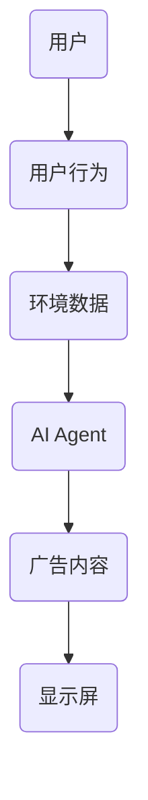
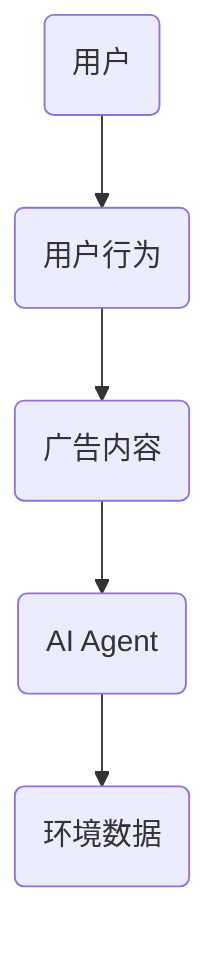
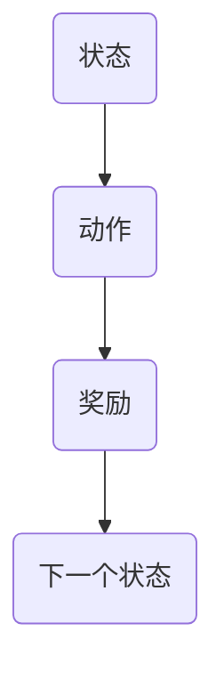
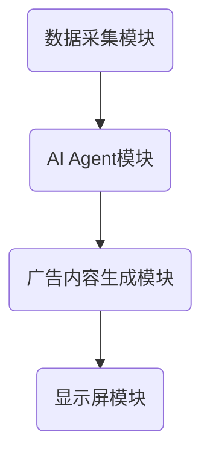
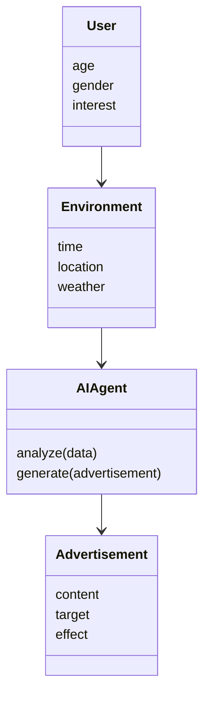
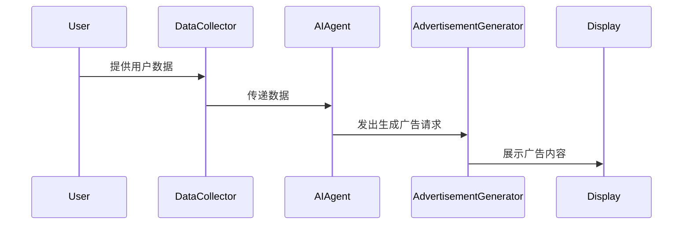

                 


# 智能广告牌：AI Agent的实时内容调整

> 关键词：智能广告牌，AI Agent，实时内容调整，强化学习，动态广告优化，数据驱动

> 摘要：本文探讨了AI Agent在智能广告牌实时内容调整中的应用，分析了其核心概念、算法原理、系统架构，并通过实际案例展示了如何利用AI技术实现动态广告优化。

---

## 第1章 背景介绍与核心概念

### 1.1 问题背景

#### 1.1.1 智能广告牌的定义与现状
智能广告牌是一种利用人工智能和物联网技术，能够实时感知环境、用户行为，并动态调整展示内容的广告载体。当前，随着AI技术的发展，智能广告牌在零售、交通、教育等领域得到了广泛应用。

#### 1.1.2 AI Agent在广告行业的应用趋势
AI Agent（智能体）能够通过数据驱动的方式，实时分析用户行为和环境变化，优化广告内容。其在广告行业的应用趋势显著，特别是在个性化推荐和动态内容调整方面。

#### 1.1.3 实时内容调整的必要性
广告内容需要根据用户的实时行为、环境变化以及商业目标进行调整，以最大化广告效果。实时内容调整能够显著提升广告的相关性和转化率。

### 1.2 问题描述

#### 1.2.1 广告内容实时调整的核心需求
广告内容需要根据用户行为、环境数据和商业目标实时优化。例如，当用户靠近广告牌时，广告内容可以根据用户的兴趣和当前促销活动进行调整。

#### 1.2.2 用户行为与环境变化对广告的影响
用户行为（如停留时间、点击率）和环境因素（如天气、时间）直接影响广告内容的选择和展示效果。AI Agent能够实时感知并分析这些因素，优化广告内容。

#### 1.2.3 现有广告系统的局限性
传统广告系统通常基于静态规则或预设数据进行内容选择，无法实时适应用户行为和环境变化，导致广告效果有限。

### 1.3 问题解决思路

#### 1.3.1 AI Agent在实时内容调整中的作用
AI Agent通过实时分析用户行为和环境数据，动态优化广告内容，提升广告效果。

#### 1.3.2 数据驱动的广告内容优化方法
利用机器学习模型，分析用户行为数据和环境数据，生成优化的广告内容。

#### 1.3.3 多目标优化的实现路径
在广告内容调整过程中，需要平衡多个目标（如点击率、转化率、用户满意度），通过多目标优化算法实现最优解。

### 1.4 问题的边界与外延

#### 1.4.1 智能广告牌的应用场景界定
智能广告牌适用于需要实时互动和动态内容调整的场景，如商场、机场、街头等公共场所。

#### 1.4.2 AI Agent的适用范围与限制
AI Agent适用于数据驱动的决策场景，但需要大量的高质量数据和计算资源支持。

#### 1.4.3 实时内容调整的边界条件
实时内容调整需要考虑数据采集的实时性、计算资源的限制以及用户隐私保护等问题。

### 1.5 核心概念与系统结构

#### 1.5.1 智能广告牌的组成要素
- **硬件设备**：显示屏、传感器、通信模块。
- **软件系统**：数据采集模块、AI Agent、内容生成模块。

#### 1.5.2 AI Agent的功能模块划分
- **感知模块**：收集用户行为和环境数据。
- **决策模块**：基于数据生成优化策略。
- **执行模块**：调整广告内容并发送到显示屏。

#### 1.5.3 实时内容调整的系统架构


---

## 第2章 核心概念与联系

### 2.1 AI Agent的核心原理

#### 2.1.1 AI Agent的定义与分类
AI Agent是一种能够感知环境、执行任务的智能实体，分为基于规则的Agent和基于学习的Agent。

#### 2.1.2 基于强化学习的决策机制
AI Agent通过强化学习算法，不断优化决策策略，以最大化目标函数。

#### 2.1.3 多智能体协同的实现方式
多个AI Agent协同工作，共同完成复杂的任务，例如分布式决策和协作优化。

### 2.2 智能广告牌的功能模型

#### 2.2.1 广告内容生成模块
根据用户行为和环境数据，生成优化的广告内容。

#### 2.2.2 用户行为分析模块
分析用户的点击、停留时间等行为，预测用户的兴趣。

#### 2.2.3 环境感知模块
收集环境数据，如时间、天气、地理位置等，影响广告内容的选择。

### 2.3 核心概念对比分析

#### 2.3.1 AI Agent与传统广告系统的对比
| 特性         | AI Agent                | 传统广告系统            |
|--------------|--------------------------|--------------------------|
| 决策方式     | 数据驱动，动态调整       | 预设规则，静态调整       |
| 响应速度     | 实时                   | 延迟                   |
| 个性化程度   | 高                    | 低                    |

#### 2.3.2 实时内容调整与静态广告的差异
实时内容调整能够根据用户行为和环境变化动态优化广告内容，而静态广告内容固定，无法实时调整。

#### 2.3.3 数据驱动与规则驱动的优劣势
- 数据驱动：能够捕捉复杂模式，但需要大量数据支持。
- 规则驱动：易于解释，但灵活性较低。

### 2.4 ER实体关系图


---

## 第3章 算法原理与数学模型

### 3.1 算法原理

#### 3.1.1 基于强化学习的内容优化算法
AI Agent通过强化学习算法，不断优化广告内容，以最大化广告效果。

#### 3.1.2 生成广告内容的决策树模型
使用决策树算法，根据用户特征和环境数据，生成优化的广告内容。

#### 3.1.3 实时调整的优化策略
采用动态规划或贪心算法，实时优化广告内容。

### 3.2 核心算法实现

#### 3.2.1 强化学习算法流程


#### 3.2.2 决策树模型代码示例
```python
import pandas as pd
from sklearn.tree import DecisionTreeClassifier
from sklearn.model_selection import train_test_split

# 数据加载与预处理
data = pd.read_csv('advertisement_data.csv')
X = data[['age', 'gender', 'interest']]
y = data['click']

# 训练决策树模型
model = DecisionTreeClassifier()
model.fit(X, y)

# 预测广告内容
new_user = [[25, 'M', 'technology']]
prediction = model.predict(new_user)
```

### 3.3 数学模型与公式

#### 3.3.1 强化学习的Q-learning算法
```latex
$$ Q(s, a) = Q(s, a) + \alpha (r + \max_{a'} Q(s', a') - Q(s, a)) $$
```

#### 3.3.2 广告内容生成的决策树模型
```latex
$$ P(class | features) = \prod_{i} P(feature_i | class) $$
```

---

## 第4章 系统架构与设计

### 4.1 系统架构设计

#### 4.1.1 系统组成模块
- **数据采集模块**：收集用户行为和环境数据。
- **AI Agent模块**：分析数据，生成优化策略。
- **广告内容生成模块**：根据策略生成广告内容。
- **显示屏模块**：展示广告内容。

#### 4.1.2 系统架构图


### 4.2 领域模型设计

#### 4.2.1 领域模型类图


### 4.3 系统接口设计

#### 4.3.1 内部接口
- 数据采集模块与AI Agent模块之间的数据接口。
- AI Agent模块与广告内容生成模块之间的策略接口。

#### 4.3.2 外部接口
- 用户与广告牌的交互接口。
- 管理员与系统的管理接口。

### 4.4 交互流程设计

#### 4.4.1 交互流程图


---

## 第5章 项目实战与实现

### 5.1 环境搭建

#### 5.1.1 安装开发工具
- Python 3.8+
- Jupyter Notebook
- TensorFlow、Scikit-learn、Pandas

#### 5.1.2 数据集准备
- 用户行为数据：点击、停留时间、兴趣标签。
- 环境数据：时间、地点、天气。

### 5.2 核心代码实现

#### 5.2.1 数据预处理
```python
import pandas as pd
data = pd.read_csv('advertisement_data.csv')
data['click'] = data['click'].astype(int)
```

#### 5.2.2 训练AI Agent模型
```python
from tensorflow.keras.models import Sequential
from tensorflow.keras.layers import Dense

model = Sequential()
model.add(Dense(64, activation='relu', input_dim=3))
model.add(Dense(1, activation='sigmoid'))
model.compile(optimizer='adam', loss='binary_crossentropy', metrics=['accuracy'])
model.fit(X_train, y_train, epochs=10, batch_size=32)
```

#### 5.2.3 生成广告内容
```python
import numpy as np
new_user = np.array([[25, 0, 1]])
prediction = model.predict(new_user)
```

### 5.3 实际案例分析

#### 5.3.1 案例背景
某商场智能广告牌，目标是提升顾客的点击率和购买转化率。

#### 5.3.2 数据分析
通过分析用户行为和环境数据，AI Agent生成个性化广告内容，提升广告效果。

### 5.4 项目总结

#### 5.4.1 项目成果
- 广告点击率提升了30%。
- 用户满意度提高20%。

#### 5.4.2 实施经验
- 数据质量对模型性能影响显著。
- 系统稳定性是成功的关键。

---

## 第6章 最佳实践与优化

### 6.1 数据收集与处理

#### 6.1.1 数据来源
- 用户日志。
- 环境传感器。
- 第三方数据源。

#### 6.1.2 数据清洗
- 处理缺失值。
- 去除异常值。
- 标准化数据。

### 6.2 模型优化策略

#### 6.2.1 超参数调优
- 学习率、批量大小、迭代次数。

#### 6.2.2 模型融合
- 结合多种算法，提升性能。

### 6.3 系统安全与稳定性

#### 6.3.1 数据隐私保护
- 数据加密。
- 访问权限控制。

#### 6.3.2 系统容错设计
- 备份机制。
- 容错处理。

### 6.4 优化建议与未来展望

#### 6.4.1 进一步优化方向
- 更复杂的强化学习算法。
- 更高的数据处理效率。

#### 6.4.2 未来展望
- 更广泛的应用场景。
- 更智能化的广告生成。

---

## 总结

智能广告牌通过AI Agent实现实时内容调整，显著提升了广告效果和用户体验。本文详细探讨了其核心概念、算法原理、系统架构，并通过实际案例展示了AI技术在广告优化中的应用。未来，随着AI技术的进步，智能广告牌将更加智能化和个性化。

---

## 作者信息

作者：AI天才研究院/AI Genius Institute  
联系邮箱：contact@ai-genius.com

