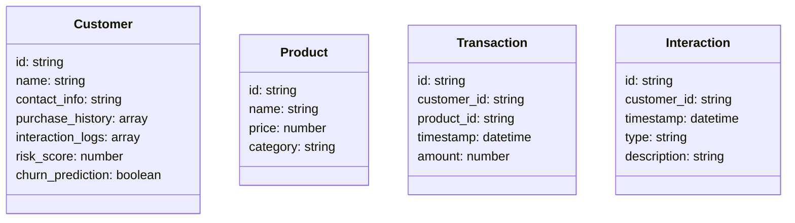
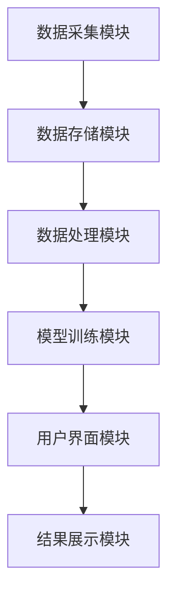
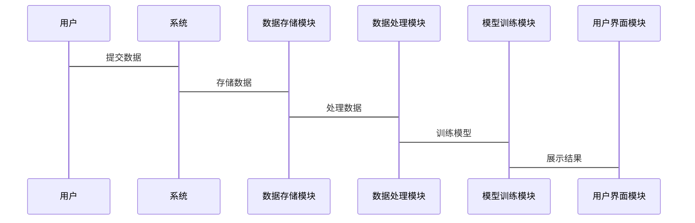

                 


# 构建AI驱动的客户生命周期管理系统

> 关键词：AI，客户生命周期管理，机器学习，数据驱动，系统架构

> 摘要：随着企业对客户管理的日益重视，构建一个高效的AI驱动客户生命周期管理系统变得至关重要。本文详细探讨了客户生命周期管理的背景、核心概念、算法原理、系统架构设计、项目实战以及最佳实践，为读者提供从理论到实践的全面指导。

---

# 第一部分: 客户生命周期管理的AI驱动概述

## 第1章: 客户生命周期管理的背景与挑战

### 1.1 客户生命周期管理的定义与重要性
客户生命周期管理（Customer Lifecycle Management, CLM）是指通过识别、获取、转化、保留和扩展客户，以最大化客户价值和企业收益的过程。AI技术的引入，使得CLM能够更精准地预测客户行为、优化客户体验并提升客户忠诚度。

#### 1.1.1 客户生命周期的定义
客户生命周期从潜在客户开始，经过转化、成熟和衰退，最终可能流失或被重新激活。AI技术的应用贯穿整个生命周期，帮助企业在各个阶段做出数据驱动的决策。

#### 1.1.2 客户生命周期管理的核心目标
- 提高客户满意度和忠诚度
- 优化客户获取和转化效率
- 减少客户流失
- 提升客户生命周期价值

#### 1.1.3 AI在客户生命周期管理中的作用
AI通过分析大量数据，识别客户行为模式，预测客户需求，并提供个性化服务，从而提升客户管理效率和效果。

### 1.2 当前客户管理的主要挑战
#### 1.2.1 数据孤岛问题
企业在不同部门和系统中积累的数据往往分散，难以整合和分析，导致决策效率低下。

#### 1.2.2 客户行为预测的复杂性
客户行为受多种因素影响，如市场变化、客户情绪等，传统方法难以准确预测。

#### 1.2.3 个性化服务的实现难度
每个客户的需求和行为都不同，提供个性化的服务需要强大的数据处理和分析能力。

## 第2章: AI驱动客户生命周期管理的必要性

### 2.1 数据驱动决策的兴起
数据驱动决策是指通过分析数据来指导商业决策，AI技术使得数据处理和分析更加高效和准确。

#### 2.1.1 数据在商业决策中的作用
数据可以帮助企业识别市场趋势、客户偏好和潜在风险，从而做出更明智的决策。

#### 2.1.2 AI如何提升数据利用效率
AI通过自动化数据处理、模式识别和预测，提高了数据的利用效率，帮助企业更好地理解客户行为。

#### 2.1.3 数据驱动的客户洞察
通过分析客户的购买记录、互动日志和行为数据，AI能够发现客户的潜在需求和偏好，从而提供更精准的服务。

### 2.2 AI在客户管理中的独特优势
AI技术在客户管理中的应用具有以下独特优势：

#### 2.2.1 自动化处理能力
AI能够自动处理大量数据，识别客户行为模式，减少人工干预，提高处理效率。

#### 2.2.2 智能预测与推荐
通过机器学习算法，AI能够预测客户行为，推荐个性化的产品和服务，提高客户满意度和忠诚度。

#### 2.2.3 实时数据分析能力
AI能够实时分析客户数据，快速响应客户需求和行为变化，提升客户体验。

## 第3章: AI驱动客户生命周期管理的核心概念

### 3.1 客户生命周期的阶段划分
客户生命周期可以分为以下几个阶段：

#### 3.1.1 潜在客户阶段
识别潜在客户，通过广告、社交媒体等方式吸引客户。

#### 3.1.2 新客户阶段
欢迎新客户，提供个性化的产品和服务，建立客户关系。

#### 3.1.3 成熟客户阶段
通过分析客户的购买记录和互动数据，提供个性化的产品推荐和优惠，提升客户忠诚度。

#### 3.1.4 衰退客户阶段
识别可能流失的客户，采取措施挽回客户，延长客户生命周期。

### 3.2 AI在各阶段的应用场景
#### 3.2.1 潜在客户识别
通过数据分析和预测模型，识别潜在客户，并进行精准营销。

#### 3.2.2 新客户欢迎与引导
通过个性化欢迎邮件和推荐，引导新客户进行首次购买，提高转化率。

#### 3.2.3 成熟客户维护与升级
通过分析客户的购买历史和行为数据，提供个性化推荐和忠诚度计划，提升客户满意度和忠诚度。

#### 3.2.4 衰退客户挽回与优化
通过预测客户流失风险，采取主动措施，如优惠券、个性化推荐等，挽回流失客户，优化客户关系。

### 3.3 核心概念的ER实体关系图
以下是客户生命周期管理系统的ER实体关系图：

```mermaid
er
  Customer
  - id: string
  - name: string
  - contact_info: string
  - purchase_history: array
  - interaction_logs: array
  - risk_score: number
  - churn_prediction: boolean

  Product
  - id: string
  - name: string
  - price: number
  - category: string

  Transaction
  - id: string
  - customer_id: string
  - product_id: string
  - timestamp: datetime
  - amount: number

  Interaction
  - id: string
  - customer_id: string
  - timestamp: datetime
  - type: string  # 如咨询、投诉、反馈
  - description: string
```

---

# 第二部分: AI驱动客户生命周期管理的算法与模型

## 第4章: 基于机器学习的客户行为预测

### 4.1 机器学习在客户管理中的应用
机器学习在客户管理中的应用包括客户 churn 预测、客户分群、个性化推荐等。

#### 4.1.1 监督学习与无监督学习的对比
- 监督学习：基于标记数据进行预测，如客户 churn 预测。
- 无监督学习：基于无标记数据进行分群，如客户分群。

### 4.2 客户 churn 预测模型
客户 churn 预测是通过预测客户流失概率，采取措施减少客户流失。

#### 4.2.1 数据预处理与特征工程
数据预处理包括数据清洗、特征提取和特征选择。特征工程包括特征标准化、特征组合等。

#### 4.2.2 基于逻辑回归的 churn 预测
逻辑回归是一种常用的分类算法，适用于二分类问题，如客户 churn 预测。

##### 逻辑回归模型公式：
$$ P(y=1|x) = \frac{1}{1 + e^{-(\beta_0 + \beta_1x_1 + \cdots + \beta_nx_n)}} $$

##### 逻辑回归实现代码：
```python
import pandas as pd
from sklearn.linear_model import LogisticRegression
from sklearn.metrics import accuracy_score

# 加载数据
data = pd.read_csv('customer_churn.csv')

# 特征工程
X = data[['age', ' tenure', ' monthlycharges', 'totalcharges']]
y = data['churn']

# 训练模型
model = LogisticRegression()
model.fit(X, y)

# 预测
y_pred = model.predict(X)

# 评估
print("准确率:", accuracy_score(y, y_pred))
```

#### 4.2.3 基于随机森林的 churn 预测
随机森林是一种基于决策树的集成算法，适用于高维数据和复杂问题。

##### 随机森林实现代码：
```python
from sklearn.ensemble import RandomForestClassifier

# 训练模型
model = RandomForestClassifier(n_estimators=100)
model.fit(X, y)

# 预测
y_pred = model.predict(X)

# 评估
print("准确率:", accuracy_score(y, y_pred))
```

### 4.3 客户分群与聚类分析
客户分群是将客户按照相似性进行分组，以便制定更有针对性的营销策略。

#### 4.3.1 K-means 聚类算法
K-means是一种常用的聚类算法，适用于客户分群。

##### K-means实现代码：
```python
from sklearn.cluster import KMeans

# 特征工程
X = data[['age', ' monthlycharges', 'totalcharges']]

# 训练模型
model = KMeans(n_clusters=3)
model.fit(X)

# 预测
y_pred = model.predict(X)

# 分群结果
print("簇中心:", model.cluster_centers_)
print("簇标签:", y_pred)
```

#### 4.3.2 DBSCAN 聚类算法
DBSCAN是一种基于密度的聚类算法，适用于处理噪声和异常值。

##### DBSCAN实现代码：
```python
from sklearn.cluster import DBSCAN

# 训练模型
model = DBSCAN(eps=2, min_samples=5)
model.fit(X)

# 预测
y_pred = model.predict(X)

# 分群结果
print("簇标签:", y_pred)
```

---

# 第三部分: AI驱动客户生命周期管理的系统架构设计

## 第5章: 系统分析与架构设计方案

### 5.1 问题场景介绍
系统需要实现客户生命周期管理，包括客户识别、行为预测、个性化推荐和流失预测。

### 5.2 系统功能设计
系统功能包括数据采集、模型训练和用户界面。

#### 5.2.1 领域模型类图
以下是领域模型类图：



#### 5.2.2 系统架构图
以下是系统架构图：



#### 5.2.3 系统接口设计
系统接口包括数据输入接口、模型训练接口和结果展示接口。

#### 5.2.4 系统交互流程图
以下是系统交互流程图：



---

# 第四部分: 项目实战

## 第6章: 项目实战

### 6.1 环境安装
需要安装Python、Pandas、Scikit-learn等库。

#### 6.1.1 安装Python
```bash
python --version
pip install --upgrade pip
```

#### 6.1.2 安装Pandas和Scikit-learn
```bash
pip install pandas scikit-learn
```

### 6.2 核心代码实现
以下是客户 churn 预测的代码实现：

```python
import pandas as pd
from sklearn.linear_model import LogisticRegression
from sklearn.metrics import accuracy_score

# 加载数据
data = pd.read_csv('customer_churn.csv')

# 特征工程
X = data[['age', ' tenure', ' monthlycharges', 'totalcharges']]
y = data['churn']

# 训练模型
model = LogisticRegression()
model.fit(X, y)

# 预测
y_pred = model.predict(X)

# 评估
print("准确率:", accuracy_score(y, y_pred))
```

### 6.3 案例分析
以一个实际案例为例，分析客户 churn 预测的结果，并制定相应的客户保留策略。

### 6.4 项目小结
总结项目实现的关键步骤和注意事项，为读者提供参考。

---

# 第五部分: 最佳实践与总结

## 第7章: 最佳实践与总结

### 7.1 最佳实践 tips
- 数据质量：确保数据的准确性和完整性。
- 模型选择：根据具体问题选择合适的算法。
- 可解释性：确保模型的可解释性，便于业务理解和应用。

### 7.2 小结
通过本文的介绍，读者可以了解AI驱动客户生命周期管理的核心概念、算法原理和系统架构设计，并通过项目实战掌握具体的实现方法。

### 7.3 注意事项
- 数据隐私保护：确保客户数据的安全和隐私。
- 模型优化：定期更新模型，适应数据变化和业务需求。
- 技术与业务结合：将技术与业务深度结合，提升客户管理效果。

### 7.4 拓展阅读
推荐以下书籍和工具，供读者进一步学习：

- 《机器学习实战》
- 《数据挖掘导论》
- Scikit-learn官方文档
- TensorFlow官方文档

---

作者：AI天才研究院/AI Genius Institute & 禅与计算机程序设计艺术 /Zen And The Art of Computer Programming

