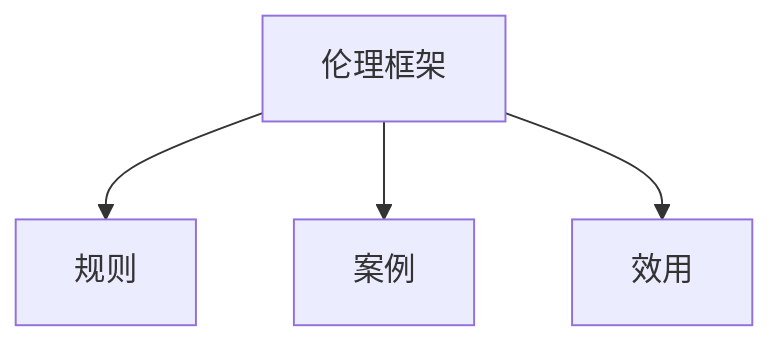
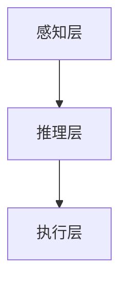

                 


# 构建具有道德推理能力的AI Agent

> 关键词：AI Agent，道德推理，伦理决策，人工智能，伦理框架

> 摘要：本文详细探讨了如何构建具有道德推理能力的AI Agent。首先介绍了AI Agent和道德推理的基本概念，然后分析了道德推理的伦理框架和核心原理。接着，深入讲解了基于规则、案例和效用的道德推理算法，并通过Mermaid图和数学公式进行了详细说明。最后，通过自动驾驶场景的实际案例，展示了如何将道德推理应用于AI Agent的构建中。

---

# 第一部分: 背景介绍

## 第1章: AI Agent与道德推理概述

### 1.1 AI Agent的基本概念

#### 1.1.1 AI Agent的定义与分类
AI Agent（智能体）是指能够感知环境并采取行动以实现目标的实体。根据智能体的复杂性和应用场景，可以将其分为简单反射型智能体、基于模型的反应型智能体、目标驱动型智能体和效用驱动型智能体。

#### 1.1.2 道德推理在AI Agent中的重要性
随着AI技术的广泛应用，AI Agent在医疗、自动驾驶、金融等领域发挥着越来越重要的作用。然而，AI Agent在决策过程中可能会面临道德困境，例如自动驾驶汽车在紧急情况下如何选择最优行动路径。因此，构建具有道德推理能力的AI Agent显得尤为重要。

#### 1.1.3 道德推理的背景与问题背景
道德推理是指智能体在决策过程中考虑伦理和道德因素的能力。传统的AI算法通常基于数学模型和数据驱动，但在处理涉及人类价值观和伦理的问题时显得力不从力。因此，如何将道德推理融入AI Agent的核心算法中，成为当前研究的热点。

---

### 1.2 道德推理的核心概念

#### 1.2.1 道德推理的定义与特征
道德推理是一种基于伦理准则和价值观的决策过程。它具有动态性、情境性和模糊性等特征，需要智能体能够根据具体场景调整决策策略。

#### 1.2.2 道德推理的边界与外延
道德推理的边界在于其适用范围和决策权限。例如，在自动驾驶场景中，智能体需要明确自身的决策权限和责任范围。外延则涉及如何与其他智能体或人类交互，确保决策的透明性和可解释性。

#### 1.2.3 道德推理与AI Agent的结合
将道德推理与AI Agent结合，需要在智能体的设计中融入伦理框架和价值观。通过算法实现道德推理，确保智能体在决策过程中能够考虑伦理因素。

---

## 第2章: 道德推理的伦理框架

### 2.1 道德决策的伦理模型

#### 2.1.1 基于规则的伦理模型
基于规则的伦理模型通过预定义的伦理规则来指导决策。例如，"首先保护人类生命"可以作为自动驾驶中的一个规则。

#### 2.1.2 基于案例的伦理模型
基于案例的伦理模型通过参考类似的历史案例来推导当前决策。这种方法能够处理规则模型难以应对的复杂场景。

#### 2.1.3 基于效用的伦理模型
基于效用的伦理模型通过计算不同决策的效用值来选择最优方案。例如，最大化总体效用或最小化伤害。

### 2.2 道德推理的伦理框架

#### 2.2.1 伦理框架的构建
伦理框架需要考虑决策的主体、客体、目标和环境等因素。通过构建层次化的伦理框架，确保智能体能够在不同场景下做出符合伦理的决策。

#### 2.2.2 伦理框架的属性对比
以下是基于规则、案例和效用的伦理框架属性对比：

| 属性         | 基于规则 | 基于案例 | 基于效用 |
|--------------|----------|----------|----------|
| 决策速度     | 快       | 较慢     | 较快     |
| 可解释性     | 高       | 较高     | 较低     |
| 适应性       | 低       | 高       | 中       |

#### 2.2.3 伦理框架的ER实体关系图


---

# 第二部分: 核心概念与联系

## 第3章: 道德推理的原理与算法

### 3.1 道德推理的原理

#### 3.1.1 道德推理的逻辑结构
道德推理的逻辑结构包括输入感知、伦理判断和决策输出三个阶段。

#### 3.1.2 道德推理的数学模型
道德推理的数学模型可以表示为：
$$
\text{决策} = f(\text{输入}, \text{伦理框架})
$$
其中，$f$ 是道德推理算法，$\text{输入}$ 是感知到的环境信息，$\text{伦理框架}$ 是预定义的伦理准则。

#### 3.1.3 道德推理的约束条件
道德推理需要满足以下约束条件：
- 一致性：决策必须符合预定义的伦理准则。
- 可行性：决策必须在实际场景中可执行。
- 优化性：决策必须在多种可能性中选择最优解。

### 3.2 道德推理的算法实现

#### 3.2.1 基于规则的道德推理算法

##### 3.2.1.1 规则表示的数学模型
基于规则的道德推理算法可以用以下公式表示：
$$
\text{决策} = \sum_{i=1}^{n} w_i \cdot r_i
$$
其中，$w_i$ 是规则 $r_i$ 的权重。

##### 3.2.1.2 规则冲突的解决方法
当多个规则发生冲突时，可以通过优先级排序或加权平均的方法来解决冲突。

##### 3.2.1.3 规则权重的计算公式
规则权重可以通过训练数据中的案例进行计算：
$$
w_i = \frac{\text{案例数}_i}{\sum_{j=1}^{n} \text{案例数}_j}
$$

#### 3.2.2 基于案例的道德推理算法

##### 3.2.2.1 案例匹配算法
基于案例的道德推理算法可以通过以下步骤实现：
1. 将当前场景与历史案例进行匹配。
2. 根据匹配度选择最相似的案例。
3. 基于案例的决策结果生成当前决策。

##### 3.2.2.2 案例库的构建方法
案例库可以通过收集和标注真实场景数据来构建，并通过聚类算法进行分类。

##### 3.2.2.3 案例权重的动态调整
案例权重可以根据决策结果的反馈进行动态调整，以提高算法的适应性。

#### 3.2.3 基于效用的道德推理算法

##### 3.2.3.1 效用函数的定义
效用函数可以定义为：
$$
u(a) = \sum_{i=1}^{n} w_i \cdot f_i(a)
$$
其中，$a$ 是决策，$f_i$ 是效用函数，$w_i$ 是权重。

##### 3.2.3.2 效用函数的优化算法
效用函数的优化可以通过梯度下降算法实现：
$$
w_i = w_i - \alpha \cdot \frac{\partial u}{\partial w_i}
$$

##### 3.2.3.3 效用函数的权重分配
权重分配可以通过训练数据中的案例进行学习，确保不同伦理准则的权重合理。

---

# 第三部分: 算法原理讲解

## 第4章: 道德推理算法的数学模型

### 4.1 基于规则的道德推理

#### 4.1.1 规则表示的数学模型
基于规则的道德推理算法可以用以下公式表示：
$$
\text{决策} = \sum_{i=1}^{n} w_i \cdot r_i
$$
其中，$w_i$ 是规则 $r_i$ 的权重。

#### 4.1.2 规则冲突的解决方法
当多个规则发生冲突时，可以通过优先级排序或加权平均的方法来解决冲突。

#### 4.1.3 规则权重的计算公式
规则权重可以通过训练数据中的案例进行计算：
$$
w_i = \frac{\text{案例数}_i}{\sum_{j=1}^{n} \text{案例数}_j}
$$

### 4.2 基于效用的道德推理

#### 4.2.1 效用函数的定义
效用函数可以定义为：
$$
u(a) = \sum_{i=1}^{n} w_i \cdot f_i(a)
$$
其中，$a$ 是决策，$f_i$ 是效用函数，$w_i$ 是权重。

#### 4.2.2 效用函数的优化算法
效用函数的优化可以通过梯度下降算法实现：
$$
w_i = w_i - \alpha \cdot \frac{\partial u}{\partial w_i}
$$

#### 4.2.3 效用函数的权重分配
权重分配可以通过训练数据中的案例进行学习，确保不同伦理准则的权重合理。

---

# 第四部分: 系统分析与架构设计

## 第5章: AI Agent的系统架构

### 5.1 系统架构的组成

#### 5.1.1 感知层
感知层负责接收和处理环境中的各种信息，例如传感器数据和用户输入。

#### 5.1.2 推理层
推理层负责根据感知到的信息和伦理框架进行道德推理，生成决策方案。

#### 5.1.3 执行层
执行层负责将决策方案转化为具体行动，例如控制机器人或发出指令。

### 5.2 系统架构的Mermaid图



---

# 第五部分: 项目实战

## 第6章: 基于道德推理的AI Agent实现

### 6.1 环境安装

#### 6.1.1 系统需求
需要安装Python 3.8及以上版本，以及必要的第三方库，例如numpy、scipy和matplotlib。

#### 6.1.2 依赖管理
可以通过以下命令安装依赖：
```
pip install numpy scipy matplotlib
```

### 6.2 核心代码实现

#### 6.2.1 基于规则的道德推理算法

##### 6.2.1.1 规则表示的代码实现
```python
class RuleBasedAgent:
    def __init__(self, rules):
        self.rules = rules
        self.weights = [1.0 for _ in range(len(rules))]
```

##### 6.2.1.2 规则冲突的解决方法
```python
def resolve_conflict(rules, weights):
    # 根据权重排序规则
    rules_sorted = sorted(rules, key=lambda x: weights[x])
    return rules_sorted[-1]
```

##### 6.2.1.3 规则权重的计算公式
```python
def calculate_weights(rules, cases):
    weights = [0.0 for _ in range(len(rules))]
    for case in cases:
        for i, rule in enumerate(rules):
            if rule in case['matching_rules']:
                weights[i] += 1
    total = sum(weights)
    if total == 0:
        return [1.0 for _ in range(len(rules))]
    weights = [w / total for w in weights]
    return weights
```

#### 6.2.2 基于案例的道德推理算法

##### 6.2.2.1 案例匹配算法
```python
def case_based_reasoning(cases, current_case):
    matches = []
    for case in cases:
        if case['scenario'] == current_case['scenario']:
            matches.append(case)
    return matches
```

##### 6.2.2.2 案例权重的动态调整
```python
def update_weights(cases, weights, feedback):
    for i, case in enumerate(cases):
        if case['id'] == feedback['case_id']:
            weights[i] += feedback['delta']
```

#### 6.2.3 基于效用的道德推理算法

##### 6.2.3.1 效用函数的定义
```python
def utility_function(action, weights):
    return sum(w * action[i] for i, w in enumerate(weights))
```

##### 6.2.3.2 效用函数的优化算法
```python
def optimize_utilities(actions, weights, learning_rate=0.1):
    for i in range(len(actions)):
        action = actions[i]
        gradient = 2 * (utility_function(action, weights) - target) * action[i]
        weights[i] -= learning_rate * gradient
```

##### 6.2.3.3 效用函数的权重分配
```python
def allocate_weights(rules, cases):
    total_cases = len(cases)
    weights = [len([c for c in cases if c['rule'] == rule]) / total_cases for rule in rules]
    return weights
```

### 6.3 案例分析与详细讲解

#### 6.3.1 自动驾驶场景
假设自动驾驶汽车在紧急情况下需要选择碰撞对象，可以通过以下步骤进行道德推理：
1. 感知层接收碰撞风险信号。
2. 推理层根据伦理框架进行决策。
3. 执行层执行最优决策。

#### 6.3.2 医疗诊断场景
在医疗诊断场景中，AI Agent需要根据患者症状和医疗伦理框架进行诊断决策。

### 6.4 项目小结

通过以上实现，我们可以看到，基于规则、案例和效用的道德推理算法各有优缺点。在实际应用中，可以根据具体场景选择合适的算法，并通过不断优化算法参数和调整伦理框架，提高AI Agent的道德推理能力。

---

# 第六部分: 总结与展望

## 第7章: 总结与展望

### 7.1 总结
本文详细探讨了如何构建具有道德推理能力的AI Agent，介绍了道德推理的伦理框架、算法原理和系统架构设计。通过实际案例分析，展示了如何将道德推理应用于AI Agent的构建中。

### 7.2 展望
未来的研究方向包括：
1. 提高道德推理算法的可解释性和透明性。
2. 探索多智能体环境下的道德推理方法。
3. 研究动态变化环境中的道德推理机制。

---

# 作者：AI天才研究院/AI Genius Institute & 禅与计算机程序设计艺术 /Zen And The Art of Computer Programming

