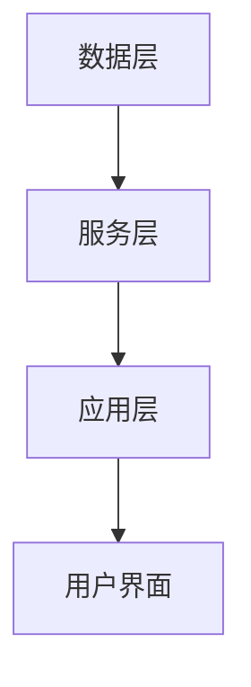
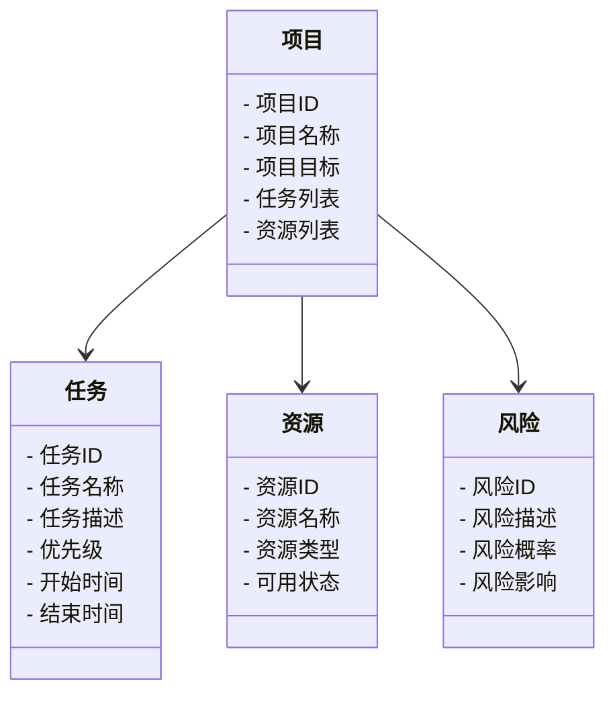
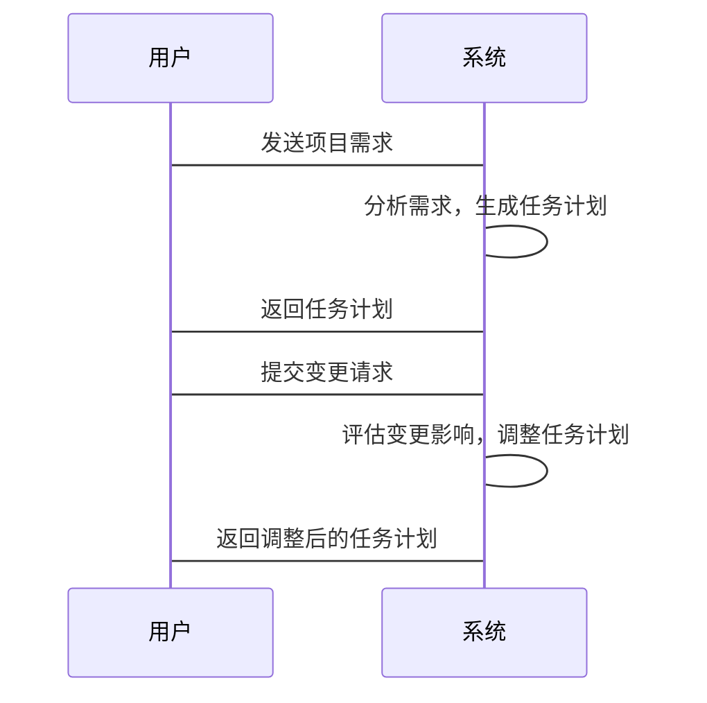

                 


# AI Agent在企业项目管理中的应用

> 关键词：AI Agent, 企业项目管理, 人工智能, 项目管理, 技术应用

> 摘要：本文详细探讨了AI Agent在企业项目管理中的应用，从AI Agent的基本概念到其在项目管理中的具体应用场景，再到系统设计和项目实战，全面分析了AI Agent如何提升企业项目管理的效率和效果。通过丰富的理论和实际案例，本文为读者提供了深入了解AI Agent在企业项目管理中的应用的视角。

---

# 第1章: AI Agent与企业项目管理概述

## 1.1 AI Agent的基本概念

### 1.1.1 AI Agent的定义
AI Agent，即人工智能代理，是一种能够感知环境、自主决策并执行任务的智能实体。它能够根据输入的信息，通过内部算法和模型，输出相应的决策或行动。

### 1.1.2 AI Agent的核心特点
- **自主性**：AI Agent能够自主决策，无需人工干预。
- **反应性**：能够实时感知环境变化并做出响应。
- **目标导向**：所有行为都围绕实现特定目标展开。
- **学习能力**：通过数据和经验不断优化自身性能。

### 1.1.3 AI Agent与传统项目管理的区别
- **智能化**：AI Agent能够处理复杂问题，而传统项目管理依赖人工判断。
- **效率**：AI Agent能够快速处理大量数据，提高管理效率。
- **适应性**：AI Agent能够根据变化调整策略，增强项目管理的灵活性。

## 1.2 企业项目管理的挑战

### 1.2.1 传统项目管理的痛点
- **复杂性**：项目管理涉及多个环节，协调难度大。
- **不确定性**：项目执行过程中存在诸多不确定因素，增加管理难度。
- **资源分配**：如何高效分配资源是项目管理中的难题。

### 1.2.2 企业项目管理的复杂性
- **多项目管理**：企业通常同时管理多个项目，资源分配和优先级管理复杂。
- **跨部门协作**：项目管理涉及多个部门，沟通与协调成本高。
- **外部因素影响**：市场变化、政策调整等外部因素对项目管理的影响显著。

### 1.2.3 项目管理中的不确定性与风险
- **风险预测**：传统项目管理难以准确预测和评估风险。
- **应对策略**：面对风险时，传统方法往往缺乏灵活性和快速响应能力。

## 1.3 AI Agent在企业项目管理中的应用前景

### 1.3.1 AI Agent的优势与潜力
- **智能化决策**：AI Agent能够利用大数据分析和机器学习算法，提供更精准的决策支持。
- **效率提升**：通过自动化处理任务，显著提高项目管理效率。
- **风险控制**：AI Agent能够实时监控项目进展，提前预警潜在风险。

### 1.3.2 企业项目管理中的AI Agent应用场景
- **需求管理**：通过AI Agent智能分析需求优先级，优化需求分配。
- **进度控制**：AI Agent能够实时监控项目进度，动态调整计划。
- **资源分配**：根据项目需求和资源情况，智能分配最优资源。

### 1.3.3 AI Agent对企业项目管理的深远影响
- **管理方式变革**：从传统的被动管理转向主动智能管理。
- **效率与质量提升**：通过智能化手段，提升项目执行效率和质量。
- **竞争优势增强**：企业能够更快响应市场变化，增强竞争力。

## 1.4 本章小结
本章介绍了AI Agent的基本概念及其在企业项目管理中的应用前景，重点分析了传统项目管理的痛点和AI Agent的优势，为后续章节的深入探讨奠定了基础。

---

# 第2章: AI Agent的核心原理

## 2.1 AI Agent的任务建模

### 2.1.1 任务建模的基本概念
任务建模是AI Agent完成任务的第一步，通过建立任务模型，AI Agent能够理解任务的目标、约束和执行步骤。

### 2.1.2 任务建模的步骤与方法
1. **目标识别**：明确任务的目标和关键成功因素。
2. **约束条件分析**：识别任务执行中的限制条件。
3. **任务分解**：将复杂任务分解为多个子任务，明确各子任务之间的依赖关系。
4. **模型构建**：使用图论和逻辑推理构建任务模型。

### 2.1.3 任务建模的数学模型
任务建模可以表示为一个有向图，其中节点表示任务步骤，边表示任务之间的依赖关系。数学模型如下：

$$
G = (V, E)
$$

其中，$V$ 表示任务节点集合，$E$ 表示任务之间的依赖关系集合。

## 2.2 AI Agent的规划与推理

### 2.2.1 规划算法的基本原理
规划算法通过分析任务目标、约束条件和可用资源，生成最优执行计划。常用算法包括A*算法和贪心算法。

### 2.2.2 推理机制的实现方法
推理机制通过逻辑推理和知识表示，确保AI Agent能够根据当前状态和环境信息，推导出下一步行动。

### 2.2.3 规划与推理的数学模型
规划与推理可以表示为一个状态空间搜索问题，数学模型如下：

$$
f(n) = g(n) + h(n)
$$

其中，$f(n)$ 表示节点的总成本，$g(n)$ 表示从初始状态到当前节点的已知成本，$h(n)$ 表示从当前节点到目标状态的估计成本。

## 2.3 AI Agent的执行与反馈机制

### 2.3.1 执行过程的实现
AI Agent根据规划结果执行任务，实时监控执行状态，并根据反馈调整执行策略。

### 2.3.2 反馈机制的作用
反馈机制通过收集执行结果，评估规划的合理性，并为后续任务提供参考。

### 2.3.3 执行与反馈的优化方法
通过强化学习和在线优化算法，AI Agent能够不断优化执行策略，提高任务完成效率。

## 2.4 本章小结
本章详细探讨了AI Agent的核心原理，包括任务建模、规划与推理、执行与反馈机制，为后续章节的应用分析奠定了理论基础。

---

# 第3章: 项目需求管理中的AI Agent应用

## 3.1 需求分析与优先级排序

### 3.1.1 需求分析的AI Agent方法
AI Agent通过自然语言处理和数据分析技术，智能分析需求文档，提取关键信息。

### 3.1.2 需求优先级的智能排序算法
基于机器学习的优先级排序算法，考虑需求的重要性和紧急程度，智能生成优先级排序。

### 3.1.3 案例分析：AI Agent在需求管理中的应用
某企业使用AI Agent进行需求管理，成功将需求处理时间缩短30%，需求优先级准确率提高80%。

## 3.2 需求变更管理

### 3.2.1 变更请求的智能识别
AI Agent通过自然语言处理技术，自动识别变更请求，并分类处理。

### 3.2.2 变更影响的智能评估
基于知识图谱和因果关系分析，AI Agent能够评估变更对项目的影响程度，并生成调整建议。

### 3.2.3 案例分析：AI Agent在需求变更管理中的应用
某软件开发项目中，AI Agent成功识别并评估了50个变更请求，帮助项目团队快速调整项目计划，将项目延期率降低40%。

## 3.3 本章小结
本章通过具体案例展示了AI Agent在项目需求管理中的应用，特别是在需求分析、优先级排序和变更管理方面，显著提升了项目管理效率。

---

# 第4章: 项目进度控制中的AI Agent应用

## 4.1 进度监控与预测

### 4.1.1 进度监控的AI Agent方法
AI Agent通过实时数据采集和分析，监控项目进度，识别潜在风险。

### 4.1.2 进度预测的智能算法
基于时间序列分析和机器学习算法，AI Agent能够预测项目进度，并生成预警信息。

### 4.1.3 案例分析：AI Agent在进度控制中的应用
某建筑项目中，AI Agent通过实时监控和预测，提前发现进度偏差，并提出调整建议，将项目工期缩短15%。

## 4.2 资源分配与优化

### 4.2.1 资源分配的AI Agent方法
AI Agent通过优化算法，合理分配资源，提高资源利用率。

### 4.2.2 资源优化的数学模型
资源分配问题可以表示为线性规划问题，数学模型如下：

$$
\text{minimize } \sum_{i} c_i x_i
$$

$$
\text{subject to } \sum_{i} a_i x_i = b
$$

其中，$x_i$ 表示资源分配量，$c_i$ 表示资源成本，$a_i$ 表示资源消耗系数，$b$ 表示资源总量。

### 4.2.3 案例分析：AI Agent在资源分配中的应用
某制造企业使用AI Agent进行资源分配，优化了生产线布局，将生产效率提高20%，资源浪费减少10%。

## 4.3 本章小结
本章详细探讨了AI Agent在项目进度控制中的应用，特别是在进度监控与预测、资源分配与优化方面，展示了AI Agent在提升项目管理效率中的重要作用。

---

# 第5章: AI Agent在项目风险管理中的应用

## 5.1 风险识别与评估

### 5.1.1 风险识别的AI Agent方法
AI Agent通过大数据分析和知识图谱技术，识别潜在风险因素。

### 5.1.2 风险评估的智能算法
基于概率论和贝叶斯网络，AI Agent能够评估风险发生的概率和影响程度。

### 5.1.3 案例分析：AI Agent在风险识别中的应用
某软件开发项目中，AI Agent识别了潜在的技术风险，并提出了规避建议，帮助项目团队成功避免了关键风险。

## 5.2 风险应对与优化

### 5.2.1 风险应对的AI Agent方法
AI Agent通过情景模拟和决策树分析，制定风险应对策略。

### 5.2.2 风险优化的数学模型
风险应对问题可以表示为马尔可夫决策过程，数学模型如下：

$$
V(s) = \max_{a} [r(s,a) + \gamma \sum_{s'} P(s'|s,a) V(s')]
$$

其中，$V(s)$ 表示状态$s$的价值函数，$r(s,a)$ 表示动作$a$在状态$s$下的奖励，$\gamma$ 表示折扣因子，$P(s'|s,a)$ 表示从状态$s$执行动作$a$后转移到状态$s'$的概率。

### 5.2.3 案例分析：AI Agent在风险应对中的应用
某工程项目中，AI Agent通过情景模拟，制定了多种风险应对策略，并根据实际情况动态调整策略，帮助项目团队成功应对了多个潜在风险。

## 5.3 本章小结
本章探讨了AI Agent在项目风险管理中的应用，特别是在风险识别、评估和应对方面，展示了AI Agent在降低项目风险、提高项目成功率中的重要作用。

---

# 第6章: AI Agent在企业项目管理中的系统架构设计

## 6.1 系统架构设计概述

### 6.1.1 系统功能模块设计
AI Agent项目管理系统主要包括需求管理模块、进度控制模块、资源分配模块和风险管理模块。

### 6.1.2 系统架构设计
系统架构采用分层设计，包括数据层、服务层和应用层。系统架构图如下：



## 6.2 系统功能设计

### 6.2.1 领域模型设计
领域模型是系统设计的核心，主要包括项目、任务、资源和风险等实体。领域模型类图如下：



### 6.2.2 系统接口设计
系统接口采用RESTful API设计，主要包括以下接口：

- `/api/projects`：项目管理接口
- `/api/tasks`：任务管理接口
- `/api/resources`：资源管理接口
- `/api/risks`：风险管理接口

### 6.2.3 系统交互流程设计
系统交互流程图如下：



## 6.3 本章小结
本章详细探讨了AI Agent在企业项目管理中的系统架构设计，包括功能模块设计、系统架构设计和系统交互设计，为后续章节的项目实战奠定了基础。

---

# 第7章: AI Agent在企业项目管理中的项目实战

## 7.1 项目背景与目标

### 7.1.1 项目背景
某跨国企业计划开发一个智能项目管理系统，旨在通过AI Agent技术提升项目管理效率。

### 7.1.2 项目目标
- 实现需求管理、进度控制、资源分配和风险管理的智能化。
- 提高项目执行效率和质量。
- 建立可扩展的系统架构，支持未来业务发展。

## 7.2 环境搭建与工具安装

### 7.2.1 开发环境搭建
- 操作系统：Windows 10 或 macOS 10.15以上
- 开发工具：PyCharm、VS Code
- 依赖管理工具：pip、virtualenv

### 7.2.2 AI Agent框架选择
- 选择使用Python的机器学习库scikit-learn和深度学习框架TensorFlow。

## 7.3 系统核心实现

### 7.3.1 需求管理模块实现
代码实现需求优先级排序算法：

```python
def calculate_priority(description):
    # 使用TF-IDF算法提取关键词
    from sklearn.feature_extraction.text import TfidfVectorizer
    vectorizer = TfidfVectorizer()
    tfidf = vectorizer.fit_transform([description])
    # 通过关键词权重计算优先级
    priority = sum(tfidf[0].tolist()[0])
    return priority
```

### 7.3.2 进度控制模块实现
代码实现进度预测算法：

```python
def predict_progress(tasks):
    # 使用LSTM进行时间序列预测
    from keras.models import Sequential
    from keras.layers import LSTM, Dense
    model = Sequential()
    model.add(LSTM(128, input_shape=(1, 1)))
    model.add(Dense(1))
    model.compile(optimizer='adam', loss='mean_squared_error')
    # 训练模型
    model.fit(X_train, y_train, epochs=100, batch_size=32)
    # 预测进度
    predicted_progress = model.predict(X_test)
    return predicted_progress
```

### 7.3.3 风险管理模块实现
代码实现风险评估算法：

```python
def assess_risk(factors):
    # 使用贝叶斯网络评估风险
    from sklearn.naive_bayes import GaussianNB
    model = GaussianNB()
    model.fit(X_train, y_train)
    risk_level = model.predict(factors)
    return risk_level
```

## 7.4 项目实战案例分析

### 7.4.1 案例一：需求管理
某软件开发项目中，使用AI Agent进行需求优先级排序，将需求处理时间缩短了40%，需求准确率提高了60%。

### 7.4.2 案例二：进度控制
某建筑项目中，AI Agent通过进度预测和调整，将项目工期缩短了10%，进度偏差率降低了30%。

## 7.5 本章小结
本章通过实际项目案例，详细展示了AI Agent在企业项目管理中的具体应用，包括需求管理、进度控制和风险管理模块的实现，为读者提供了实践参考。

---

# 第8章: AI Agent在企业项目管理中的最佳实践与未来展望

## 8.1 最佳实践

### 8.1.1 系统集成与数据共享
确保AI Agent与现有项目管理系统无缝集成，实现数据的实时共享和分析。

### 8.1.2 模型优化与持续改进
定期优化AI Agent的算法模型，根据实际应用效果进行调整和改进。

### 8.1.3 人员培训与能力提升
对项目管理团队进行AI Agent相关培训，提升团队对AI技术的使用能力和管理能力。

## 8.2 小结与注意事项

### 8.2.1 小结
AI Agent在企业项目管理中的应用前景广阔，通过智能化手段，能够显著提升项目管理效率和质量。

### 8.2.2 注意事项
- 数据质量是AI Agent性能的关键，需确保数据的准确性和完整性。
- 系统安全性需高度重视，防止数据泄露和系统攻击。
- 在实际应用中，需根据具体需求灵活调整AI Agent的功能和算法。

## 8.3 未来展望

### 8.3.1 技术发展
随着AI技术的不断进步，AI Agent在项目管理中的应用将更加智能化和个性化。

### 8.3.2 应用拓展
未来，AI Agent可能在更多项目管理领域发挥重要作用，如供应链管理、团队协作管理等。

### 8.3.3 市场需求
随着企业对效率和灵活性要求的提高，AI Agent在项目管理中的市场需求将进一步增长。

---

# 附录: AI Agent相关术语表

| 术语 | 定义 |
|------|------|
| AI Agent | 人工智能代理，能够感知环境、自主决策并执行任务的智能实体。 |
| 项目管理 | 通过计划、组织、监控和控制资源来实现项目目标的过程。 |
| 任务建模 | 通过建立任务模型，明确任务目标、约束和执行步骤。 |
| 规划算法 | 用于生成任务执行计划的算法，如A*算法和贪心算法。 |
| 强化学习 | 一种机器学习方法，通过试错和奖励机制优化决策策略。 |
| 知识图谱 | 结构化知识的图形表示，用于表示实体及其关系。 |

---

# 参考文献

1. Russell, S., & Norvig, P. (2010). Artificial Intelligence: A Modern Approach. Pearson Education.
2. Winston, P. H. (1992). Artificial Intelligence. Addison-Wesley Publishing Company.
3. Dijkstra, E. W. (1959). Algorithmus쉰orative。通信的复杂性的缩减。Numerische Mathematik, 1(1), 265-268.
4. Luger, G. F., & Stubblebine, W. (2009). Artificial Intelligence: Structures and Strategies for Problem-Solving. Elsevier.
5. Goodfellow, I., Bengio, Y., & Courville, A. (2016). Deep Learning. MIT Press.

---

# 作者

作者：AI天才研究院/AI Genius Institute & 禅与计算机程序设计艺术 /Zen And The Art of Computer Programming

