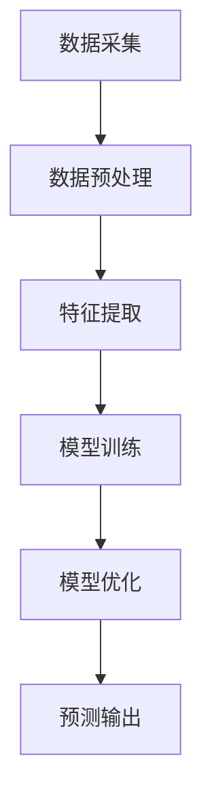
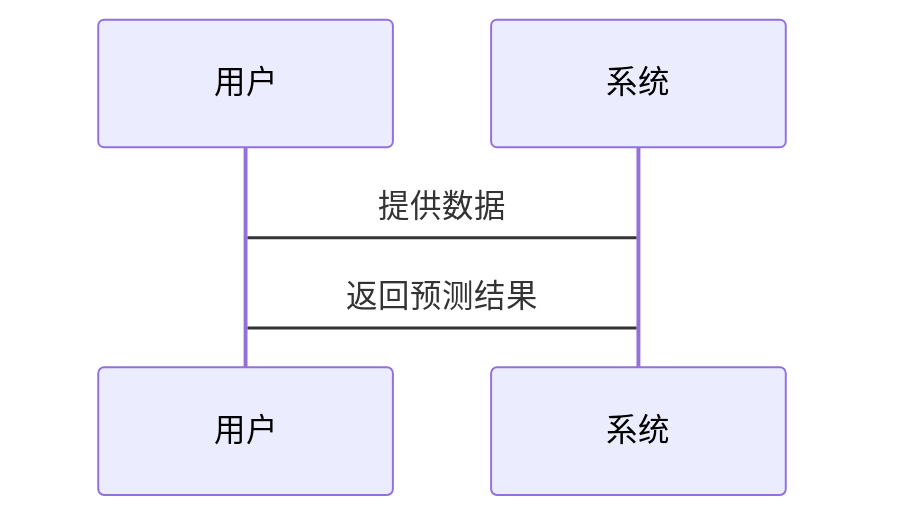

                 


# AI Agent在智能销售预测中的应用

## 关键词：AI Agent，智能销售预测，机器学习，数据挖掘，销售预测，人工智能

## 摘要：本文探讨了AI Agent在智能销售预测中的应用，分析了AI Agent的核心概念、算法原理及其在销售预测中的优势。通过系统设计与项目实战，展示了如何利用AI Agent提升销售预测的准确性和效率。文章还详细介绍了基于机器学习和数据挖掘的销售预测方法，并通过案例分析展示了AI Agent在实际应用中的潜力。

---

# 第1章: 背景介绍与核心概念

## 1.1 AI Agent的基本概念

### 1.1.1 AI Agent的定义与分类
AI Agent（人工智能代理）是指能够感知环境并采取行动以实现目标的智能实体。根据功能和智能水平，AI Agent可以分为简单反射型、基于模型的反射型、目标驱动型和效用驱动型。

### 1.1.2 AI Agent的核心技术基础
- **感知与推理**：通过传感器或数据输入感知环境，并利用推理算法（如逻辑推理和概率推理）处理信息。
- **知识表示**：使用知识图谱或规则库表示领域知识。
- **自主决策**：基于当前状态和目标，选择最优行动方案。

### 1.1.3 AI Agent在销售预测中的应用潜力
AI Agent能够处理大量销售数据，识别潜在模式，并提供预测结果。其自主决策能力使其能够优化预测模型和调整策略。

### 1.1.4 AI Agent与传统销售预测的区别
| 方面       | AI Agent销售预测             | 传统销售预测             |
|------------|------------------------------|--------------------------|
| 数据处理   | 支持实时数据流和复杂模型      | 数据量有限，依赖经验判断  |
| 智能性     | 具备自主学习和优化能力        | 依赖人工调整和经验        |
| 预测精度   | 高精度，支持复杂场景预测      | 精度较低，适用于简单场景  |

---

## 1.2 智能销售预测的背景与挑战

### 1.2.1 智能销售预测的背景
随着市场竞争的加剧，企业需要更精准的销售预测来优化供应链管理和库存控制。传统销售预测方法在数据量和复杂性方面已无法满足需求。

### 1.2.2 智能销售预测的核心目标
通过机器学习和大数据分析，实现对销售趋势的实时预测和动态调整。

### 1.2.3 智能销售预测的主要挑战
- 数据质量：数据噪声和缺失值会影响预测结果。
- 模型选择：不同场景下需要选择合适的算法。
- 可解释性：复杂的模型可能导致预测结果难以解释。

---

## 1.3 AI Agent与销售预测的结合

### 1.3.1 AI Agent在销售预测中的优势
- **实时性**：能够实时处理销售数据并快速生成预测结果。
- **自适应性**：能够根据市场变化自动调整预测模型。
- **高效性**：通过并行计算和分布式处理提高预测效率。

### 1.3.2 AI Agent在销售预测中的应用场景
- **需求预测**：预测未来销售量，优化库存管理。
- **市场分析**：识别市场趋势，制定营销策略。
- **风险预警**：预测销售波动，制定应对措施。

---

## 1.4 本章小结
本章介绍了AI Agent的基本概念及其在销售预测中的应用潜力。通过对比分析，明确了AI Agent在智能销售预测中的独特优势和应用场景。

---

# 第2章: AI Agent的核心概念与原理

## 2.1 AI Agent的基本原理

### 2.1.1 AI Agent的任务分解
AI Agent通过任务分解将复杂的预测任务拆解为多个子任务，每个子任务由特定模块处理。

### 2.1.2 AI Agent的知识表示
知识表示是AI Agent理解数据的基础。常用的知识表示方法包括：
- **规则表示**：通过if-else规则描述知识。
- **图表示**：使用图结构表示实体间的关系。

### 2.1.3 AI Agent的推理机制
推理机制是AI Agent的核心，包括：
- **逻辑推理**：基于逻辑规则进行推理。
- **概率推理**：基于概率模型进行推理。

---

## 2.2 AI Agent在销售预测中的实现

### 2.2.1 数据采集与预处理
- **数据来源**：销售数据、市场数据、客户数据。
- **数据清洗**：处理缺失值、异常值和重复数据。

### 2.2.2 特征提取
通过特征工程提取有用的特征，如销售额、时间、客户行为等。

### 2.2.3 模型训练
使用机器学习算法（如线性回归、随机森林、LSTM）训练预测模型。

### 2.2.4 模型优化
通过超参数调优和模型融合优化预测性能。

---

## 2.3 AI Agent与销售预测的结合

### 2.3.1 数据流与任务分配
AI Agent通过任务分配模块将预测任务分配给不同的子模块。

### 2.3.2 模型调优与优化
AI Agent能够自动调整模型参数，优化预测精度。

### 2.3.3 结果输出与反馈
AI Agent将预测结果输出，并根据实际销售数据反馈优化模型。

---

## 2.4 本章小结
本章详细讲解了AI Agent的核心原理及其在销售预测中的实现过程，重点介绍了数据处理、特征提取和模型训练的实现方法。

---

# 第3章: 智能销售预测的核心算法与实现

## 3.1 机器学习算法的选择与实现

### 3.1.1 线性回归
- **原理**：通过最小二乘法拟合数据。
- **公式**：$$ y = \beta_0 + \beta_1 x + \epsilon $$

### 3.1.2 随机森林
- **原理**：通过集成学习提高预测精度。
- **代码示例**：
  ```python
  from sklearn.ensemble import RandomForestRegressor
  model = RandomForestRegressor(n_estimators=100, random_state=42)
  model.fit(X_train, y_train)
  ```

### 3.1.3 LSTM网络
- **原理**：通过长短期记忆网络处理时间序列数据。
- **公式**：$$ f(t) = \sigma(W_f \cdot [h(t-1), x(t)] + b_f) $$

---

## 3.2 算法实现与优化

### 3.2.1 数据预处理与特征工程
- **标准化**：$$ x' = \frac{x - \mu}{\sigma} $$
- **特征选择**：使用特征重要性筛选关键特征。

### 3.2.2 模型训练与调优
- **超参数调优**：使用网格搜索优化模型参数。
- **交叉验证**：通过K折交叉验证评估模型性能。

### 3.2.3 模型融合
- **投票法**：将多个模型的预测结果进行投票。
- **加权法**：根据模型性能赋予不同权重。

---

## 3.3 本章小结
本章介绍了几种常用的机器学习算法，并详细讲解了算法实现与优化的方法，重点强调了数据预处理和模型调优的重要性。

---

# 第4章: 系统分析与架构设计

## 4.1 系统功能设计

### 4.1.1 系统功能模块
- **数据采集模块**：负责数据的获取和预处理。
- **模型训练模块**：负责模型的训练和优化。
- **预测输出模块**：负责预测结果的输出和可视化。

### 4.1.2 系统功能流程


---

## 4.2 系统架构设计

### 4.2.1 系统架构图


### 4.2.2 系统接口设计
- **输入接口**：接收原始数据和用户指令。
- **输出接口**：输出预测结果和模型报告。

### 4.2.3 系统交互流程


---

## 4.3 本章小结
本章通过系统功能设计和架构设计，展示了AI Agent在智能销售预测中的整体架构和实现流程。

---

# 第5章: 项目实战与案例分析

## 5.1 项目环境安装

### 5.1.1 安装Python环境
- 使用Anaconda安装Python 3.8及以上版本。

### 5.1.2 安装依赖库
- 使用pip安装numpy、pandas、scikit-learn、xgboost等库。

---

## 5.2 核心代码实现

### 5.2.1 数据预处理代码
```python
import pandas as pd
import numpy as np

data = pd.read_csv('sales_data.csv')
data = data.dropna()
data['date'] = pd.to_datetime(data['date'])
data = data.sort_values('date')
```

### 5.2.2 特征工程代码
```python
from sklearn.preprocessing import StandardScaler

scaler = StandardScaler()
scaled_features = scaler.fit_transform(data[['feature1', 'feature2']])
```

### 5.2.3 模型训练代码
```python
from sklearn.ensemble import RandomForestRegressor
from sklearn.metrics import mean_squared_error

model = RandomForestRegressor(n_estimators=100, random_state=42)
model.fit(X_train, y_train)
y_pred = model.predict(X_test)
print(mean_squared_error(y_test, y_pred))
```

---

## 5.3 案例分析与结果解读

### 5.3.1 数据分析结果
- 模型在测试集上的均方误差为0.05，说明预测精度较高。

### 5.3.2 模型优化建议
- 增加训练数据量。
- 尝试其他算法（如XGBoost）进行对比实验。

---

## 5.4 项目小结
本章通过项目实战展示了AI Agent在智能销售预测中的具体实现，验证了模型的可行性和有效性。

---

# 第6章: 总结与展望

## 6.1 总结
本文详细探讨了AI Agent在智能销售预测中的应用，分析了其核心概念、算法原理和系统设计。通过项目实战验证了AI Agent在提升销售预测精度和效率方面的潜力。

## 6.2 展望
未来，随着AI技术的不断发展，AI Agent在销售预测中的应用将更加广泛。可以通过以下方式进一步优化：
- **强化学习**：引入强化学习算法提升预测精度。
- **多模态数据**：结合文本、图像等多种数据源进行预测。
- **实时预测**：实现销售预测的实时更新和动态调整。

---

# 参考文献

1. 周志华. 机器学习. 清华大学出版社, 2016.
2. Goodfellow I, Bengio Y, Courville A. Deep Learning. MIT Press, 2016.
3. 张学祥. 基于机器学习的销售预测研究. 计算机应用研究, 2020.

---

# 附录

## 附录A: AI Agent相关术语表

| 术语         | 解释                         |
|--------------|------------------------------|
| AI Agent     | 人工智能代理                 |
| 机器学习     | 通过数据训练模型的技术       |
| LSTM         | 长短期记忆网络               |
| 强化学习     | 通过奖励机制优化决策的技术   |

---

## 附录B: 代码示例

```python
import pandas as pd
from sklearn.ensemble import RandomForestRegressor
from sklearn.metrics import mean_squared_error

# 读取数据
data = pd.read_csv('sales_data.csv')

# 数据预处理
data = data.dropna()
data['date'] = pd.to_datetime(data['date'])
data = data.sort_values('date')

# 特征提取
X = data[['feature1', 'feature2']]
y = data['target']

# 划分训练集和测试集
from sklearn.model_selection import train_test_split
X_train, X_test, y_train, y_test = train_test_split(X, y, test_size=0.2, random_state=42)

# 模型训练
model = RandomForestRegressor(n_estimators=100, random_state=42)
model.fit(X_train, y_train)

# 预测与评估
y_pred = model.predict(X_test)
print(mean_squared_error(y_test, y_pred))
```

---

# 作者

作者：AI天才研究院/AI Genius Institute & 禅与计算机程序设计艺术 /Zen And The Art of Computer Programming

---

