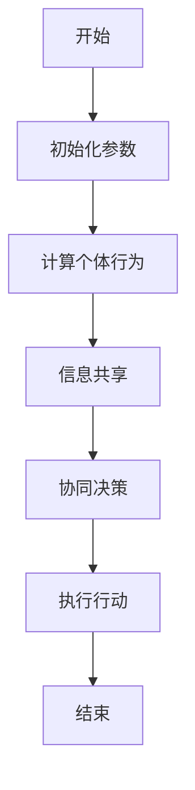
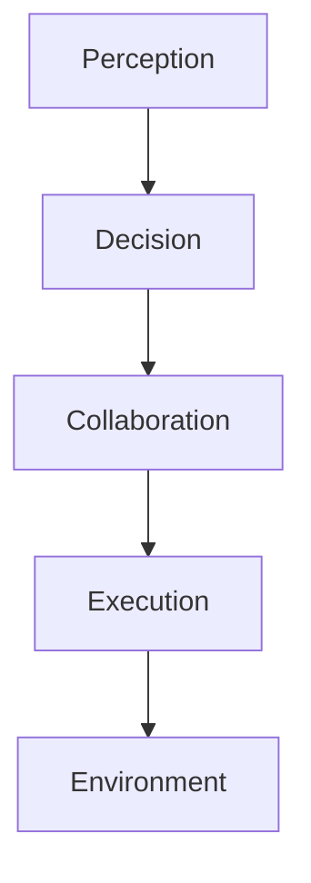
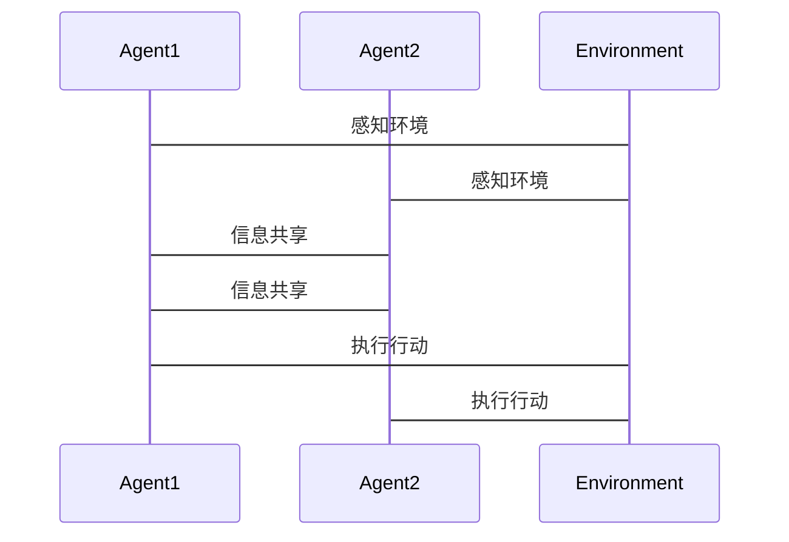

                 


# AI Agent的群体智能涌现机制研究

**关键词**：AI Agent、群体智能、智能涌现、协同学习、分布式计算

**摘要**：本文旨在探讨AI Agent在群体智能中的涌现机制，分析AI Agent与群体智能的结合原理，详细阐述其算法原理、系统架构、数学模型以及实际应用场景。通过理论分析与实践案例相结合的方式，揭示AI Agent群体智能的内在规律与实际应用价值，为相关领域的研究与应用提供参考。

---

## 第1章 AI Agent的基本概念

### 1.1 AI Agent的定义与特点

#### 1.1.1 AI Agent的定义
AI Agent（人工智能代理）是指在计算机系统中，能够感知环境并采取行动以实现目标的实体。它可以是一个软件程序，也可以是一个物理设备，其核心目标是通过智能行为实现特定任务。

#### 1.1.2 AI Agent的核心特点
- **自主性**：AI Agent能够在没有外部干预的情况下自主决策。
- **反应性**：能够实时感知环境并做出响应。
- **目标导向性**：通过目标驱动行为，优化决策过程。
- **学习能力**：能够通过经验改进自身行为。

#### 1.1.3 AI Agent的分类与应用场景
- **简单反射型Agent**：基于当前感知做出反应，适用于简单任务。
- **基于模型的反射型Agent**：利用内部模型进行决策，适用于复杂环境。
- **目标驱动型Agent**：通过目标驱动行为，适用于复杂任务。
- **学习型Agent**：通过学习优化行为，适用于动态环境。

### 1.2 AI Agent的核心原理
AI Agent通过感知、推理、决策和行动实现智能行为。其核心原理包括：
- **感知**：通过传感器或数据源获取环境信息。
- **推理**：基于感知信息进行逻辑推理。
- **决策**：根据推理结果做出最优选择。
- **行动**：执行决策结果，影响环境状态。

---

## 第2章 群体智能的基本概念

### 2.1 群体智能的定义与特点

#### 2.1.1 群体智能的定义
群体智能是指多个智能体通过协同行为产生超出个体智能的集体智能。其核心在于个体之间的协作与信息共享。

#### 2.1.2 群体智能的核心特点
- **去中心化**：没有中央控制节点，个体自主决策。
- **自组织性**：个体通过局部信息实现全局目标。
- **涌现性**：群体智能通过个体行为的协同而涌现。

#### 2.1.3 群体智能的分类与应用场景
- **自然群体智能**：模拟生物群体的行为，如鸟群飞行。
- **人工群体智能**：应用于分布式计算、机器人协作等领域。
- **混合群体智能**：结合自然与人工智能的混合模式。

### 2.2 群体智能的核心原理
群体智能的核心原理包括：
- **信息共享**：个体通过信息交换实现协作。
- **协同决策**：通过分布式决策实现全局优化。
- **适应性**：群体能够根据环境变化自适应调整行为。

---

## 第3章 AI Agent群体智能的背景与问题背景

### 3.1 AI Agent群体智能的研究背景

#### 3.1.1 AI Agent技术的发展历程
- 从简单反射型Agent到目标驱动型Agent，再到学习型Agent，AI Agent技术不断演进。
- 群体智能的研究始于对自然群体行为的模拟，如蚂蚁觅食、鸟群飞行。

#### 3.1.2 群体智能研究的现状与趋势
- 群体智能在分布式计算、机器人协作、多智能体系统等领域得到广泛应用。
- 随着AI技术的进步，群体智能的研究逐渐向更高效、更智能的方向发展。

#### 3.1.3 AI Agent群体智能的结合与创新
- 将AI Agent的自主性和学习能力与群体智能的协作性结合。
- 通过AI技术提升群体智能的决策效率和适应性。

### 3.2 问题背景与问题描述

#### 3.2.1 AI Agent群体智能的核心问题
- 如何实现个体之间的高效协作。
- 如何在去中心化环境中实现全局最优决策。
- 如何处理动态环境中的不确定性。

#### 3.2.2 群体智能涌现机制的定义与目标
- **涌现机制**：通过个体行为的协同，产生集体智能的过程。
- **目标**：研究个体行为如何协同，形成更复杂的智能表现。

#### 3.2.3 AI Agent群体智能的边界与外延
- **边界**：个体行为与集体行为的界限。
- **外延**：AI Agent群体智能与其他智能形式（如人机协作）的结合。

### 3.3 问题解决与边界分析

#### 3.3.1 AI Agent群体智能的解决方案
- **分布式计算**：通过分布式算法实现去中心化决策。
- **协同学习**：通过机器学习算法实现个体间的信息共享与协作。
- **涌现机制设计**：设计个体行为规则，使其协同产生集体智能。

#### 3.3.2 群体智能涌现机制的核心要素
- **个体行为规则**：个体如何感知环境并做出反应。
- **信息共享机制**：个体之间如何交换信息。
- **协同决策算法**：如何基于个体信息做出全局决策。

#### 3.3.3 AI Agent群体智能的系统架构与核心要素组成

---

## 第4章 AI Agent与群体智能的核心概念

### 4.1 AI Agent与群体智能的核心原理

#### 4.1.1 AI Agent的智能行为机制
- **感知-决策-行动**：AI Agent通过感知环境，决策行动方案，执行行动。
- **学习与适应**：通过经验改进自身行为。

#### 4.1.2 群体智能的协同与涌现机制
- **信息共享**：个体通过信息交换实现协作。
- **自组织性**：群体通过局部规则实现全局目标。
- **涌现性**：个体行为的协同产生集体智能。

#### 4.1.3 AI Agent群体智能的结合原理
- **个体智能**：AI Agent的自主性和学习能力。
- **群体协作**：通过信息共享和协同决策实现集体智能。
- **涌现机制**：个体行为规则的设计与优化。

### 4.2 核心概念属性特征对比

#### 4.2.1 AI Agent与群体智能的属性特征对比

| 属性       | AI Agent                          | 群体智能                          |
|------------|-----------------------------------|-----------------------------------|
| 自主性      | 高                                | 无中心控制，高                   |
| 信息处理   | 基于模型，复杂                   | 基于局部信息，简单               |
| 协作能力   | 无明确协作机制                   | 明确协作机制                     |
| 智能表现    | 单个智能体的智能                 | 集体智能的涌现                   |

#### 4.2.2 ER实体关系图架构

```mermaid
erDiagram
    agent {
        id : integer
        name : string
        type : string
    }
    environment {
        id : integer
        status : string
        time : timestamp
    }
    interaction {
        id : integer
        agent_id : integer
        environment_id : integer
        timestamp : timestamp
        action : string
    }
    agent --> interaction : "与环境互动"
    environment --> interaction : "被感知"
    agent --> agent : "协作与信息共享"
```

### 4.3 AI Agent群体智能的核心算法

#### 4.3.1 分布式计算算法



#### 4.3.2 协同学习算法

```python
def distributed_learning_agents(num_agents):
    agents = [Agent() for _ in range(num_agents)]
    for agent in agents:
        agent.initialize_parameters()
    for step in range(max_steps):
        for agent in agents:
            agent.perceive_environment()
            agent.make_decision()
        for agent in agents:
            agent.share_info_with_neighbors()
        for agent in agents:
            agent.update_parameters()
    return agents
```

---

## 第5章 算法原理讲解

### 5.1 算法原理的数学模型

#### 5.1.1 群体智能的涌现模型

$$ C = f(N, r) $$

其中，\( C \) 表示集体智能，\( N \) 表示个体数量，\( r \) 表示个体行为规则的复杂度。

#### 5.1.2 分布式计算的收敛性分析

$$ \lim_{t \to \infty} \frac{1}{t} \sum_{i=1}^{t} f(x_i) = \text{全局最优值} $$

---

## 第6章 系统分析与架构设计

### 6.1 问题场景介绍

#### 6.1.1 群体智能的应用场景
- 多机器人协作
- 分布式任务分配
- 网络流量优化

#### 6.1.2 系统需求分析
- **功能需求**：实现多智能体的协作与信息共享。
- **性能需求**：支持大规模智能体的实时协作。
- **接口需求**：提供与其他系统的接口。

### 6.2 系统功能设计

#### 6.2.1 系统功能模块
- **感知模块**：获取环境信息。
- **决策模块**：基于感知信息做出决策。
- **协作模块**：实现个体间的信息共享与协同决策。
- **执行模块**：执行决策结果。

### 6.3 系统架构设计

#### 6.3.1 系统架构图



### 6.4 系统接口设计

#### 6.4.1 接口描述
- **输入接口**：感知环境信息。
- **输出接口**：执行决策结果。
- **协作接口**：与其他智能体交换信息。

### 6.5 系统交互设计

#### 6.5.1 交互流程图



---

## 第7章 项目实战

### 7.1 环境安装与配置

```bash
pip install numpy matplotlib
```

### 7.2 核心代码实现

#### 7.2.1 分布式协作算法

```python
import numpy as np

class Agent:
    def __init__(self):
        self.position = np.random.rand(2)
        self.velocity = np.zeros(2)
    
    def perceive(self, environment):
        # 感知环境信息
        pass
    
    def decide(self):
        # 做出决策
        pass
    
    def move(self):
        # 执行移动
        self.position += self.velocity

def main():
    num_agents = 5
    agents = [Agent() for _ in range(num_agents)]
    for _ in range(100):
        for agent in agents:
            agent.perceive(environment)
            agent.decide()
        for agent in agents:
            agent.move()
    # 可视化结果
    import matplotlib.pyplot as plt
    plt.scatter([agent.position[0] for agent in agents], [agent.position[1] for agent in agents])
    plt.show()

if __name__ == "__main__":
    main()
```

### 7.3 案例分析与详细解读

#### 7.3.1 案例分析
- **案例背景**：多机器人协作完成目标任务。
- **算法实现**：通过分布式计算实现机器人协作。
- **结果分析**：机器人能够通过信息共享实现协同行为。

---

## 第8章 总结与展望

### 8.1 全文总结
本文系统地探讨了AI Agent群体智能的涌现机制，分析了其核心概念、算法原理、系统架构与实际应用。通过理论分析与实践案例，揭示了AI Agent群体智能的内在规律与实际价值。

### 8.2 研究展望
未来的研究方向包括：
- 更高效的协同学习算法。
- 更智能的涌现机制设计。
- AI Agent群体智能与人机协作的结合。

---

**作者：AI天才研究院/AI Genius Institute & 禅与计算机程序设计艺术 /Zen And The Art of Computer Programming**

