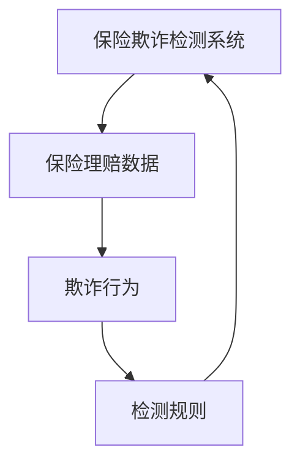
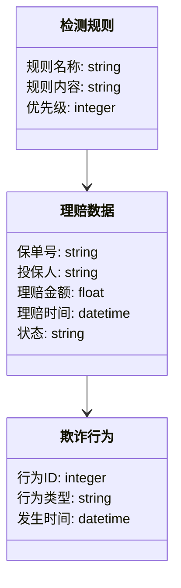
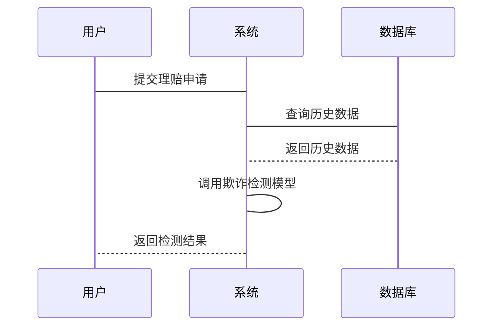

                 


# AI驱动的保险理赔欺诈检测

**关键词：保险欺诈检测、人工智能、机器学习、自然语言处理、计算机视觉、保险系统架构**

**摘要：**  
随着保险行业的数字化转型，保险欺诈行为日益复杂化和多样化。传统的欺诈检测方法逐渐暴露出效率低下、准确率不足等问题。基于人工智能（AI）的保险欺诈检测技术凭借其高效性、准确性和智能化，成为解决这一问题的关键。本文将深入探讨AI在保险欺诈检测中的应用，从核心概念、算法原理到系统架构设计，再到项目实战，全面解析如何利用AI技术提升保险欺诈检测的效率和准确性。通过实际案例分析和代码实现，本文将为读者提供从理论到实践的系统性指导。

---

## 第一部分: AI驱动的保险理赔欺诈检测背景与概述

### 第1章: 保险欺诈检测的基本概念

#### 1.1 保险欺诈的定义与分类
- **1.1.1 保险欺诈的定义**  
  保险欺诈是指在保险理赔过程中，投保人或受益人故意虚构事实或隐瞒真相，以骗取保险金的行为。常见的保险欺诈包括夸大损失、制造假赔案、编造虚假身份等。

- **1.1.2 保险欺诈的主要类型**  
  - **理赔型欺诈**：通过夸大损失或虚构事故骗取保险金。  
  - **投保型欺诈**：在投保时故意隐瞒健康状况或投保标的的风险。  
  - **重复索赔**：同一事件多次索赔，试图获得超额赔付。  

- **1.1.3 保险欺诈的特征与风险**  
  - **特征**：欺诈行为通常具有隐蔽性、复杂性和多样性。  
  - **风险**：欺诈行为会增加保险公司的赔付成本，影响保险市场的健康发展。

#### 1.2 保险行业的现状与挑战
- **1.2.1 保险行业的数字化转型**  
  数字化技术的应用使得保险行业的理赔流程更加高效，但也为欺诈行为提供了新的机会。

- **1.2.2 保险理赔中的常见问题**  
  - 欺诈行为难以识别。  
  - 传统规则检测方法存在漏检和误检的问题。  
  - 数据量大、维度多，人工分析效率低下。  

- **1.2.3 保险欺诈检测的重要性**  
  准确检测欺诈行为可以降低保险公司的财务风险，维护保险市场的公平性。

#### 1.3 AI技术在保险行业的应用现状
- **1.3.1 AI技术的基本概念**  
  AI是一种模拟人类智能的技术，包括机器学习、自然语言处理（NLP）和计算机视觉（CV）等。

- **1.3.2 AI在保险行业的主要应用领域**  
  - 风险评估：基于历史数据预测风险。  
  - 理赔自动化：利用AI技术自动处理理赔申请。  
  - 欺诈检测：通过机器学习模型识别异常行为。  

- **1.3.3 AI驱动保险欺诈检测的优势**  
  - 高效性：AI能够快速处理大量数据，提高检测效率。  
  - 准确性：机器学习模型可以发现隐藏的模式，提高检测准确性。  
  - 智能性：AI能够自适应学习，持续优化检测模型。  

#### 1.4 保险欺诈检测的挑战与机遇
- **1.4.1 保险欺诈检测的主要挑战**  
  - 数据质量：数据缺失、噪声大影响模型准确性。  
  - 模型解释性：复杂的AI模型难以解释检测结果。  
  - 欺诈手段的多样化：欺诈者不断进化，对模型提出更高要求。  

- **1.4.2 AI技术带来的新机遇**  
  - 提高检测效率：AI能够快速处理大量数据，显著减少人工成本。  
  - 增强检测能力：深度学习模型可以捕捉复杂特征，提升检测精度。  
  - 实时监控：AI技术可以实现实时数据分析，及时发现欺诈行为。  

- **1.4.3 保险欺诈检测的未来发展趋势**  
  - 多模态数据融合：结合文本、图像等多种数据源，提升检测能力。  
  - 自监督学习：利用无标签数据进行自适应学习。  
  - 可解释性增强：开发更透明的模型，便于解释和调整。  

---

## 第二部分: 保险欺诈检测的核心概念与联系

### 第2章: 保险欺诈检测的核心概念与联系

#### 2.1 保险欺诈检测的核心概念
- **2.1.1 数据驱动的保险欺诈检测**  
  基于大数据分析，利用统计方法和机器学习模型发现欺诈行为。

- **2.1.2 基于规则的保险欺诈检测**  
  根据预定义的规则（如时间、地点、金额等）筛选异常行为。

- **2.1.3 基于机器学习的保险欺诈检测**  
  利用机器学习算法（如随机森林、XGBoost等）训练模型，预测欺诈行为。

#### 2.2 核心概念的原理与联系
- **2.2.1 保险欺诈检测的原理**  
  - 数据预处理：清洗和特征提取。  
  - 模型训练：基于历史数据训练分类模型。  
  - 模型部署：实时监控和预测。  

- **2.2.2 数据特征与欺诈行为的关系**  
  - 时间特征：如理赔时间、报案时间间隔。  
  - 空间特征：如理赔地点、事故地点分布。  
  - 行为特征：如理赔金额、报案频率。  

- **2.2.3 不同检测方法的优缺点对比**  
| 检测方法       | 优点                     | 缺点                     |
|----------------|--------------------------|--------------------------|
| 基于规则       | 实现简单，易于解释       | 易受欺诈手段变化影响     |
| 数据驱动       | 能够捕捉复杂模式         | 数据质量和特征选择依赖   |
| 机器学习       | 准确性高，适应性强       | 解释性差，计算资源消耗大 |

#### 2.3 实体关系图（ER图）架构


---

## 第三部分: 保险欺诈检测的算法原理

### 第3章: 保险欺诈检测的算法原理

#### 3.1 保险欺诈检测的分类算法
- **3.1.1 分类算法概述**  
  分类算法是机器学习中用于预测数据标签的技术，广泛应用于欺诈检测。

- **3.1.2 常见的保险欺诈分类算法**  
  - **逻辑回归（Logistic Regression）**：适用于二分类问题，能够输出概率值。  
  - **支持向量机（SVM）**：适用于高维数据，能够处理非线性分类问题。  
  - **随机森林（Random Forest）**：基于决策树的集成方法，具有高准确性和鲁棒性。  
  - **梯度提升树（XGBoost、LightGBM）**：基于树的集成算法，能够处理复杂特征。  

#### 3.2 保险欺诈检测的聚类算法
- **3.2.1 聚类算法概述**  
  聚类算法用于将数据分成若干组，发现数据中的潜在模式。

- **3.2.2 常见的保险欺诈聚类算法**  
  - **K-means**：简单易用，适用于球形簇的划分。  
  - **DBSCAN**：基于密度的聚类算法，能够处理噪声数据。  

#### 3.3 保险欺诈检测的回归算法
- **3.3.1 回归算法概述**  
  回归算法用于预测连续型变量，适用于风险评估场景。

- **3.3.2 常见的保险欺诈回归算法**  
  - **线性回归（Linear Regression）**：适用于线性关系的数据。  
  - **岭回归（Ridge Regression）**：用于处理多重共线性问题。  

#### 3.4 基于深度学习的保险欺诈检测
- **3.4.1 深度学习概述**  
  深度学习是一种多层神经网络技术，能够自动提取数据特征。

- **3.4.2 常见的深度学习模型**  
  - **卷积神经网络（CNN）**：适用于图像数据处理。  
  - **循环神经网络（RNN）**：适用于序列数据处理。  
  - **长短期记忆网络（LSTM）**：适用于时间序列数据分析。  

---

## 第四部分: 保险欺诈检测的系统分析与架构设计

### 第4章: 保险欺诈检测的系统分析与架构设计

#### 4.1 保险欺诈检测的系统分析
- **4.1.1 问题场景介绍**  
  保险公司在理赔过程中面临欺诈风险，需要一个高效的检测系统。

- **4.1.2 系统功能设计**  
  - 数据采集：从数据库中获取理赔数据。  
  - 特征工程：提取关键特征并进行数据预处理。  
  - 模型训练：基于历史数据训练欺诈检测模型。  
  - 实时监控：对新理赔申请进行实时检测。  

#### 4.2 保险欺诈检测的架构设计
- **4.2.1 领域模型（Mermaid 类图）**  


- **4.2.2 系统架构设计（Mermaid 架构图）**  
```mermaid
container Insurance Fraud Detection System {
    Service Layer
    Data Layer
    Model Layer
}
```

- **4.2.3 系统接口设计**  
  - 数据接口：与数据库交互，获取理赔数据。  
  - 模型接口：与机器学习模型交互，获取检测结果。  
  - 用户接口：供保险公司员工查看检测结果。  

#### 4.3 保险欺诈检测的系统交互设计
- **4.3.1 系统交互流程（Mermaid 序列图）**  


---

## 第五部分: 保险欺诈检测的项目实战

### 第5章: 保险欺诈检测的项目实战

#### 5.1 环境安装与配置
- **5.1.1 安装Python**  
  - 安装Python 3.x版本，推荐使用Anaconda或Pyenv管理环境。  

- **5.1.2 安装依赖库**  
  ```bash
  pip install pandas numpy scikit-learn xgboost
  ```

- **5.1.3 数据准备**  
  下载保险理赔数据集，确保数据格式为CSV或Excel。

#### 5.2 系统核心实现源代码
- **5.2.1 数据预处理代码**  
  ```python
  import pandas as pd
  import numpy as np

  # 读取数据
  df = pd.read_csv('insurance_fraud.csv')

  # 数据清洗
  df.dropna(inplace=True)
  df = pd.get_dummies(df, columns=['region', 'policy_type'])

  # 划分训练集和测试集
  from sklearn.model_selection import train_test_split
  X = df.drop('fraud_flag', axis=1)
  y = df['fraud_flag']
  X_train, X_test, y_train, y_test = train_test_split(X, y, test_size=0.2, random_state=42)
  ```

- **5.2.2 模型训练代码**  
  ```python
  from xgboost import XGBClassifier
  from sklearn.metrics import accuracy_score, precision_score, recall_score, f1_score

  # 训练模型
  model = XGBClassifier(n_estimators=100, learning_rate=0.1, max_depth=6)
  model.fit(X_train, y_train)

  # 预测
  y_pred = model.predict(X_test)

  # 评估指标
  print(f'Accuracy: {accuracy_score(y_test, y_pred)}')
  print(f'Precision: {precision_score(y_test, y_pred)}')
  print(f'Recall: {recall_score(y_test, y_pred)}')
  print(f'F1 Score: {f1_score(y_test, y_pred)}')
  ```

- **5.2.3 模型解释代码**  
  ```python
  from sklearn.tree import export_graphviz
  from IPython.display import Image
  import graphviz

  # 绘制决策树
  export_graphviz(model.estimators_[0], out_file='tree.dot', feature_names=X.columns)
  ```

#### 5.3 案例分析与详细解读
- **5.3.1 数据分析**  
  - 统计不同欺诈类型的比例，分析欺诈行为的分布特征。  
  - 通过可视化工具（如Matplotlib、Seaborn）绘制数据分布图，发现潜在的欺诈模式。  

- **5.3.2 模型评估**  
  - 通过混淆矩阵分析模型的分类性能。  
  - 使用ROC曲线评估模型的区分能力。  

- **5.3.3 实际案例分析**  
  - 假设某理赔申请中，理赔金额远高于同类案件的平均水平，且理赔时间异常集中。模型能够识别出这一异常行为，标记为潜在欺诈。  

#### 5.4 项目小结
- 通过项目实战，验证了AI技术在保险欺诈检测中的有效性。  
- 实践中需要注意数据质量、模型选择和结果解释等问题。  

---

## 第六部分: 保险欺诈检测的最佳实践与总结

### 第6章: 保险欺诈检测的最佳实践

#### 6.1 最佳实践 tips
- **数据质量管理**：确保数据的完整性和准确性。  
- **特征工程优化**：选择合适的特征，避免过拟合。  
- **模型调优**：通过交叉验证和网格搜索优化模型性能。  
- **实时监控**：建立实时监控系统，及时发现异常行为。  

#### 6.2 总结与展望
- 总结：AI技术为保险欺诈检测提供了新的解决方案，显著提升了检测效率和准确性。  
- 展望：未来，随着AI技术的不断发展，保险欺诈检测将更加智能化和精准化。  

#### 6.3 注意事项
- 保护用户隐私：在数据处理和模型训练过程中，确保用户隐私不被泄露。  
- 模型可解释性：尽量选择解释性较强的模型，便于业务人员理解和调整。  
- 持续优化：定期更新模型，适应欺诈手段的变化。  

#### 6.4 拓展阅读
- 《机器学习实战》：深入理解机器学习算法的实现和应用。  
- 《深度学习》：探索深度学习在保险欺诈检测中的应用。  
- 《自然语言处理入门》：了解NLP技术在保险文本分析中的应用。  

---

## 结语

保险欺诈检测是保险行业数字化转型中的重要环节，AI技术的应用为其带来了新的突破。通过本文的系统性分析，读者可以全面了解AI驱动的保险欺诈检测的核心概念、算法原理、系统架构和项目实现。未来，随着技术的不断进步，保险欺诈检测将更加智能化、精准化，为保险行业的发展保驾护航。

---

**作者：AI天才研究院/AI Genius Institute & 禅与计算机程序设计艺术 /Zen And The Art of Computer Programming**

