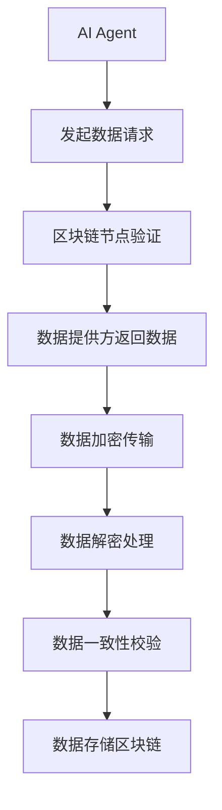
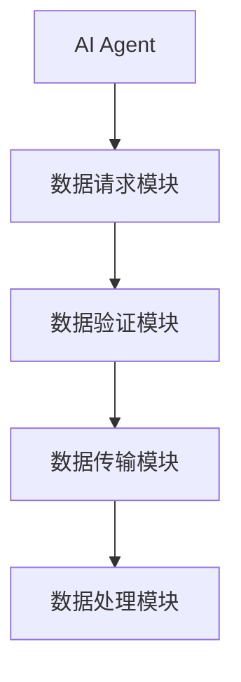
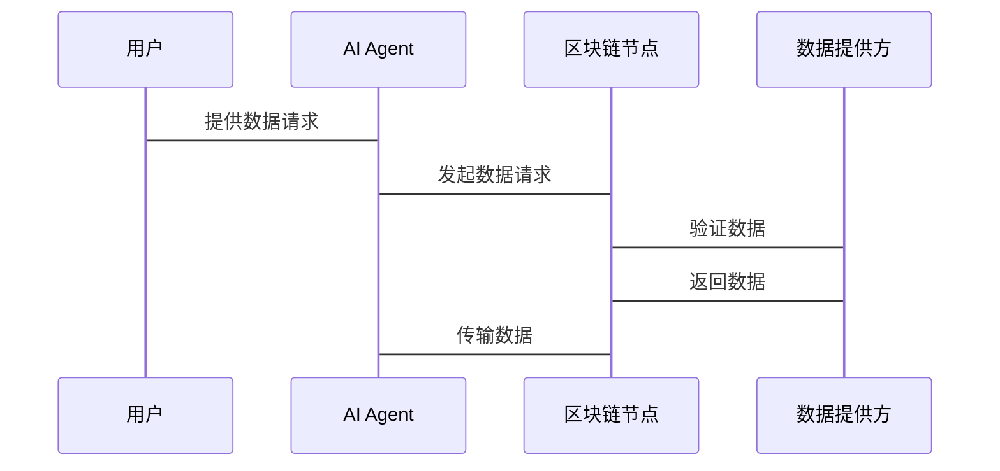

                 


# 企业AI Agent的区块链数据共享机制

## 关键词：企业AI Agent，区块链，数据共享，智能合约，分布式系统

## 摘要：本文探讨了企业AI Agent与区块链技术结合的创新应用，重点分析了基于区块链的AI Agent数据共享机制的核心原理、系统架构及实现方案，详细阐述了从问题背景到解决方案的完整技术路径，并通过实际案例展示了其应用价值。

---

# 第一部分: 企业AI Agent的区块链数据共享机制背景介绍

---

# 第1章: 企业AI Agent与区块链数据共享概述

## 1.1 问题背景与概念背景

### 1.1.1 企业数据共享的挑战
- 数据孤岛问题：企业间数据分散，难以高效共享。
- 数据隐私问题：数据共享可能涉及敏感信息，如何保护隐私？
- 数据一致性问题：多源数据如何保持一致性？
- 数据可信度问题：如何确保数据真实可靠？

### 1.1.2 AI Agent在企业数据共享中的作用
- AI Agent作为智能代理，能够自动处理和协调数据共享过程。
- 通过AI算法优化数据匹配和决策，提高数据共享效率。

### 1.1.3 区块链技术的核心优势
- 分布式账本：确保数据不可篡改，提高可信度。
- 智能合约：自动执行共享规则，减少人为干预。
- 去中心化：消除中间机构，降低数据共享成本。

### 1.1.4 问题的边界与外延
- 本研究仅关注企业内部数据共享，不涉及跨机构数据共享。
- 本机制暂不考虑实时性极高的场景，优先保证数据准确性和隐私性。

### 1.1.5 核心概念结构与组成要素
- 数据提供方：企业内部系统或第三方服务。
- 数据消费者：需要数据进行决策的AI Agent或其他系统。
- 区块链平台：提供数据存储和智能合约执行环境。
- AI Agent：负责数据请求、处理和决策。

## 1.2 问题描述与目标

### 1.2.1 企业数据共享的主要问题
- 数据孤岛：企业内部各部门间数据不通，外部数据获取困难。
- 数据隐私：数据共享可能涉及敏感信息，如何确保隐私？
- 数据质量：如何保证数据的准确性和一致性？

### 1.2.2 AI Agent在数据共享中的目标
- 自动化数据请求与获取：AI Agent代替人工发起数据请求。
- 智能数据匹配：基于AI算法，自动匹配最优数据源。
- 自动化决策支持：AI Agent利用数据进行智能决策。

### 1.2.3 区块链技术如何解决这些问题
- 数据可信度：区块链提供不可篡改的记录，确保数据真实。
- 数据隐私：通过零知识证明等技术保护隐私。
- 数据一致性：区块链的分布式特性确保数据一致性。

### 1.2.4 问题解决的边界与限制
- 仅解决企业内部数据共享问题，暂不考虑外部数据共享。
- 仅支持结构化数据，非结构化数据共享暂不处理。

---

# 第二部分: 核心概念与联系

---

# 第2章: AI Agent与区块链的核心原理

## 2.1 AI Agent的核心原理

### 2.1.1 AI Agent的基本概念
- AI Agent是具有感知和决策能力的智能体。
- 具备以下核心能力：
  - 感知环境：通过传感器或API获取数据。
  - 分析数据：使用机器学习算法进行数据分析。
  - 制定决策：基于分析结果做出决策。
  - 执行操作：通过API或命令执行决策。

### 2.1.2 AI Agent的决策机制
- 基于规则的决策：简单条件判断，适用于规则明确的场景。
- 基于学习的决策：使用机器学习模型，适用于复杂场景。
- 基于推理的决策：通过逻辑推理得出结论。

### 2.1.3 AI Agent的自我学习能力
- 监督学习：基于标注数据进行训练。
- 无监督学习：基于未标注数据发现模式。
- 强化学习：通过奖励机制优化决策。

## 2.2 区块链的核心原理

### 2.2.1 区块链的基本概念
- 区块链是一种分布式账本技术。
- 区块链由多个区块组成，每个区块包含交易记录和链式结构。
- 每个区块都有一个哈希值，用于验证数据完整性和一致性。

### 2.2.2 区块链的共识机制
- 共识机制：区块链节点通过某种算法达成一致。
  - 工作量证明（PoW）：通过计算找到特定哈希值。
  - 权益证明（PoS）：根据节点持有的代币数量分配记账权。
  - 拜占庭容错（BFT）：通过投票机制达成共识。

### 2.2.3 区块链的智能合约
- 智能合约：区块链上的自动执行程序。
- 智能合约特点：
  - 自动执行：一旦触发条件，自动执行预设操作。
  - 不可篡改：智能合约代码一旦部署，无法修改。
  - 可编程性：支持多种业务逻辑。

## 2.3 AI Agent与区块链的联系

### 2.3.1 数据共享的核心概念
- 数据共享：多个参与者之间共享数据。
- 数据可信度：区块链确保数据真实可靠。
- 数据隐私：通过隐私保护技术（如零知识证明）保护隐私。

### 2.3.2 AI Agent与区块链的结合点
- 数据存储：AI Agent可以将数据存储在区块链上，确保数据不可篡改。
- 数据访问控制：通过智能合约实现数据访问权限控制。
- 数据共享规则：通过智能合约定义数据共享规则。

### 2.3.3 数据共享机制的实体关系图

```mermaid
erDiagram
    actor 用户
    actor 企业
    actor 区块链节点
    actor AI Agent
    database 数据共享数据库
    database 区块链账本
    boundary 数据共享边界
    boundary 区块链边界
    boundary AI Agent边界
    用户 --> 数据共享边界: 提交数据
    用户 --> 区块链边界: 加入区块链
    用户 --> AI Agent边界: 调用AI服务
```

---

# 第三部分: 算法原理与数学模型

---

# 第3章: 企业AI Agent区块链数据共享的算法原理

## 3.1 数据共享的算法流程

### 3.1.1 数据请求流程
1. AI Agent发起数据请求。
2. 区块链节点验证请求合法性。
3. 数据提供方返回数据。
4. 数据传输到AI Agent进行处理。

### 3.1.2 数据加密与解密
- 加密算法：使用对称加密算法（如AES）进行数据加密。
- 解密算法：使用相应密钥进行解密。

### 3.1.3 数据一致性校验
- 使用区块链的链式结构保证数据一致性。
- 通过共识机制确保所有节点数据一致。

### 3.1.4 数据共享规则的执行
- 通过智能合约自动执行数据共享规则。
- 智能合约代码实现数据访问控制。

### 3.1.5 数据隐私保护
- 使用零知识证明技术保护隐私。
- 数据加密存储，确保只有合法用户才能解密。

### 3.1.6 数据版本控制
- 使用区块链的版本控制机制管理数据变更。
- 通过哈希值唯一标识每个数据版本。

## 3.2 数据共享的数学模型

### 3.2.1 数据一致性校验的数学模型
$$
H = \text{Hash}(D_1, D_2, \ldots, D_n)
$$
其中，$H$ 是数据块的哈希值，$D_i$ 是数据块中的数据。

### 3.2.2 数据隐私保护的数学模型
$$
f(x) = \text{Enc}(x, k)
$$
其中，$x$ 是明文数据，$k$ 是加密密钥，$f(x)$ 是加密后的数据。

### 3.2.3 数据共享规则的数学模型
$$
R = \{ (u, p) | u \in U, p \in P \}
$$
其中，$U$ 是用户集合，$P$ 是权限集合，$R$ 是用户权限关系。

## 3.3 数据共享机制的流程图



---

# 第四部分: 系统分析与架构设计

---

# 第4章: 企业AI Agent区块链数据共享的系统架构

## 4.1 系统功能设计

### 4.1.1 系统功能模块
- 数据请求模块：AI Agent发起数据请求。
- 数据验证模块：区块链节点验证请求合法性。
- 数据传输模块：数据加密传输到AI Agent。
- 数据处理模块：AI Agent对数据进行分析和处理。

### 4.1.2 系统功能流程



## 4.2 系统架构设计

### 4.2.1 系统架构图


### 4.2.2 系统接口设计
- 数据请求接口：AI Agent调用的API接口。
- 数据验证接口：区块链节点验证数据请求的合法性。
- 数据传输接口：数据加密传输到AI Agent。

## 4.3 系统交互流程图



---

# 第五部分: 项目实战

---

# 第5章: 企业AI Agent区块链数据共享的项目实现

## 5.1 环境安装与配置

### 5.1.1 环境要求
- 操作系统：Linux/Windows/MacOS
- 区块链平台：以太坊/Geth节点
- AI框架：TensorFlow/PyTorch
- 开发语言：Python

### 5.1.2 安装步骤
1. 安装Python：`python --version`
2. 安装以太坊开发环境：`pip install eth_account eth_utils web3`
3. 安装AI框架：`pip install tensorflow`

## 5.2 核心代码实现

### 5.2.1 数据请求模块代码

```python
from web3 import Web3, HTTPProvider

# 初始化区块链节点
w3 = Web3(HTTPProvider('http://localhost:8545'))

# 发起数据请求
def request_data(data_request):
    # 调用智能合约
    contract_address = '0x...'
    contract_abi = [...]  # 智能合约ABI
    # 调用智能合约方法
    tx_hash = w3.eth.sendTransaction(...)
    return tx_hash
```

### 5.2.2 数据验证模块代码

```python
from eth_account import Account

# 初始化账户
account = Account('0x...', 'password')

# 验证数据请求
def verify_request(tx_hash):
    receipt = w3.eth.getTransactionReceipt(tx_hash)
    return receipt.status == '成功'
```

### 5.2.3 数据传输模块代码

```python
import json

# 数据加密
def encrypt_data(data):
    key = 'secret_key'
    cipher = AES.new(key, AES.MODE_ECB)
    encrypted_data = cipher.encrypt(data)
    return encrypted_data

# 数据解密
def decrypt_data(encrypted_data):
    key = 'secret_key'
    cipher = AES.new(key, AES.MODE_ECB)
    decrypted_data = cipher.decrypt(encrypted_data)
    return decrypted_data
```

## 5.3 项目小结

### 5.3.1 项目总结
- 项目实现了企业AI Agent与区块链数据共享的核心功能。
- 系统架构设计合理，功能模块划分清晰。
- 智能合约和数据加密技术有效保护了数据隐私。

### 5.3.2 注意事项
- 数据加密算法选择要谨慎，确保安全性。
- 智能合约代码要经过严格测试，避免漏洞。
- 区块链节点数量和性能要根据实际需求进行调整。

### 5.3.3 项目意义
- 本项目为企业的数据共享提供了新的思路和技术方案。
- 通过AI Agent和区块链的结合，提升了数据共享的效率和安全性。
- 为后续研究提供了理论和实践基础。

---

# 第六部分: 总结与展望

---

# 第6章: 企业AI Agent区块链数据共享机制的总结与展望

## 6.1 总结
- 本文系统地分析了企业AI Agent与区块链数据共享的核心原理。
- 提出了基于区块链的AI Agent数据共享机制，解决了数据可信度和隐私性问题。
- 通过实际案例展示了系统的实现和应用价值。

## 6.2 展望
- 进一步研究数据隐私保护技术，如同态加密和秘密分享。
- 探索区块链的可扩展性问题，提升系统性能。
- 研究AI Agent的自适应能力，使其能够更好地适应动态变化的环境。

---

# 附录

---

## 附录A: 参考文献
1. 区块链技术入门与实战
2. 智能合约开发指南
3. 人工智能与机器学习实战

---

## 附录B: 项目代码与资源

---

## 附录C: 术语解释
- AI Agent：人工智能代理
- 区块链：分布式账本技术
- 智能合约：区块链上的自动执行程序

---

# 作者

---

作者：AI天才研究院/AI Genius Institute & 禅与计算机程序设计艺术 /Zen And The Art of Computer Programming

