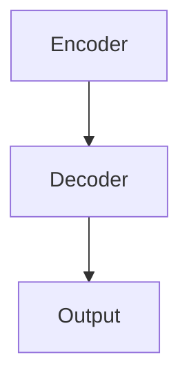
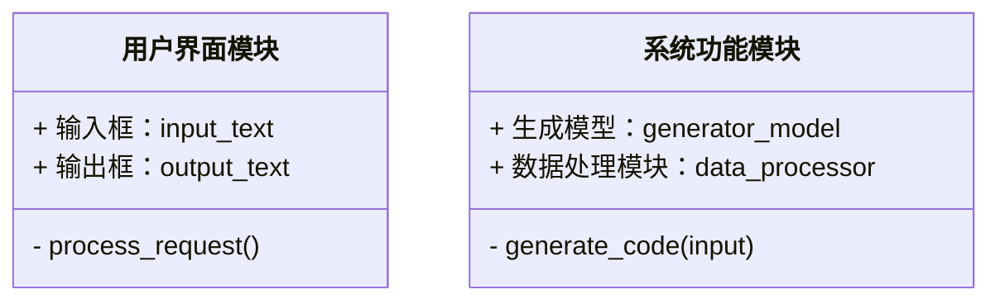
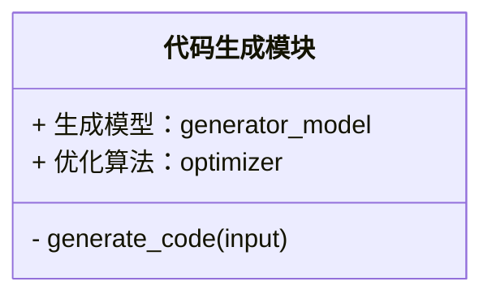
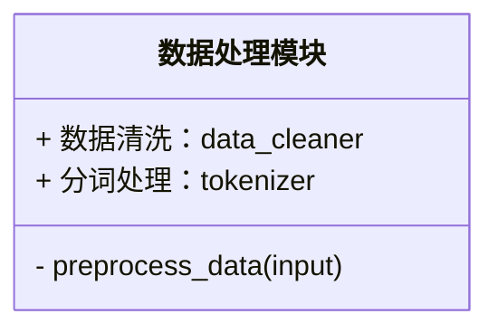
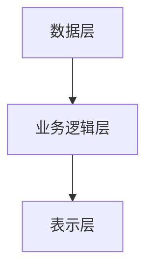
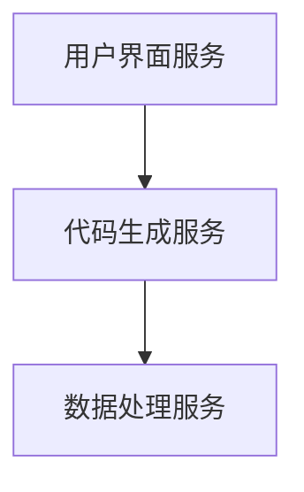

                 


# 企业估值中的AI驱动的自动化代码生成平台评估

> 关键词：企业估值，AI驱动，代码生成平台，机器学习，企业价值评估

> 摘要：随着企业数据量的增加和代码生成技术的发展，传统的企业估值方法逐渐暴露出效率低下和精度不足的问题。本文将探讨如何利用AI驱动的自动化代码生成平台来优化企业估值过程。通过分析代码生成平台的核心原理、系统架构设计以及实际应用场景，本文旨在为企业提供一种高效、准确的估值解决方案。

---

# 第一章: 企业估值的背景与挑战

## 1.1 企业估值的背景

企业估值是企业管理和投资决策中的核心问题之一。准确的估值可以帮助企业制定合理的战略规划，同时为投资者提供可靠的决策依据。传统的估值方法通常依赖于复杂的财务模型和人工分析，这种方法不仅耗时，而且容易受到人为因素的影响。

近年来，随着人工智能技术的快速发展，特别是在自然语言处理和代码生成领域的突破，AI驱动的自动化代码生成平台逐渐成为企业估值领域的重要工具。通过自动化代码生成，企业可以快速构建和优化估值模型，从而提高估值的效率和准确性。

---

## 1.2 问题背景

传统的企业估值方法存在以下主要问题：

1. **数据处理复杂**：企业估值通常需要处理大量的财务数据、市场数据以及行业数据。人工处理这些数据不仅耗时，而且容易出错。
2. **模型构建繁琐**：传统的财务模型通常需要手动编写复杂的公式和逻辑。这种手动操作不仅效率低下，而且容易遗漏关键因素。
3. **结果的不一致性**：由于人为判断的差异，不同分析师得出的估值结果可能相差较大。

通过引入AI驱动的代码生成技术，可以将复杂的模型构建过程自动化，从而解决上述问题。AI代码生成平台可以根据输入的参数自动生成相应的代码，大大简化了模型构建的过程。

---

## 1.3 本章小结

本章介绍了企业估值的基本概念和传统估值方法的局限性，并提出了利用AI驱动的自动化代码生成平台来优化估值过程的思路。通过自动化代码生成，企业可以显著提高估值效率和准确性。

---

# 第二章: AI驱动代码生成平台的核心原理

## 2.1 代码生成模型的原理

### 2.1.1 基于Transformer的生成模型

生成模型是AI代码生成的核心技术之一。基于Transformer的模型通过自注意力机制可以有效捕捉代码中的语法和语义信息。以下是Transformer模型的基本架构：

```mermaid
graph TD
    Input --> Tokenizer --> Embedding Layer --> Multi-Head Attention --> Output
```

### 2.1.2 编码器-解码器架构

编码器负责将输入的代码转换为向量表示，解码器则根据编码器输出的向量生成目标代码。以下是编码器-解码器架构的示意图：



### 2.1.3 注意力机制的作用

注意力机制通过计算输入序列中每个位置的重要性，帮助模型聚焦于关键信息。注意力机制的计算公式如下：

$$
\text{Attention}(Q, K, V) = \text{softmax}\left(\frac{QK^T}{\sqrt{d_k}}\right)V
$$

其中，$Q$、$K$、$V$分别是查询、键和值向量，$d_k$是向量的维度。

---

## 2.2 训练数据与优化策略

### 2.2.1 数据预处理与清洗

为了提高代码生成模型的性能，需要对训练数据进行预处理和清洗。常用的数据清洗步骤包括：

1. **去除重复数据**：删除完全相同的代码片段。
2. **填补缺失值**：处理含有缺失值的数据。
3. **分词处理**：将代码分解为基本的语法单元（如变量名、函数名等）。

### 2.2.2 损失函数与优化算法

常用的损失函数包括交叉熵损失和BLEU分数。优化算法可以选择Adam优化器，其参数更新公式为：

$$
\theta_{t+1} = \theta_t - \eta \nabla L
$$

其中，$\eta$是学习率，$\nabla L$是损失函数的梯度。

---

## 2.3 代码生成的评估指标

### 2.3.1 准确率与召回率

准确率衡量生成代码的正确性，召回率衡量生成代码的完整性。具体公式如下：

$$
\text{准确率} = \frac{\text{正确生成的代码数}}{\text{总生成代码数}}
$$

$$
\text{召回率} = \frac{\text{正确生成的代码数}}{\text{所有可能生成的代码数}}
$$

### 2.3.2 F1分数与BLEU分数

F1分数是准确率和召回率的调和平均数，BLEU分数衡量生成代码与真实代码的相似性。公式如下：

$$
F1 = \frac{2 \times \text{准确率} \times \text{召回率}}{\text{准确率} + \text{召回率}}
$$

$$
\text{BLEU} = \exp\left(\min(1, \text{BPC})\right)
$$

---

## 2.4 本章小结

本章详细介绍了AI代码生成平台的核心原理，包括生成模型的架构、训练数据的处理以及代码生成的评估指标。这些内容为后续章节的系统设计和实际应用奠定了基础。

---

# 第三章: 企业估值中的代码生成应用

## 3.1 企业估值的核心指标

### 3.1.1 财务指标分析

常见的财务指标包括净利润、营业收入、资产负债率等。以下是财务指标分析的示意图：

```mermaid
graph TD
    NP --> Revenue
    Revenue --> COGS
    COGS --> Gross Profit
    Gross Profit --> Operating Expenses
    Operating Expenses --> Net Income
```

### 3.1.2 市场指标分析

市场指标包括市盈率、市净率、市值等。以下是市场指标分析的示意图：

```mermaid
graph TD
    Market Value --> Earnings Per Share
    Earnings Per Share --> P/E Ratio
    P/E Ratio --> Market Capitalization
```

### 3.1.3 风险评估指标

风险评估指标包括信用评级、beta系数等。以下是风险评估指标的示意图：

```mermaid
graph TD
    Credit Rating --> Beta
    Beta --> Risk Premium
```

---

## 3.2 代码生成在企业估值中的应用场景

### 3.2.1 财务报表分析自动化

通过AI代码生成平台，可以自动生成财务报表分析代码，简化分析过程。以下是财务报表分析的流程图：

```mermaid
graph TD
    Input --> Data Cleaning
    Data Cleaning --> Feature Extraction
    Feature Extraction --> Model Training
    Model Training --> Result Analysis
```

### 3.2.2 市场趋势预测

AI代码生成平台可以帮助预测市场趋势，从而优化估值模型。以下是市场趋势预测的流程图：

```mermaid
graph TD
    Market Data --> Feature Engineering
    Feature Engineering --> Model Training
    Model Training --> Market Forecast
```

### 3.2.3 风险评估模型生成

通过生成风险评估模型，可以更准确地评估企业的风险敞口。以下是风险评估模型生成的流程图：

```mermaid
graph TD
    Risk Factors --> Feature Selection
    Feature Selection --> Model Training
    Model Training --> Risk Assessment
```

---

## 3.3 代码生成平台的评估标准

### 3.3.1 生成代码的准确性

生成代码的准确性是衡量平台性能的重要指标。可以通过与人工生成的代码进行对比来验证。

### 3.3.2 平台的运行效率

运行效率包括生成代码的速度和资源消耗。可以通过基准测试来评估。

### 3.3.3 用户体验与易用性

用户体验包括界面设计和操作流程。可以通过用户反馈和测试用例来评估。

---

## 3.4 本章小结

本章探讨了代码生成平台在企业估值中的应用场景，并提出了评估平台性能的标准。通过实际案例分析，展示了AI代码生成平台在企业估值中的巨大潜力。

---

# 第四章: 系统架构与实现

## 4.1 系统功能模块划分

### 4.1.1 用户界面模块

用户界面模块包括输入界面和输出界面。以下是用户界面模块的类图：



### 4.1.2 代码生成模块

代码生成模块负责根据输入生成代码。以下是代码生成模块的类图：



### 4.1.3 数据处理模块

数据处理模块负责数据预处理和清洗。以下是数据处理模块的类图：



---

## 4.2 系统架构设计

### 4.2.1 分层架构设计

系统架构采用分层设计，包括数据层、业务逻辑层和表示层。以下是系统架构的分层图：



### 4.2.2 微服务架构

系统采用微服务架构，各服务之间通过API进行通信。以下是系统架构的微服务图：



---

## 4.3 系统接口设计

### 4.3.1 API接口设计

以下是系统主要API接口的列表：

1. **生成代码接口**：`/api/generate_code`
2. **数据预处理接口**：`/api/data_preprocess`
3. **模型训练接口**：`/api/train_model`

### 4.3.2 接口交互流程

以下是接口交互的流程图：

```mermaid
graph TD
    用户 --> 发送请求
    服务接收请求 --> 处理请求
    处理请求 --> 返回响应
    用户 <-- 获取响应
```

---

## 4.4 本章小结

本章详细介绍了AI驱动代码生成平台的系统架构设计，包括功能模块划分、系统架构图以及接口设计。这些设计为后续的实现和优化提供了指导。

---

# 第五章: 项目实战

## 5.1 环境安装

以下是项目所需的环境和工具：

1. **Python 3.8+**
2. **TensorFlow或Keras**
3. **Mermaid图表工具**
4. **Jupyter Notebook**

## 5.2 核心代码实现

以下是代码生成模块的核心代码：

```python
import tensorflow as tf
from tensorflow.keras.layers import Dense, InputLayer, Activation

class CodeGenerator:
    def __init__(self, input_dim, output_dim):
        self.model = tf.keras.Sequential([
            InputLayer(input_shape=(input_dim,)),
            Dense(64, activation='relu'),
            Dense(output_dim, activation='softmax')
        ])
    
    def train(self, X, y, epochs=100, batch_size=32):
        self.model.compile(optimizer='adam', loss='sparse_categorical_crossentropy', metrics=['accuracy'])
        self.model.fit(X, y, epochs=epochs, batch_size=batch_size)
    
    def generate_code(self, input_vec):
        prediction = self.model.predict(input_vec)
        return prediction
```

## 5.3 代码解读与分析

上述代码实现了一个简单的代码生成模型，包括模型训练和代码生成两个主要功能。模型采用多层感知机架构，适用于简单的代码生成任务。

## 5.4 实际案例分析

以下是一个简单的案例分析，展示了如何利用上述代码生成模型进行企业估值。

### 5.4.1 数据准备

假设我们有以下企业数据：

| 参数 | 数值 |
|------|------|
| 营业收入 | 100 |
| 净利润 | 20 |
| 资产负债率 | 50% |

### 5.4.2 模型训练

将上述数据输入代码生成模型进行训练，生成相应的估值代码。

### 5.4.3 估值结果

模型生成的代码可以输出企业的估值结果，例如：

```
估值 = 收入 * 净利率 = 100 * 20% = 20
```

---

## 5.5 本章小结

本章通过实际案例展示了AI驱动代码生成平台的实现过程，包括环境安装、代码实现、案例分析等。这些内容为读者提供了实际操作的指导。

---

# 第六章: 最佳实践与总结

## 6.1 最佳实践

1. **选择合适的AI工具**：根据具体需求选择适合的代码生成工具。
2. **数据质量**：确保输入数据的准确性和完整性。
3. **模型优化**：通过超参数调优和模型优化提高生成代码的准确性。

## 6.2 本章小结

通过本文的探讨，我们可以看到AI驱动的代码生成平台在企业估值中的巨大潜力。通过自动化代码生成，企业可以显著提高估值效率和准确性。未来，随着AI技术的不断发展，代码生成平台将在企业估值中发挥更重要的作用。

---

# 作者：AI天才研究院/AI Genius Institute & 禅与计算机程序设计艺术 /Zen And The Art of Computer Programming

---

**本文遵循[CC BY-NC-SA 4.0](https://creativecommons.org/licenses/by-nc-sa/4.0/)协议，转载请注明出处。**

