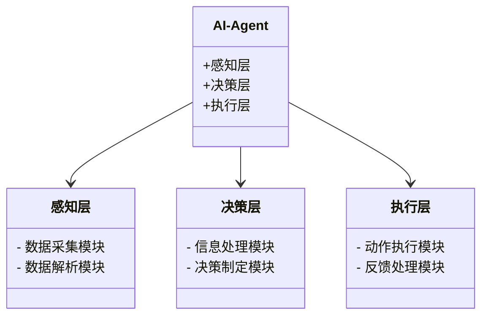

                 


# 企业级AI Agent的测试与质量保证策略

> 关键词：企业级AI Agent，测试，质量保证，AI算法，系统架构，项目实战

> 摘要：本文系统地探讨了企业级AI Agent的测试与质量保证策略。首先介绍了AI Agent的基本概念和背景，分析了测试与质量保证的核心概念与特殊性。接着详细讲解了AI Agent的核心概念与原理，包括其结构与功能、交互模型，以及相关的算法原理和数学模型。然后通过系统分析与架构设计，展示了如何将这些理论应用于实际项目中。最后，通过项目实战，详细阐述了测试与质量保证的具体实施过程，并总结了最佳实践、小结和注意事项。

---

# 第一部分: 企业级AI Agent的测试与质量保证概述

## 第1章: AI Agent的基本概念与背景

### 1.1 AI Agent的定义与特点

AI Agent（人工智能代理）是指能够感知环境、自主决策并执行任务的智能实体。企业级AI Agent是专门为企业的复杂业务场景设计的高级AI系统，具有以下特点：

- **智能性**：能够理解上下文并执行复杂决策。
- **自主性**：能够在没有人工干预的情况下完成任务。
- **适应性**：能够根据环境变化调整行为。
- **可扩展性**：能够处理大规模数据和复杂场景。

### 1.2 企业级AI Agent的背景与应用领域

#### 1.2.1 AI Agent在企业中的应用场景

企业级AI Agent广泛应用于以下领域：

- **客户服务**：智能客服系统，解决客户问题。
- **流程自动化**：优化企业内部流程，提高效率。
- **数据分析**：从海量数据中提取洞察，辅助决策。
- **风险管理**：实时监控并防范潜在风险。

#### 1.2.2 企业级AI Agent的发展趋势

随着AI技术的飞速发展，企业级AI Agent正朝着以下方向演进：

- **多模态交互**：支持文本、语音、图像等多种交互方式。
- **人机协作**：AI Agent与人类协同工作，增强效率。
- **实时响应**：具备快速决策和执行能力。

#### 1.2.3 企业级AI Agent的挑战与机遇

企业级AI Agent的挑战主要体现在：

- **技术复杂性**：需要处理多模态数据和复杂场景。
- **数据隐私**：企业数据的安全性和隐私保护。
- **系统可靠性**：确保AI Agent在关键时刻稳定运行。

而机遇则在于：

- **技术进步**：AI算法和计算能力的提升。
- **市场需求**：企业对智能化解决方案的需求日益增长。
- **生态系统**：AI Agent与企业现有系统的深度融合。

## 第2章: 测试与质量保证的基本概念

### 2.1 测试的基本概念

#### 2.1.1 测试的目的与作用

测试的主要目的是验证系统功能是否符合需求，并发现潜在缺陷。其作用包括：

- **验证功能**：确保系统按预期工作。
- **发现缺陷**：通过测试暴露系统问题。
- **提高质量**：通过缺陷修复提升系统质量。

#### 2.1.2 测试的类型与分类

测试可以分为以下几类：

- **功能测试**：验证系统功能是否正常。
- **性能测试**：评估系统在高负载下的表现。
- **安全性测试**：确保系统安全无漏洞。
- **回归测试**：验证修复后系统是否稳定。

#### 2.1.3 测试的生命周期

测试的生命周期通常包括以下阶段：

1. **需求分析**：明确测试目标和范围。
2. **测试计划制定**：制定测试策略和计划。
3. **测试用例设计**：设计测试用例。
4. **执行测试**：按照测试用例执行测试。
5. **缺陷报告**：记录和报告发现的缺陷。
6. **测试总结**：分析测试结果并总结经验。

### 2.2 质量保证的基本概念

#### 2.2.1 质量保证的定义与作用

质量保证（QA）是通过系统化的方法确保产品或服务满足既定质量标准的过程。其作用包括：

- **预防缺陷**：通过早期干预减少缺陷发生。
- **持续改进**：通过反馈机制不断优化系统。
- **提升信心**：增强客户和利益相关者的信任。

#### 2.2.2 质量保证的流程与方法

质量保证的流程通常包括：

1. **需求分析**：理解需求并制定质量标准。
2. **过程监控**：监督开发和测试过程。
3. **质量审计**：定期检查系统质量。
4. **持续改进**：根据审计结果优化流程。

#### 2.2.3 质量保证与测试的关系

质量保证与测试密切相关，但测试是质量保证的一部分。测试主要关注缺陷检测，而质量保证则关注整体质量的把控。两者相辅相成，共同确保系统质量。

## 第3章: 企业级AI Agent测试与质量保证的特殊性

### 3.1 企业级AI Agent的复杂性

#### 3.1.1 AI Agent的多模态交互

企业级AI Agent通常需要处理多种交互方式，如文本、语音和图像。这种多模态交互增加了测试的复杂性，因为需要验证不同交互方式下的系统表现。

#### 3.1.2 AI Agent的自主决策能力

AI Agent的核心能力是自主决策，这意味着其行为可能受到环境和上下文的影响。这种自主性使得测试场景的设计更加复杂，因为需要覆盖各种可能的情况。

#### 3.1.3 AI Agent的实时性与响应速度

企业级AI Agent需要在实时环境下运行，响应速度直接影响用户体验。因此，测试需要关注系统的实时性和响应速度，确保其在高负载下仍能稳定运行。

### 3.2 企业级AI Agent测试与质量保证的挑战

#### 3.2.1 测试场景的多样性

由于企业级AI Agent的应用场景多样，测试场景也需要覆盖多种情况。这增加了测试设计的难度，因为需要考虑各种可能的用户输入和系统响应。

#### 3.2.2 测试数据的复杂性

AI Agent的测试通常需要大量复杂的数据，包括文本、语音、图像等。这些数据的多样性和复杂性使得测试数据的准备和管理变得困难。

#### 3.2.3 测试工具的局限性

现有的测试工具可能无法完全满足企业级AI Agent测试的需求，尤其是在处理多模态数据和复杂场景时。因此，可能需要开发定制化的测试工具和框架。

### 3.3 企业级AI Agent测试与质量保证的策略

#### 3.3.1 测试策略的制定

制定测试策略时，需要考虑以下因素：

- **测试目标**：明确测试的目标和范围。
- **测试资源**：评估可用的测试资源和工具。
- **测试优先级**：根据风险和影响制定测试优先级。

#### 3.3.2 质量保证策略的实施

实施质量保证策略时，可以采取以下措施：

- **过程监控**：监督开发和测试过程，确保符合质量标准。
- **质量审计**：定期检查系统质量，发现潜在问题。
- **持续改进**：根据反馈优化系统和流程。

#### 3.3.3 测试与质量保证的协同

测试和质量保证需要协同工作，共同确保系统质量。具体包括：

- **需求分析**：在需求阶段明确测试目标和质量标准。
- **测试设计**：根据需求设计测试用例。
- **缺陷管理**：记录和跟踪缺陷，确保问题得到解决。
- **总结改进**：分析测试结果，总结经验并优化流程。

---

# 第二部分: 企业级AI Agent的核心概念与联系

## 第4章: AI Agent的核心概念与原理

### 4.1 AI Agent的结构与功能

#### 4.1.1 AI Agent的感知层

感知层是AI Agent与外部环境交互的部分，负责接收和处理输入数据。其主要功能包括：

- **数据采集**：从多种渠道获取数据，如传感器、数据库等。
- **数据解析**：对获取的数据进行解析和处理，提取有用信息。

#### 4.1.2 AI Agent的决策层

决策层是AI Agent的核心部分，负责根据感知层提供的信息做出决策。其主要功能包括：

- **信息处理**：对感知层提供的信息进行分析和处理。
- **决策制定**：基于分析结果制定决策。

#### 4.1.3 AI Agent的执行层

执行层是AI Agent的行动部分，负责根据决策层的指令执行具体操作。其主要功能包括：

- **动作执行**：根据决策执行具体操作。
- **反馈处理**：处理执行后的反馈，调整后续行为。

### 4.2 AI Agent的交互模型

#### 4.2.1 单轮对话模型

单轮对话模型是AI Agent与用户之间的简单交互模型，通常用于处理简单的查询。例如：

- 用户：请问今天北京的天气如何？
- AI Agent：今天北京的天气是晴天，温度在20℃到25℃之间。

#### 4.2.2 多轮对话模型

多轮对话模型允许AI Agent与用户进行多轮交互，能够更好地理解上下文和用户意图。例如：

- 用户：我有一个问题，能帮我解答吗？
- AI Agent：当然可以，请问您有什么问题？
- 用户：我的订单在哪里？
- AI Agent：请提供您的订单号，我帮您查询。

#### 4.2.3 主动交互模型

主动交互模型是AI Agent在没有用户主动请求的情况下，主动提供信息或服务。例如：

- AI Agent：尊敬的用户，您的订单已发货，请注意查收。
- 用户：谢谢。

---

## 第5章: 企业级AI Agent的算法原理

### 5.1 AI Agent的训练与推理过程

#### 5.1.1 算法原理

AI Agent的训练和推理过程通常包括以下几个步骤：

1. **数据预处理**：对原始数据进行清洗和转换，使其适合模型训练。
2. **模型训练**：使用训练数据训练模型，优化模型参数。
3. **模型推理**：使用训练好的模型对新输入进行预测或分类。

#### 5.1.2 数学模型与公式

AI Agent的训练通常基于深度学习模型，例如循环神经网络（RNN）或变压器（Transformer）。以下是一个简单的RNN模型的数学表达式：

$$
f(x) = \sigma(W_{hh}h_{t-1} + W_{xh}x_t + b_h)
$$

其中，$x_t$ 是输入向量，$h_{t-1}$ 是前一时刻的隐藏层状态，$W_{hh}$ 和 $W_{xh}$ 是权重矩阵，$b_h$ 是偏置项，$\sigma$ 是激活函数。

---

## 第6章: 企业级AI Agent的系统分析与架构设计

### 6.1 系统功能设计

#### 6.1.1 领域模型设计

以下是领域模型的类图：



#### 6.1.2 系统架构设计

以下是系统架构的架构图：


---

## 第7章: 项目实战

### 7.1 环境安装与配置

#### 7.1.1 安装Python

安装Python：

```bash
# 在终端中运行以下命令
python --version
```

确保Python版本为3.8或更高。

#### 7.1.2 安装依赖库

安装必要的依赖库：

```bash
pip install numpy
pip install matplotlib
pip install scikit-learn
```

---

### 7.2 系统核心实现

以下是AI Agent的核心实现代码：

```python
import numpy as np

def感知层输入处理(input_data):
    # 数据预处理代码
    processed_data = input_data.lower().strip()
    return processed_data

def决策层推理(processed_data):
    # 简单的决策逻辑
    if "帮助" in processed_data:
        return "帮助用户解决问题"
    elif "信息" in processed_data:
        return "提供相关信息"
    else:
        return "无法识别"

def执行层输出(result):
    # 输出结果
    print(result)
```

---

### 7.3 项目小结

通过本项目的实战，我们可以看到企业级AI Agent的测试与质量保证需要综合考虑多方面的因素。从数据预处理到模型训练，再到系统部署，每一步都需要精心设计和测试。通过制定合理的测试策略和质量保证策略，可以有效提升系统的稳定性和可靠性。

---

## 第8章: 最佳实践与总结

### 8.1 最佳实践

- **制定详细的测试计划**：在测试开始前明确测试目标和范围。
- **使用自动化测试工具**：提高测试效率并减少人为错误。
- **注重数据质量管理**：确保测试数据的多样性和代表性。
- **持续优化系统**：根据测试结果不断优化系统和流程。

### 8.2 小结

企业级AI Agent的测试与质量保证是一个复杂而重要的任务。通过本文的探讨，我们了解了AI Agent的核心概念、测试与质量保证的特殊性，以及如何在实际项目中应用这些理论。希望本文能为相关从业者提供有价值的参考和指导。

### 8.3 注意事项

- **数据隐私保护**：在处理企业数据时，必须严格遵守数据隐私法规。
- **系统可靠性**：确保AI Agent在关键时刻能够稳定运行。
- **团队协作**：测试与开发团队需要紧密合作，共同提升系统质量。

---

## 第9章: 拓展阅读

- **推荐书籍**：《人工智能：一种现代的方法》
- **推荐博客**：[AI Agent技术博客](https://example.com)
- **推荐工具**：[Python测试框架](https://example.com)

---

作者：AI天才研究院/AI Genius Institute & 禅与计算机程序设计艺术 /Zen And The Art of Computer Programming

