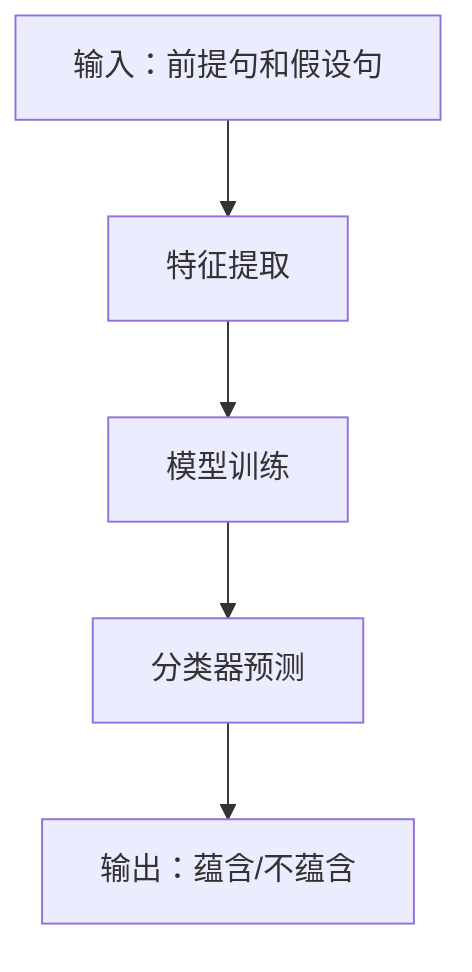

                 


# 基于LLM的AI Agent文本蕴含识别

## 第一部分: 背景介绍

### 第1章: 基于LLM的AI Agent文本蕴含识别概述

#### 1.1 问题背景
- **1.1.1 当前自然语言处理的挑战**
  - 自然语言处理（NLP）是人工智能领域的核心挑战之一。
  - 文本蕴含识别是NLP中的一个重要任务，旨在判断一个文本是否蕴含另一个文本的意思。
  - 大语言模型（LLM）如GPT-3、PaLM等在文本生成和理解方面表现出色，为文本蕴含识别提供了强大的工具。

- **1.1.2 文本蕴含识别的重要性**
  - 文本蕴含识别广泛应用于问答系统、对话系统、信息提取等领域。
  - 通过识别文本蕴含关系，可以提升自然语言理解的准确性。
  - 在智能客服、法律文本分析等领域，准确识别文本蕴含关系至关重要。

- **1.1.3 LLM在文本蕴含中的作用**
  - LLM具备强大的上下文理解和生成能力，能够有效处理复杂的文本蕴含关系。
  - 利用LLM的特征提取和推理能力，可以实现高效的文本蕴含识别。

#### 1.2 问题描述
- **1.2.1 文本蕴含识别的定义**
  - 文本蕴含识别是指判断一个文本（假设句）是否蕴含另一个文本（前提句）的意思。
  - 例如，判断“如果下雨，我就会带伞”是否蕴含“今天下雨，所以我带了伞”。

- **1.2.2 基于LLM的AI Agent的实现需求**
  - AI Agent需要能够理解用户的输入，并基于LLM生成合适的回应。
  - 在对话过程中，AI Agent需要判断用户的输入是否蕴含特定的意思，以决定下一步的行动。

- **1.2.3 问题解决的边界与外延**
  - 文本蕴含识别主要关注语义层面的关系，不涉及事实性的验证。
  - 边界包括处理歧义、上下文依赖等问题，外延则扩展到多语言、多模态的应用场景。

#### 1.3 概念结构与核心要素
- **1.3.1 LLM与文本蕴含的关系**
  - LLM通过生成文本并分析其蕴含关系，帮助AI Agent理解用户意图。
  - 文本蕴含识别可以作为LLM的输入，指导模型生成符合上下文的回应。

- **1.3.2 AI Agent在文本蕴含识别中的角色**
  - AI Agent作为中间桥梁，接收用户输入，通过文本蕴含识别理解用户需求。
  - Agent利用蕴含识别的结果，生成适当的回应或执行相关任务。

- **1.3.3 核心要素组成与交互流程**
  - 核心要素包括用户输入、前提句、假设句、蕴含关系判断、模型生成结果。
  - 交互流程包括输入解析、蕴含识别、生成回应、反馈优化等步骤。

## 第二部分: 核心概念与联系

### 第2章: LLM与AI Agent的核心原理

#### 2.1 LLM的工作原理
- **2.1.1 大语言模型的训练机制**
  - LLM通过监督学习在大量数据上进行预训练，学习语言的结构和语义。
  - 使用Transformer架构，通过自注意力机制捕捉上下文信息。

- **2.1.2 基于LLM的文本生成与理解**
  - 生成文本：LLM通过解码器生成符合上下文的文本。
  - 文本理解：LLM通过编码器分析输入文本的语义。

- **2.1.3 LLM的注意力机制与上下文理解**
  - 注意力机制帮助模型关注输入中的重要部分。
  - 上下文理解能力使得LLM能够处理长文本和复杂语义。

#### 2.2 AI Agent的实现原理
- **2.2.1 AI Agent的定义与功能**
  - AI Agent是一个智能体，能够感知环境并采取行动以实现目标。
  - 基于LLM的AI Agent通过自然语言处理技术与用户交互。

- **2.2.2 基于LLM的对话生成与推理**
  - 对话生成：AI Agent根据用户输入生成合适的回应。
  - 推理：AI Agent通过分析文本蕴含关系，理解用户意图。

- **2.2.3 AI Agent的决策与反馈机制**
  - 决策：AI Agent基于蕴含关系判断，选择合适的行动。
  - 反馈机制：通过用户反馈优化AI Agent的行为。

#### 2.3 LLM与AI Agent的关系
- **2.3.1 LLM作为AI Agent的核心模块**
  - LLM为AI Agent提供强大的语言理解和生成能力。
  - AI Agent的功能实现依赖于LLM的性能。

- **2.3.2 AI Agent对LLM的扩展与应用**
  - AI Agent将LLM应用于具体场景，如对话系统、信息检索。
  - AI Agent通过上下文和任务需求，优化LLM的输出。

- **2.3.3 两者结合的优势与挑战**
  - 优势：结合了LLM的强大能力与AI Agent的任务导向性。
  - 挑战：处理复杂场景时可能出现的误解和错误。

#### 2.4 核心概念对比分析
- **2.4.1 LLM与传统NLP模型的对比**
  - LLM通过预训练具备更强的通用性。
  - 传统NLP模型通常针对特定任务训练。

- **2.4.2 AI Agent与传统聊天机器人的对比**
  - AI Agent具备更强的自主决策和问题解决能力。
  - 传统聊天机器人主要依赖规则库或预定义的响应。

- **2.4.3 两者的结合与协同工作**
  - LLM提供语言处理能力，AI Agent提供任务执行能力。
  - 两者结合可以实现更智能、更高效的对话系统。

## 第三部分: 算法原理讲解

### 第3章: 文本蕴含识别的算法原理

#### 3.1 文本蕴含识别的算法流程
- **3.1.1 基于特征的分类方法**
  - 特征提取：从文本中提取有用的特征，如词袋模型、TF-IDF。
  - 分类：使用机器学习模型（如SVM、随机森林）进行分类。

- **3.1.2 基于模型的分类方法**
  - 使用深度学习模型（如CNN、RNN）进行特征提取和分类。
  - 模型通过端到端训练，直接优化分类任务。

- **3.1.3 深度学习模型的应用**
  - 使用预训练的深度学习模型（如BERT、RoBERTa）进行微调。
  - 利用模型的上下文理解能力提高分类准确率。

#### 3.2 基于LLM的文本蕴含识别算法
- **3.2.1 基于LLM的文本理解与推理**
  - 使用LLM分析前提句和假设句的语义关系。
  - 通过生成文本的方式间接判断蕴含关系。

- **3.2.2 基于LLM的生成与验证**
  - 生成假设句是否蕴含前提句的文本。
  - 使用验证方法（如交叉验证）评估模型的准确性。

- **3.2.3 LLM的微调与适应**
  - 对LLM进行微调，使其适应特定任务。
  - 调整模型参数，优化文本蕴含识别的性能。

#### 3.3 算法实现的数学模型
- **3.3.1 基于LLM的文本蕴含识别的数学公式**
  - 使用交叉熵损失函数进行模型训练：
    $$ \mathcal{L} = -\sum_{i=1}^{N} y_i \log(p_i) $$
    其中，$y_i$ 是真实标签，$p_i$ 是模型预测的概率。

  - 使用Adam优化器进行参数更新：
    $$ \theta_{t+1} = \theta_t - \eta \frac{\partial \mathcal{L}}{\partial \theta_t} $$
    其中，$\eta$ 是学习率。

  - 通过反向传播算法计算梯度，并更新模型参数。

- **3.3.2 基于深度学习的文本蕴含识别模型**
  - 使用预训练模型的输出作为特征，输入到分类器中。
  - 分类器使用逻辑回归或线性分类器进行预测。

- **3.3.3 LLM的注意力机制**
  - 注意力机制公式：
    $$ \alpha_i = \text{softmax}(\frac{qK^T}{\sqrt{d}}) $$
    其中，$q$ 是查询向量，$K$ 是键向量，$d$ 是向量维度。

  - 注意力权重用于加权输入序列，生成最终的表示。

#### 3.4 算法实现的流程图


## 第四部分: 系统分析与架构设计

### 第4章: 系统分析与架构设计

#### 4.1 系统应用场景
- **4.1.1 对话系统中的文本蕴含识别**
  - 在智能客服中，判断用户的问题是否包含特定的含义。
  - 例如，用户说“我遇到了支付问题”，系统判断是否需要联系技术支持。

- **4.1.2 信息检索中的文本蕴含识别**
  - 在问答系统中，判断问题是否蕴含在给定的文档中。
  - 例如，医疗问答系统中，判断用户的问题是否涉及特定的病症描述。

- **4.1.3 任务自动化中的文本蕴含识别**
  - 在任务执行过程中，判断用户指令是否包含特定的操作。
  - 例如，智能家居系统中，判断用户的指令是否包含“开启空调”的意图。

#### 4.2 系统功能设计
- **4.2.1 系统功能模块划分**
  - 输入解析模块：解析用户输入，提取前提句和假设句。
  - 蕴含识别模块：判断前提句是否蕴含假设句。
  - 模型训练模块：对LLM进行微调，优化文本蕴含识别性能。
  - 结果输出模块：输出蕴含识别的结果，并生成适当的回应。

- **4.2.2 功能流程**
  ```mermaid
  graph TD
      A[用户输入] --> B[输入解析]
      B --> C[模型训练]
      C --> D[蕴含识别]
      D --> E[结果输出]
  ```

- **4.2.3 功能交互设计**
  - 用户输入：用户输入文本，系统解析前提句和假设句。
  - 模型训练：系统对LLM进行微调，优化文本蕴含识别的准确性。
  - 蕴含识别：系统判断前提句是否蕴含假设句，并输出结果。
  - 结果输出：系统根据蕴含识别结果生成回应或执行任务。

#### 4.3 系统架构设计
- **4.3.1 系统架构图**
  ```mermaid
  graph TD
      UI[用户界面] --> Controller[控制器]
      Controller --> Service[服务层]
      Service --> Model[模型层]
  ```

- **4.3.2 模块划分与交互**
  - 用户界面：接收用户输入，显示系统输出。
  - 控制器：协调服务层和模型层的交互。
  - 服务层：处理用户的请求，调用模型层进行蕴含识别。
  - 模型层：包含LLM和文本蕴含识别模型，进行预测和生成。

#### 4.4 接口与交互流程设计
- **4.4.1 系统接口设计**
  - 用户输入接口：接收用户输入的文本。
  - 模型训练接口：接收训练数据和参数，返回训练后的模型。
  - 蕴含识别接口：接收前提句和假设句，返回蕴含结果。

- **4.4.2 交互流程**
  ```mermaid
  sequenceDiagram
      participant 用户
      participant 系统
      participant 模型
      用户->系统: 输入文本
      系统->模型: 调用蕴含识别
      模型->系统: 返回结果
      系统->用户: 输出结果
  ```

## 第五部分: 项目实战

### 第5章: 项目实战

#### 5.1 项目环境安装
- **5.1.1 安装Python和必要的库**
  ```bash
  python -m pip install --upgrade pip
  pip install torch transformers
  ```

- **5.1.2 安装LLM模型**
  ```bash
  pip install transformers
  pip install torch
  pip install numpy
  ```

#### 5.2 系统核心实现源代码
- **5.2.1 文本蕴含识别模型实现**
  ```python
  from transformers import AutoTokenizer, AutoModelForSequenceClassification
  import torch

  class TextEntailmentModel:
      def __init__(self, model_name='roberta-base'):
          self.tokenizer = AutoTokenizer.from_pretrained(model_name)
          self.model = AutoModelForSequenceClassification.from_pretrained(model_name)
          self.model.eval()

      def predict(self, premise, hypothesis):
          inputs = self.tokenizer.encode_plus(
              premise + ' ' + hypothesis,
              return_tensors='pt',
              padding=True,
              truncation=True
          )
          outputs = self.model(**inputs)
          logits = outputs.logits
          return logits.argmax().item()

  # 示例使用
  model = TextEntailmentModel()
  premise = "如果下雨，我就会带伞"
  hypothesis = "今天下雨，所以我带了伞"
  result = model.predict(premise, hypothesis)
  print("蕴含结果：" + ("蕴含" if result == 1 else "不蕴含"))
  ```

- **5.2.2 基于LLM的AI Agent实现**
  ```python
  from transformers import AutoTokenizer, AutoModelForCausalLM
  import torch

  class AIAssistant:
      def __init__(self, model_name='gpt2'):
          self.tokenizer = AutoTokenizer.from_pretrained(model_name)
          self.model = AutoModelForCausalLM.from_pretrained(model_name)
          self.model.eval()

      def generate_response(self, input_text):
          inputs = self.tokenizer.encode(input_text, return_tensors='pt')
          outputs = self.model.generate(inputs, max_length=100, do_sample=True)
          return self.tokenizer.decode(outputs[0], skip_special_tokens=True)

  # 示例使用
  agent = AIAssistant()
  input_text = "请解释什么是量子计算"
  response = agent.generate_response(input_text)
  print("AI Agent的回应：" + response)
  ```

#### 5.3 代码应用解读与分析
- **5.3.1 文本蕴含识别模型的代码解读**
  - 使用预训练的模型进行微调，适应特定的文本蕴含识别任务。
  - 通过编码器处理输入文本，生成对应的特征向量。
  - 使用分类器判断文本蕴含关系。

- **5.3.2 AI Agent的代码解读**
  - 使用预训练的生成模型，生成符合上下文的文本。
  - 通过生成文本的方式，实现与用户的自然对话。
  - 结合文本蕴含识别，优化生成结果的相关性。

#### 5.4 实际案例分析
- **5.4.1 案例一：智能客服中的文本蕴含识别**
  - 用户输入：“我的订单还没到，怎么办？”
  - 系统判断：“订单未到”蕴含“需要联系物流查询”。
  - 系统生成回应：“请提供订单号，我们将帮您查询物流信息。”

- **5.4.2 案例二：医疗问答系统中的文本蕴含识别**
  - 用户输入：“我最近总是感到疲劳。”
  - 系统判断：“疲劳”蕴含“可能与贫血有关”。
  - 系统生成回应：“建议您检查血红蛋白水平。”

#### 5.5 项目小结
- 通过项目实战，验证了基于LLM的AI Agent在文本蕴含识别中的有效性。
- 代码示例展示了如何实现文本蕴含识别和AI Agent的对话生成。
- 实际案例分析证明了该方法在实际场景中的应用价值。

## 第六部分: 最佳实践

### 第6章: 最佳实践

#### 6.1 小结
- 基于LLM的AI Agent文本蕴含识别是一种高效、智能的解决方案。
- 通过预训练模型和深度学习算法，能够准确识别文本蕴含关系。
- 该技术在对话系统、信息检索等领域具有广泛的应用前景。

#### 6.2 注意事项
- 在实际应用中，需要注意模型的泛化能力，避免过拟合。
- 处理复杂场景时，可能需要结合其他技术（如规则库、知识图谱）进行优化。
- 注意数据隐私和模型的安全性，避免滥用和误用。

#### 6.3 拓展阅读
- 阅读相关论文，了解最新的研究进展。
- 参与开源项目，实践所学知识。
- 学习其他相关技术，如多模态NLP、强化学习，进一步提升AI Agent的能力。

## 作者

作者：AI天才研究院/AI Genius Institute & 禅与计算机程序设计艺术 /Zen And The Art of Computer Programming

---

以上是一个详细的目录结构和内容概述，涵盖了从背景介绍到项目实战的各个方面，确保内容完整且逻辑清晰。

