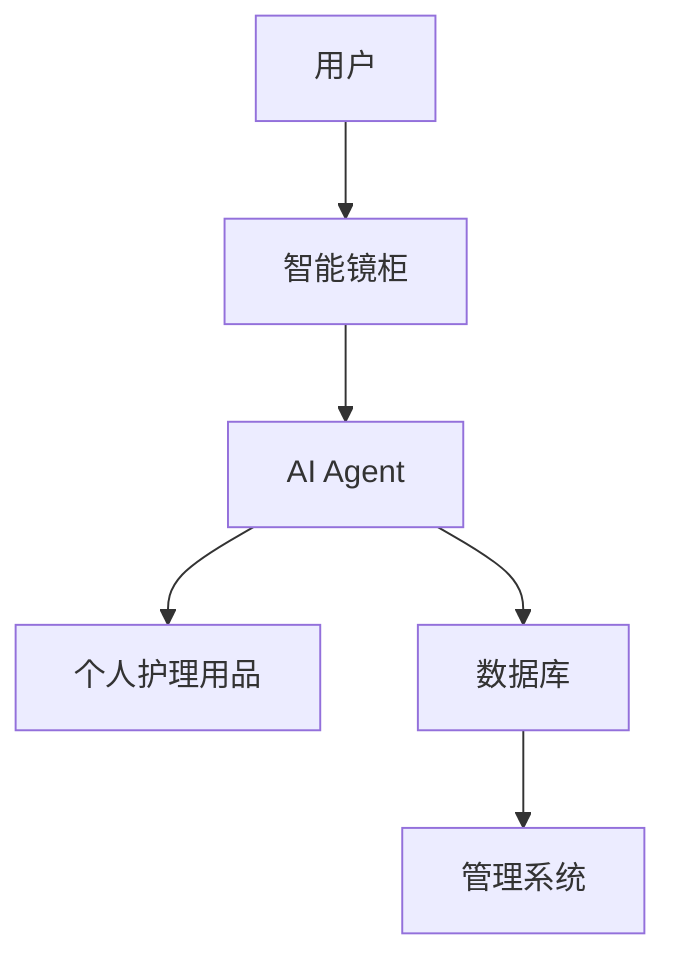
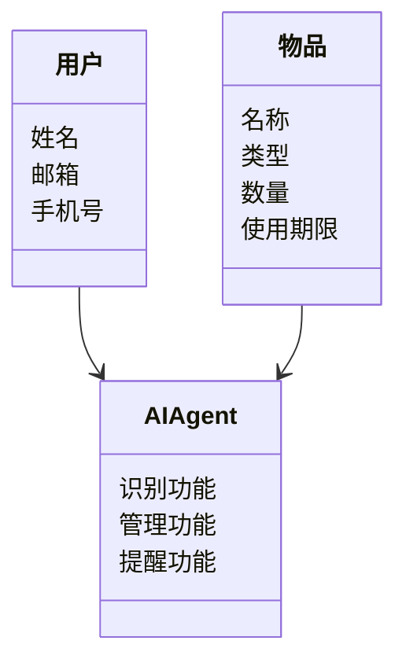
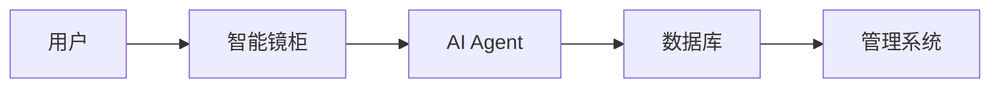
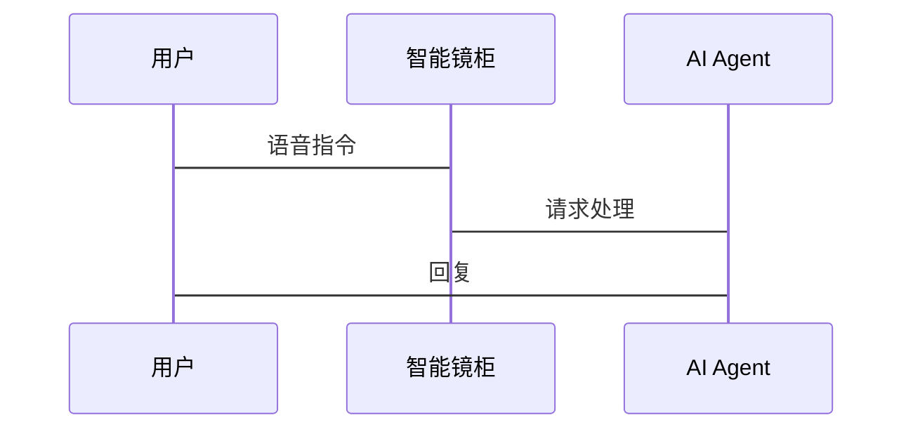

                 


# 智能浴室镜柜：AI Agent的个人护理用品管理

## 关键词：智能浴室镜柜、AI Agent、个人护理用品、物联网、人工智能、智能家居

## 摘要：本文探讨了智能浴室镜柜与AI Agent在个人护理用品管理中的应用。通过分析问题背景、解决方案、核心原理、系统架构、算法实现、项目实战及最佳实践，展示了如何利用AI技术提升个人护理管理的智能化水平。文章从背景介绍、核心概念、算法原理、系统设计、项目实现等多维度展开，为读者提供全面的技术解读。

---

# 第一部分：背景介绍

## 第1章：智能浴室镜柜与AI Agent概述

### 1.1 智能浴室镜柜的背景与问题背景

#### 1.1.1 传统浴室镜柜的功能与局限性
传统浴室镜柜主要用于存储和摆放个人护理用品，如牙刷、毛巾、化妆品等。然而，这类产品通常存在以下问题：
- **存储混乱**：用户难以快速找到所需物品，导致时间浪费。
- **缺乏提醒**：无法提醒用户物品的使用期限或补货需求。
- **功能单一**：仅作为存储工具，未能提供智能化的管理功能。

#### 1.1.2 个人护理用品管理中的问题与挑战
随着生活水平的提高，个人护理用品的种类和数量不断增加，传统管理方式的局限性日益明显：
- **时间浪费**：用户每天早晨花费大量时间寻找物品。
- **资源浪费**：过期产品堆积导致资源浪费。
- **安全隐患**：药品或化学品过期可能引发安全隐患。

#### 1.1.3 智能化管理的需求与应用场景
智能化管理的需求主要体现在以下几个方面：
- **快速查找**：通过智能搜索或语音助手快速定位物品。
- **提醒功能**：提醒用户使用即将过期的产品或补货需求。
- **健康管理**：结合用户健康数据，推荐合适的护理产品。

### 1.2 AI Agent的核心概念与问题描述

#### 1.2.1 AI Agent的基本定义与特点
AI Agent（人工智能代理）是一种能够感知环境、执行任务的智能实体。其特点包括：
- **自主性**：无需人工干预，自动执行任务。
- **反应性**：能够实时感知环境并做出响应。
- **学习能力**：通过数据学习优化决策能力。

#### 1.2.2 个人护理用品管理中的问题描述
在个人护理用品管理中，AI Agent需要解决以下问题：
- **识别与分类**：准确识别物品并进行分类。
- **库存管理**：实时更新库存信息并提醒用户。
- **个性化推荐**：根据用户习惯推荐相关产品。

#### 1.2.3 智能浴室镜柜的解决方案与边界
智能浴室镜柜通过集成AI Agent，提供以下解决方案：
- **智能识别**：利用图像识别技术快速识别物品。
- **智能管理**：通过AI算法实现库存管理和使用建议。
- **交互方式**：支持语音、触摸等多种交互方式。

### 1.3 问题解决与系统边界

#### 1.3.1 智能浴室镜柜的功能实现
智能浴室镜柜的核心功能包括：
- **物品识别**：通过摄像头和图像识别技术识别物品。
- **库存管理**：记录物品的使用情况和剩余数量。
- **智能提醒**：当物品即将用尽或过期时，提醒用户。

#### 1.3.2 系统的边界与外延
系统的边界包括：
- **硬件部分**：智能镜柜、摄像头、传感器等。
- **软件部分**：AI Agent、库存管理系统、用户界面等。
- **用户交互**：用户通过语音或触摸进行操作。

#### 1.3.3 核心概念与系统结构
核心概念包括：
- **用户**：系统的主要使用者。
- **智能镜柜**：系统的硬件载体。
- **AI Agent**：系统的智能核心。

### 1.4 核心要素与概念结构

#### 1.4.1 智能浴室镜柜的核心要素
智能浴室镜柜的核心要素包括：
- **硬件设备**：摄像头、传感器、存储模块。
- **软件系统**：AI算法、数据库、用户界面。
- **用户交互**：语音、触摸、手势等交互方式。

#### 1.4.2 AI Agent与个人护理用品的关系
AI Agent通过感知环境和用户需求，实现对个人护理用品的智能管理。两者的关系如下：
- **感知环境**：AI Agent通过摄像头和传感器感知物品的存在和状态。
- **用户需求**：AI Agent通过用户输入（如语音指令）理解用户需求。
- **执行任务**：AI Agent根据需求和环境信息，执行相应的管理任务。

#### 1.4.3 系统功能与用户需求的对应关系
系统功能与用户需求的对应关系如下：

| **系统功能**      | **用户需求**                |
|-------------------|-----------------------------|
| 物品识别          | 快速找到所需物品           |
| 库存管理          | 实时了解物品使用情况       |
| 智能提醒          | 避免物品过期或遗漏         |
| 个性化推荐        | 根据习惯推荐相关产品       |

### 1.5 本章小结
本章介绍了智能浴室镜柜和AI Agent的基本概念，分析了传统浴室镜柜的局限性，提出了智能化管理的需求和解决方案。通过系统边界和核心要素的分析，为后续章节的展开奠定了基础。

---

## 第2章：AI Agent与智能镜柜的核心原理

### 2.1 AI Agent的核心原理

#### 2.1.1 自然语言处理（NLP）在AI Agent中的应用
自然语言处理技术主要用于实现用户的语音指令识别和语义理解。以下是其实现原理：
- **语音识别**：通过将用户的语音输入转换为文本。
- **语义理解**：分析文本的语义，理解用户的需求。
- **对话生成**：根据理解生成自然的回复。

#### 2.1.2 图像识别与物体检测的原理
图像识别技术用于实现物品的自动识别和分类：
- **图像采集**：通过摄像头获取物品的图像。
- **特征提取**：提取物品的视觉特征。
- **分类识别**：利用训练好的模型进行物品分类。

#### 2.1.3 机器学习在智能管理中的作用
机器学习用于实现个性化推荐和行为预测：
- **数据收集**：收集用户的使用习惯和偏好。
- **模型训练**：通过机器学习算法训练推荐模型。
- **实时优化**：根据用户反馈优化推荐策略。

### 2.2 智能镜柜的核心概念与联系

#### 2.2.1 智能镜柜的功能模块分析
智能镜柜的功能模块包括：
- **物品识别模块**：负责物品的自动识别。
- **库存管理模块**：负责物品的库存记录和更新。
- **智能提醒模块**：负责提醒用户物品的使用情况。

#### 2.2.2 AI Agent与智能镜柜的交互机制
AI Agent与智能镜柜的交互机制如下：
- **感知环境**：AI Agent通过摄像头和传感器感知环境。
- **用户输入**：用户通过语音或触摸输入需求。
- **执行任务**：AI Agent根据输入和环境信息执行相应的任务。

#### 2.2.3 系统的核心要素与关系
系统的核心要素包括：
- **用户**：系统的主要使用者。
- **智能镜柜**：系统的硬件载体。
- **AI Agent**：系统的智能核心。

### 2.3 核心概念的属性特征对比

#### 2.3.1 AI Agent与传统自动化系统的对比
| **AI Agent**       | **传统自动化系统**        |
|--------------------|---------------------------|
| 自主性             | 需要外部控制             |
| 适应性             | 固定规则                 |
| 学习能力           | 无学习能力               |

#### 2.3.2 智能镜柜与普通浴室镜柜的对比
| **智能镜柜**        | **普通浴室镜柜**         |
|---------------------|--------------------------|
| 智能识别功能         | 无智能识别功能           |
| 库存管理功能         | 无库存管理功能           |
| 智能提醒功能         | 无智能提醒功能           |

#### 2.3.3 个人护理用品管理的特征分析
个人护理用品管理的特征包括：
- **多样性**：物品种类繁多。
- **动态性**：使用情况实时变化。
- **个性化**：用户需求各不相同。

### 2.4 实体关系图


### 2.5 本章小结
本章详细讲解了AI Agent的核心原理，分析了智能镜柜的功能模块和交互机制，并通过对比分析和实体关系图，展示了系统的核心要素及其关系。

---

## 第3章：AI Agent的算法原理

### 3.1 自然语言处理（NLP）算法

#### 3.1.1 分词算法
分词算法用于将用户的语音输入分割成词语或短语。常用的分词算法包括：
- **基于规则的分词**：利用词典和语法规则进行分词。
- **基于统计的分词**：利用概率模型进行分词。

#### 3.1.2 语义理解算法
语义理解算法用于理解用户需求的含义。常用的算法包括：
- **词袋模型**：将文本表示为词袋。
- **TF-IDF**：计算词语的重要性。
- **深度学习模型**：如LSTM和Transformer。

#### 3.1.3 对话生成
对话生成算法用于生成自然的回复。常用的算法包括：
- **基于模板的对话生成**：根据预定义模板生成回复。
- **基于生成模型的对话生成**：利用生成对抗网络（GAN）生成回复。

### 3.2 图像识别与物体检测算法

#### 3.2.1 图像采集与预处理
图像采集与预处理步骤包括：
1. **图像采集**：通过摄像头获取图像。
2. **图像预处理**：包括灰度化、二值化、滤波等。

#### 3.2.2 特征提取与分类
特征提取与分类步骤包括：
1. **特征提取**：提取图像的特征向量。
2. **分类识别**：利用训练好的模型进行分类。

#### 3.2.3 常用算法
常用的图像识别算法包括：
- **支持向量机（SVM）**：用于分类。
- **卷积神经网络（CNN）**：用于图像识别。

### 3.3 机器学习在智能管理中的应用

#### 3.3.1 数据收集与预处理
数据收集与预处理步骤包括：
1. **数据收集**：收集用户的使用习惯和偏好。
2. **数据清洗**：去除噪声数据。

#### 3.3.2 模型训练
模型训练步骤包括：
1. **特征选择**：选择重要的特征。
2. **模型训练**：利用训练数据训练模型。

#### 3.3.3 模型优化
模型优化步骤包括：
1. **参数调优**：调整模型参数。
2. **交叉验证**：验证模型的泛化能力。

### 3.4 数学模型与公式

#### 3.4.1 分类模型
分类模型常用的公式包括：
- **逻辑回归**：$$ P(y=1|x) = \frac{e^{w \cdot x + b}}{1 + e^{w \cdot x + b}} $$
- **支持向量机**：$$ \text{目标函数} = \sum_{i=1}^{n} \xi_i + C \sum_{i=1}^{n} \xi_i $$

#### 3.4.2 聚类模型
聚类模型常用的公式包括：
- **K-means**：$$ \text{目标函数} = \sum_{i=1}^{k} \sum_{j=1}^{n_i} ||x_j - c_i||^2 $$
- **层次聚类**：$$ \text{相似性矩阵} = [d_{i,j}] $$

### 3.5 本章小结
本章详细讲解了AI Agent中常用的算法，包括自然语言处理、图像识别和机器学习算法，并通过数学公式展示了模型的实现原理。

---

## 第4章：系统分析与架构设计

### 4.1 问题场景介绍

#### 4.1.1 项目背景
智能浴室镜柜的开发背景包括：
- **智能化需求**：用户对智能化生活的追求。
- **市场需求**：智能家居市场的快速发展。

#### 4.1.2 项目目标
项目的总体目标是：
- 实现个人护理用品的智能化管理。
- 提供便捷的用户交互体验。

### 4.2 系统功能设计

#### 4.2.1 领域模型
领域模型的类图如下：


#### 4.2.2 系统架构
系统架构的架构图如下：


#### 4.2.3 接口设计
接口设计包括：
- **用户接口**：语音、触摸、手势。
- **系统接口**：与智能家居平台的对接。

#### 4.2.4 交互流程
交互流程的序列图如下：


### 4.3 本章小结
本章分析了系统的功能需求和架构设计，通过类图、架构图和序列图展示了系统的实现方案。

---

## 第5章：项目实战

### 5.1 环境安装

#### 5.1.1 开发环境
开发环境包括：
- **操作系统**：Windows 10 或 macOS。
- **开发工具**：Python、PyTorch、TensorFlow。
- **硬件设备**：摄像头、传感器。

#### 5.1.2 依赖安装
安装依赖包括：
- **Python库**：numpy、pandas、scikit-learn。
- **框架**：Flask、Django。

### 5.2 系统核心实现

#### 5.2.1 AI Agent实现
AI Agent的实现代码如下：
```python
class AIAgent:
    def __init__(self):
        self.nlp_model = initialize_NLP_model()
        self.vision_model = initialize_vision_model()

    def process_request(self, request):
        if request.type == 'voice':
            response = self.nlp_model(request.content)
        else:
            response = self.vision_model(request.content)
        return response
```

#### 5.2.2 智能镜柜实现
智能镜柜的实现代码如下：
```python
class SmartMirror:
    def __init__(self):
        self.inventory = {}

    def recognize_item(self, item):
        # 使用图像识别技术识别物品
        pass

    def update_inventory(self, item, quantity):
        self.inventory[item] += quantity
```

### 5.3 代码应用解读与分析
- **AI Agent实现**：通过NLP模型处理用户的语音指令，通过视觉模型处理图像信息。
- **智能镜柜实现**：通过图像识别技术识别物品，并更新库存信息。

### 5.4 实际案例分析
实际案例分析包括：
- **案例1**：用户通过语音指令查找物品。
- **案例2**：系统自动提醒物品过期。

### 5.5 本章小结
本章通过实际案例分析和代码实现，展示了系统的具体实现过程。

---

## 第6章：总结与展望

### 6.1 总结
智能浴室镜柜通过集成AI Agent，实现了个人护理用品的智能化管理。通过自然语言处理、图像识别和机器学习算法，系统能够快速识别物品、管理库存并提醒用户。

### 6.2 未来展望
未来的改进方向包括：
- **多模态交互**：支持更多交互方式。
- **更智能的推荐**：结合用户健康数据提供个性化建议。
- **扩展功能**：增加更多智能服务，如健康监测。

---

## 第7章：最佳实践与注意事项

### 7.1 最佳实践
- **数据安全**：确保用户数据的安全性。
- **用户体验**：注重交互设计，提升用户体验。
- **系统维护**：定期更新系统和模型。

### 7.2 注意事项
- **硬件兼容性**：确保硬件设备的兼容性。
- **系统稳定性**：确保系统的稳定性和可靠性。
- **隐私保护**：严格保护用户隐私。

---

## 第8章：附录

### 8.1 术语表
- **AI Agent**：人工智能代理。
- **NLP**：自然语言处理。
- **CNN**：卷积神经网络。

### 8.2 参考文献
- [1] LeCun, Y., Bengio, Y., & Hinton, G. (2015). Deep learning. Nature, 521(7555), 436-444.
- [2] Krizhevsky, A., Sutskever, I., & Hinton, G. E. (2012). ImageNet classification with deep convolutional neural networks. Communications of the ACM, 55(3), 32-40.

---

## 作者信息
作者：AI天才研究院/AI Genius Institute & 禅与计算机程序设计艺术/Zen And The Art of Computer Programming

