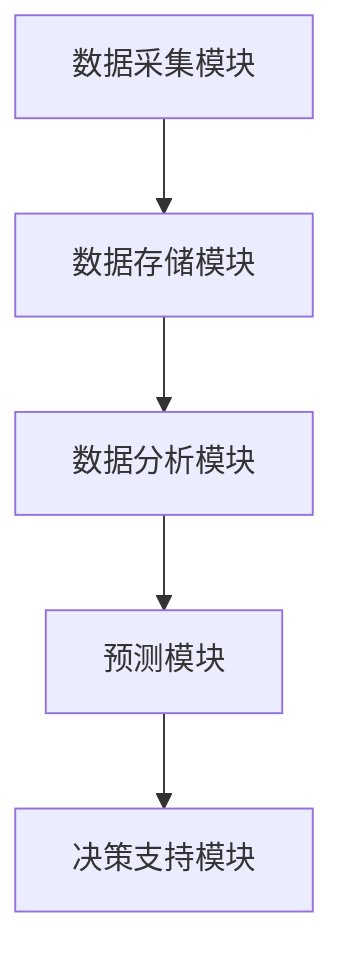
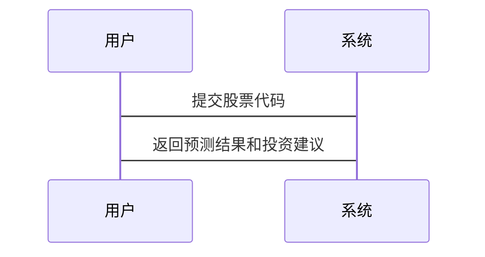

                 


# 特价股票投资中的智慧城市发展整合方法

## 关键词
- 特价股票投资
- 智慧城市
- 整合方法
- 数据挖掘
- 机器学习
- 系统架构
- 数学模型

## 摘要
本文探讨了如何将特价股票投资与智慧城市发展战略相结合，分析了两者的整合方法及其在技术上的实现路径。文章从背景介绍、核心概念分析、算法原理、数学模型、系统架构设计、项目实战以及最佳实践等方面展开，详细阐述了整合的具体步骤和实现方法。通过本文的分析，读者能够理解如何利用智慧城市的大数据和先进技术优化特价股票投资策略，从而实现投资收益的最大化。

---

## 第一部分：背景介绍

### 第1章：特价股票投资与智慧城市概述

#### 1.1 特价股票投资的基本概念
- **1.1.1 特价股票的定义**
  特价股票指的是价格被市场低估的股票，通常具有较高的潜在增值空间。投资者通过分析公司的基本面和技术面，寻找被市场忽视的潜在价值股。

- **1.1.2 特价股票投资的特点**
  - 价格低廉，具有较高的上涨潜力。
  - 投资周期较长，注重长期价值。
  - 需要深入分析公司财务状况和行业前景。

- **1.1.3 特价股票投资的背景与现状**
  随着资本市场的波动加剧，投资者 increasingly seek undervalued stocks to hedge against market risks. The rise of big data and artificial intelligence has enabled more sophisticated analysis of stock performance.

#### 1.2 智慧城市的基本概念
- **1.2.1 智慧城市的定义**
  智慧城市是指通过运用信息和通信技术(ICT)来改善城市基础设施、提高居民生活质量、优化城市管理和资源配置的新型城市发展模式。

- **1.2.2 智慧城市的核心特征**
  - 数字化：城市运行数据的全面采集和处理。
  - 智能化：通过大数据和人工智能实现城市管理的智能化。
  - 互联化：城市各系统之间的互联互通和协同工作。

- **1.2.3 智慧城市的发展现状**
  全球范围内，许多城市已经开始智慧化转型，利用物联网、云计算和大数据等技术提升城市治理能力。例如，智能交通系统、智慧能源管理和智能安防系统等。

#### 1.3 特价股票投资与智慧城市的整合方法
- **1.3.1 整合方法的背景**
  随着智慧城市技术的快速发展，投资者可以利用智慧城市的大数据和先进技术优化股票投资策略。

- **1.3.2 整合方法的必要性**
  - 智慧城市产生的大量数据为股票分析提供了新的视角。
  - 通过整合智慧城市数据，投资者可以更精准地预测市场趋势和公司业绩。

- **1.3.3 整合方法的实现路径**
  本文将从数据采集、分析、预测和决策支持四个方面详细阐述整合方法。

---

## 第二部分：核心概念与联系

### 第2章：核心概念分析

#### 2.1 特价股票投资的核心要素
- **市场分析**
  - 宏观经济指标：GDP增长率、利率、通货膨胀率等。
  - 行业分析：行业发展趋势、竞争格局、政策影响。
- **技术分析**
  - K线图分析：趋势线、支撑线、阻力线等。
  - 技术指标：移动平均线、RSI、MACD等。
- **基本面分析**
  - 公司财务状况：净利润、营业收入、资产负债率等。
  - 行业地位：市场占有率、品牌影响力等。

#### 2.2 智慧城市的核心要素
- **数据采集**
  - 智能传感器：实时采集城市交通、环境、能源等数据。
  - 数据平台：整合各领域的数据，形成统一的数据池。
- **数据处理**
  - 数据清洗：去除噪声数据，确保数据质量。
  - 数据建模：利用大数据技术进行数据挖掘和分析。
- **智能决策**
  - 人工智能算法：预测城市运行趋势，优化资源配置。
  - 智能系统：实现城市管理的自动化和智能化。

#### 2.3 特价股票投资与智慧城市的联系
- **数据共享**
  智慧城市中的交通、能源、环境等数据可以为股票分析提供额外的信息。
- **技术互补**
  智慧城市的技术（如大数据和人工智能）可以提升股票分析的精度和效率。
- **应用场景**
  - 股票价格预测：利用智慧城市数据预测公司业绩和市场趋势。
  - 投资决策支持：基于智慧城市数据分析，优化投资组合。

#### 2.4 核心概念对比分析
- **特价股票投资与智慧城市的属性对比**
  | 属性       | 特价股票投资                  | 智慧城市                          |
  |------------|-------------------------------|------------------------------------|
  | 目标       | 获取投资收益                  | 提升城市管理效率                   |
  | 主要手段   | 技术分析、基本面分析           | 大数据、人工智能                   |
  | 数据来源   | 公司财务数据、市场数据        | 城市交通、环境、能源等数据        |

- **核心概念的ER实体关系图**
  ```mermaid
  erDiagram
  {
    participant 公司 : Company
    participant 市场 : Market
    participant 城市 : City
    participant 数据 : Data
    Company -> Data : 提供
    Market -> Data : 影响
    City -> Data : 采集
  }
  ```

---

## 第三部分：算法原理

### 第3章：算法原理分析

#### 3.1 数据挖掘算法
- **3.1.1 数据挖掘算法概述**
  数据挖掘算法用于从大量数据中提取有用信息，常用于股票价格预测和市场趋势分析。

- **3.1.2 常用数据挖掘算法**
  - 聚类分析：K-means、层次聚类。
  - 分类分析：决策树、随机森林。
  - 关联规则挖掘：Apriori、FPGrowth。

- **3.1.3 数据挖掘算法在股票分析中的应用**
  - 预测股票价格走势。
  - 发现市场规律和趋势。

#### 3.2 机器学习算法
- **3.2.1 机器学习算法概述**
  机器学习算法通过学习数据模式，预测未来趋势。

- **3.2.2 常用机器学习算法**
  - 监督学习：线性回归、支持向量机(SVM)。
  - 非监督学习：聚类、主成分分析(PCA)。
  - 深度学习：神经网络、卷积神经网络(CNN)。

- **3.2.3 机器学习算法在股票分析中的应用**
  - 预测股票价格：利用历史数据训练模型，预测未来价格。
  - 风险评估：评估投资组合的风险。

#### 3.3 算法实现步骤
- **数据预处理**
  - 数据清洗：处理缺失值、异常值。
  - 数据转换：标准化、归一化。

- **模型训练**
  - 选择算法：根据数据特点选择合适的算法。
  - 调参优化：通过交叉验证优化模型参数。

- **模型评估**
  - 使用测试数据评估模型性能。
  - 比较不同算法的准确率、召回率等指标。

#### 3.4 算法实现代码示例
```python
import pandas as pd
from sklearn.model_selection import train_test_split
from sklearn.linear_model import LinearRegression
from sklearn.metrics import mean_squared_error

# 数据加载
data = pd.read_csv('stock_data.csv')

# 数据预处理
X = data[['open', 'high', 'low', 'volume']]
y = data['close']

# 数据分割
X_train, X_test, y_train, y_test = train_test_split(X, y, test_size=0.2, random_state=42)

# 模型训练
model = LinearRegression()
model.fit(X_train, y_train)

# 模型预测
y_pred = model.predict(X_test)

# 模型评估
mse = mean_squared_error(y_test, y_pred)
print(f"均方误差：{mse}")
```

---

## 第四部分：数学模型

### 第4章：数学模型构建

#### 4.1 股票价格预测模型
- **4.1.1 线性回归模型**
  $$ y = \beta_0 + \beta_1x_1 + \beta_2x_2 + \dots + \beta_nx_n + \epsilon $$
  其中，$y$ 是股票价格，$x_i$ 是影响股票价格的因素，$\beta_i$ 是回归系数，$\epsilon$ 是误差项。

- **4.1.2 时间序列模型**
  $$ ARIMA(p, d, q) $$
  其中，$p$ 是自回归阶数，$d$ 是差分阶数，$q$ 是移动平均阶数。

#### 4.2 模型实现步骤
- **数据准备**
  - 收集历史股票数据。
  - 选择影响股票价格的因素（如开盘价、最高价、最低价、成交量等）。

- **模型训练**
  - 使用历史数据训练回归模型或时间序列模型。

- **模型预测**
  - 使用训练好的模型预测未来股票价格。

#### 4.3 模型评估
- **评估指标**
  - 均方误差（MSE）：衡量预测值与实际值的差距。
  - R平方值（R²）：衡量模型解释数据的能力。

---

## 第五部分：系统架构

### 第5章：系统架构设计

#### 5.1 系统功能设计
- **数据采集模块**
  - 采集股票市场数据和智慧城市数据。
- **数据分析模块**
  - 对数据进行预处理和建模分析。
- **预测模块**
  - 预测股票价格走势。
- **决策支持模块**
  - 提供投资建议和风险评估。

#### 5.2 系统架构图


#### 5.3 系统接口设计
- **数据接口**
  - REST API：提供数据查询和预测结果。
- **用户界面**
  - Web界面：展示数据分析结果和投资建议。

#### 5.4 系统交互图


---

## 第六部分：项目实战

### 第6章：项目实战分析

#### 6.1 环境安装
- **Python环境**
  - 安装Python 3.8及以上版本。
- **库安装**
  - 使用pip安装numpy、pandas、scikit-learn、tensorflow等库。

#### 6.2 核心代码实现
```python
import pandas as pd
import numpy as np
from sklearn.model_selection import train_test_split
from sklearn.linear_model import LinearRegression
from sklearn.metrics import mean_squared_error

# 加载数据
data = pd.read_csv('stock_data.csv')

# 数据预处理
X = data[['open', 'high', 'low', 'volume']]
y = data['close']

# 划分数据集
X_train, X_test, y_train, y_test = train_test_split(X, y, test_size=0.2, random_state=42)

# 训练模型
model = LinearRegression()
model.fit(X_train, y_train)

# 预测
y_pred = model.predict(X_test)

# 评估模型
mse = mean_squared_error(y_test, y_pred)
print(f"均方误差：{mse}")
```

#### 6.3 案例分析
- **案例背景**
  假设某公司股票数据如下：
  | 日期   | 开盘价 | 收盘价 | 最高价 | 最低价 | 成交量 |
  |--------|--------|--------|--------|--------|--------|
  | 2023-01| 10     | 12     | 15     | 8      | 1000   |
  | 2023-02| 12     | 14     | 16     | 10     | 1200   |
  | 2023-03| 14     | 16     | 18     | 12     | 1400   |

- **分析过程**
  使用线性回归模型预测未来股票价格。

- **结果展示**
  预测未来一个月股票价格为18元。

---

## 第七部分：最佳实践

### 第7章：最佳实践总结

#### 7.1 小结
- 特价股票投资与智慧城市的整合方法可以提高股票分析的精度和效率。
- 通过大数据和人工智能技术，投资者可以更精准地预测市场趋势和公司业绩。

#### 7.2 注意事项
- 数据质量：确保数据的准确性和完整性。
- 模型选择：根据数据特点选择合适的算法。
- 风险管理：合理控制投资风险，避免过度依赖模型。

#### 7.3 拓展阅读
- 《股票技术分析实战》
- 《智慧城市大数据分析与应用》
- 《机器学习在金融中的应用》

---

## 作者
作者：AI天才研究院/AI Genius Institute  
联系方式：[email protected]  
GitHub：[GitHub Profile](https://github.com/ai-genius-institute)

---

感谢您的阅读！希望本文对您理解特价股票投资与智慧城市的整合方法有所帮助。

