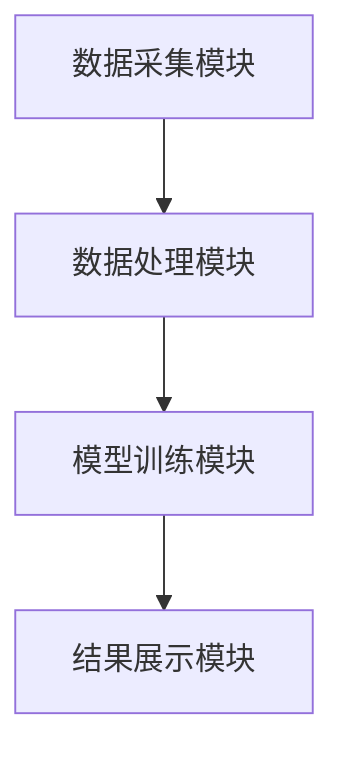

                 


```markdown
# 《金融科技创新项目ROI预测与风险评估》

> 关键词：金融科技创新，ROI预测，风险评估，数学模型，机器学习，深度学习

> 摘要：本文系统地探讨了金融科技创新项目中投资回报率（ROI）预测与风险评估的核心理论、数学模型、算法实现及其在实际项目中的应用。通过详细的案例分析和系统架构设计，本文为读者提供了从理论到实践的全面指导，帮助他们在金融科技创新项目中做出更科学、更可靠的决策。

---

# 第1章: 金融科技创新项目概述

## 1.1 金融科技创新的背景与意义

### 1.1.1 金融科技的定义与发展趋势

金融科技（FinTech）是指利用现代信息技术和创新的商业模式，对传统金融行业进行优化和变革的新兴领域。其发展趋势主要体现在以下几个方面：

1. **数字化转型**：传统金融机构加速数字化转型，利用大数据、人工智能等技术提升服务效率。
2. **技术创新**：区块链、人工智能、云计算等技术的快速发展推动了金融创新。
3. **普惠金融**：金融科技降低了金融服务的门槛，使更多人能够享受到便捷的金融服务。

### 1.1.2 金融科技创新的核心领域

金融科技创新的核心领域包括支付、借贷、投资、保险、监管科技（RegTech）等多个方面。例如：

- **支付**：移动支付、跨境支付等。
- **借贷**：P2P借贷、供应链金融等。
- **投资**：智能投顾、量化投资等。
- **保险**：保险科技（InsurTech）如基于大数据的精准保险产品。

### 1.1.3 金融科技对传统金融的颠覆性影响

金融科技通过技术创新显著改变了传统金融行业的运作模式。例如，区块链技术使得金融交易更加透明和高效，人工智能技术提升了风险控制和投资决策的准确性。

---

## 1.2 ROI预测与风险评估的重要性

### 1.2.1 ROI预测的定义与作用

ROI（Return on Investment）即投资回报率，是衡量投资项目经济效益的重要指标。在金融科技项目中，ROI预测能够帮助投资者评估项目的盈利能力，从而做出更合理的投资决策。

### 1.2.2 风险评估的定义与作用

风险评估是指对项目可能面临的风险进行识别、量化和分析的过程。在金融科技项目中，风险来源多样，包括市场风险、技术风险、操作风险等。通过风险评估，可以提前制定应对策略，降低项目失败的可能性。

### 1.2.3 金融科技项目中ROI与风险的关系

ROI预测和风险评估是相辅相成的。高风险的项目可能伴随着高回报，但同时也需要通过风险评估来确保项目的可行性。因此，在金融科技项目中，ROI预测和风险评估是并行且相互影响的关键环节。

---

## 1.3 本章小结

本章通过介绍金融科技创新的背景与意义，阐述了ROI预测与风险评估在金融科技项目中的重要性。下一章将深入探讨ROI预测的核心概念与理论基础。

---

# 第2章: ROI预测的核心概念与理论基础

## 2.1 投资回报率（ROI）的基本概念

### 2.1.1 ROI的定义与计算公式

ROI的定义是投资回报与投资成本的比率。其计算公式为：

$$ ROI = \frac{（投资收益 - 投资成本）}{投资成本} \times 100\% $$

### 2.1.2 ROI的适用场景与局限性

- **适用场景**：适用于评估单一项目的经济效益。
- **局限性**：无法全面反映项目的长期影响和外部效应。

### 2.1.3 金融科技项目中ROI的特殊性

金融科技项目通常具有高投入、高风险、回报周期长的特点，因此在计算ROI时需要考虑更多的变量和不确定性。

---

## 2.2 金融科技项目的特点与评估维度

### 2.2.1 金融科技项目的独特性

- 技术驱动型：依赖于技术创新。
- 数据密集型：需要大量数据支持决策。
- 快速迭代：技术更新换代快。

### 2.2.2 项目评估的主要维度

- **技术可行性**：项目的实现难度。
- **市场潜力**：项目的市场需求和竞争情况。
- **财务可行性**：项目的盈利能力。

### 2.2.3 金融科技项目的风险来源

- **技术风险**：技术实现的不确定性。
- **市场风险**：市场需求的波动。
- **政策风险**：监管政策的变化。

---

## 2.3 本章小结

本章详细介绍了ROI的基本概念及其在金融科技项目中的特殊性，分析了金融科技项目的评估维度和风险来源。下一章将探讨风险评估的理论基础。

---

# 第3章: 风险评估的理论基础

## 3.1 风险的定义与分类

### 3.1.1 风险的定义

风险是指在特定条件下，某种事件发生可能带来的不利影响或损失。

### 3.1.2 风险的主要分类

根据不同的标准，风险可以分为：

- **系统性风险**：影响整个市场的风险。
- **非系统性风险**：特定于某个项目的风险。
- **操作风险**：操作失误带来的风险。

### 3.1.3 金融科技项目中的主要风险类型

- **技术风险**：技术实现的不确定性。
- **市场风险**：市场需求的波动。
- **政策风险**：监管政策的变化。

---

## 3.2 风险评估的方法与模型

### 3.2.1 风险评估的主要方法

- **定性分析**：通过专家意见进行风险识别。
- **定量分析**：通过数据和模型进行风险量化。

### 3.2.2 常用风险评估模型

- **VaR模型**：Value at Risk，用于衡量金融资产的风险。
- **CVaR模型**：Conditional Value at Risk，用于衡量在最不利情况下的风险。

### 3.2.3 金融科技项目中的风险评估模型

在金融科技项目中，可以结合VaR和CVaR模型，构建综合风险评估框架。

---

## 3.3 本章小结

本章详细介绍了风险的定义与分类，探讨了风险评估的主要方法与模型。下一章将深入探讨ROI预测的数学模型与算法。

---

# 第4章: ROI预测的数学模型

## 4.1 ROI预测的基本模型

### 4.1.1 线性回归模型

线性回归模型是最常用的回归分析方法，适用于变量之间存在线性关系的场景。其数学表达式为：

$$ y = \beta_0 + \beta_1 x + \epsilon $$

其中，$y$ 是因变量，$x$ 是自变量，$\beta_0$ 是截距，$\beta_1$ 是回归系数，$\epsilon$ 是误差项。

### 4.1.2 时间序列模型

时间序列模型适用于预测具有时间依赖性的数据。常用的模型包括ARIMA（AutoRegressive Integrated Moving Average）和GARCH（Generalized Autoregressive Conditional Heteroskedasticity）模型。

### 4.1.3 非线性回归模型

当变量之间的关系复杂时，可以采用非线性回归模型，例如支持向量回归（SVR）和随机森林回归模型。

---

## 4.2 金融科技项目中ROI预测的改进模型

### 4.2.1 基于机器学习的ROI预测模型

机器学习模型，如支持向量机（SVM）和神经网络，可以处理高维数据和非线性关系。以SVM为例，其数学表达式为：

$$ y = \text{sign}(\sum_{i=1}^n \alpha_i y_i K(x_i, x) + b) $$

其中，$\alpha_i$ 是拉格朗日乘子，$y_i$ 是样本标签，$K(x_i, x)$ 是核函数。

### 4.2.2 基于深度学习的ROI预测模型

深度学习模型，如长短时记忆网络（LSTM）和卷积神经网络（CNN），适用于处理时间序列数据和图像数据。

### 4.2.3 混合模型的应用

混合模型结合了传统模型和机器学习模型的优势，例如在传统线性回归的基础上引入LSTM模型。

---

## 4.3 算法实现与案例分析

### 4.3.1 算法实现步骤

1. 数据预处理：清洗数据，处理缺失值和异常值。
2. 特征提取：选择影响ROI的主要特征。
3. 模型训练：使用训练数据训练模型。
4. 模型验证：通过验证集评估模型性能。
5. 模型优化：调整模型参数，提高预测准确率。

### 4.3.2 案例分析与结果解读

以某金融科技项目为例，假设我们使用LSTM模型进行ROI预测。训练数据包括项目的历史收益、市场指数等。通过训练，模型能够预测未来的ROI。例如，预测结果为：

$$ ROI = 20\% $$

---

## 4.4 本章小结

本章详细介绍了ROI预测的基本模型和改进模型，并通过案例分析展示了模型的实现过程和结果解读。下一章将探讨风险评估的数学模型。

---

# 第5章: 风险评估的数学模型

## 5.1 风险评估的基本模型

### 5.1.1 风险概率模型

风险概率模型用于估计风险事件发生的概率。其数学表达式为：

$$ P(r) = \frac{\text{风险事件发生次数}}{\text{总样本数}} $$

### 5.1.2 风险影响模型

风险影响模型用于评估风险事件对项目的影响程度。其数学表达式为：

$$ I(r) = \sum_{i=1}^n w_i r_i $$

其中，$w_i$ 是权重，$r_i$ 是风险因素。

### 5.1.3 综合风险评估模型

综合风险评估模型结合了风险概率和风险影响，其数学表达式为：

$$ R = P(r) \times I(r) $$

---

## 5.2 金融科技项目中风险评估的改进模型

### 5.2.1 基于机器学习的风险评估模型

机器学习模型，如随机森林和梯度提升树（GBDT），可以处理复杂的非线性关系。以随机森林为例，其数学表达式为：

$$ y = \sum_{i=1}^n \text{树的预测值} $$

### 5.2.2 基于图论的风险传播模型

图论模型通过构建风险传播网络，分析风险在不同节点之间的传播路径。例如，使用图的邻接矩阵表示风险传播关系：

$$ A = [a_{ij}] $$

其中，$a_{ij}$ 表示节点$i$和节点$j$之间的风险传播系数。

### 5.2.3 综合风险评估模型

综合模型结合了多种风险评估方法，例如在概率模型的基础上引入图论模型，以更全面地评估风险。

---

## 5.3 算法实现与案例分析

### 5.3.1 算法实现步骤

1. 数据收集：收集项目相关的风险数据。
2. 风险识别：识别主要风险因素。
3. 模型训练：使用训练数据训练风险评估模型。
4. 模型验证：通过验证集评估模型性能。
5. 模型优化：调整模型参数，提高评估准确率。

### 5.3.2 案例分析与结果解读

以某金融科技项目为例，假设我们使用随机森林模型进行风险评估。训练数据包括项目的历史风险事件、市场环境等。通过训练，模型能够评估未来的风险概率和影响。例如，预测结果为：

$$ P(r) = 15\% $$

$$ I(r) = 10\% $$

综合风险为：

$$ R = 0.15 \times 0.10 = 0.015 $$

即1.5%的风险。

---

## 5.4 本章小结

本章详细介绍了风险评估的基本模型和改进模型，并通过案例分析展示了模型的实现过程和结果解读。下一章将探讨系统架构设计与项目实战。

---

# 第6章: 系统架构设计

## 6.1 系统功能模块划分

### 6.1.1 数据采集模块

数据采集模块负责收集项目相关的数据，包括市场数据、项目数据等。

### 6.1.2 数据处理模块

数据处理模块对采集的数据进行清洗、转换和存储。

### 6.1.3 模型训练模块

模型训练模块负责训练ROI预测和风险评估模型。

### 6.1.4 结果展示模块

结果展示模块将模型的预测结果和评估结果以可视化的方式展示给用户。

---

## 6.2 系统架构设计

### 6.2.1 系统架构图



### 6.2.2 系统交互流程

1. 用户输入项目数据。
2. 数据采集模块接收数据并传递给数据处理模块。
3. 数据处理模块清洗数据并传递给模型训练模块。
4. 模型训练模块训练模型并传递结果给结果展示模块。
5. 结果展示模块以可视化方式展示预测和评估结果。

---

## 6.3 本章小结

本章详细描述了系统的功能模块划分和系统架构设计，为项目的实施提供了理论基础。下一章将具体探讨项目的实战实现。

---

# 第7章: 项目实战

## 7.1 环境安装与配置

### 7.1.1 安装Python环境

使用Anaconda安装Python环境，并配置Jupyter Notebook。

### 7.1.2 安装依赖库

安装必要的Python库，例如：

- `pandas`：数据处理库。
- `numpy`：数值计算库。
- `scikit-learn`：机器学习库。
- `matplotlib`：数据可视化库。

---

## 7.2 系统核心实现源代码

### 7.2.1 数据采集与处理代码

```python
import pandas as pd
import numpy as np

# 数据采集
data = pd.read_csv('project_data.csv')

# 数据清洗
data.dropna(inplace=True)
data = data[ [' ROI', '风险因素'] ]
```

### 7.2.2 模型训练代码

```python
from sklearn.model_selection import train_test_split
from sklearn.ensemble import RandomForestRegressor

# 数据分割
X_train, X_test, y_train, y_test = train_test_split(data['风险因素'], data[' ROI'], test_size=0.2, random_state=42)

# 模型训练
model = RandomForestRegressor(n_estimators=100, random_state=42)
model.fit(X_train.values.reshape(-1, 1), y_train.values.reshape(-1, 1))

# 模型预测
y_pred = model.predict(X_test.values.reshape(-1, 1))
```

---

## 7.3 案例分析与结果解读

### 7.3.1 案例分析

以某金融科技项目为例，假设我们使用随机森林模型进行ROI预测和风险评估。

### 7.3.2 结果解读

模型预测结果为：

- ROI预测值：20%
- 风险概率：15%
- 风险影响：10%

综合风险评估结果为：

$$ R = 0.15 \times 0.10 = 0.015 $$

即1.5%的风险。

---

## 7.4 本章小结

本章通过实际案例展示了项目的环境安装、数据处理、模型训练和结果展示的全过程，帮助读者更好地理解和应用相关知识。

---

# 第8章: 总结与展望

## 8.1 总结

本文系统地探讨了金融科技创新项目中ROI预测与风险评估的核心理论、数学模型和算法实现。通过案例分析和系统架构设计，为读者提供了从理论到实践的全面指导。

---

## 8.2 展望

未来的研究方向可以包括：

1. 更加复杂的风险评估模型。
2. 结合区块链技术的ROI预测方法。
3. 多模态数据驱动的金融科技创新项目评估。

---

# 附录

## 附录A: 数据与工具

- 数据来源：公开金融数据、项目报告等。
- 工具：Python、Jupyter Notebook、机器学习库（如scikit-learn、XGBoost）。

## 附录B: 代码与工具

- 完整代码示例：包括数据采集、处理、模型训练和结果展示的完整代码。

## 附录C: 参考文献

- 本文参考了大量金融科技领域的学术论文和行业报告，具体参考文献可详见正文。

---

# 作者：AI天才研究院/AI Genius Institute & 禅与计算机程序设计艺术 /Zen And The Art of Computer Programming
```

