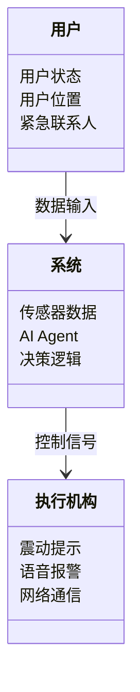
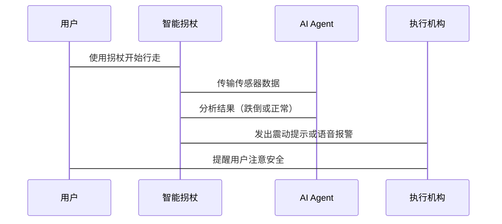
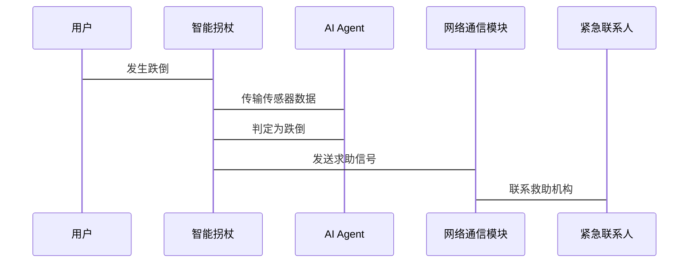

                 


# AI Agent在智能拐杖中的跌倒预防与紧急求助

## 关键词：AI Agent，智能拐杖，跌倒预防，紧急求助，传感器技术，算法实现，系统架构设计

## 摘要：  
本文详细探讨了AI Agent在智能拐杖中的应用，重点分析了跌倒预防与紧急求助的核心算法、系统架构设计以及实际应用场景。通过结合传感器技术与人工智能算法，提出了一种基于AI Agent的智能拐杖系统，能够实时监测用户状态，预防跌倒并提供紧急求助功能。本文从背景介绍、核心概念、算法原理、系统架构到项目实战，全面阐述了该系统的实现与优化过程。

---

# 第一部分: 背景介绍与问题分析

## 第1章: 背景介绍与问题分析

### 1.1 AI Agent与智能拐杖的概述

#### 1.1.1 AI Agent的基本概念  
AI Agent（人工智能代理）是一种能够感知环境、自主决策并执行任务的智能实体。它能够根据环境输入的信息，通过内部算法处理后，输出相应的动作或指令。AI Agent的核心在于其感知-决策-执行的闭环能力。

#### 1.1.2 智能拐杖的定义与功能  
智能拐杖是一种结合了传感器、AI算法和执行机构的辅助工具，主要用于帮助行动不便的用户（如老年人或残障人士）进行移动支持。其核心功能包括：  
- **跌倒检测**：通过传感器实时监测用户的状态，判断是否可能发生跌倒。  
- **紧急求助**：当检测到跌倒或用户处于危险状态时，自动触发求助信号。  
- **实时反馈**：通过震动或语音提示，提醒用户注意安全。

#### 1.1.3 跌倒预防与紧急求助的重要性  
跌倒是老年人和行动不便人群的主要安全威胁之一。根据统计，每年因跌倒导致的医疗费用高昂，且很多情况下，跌倒后的及时救助能够显著降低伤害程度。因此，通过智能拐杖实现跌倒预防和紧急求助，具有重要的社会意义和经济价值。

---

### 1.2 跌倒预防与紧急求助的问题背景

#### 1.2.1 老龄化社会与跌倒问题  
随着全球人口老龄化加剧，老年人的数量迅速增加，而老年人的跌倒风险也显著上升。根据世界卫生组织（WHO）的数据，全球每年有超过3000万人因跌倒受伤，其中6%的跌倒会导致严重伤害。智能拐杖作为一种辅助工具，能够有效减少跌倒的发生。

#### 1.2.2 智能拐杖在跌倒预防中的作用  
智能拐杖通过内置的传感器（如加速度计、陀螺仪、压力传感器等）实时监测用户的行走状态，分析步态特征，识别潜在的跌倒风险。当系统判断用户可能跌倒时，会提前发出预警，提醒用户调整姿态或采取其他措施。

#### 1.2.3 紧急求助的必要性与挑战  
在紧急情况下，智能拐杖需要能够快速响应，向预设的紧急联系人或救助机构发送求助信号。然而，如何在复杂的环境中准确判断紧急情况，同时确保求助信号的及时性与可靠性，是一个技术上的挑战。

---

### 1.3 问题解决与边界分析

#### 1.3.1 跌倒预防的核心问题  
跌倒预防的核心问题在于如何通过传感器数据准确判断用户的步态特征，并预测可能的跌倒风险。这需要结合多种传感器数据（如加速度、角速度、压力分布等）进行综合分析。

#### 1.3.2 紧急求助的实现边界  
紧急求助的实现需要考虑以下边界条件：  
- **地理位置**：用户是否处于网络覆盖范围内？  
- **用户状态**：用户是否意识清醒？是否需要立即救助？  
- **隐私保护**：如何在紧急情况下保护用户的隐私数据？  

#### 1.3.3 智能拐杖的功能外延  
智能拐杖的功能不仅限于跌倒预防与紧急求助，还可以扩展到其他辅助功能，如路径规划、环境识别、健康监测等。

---

### 1.4 核心概念与系统结构

#### 1.4.1 AI Agent在智能拐杖中的角色  
AI Agent在智能拐杖中扮演“智能大脑”的角色，负责处理传感器数据、分析用户行为、做出决策并执行相应的动作。

#### 1.4.2 系统核心要素与组成  
智能拐杖的核心组成包括：  
- **传感器模块**：用于采集用户行为数据。  
- **AI处理模块**：负责数据的分析与决策。  
- **执行机构**：根据AI Agent的指令执行动作，如震动提示、语音报警等。  

#### 1.4.3 系统功能模块与交互关系  
```mermaid
entityDiagram
    entity 智能拐杖 {
        attribute 用户行为数据
        attribute 系统决策指令
        attribute 用户反馈
    }
    entity AI Agent {
        attribute 传感器数据
        attribute 决策逻辑
        attribute 执行指令
    }
    AI Agent --> 智能拐杖: 控制信号
    智能拐杖 --> AI Agent: 数据输入
```

---

# 第二部分: 核心概念与技术原理

## 第2章: 核心概念与技术原理

### 2.1 AI Agent的核心原理

#### 2.1.1 AI Agent的基本原理  
AI Agent通过感知环境输入（如传感器数据），结合内部知识库和决策算法，生成相应的动作或指令。其核心流程包括：  
1. **感知**：采集环境数据。  
2. **分析**：对数据进行特征提取与分类。  
3. **决策**：基于分析结果生成决策指令。  
4. **执行**：将决策指令转化为实际动作。

#### 2.1.2 基于AI的跌倒检测算法  
跌倒检测算法的核心在于对用户行为数据的分析。常用的算法包括：  
- **基于加速度的跌倒检测**：通过分析加速度信号的突变点来判断跌倒。  
- **基于时间序列的分类算法**：利用机器学习模型（如随机森林、支持向量机等）对行为数据进行分类。

#### 2.1.3 紧急求助的决策机制  
紧急求助的决策机制需要结合多种因素，包括：  
- **跌倒检测结果**：是否检测到跌倒行为？  
- **用户状态**：用户是否需要立即救助？  
- **环境信息**：用户是否处于危险环境中？  

---

### 2.2 传感器技术与数据处理

#### 2.2.1 常用传感器类型与功能  
智能拐杖常用的传感器包括：  
- **加速度计**：用于检测加速度变化，判断跌倒风险。  
- **陀螺仪**：用于检测旋转角度，辅助判断步态特征。  
- **压力传感器**：用于检测用户对拐杖的握力变化。  

#### 2.2.2 数据采集与预处理流程  
数据采集流程包括：  
1. **数据采集**：通过传感器获取用户行为数据。  
2. **数据预处理**：去除噪声、归一化处理等。  
3. **特征提取**：提取有用的特征（如加速度峰值、时间序列特征等）。  

#### 2.2.3 数据特征提取与分析  
特征提取是跌倒检测的核心步骤。常用的特征包括：  
- **加速度峰值**：跌倒时的加速度突变点。  
- **时间序列特征**：步态周期、步长、步频等。  
- **频域特征**：加速度信号的频谱分析。  

---

### 2.3 AI Agent与智能拐杖的实体关系

```mermaid
entityDiagram
    entity 智能拐杖 {
        attribute 传感器数据
        attribute 用户操作指令
        attribute 状态反馈
    }
    entity AI Agent {
        attribute 感知数据
        attribute 决策逻辑
        attribute 执行指令
    }
    AI Agent --> 智能拐杖: 控制信号
    智能拐杖 --> AI Agent: 数据输入
```

---

# 第三部分: 算法原理与实现

## 第3章: 跌倒检测算法原理与实现

### 3.1 基于加速度传感器的跌倒检测

#### 3.1.1 加速度传感器的工作原理  
加速度传感器通过测量物体加速度的变化，反映物体的运动状态。在智能拐杖中，加速度传感器主要用于检测用户的步态特征和跌倒风险。

#### 3.1.2 跌倒检测的特征提取  
跌倒检测的关键在于识别加速度信号的突变点。常用的特征包括：  
- **加速度突变幅度**：跌倒时加速度的峰值。  
- **时间窗口内的能量变化**：用于判断跌倒的突然性。  

#### 3.1.3 基于时间序列的跌倒判定  
基于时间序列的跌倒判定算法通常采用滑动窗口方法，对连续的加速度数据进行分析。例如，可以使用滑动平均法（Moving Average）来平滑数据，然后通过阈值判断是否发生跌倒。

---

### 3.2 算法实现流程

#### 3.2.1 数据采集与预处理  
数据采集流程包括：  
1. **采集加速度数据**：通过加速度传感器获取用户的步态数据。  
2. **数据预处理**：去除噪声、归一化处理。  

#### 3.2.2 特征提取与分类器训练  
特征提取步骤包括：  
- **加速度峰值提取**：提取跌倒时的加速度突变点。  
- **时间序列特征提取**：提取步态周期、步长等特征。  

分类器训练可以采用 supervised learning 算法，如随机森林、支持向量机（SVM）等。

#### 3.2.3 跌倒判定逻辑实现  
跌倒判定逻辑可以通过以下步骤实现：  
1. **特征提取**：从加速度数据中提取跌倒特征。  
2. **分类器预测**：将特征输入分类器，判断是否发生跌倒。  
3. **触发报警**：如果判定为跌倒，触发紧急求助功能。

---

### 3.3 算法实现代码示例

```python
import numpy as np
from sklearn.ensemble import RandomForestClassifier

# 示例数据：加速度传感器的X、Y、Z轴数据
acc_x = np.array([...])  # 加速度X轴数据
acc_y = np.array([...])  # 加速度Y轴数据
acc_z = np.array([...])  # 加速度Z轴数据

# 特征提取
def extract_features(acc_x, acc_y, acc_z):
    features = []
    for i in range(len(acc_x)):
        # 提取加速度突变幅度
        peak = max(abs(acc_x[i]), abs(acc_y[i]), abs(acc_z[i]))
        # 提取时间窗口内的能量变化
        energy = np.sqrt(acc_x[i]**2 + acc_y[i]**2 + acc_z[i]**2)
        features.append([peak, energy])
    return features

# 训练随机森林分类器
features = extract_features(acc_x, acc_y, acc_z)
labels = [...]  # 标签：0表示正常，1表示跌倒

model = RandomForestClassifier(n_estimators=100)
model.fit(features, labels)

# 预测跌倒
new_features = extract_features(new_acc_x, new_acc_y, new_acc_z)
predicted = model.predict(new_features)
```

---

## 第4章: 紧急求助算法实现与优化

### 4.1 紧急求助的核心算法

#### 4.1.1 基于跌倒检测的紧急求助触发  
当AI Agent检测到跌倒行为后，会触发紧急求助功能。触发条件包括：  
- **跌倒检测结果**：算法判定为跌倒。  
- **用户状态**：用户可能需要紧急救助（如无意识、无法自行站立）。  

#### 4.1.2 紧急求助的通信机制  
紧急求助的通信机制包括：  
- **本地报警**：通过震动或语音提示用户。  
- **远程报警**：向预设的紧急联系人或救助机构发送求助信号。  

---

### 4.2 基于位置的紧急求助优化

#### 4.2.1 GPS定位与网络通信  
智能拐杖可以通过GPS模块获取用户的位置信息，并通过网络通信模块（如Wi-Fi或蜂窝网络）发送求助信号。  

#### 4.2.2 紧急联系人数据库  
智能拐杖需要维护一个紧急联系人数据库，包括联系人姓名、电话号码、地理位置等信息。当触发紧急求助时，系统会自动联系这些联系人或拨打急救电话。

---

### 4.3 算法优化与性能提升

#### 4.3.1 算法优化  
- **特征优化**：增加更多的跌倒特征，如步态不规则性、重心变化等。  
- **模型优化**：使用更高效的分类算法（如XGBoost、LightGBM）提升分类精度。  

#### 4.3.2 性能提升  
- **数据预处理优化**：减少数据采集和处理的时间。  
- **算法加速**：通过并行计算或硬件加速提升算法运行效率。  

---

# 第四部分: 系统分析与架构设计

## 第5章: 系统分析与架构设计方案

### 5.1 问题场景介绍

#### 5.1.1 用户场景分析  
智能拐杖的目标用户包括：  
- **老年人**：行动不便，容易跌倒。  
- **残障人士**：需要辅助工具进行日常移动。  
- **医疗康复人员**：用于康复训练的实时监测。  

#### 5.1.2 问题场景描述  
用户在使用智能拐杖时，可能面临以下问题：  
- **跌倒风险**：用户可能因疲劳、路面不平或其他原因跌倒。  
- **紧急情况**：用户跌倒后无法自行求助。  

---

### 5.2 项目介绍

#### 5.2.1 项目目标  
本项目旨在开发一种基于AI Agent的智能拐杖系统，能够实时监测用户状态，预防跌倒并提供紧急求助功能。

#### 5.2.2 项目范围  
- **硬件开发**：传感器、执行机构、通信模块等。  
- **软件开发**：AI Agent算法、数据处理模块、用户界面等。  

---

### 5.3 系统功能设计

#### 5.3.1 领域模型设计  


#### 5.3.2 功能模块划分  
- **传感器模块**：负责采集用户行为数据。  
- **AI处理模块**：负责数据的分析与决策。  
- **执行机构**：根据AI Agent的指令执行动作。  

---

### 5.4 系统架构设计

#### 5.4.1 系统架构图  


#### 5.4.2 系统接口设计  
- **传感器接口**：与加速度计、陀螺仪等传感器连接。  
- **网络接口**：与Wi-Fi或蜂窝网络模块连接，用于通信。  
- **用户接口**：与震动提示、语音报警等执行机构连接。  

---

### 5.5 系统交互设计

#### 5.5.1 系统交互流程  


#### 5.5.2 紧急情况下的交互流程  


---

# 第五部分: 项目实战与优化

## 第6章: 项目实战

### 6.1 环境安装与配置

#### 6.1.1 硬件安装  
- **传感器模块**：安装加速度计、陀螺仪等传感器。  
- **网络通信模块**：配置Wi-Fi或蜂窝网络模块。  

#### 6.1.2 软件安装  
- **AI Agent算法库**：安装必要的机器学习库（如scikit-learn、TensorFlow）。  
- **数据处理工具**：安装数据分析工具（如Python、Jupyter Notebook）。  

---

### 6.2 系统核心实现

#### 6.2.1 跌倒检测实现  
```python
import numpy as np
from sklearn.ensemble import RandomForestClassifier

def detect_fall(acc_x, acc_y, acc_z):
    features = []
    for i in range(len(acc_x)):
        peak = max(abs(acc_x[i]), abs(acc_y[i]), abs(acc_z[i]))
        energy = np.sqrt(acc_x[i]**2 + acc_y[i]**2 + acc_z[i]**2)
        features.append([peak, energy])
    return features

# 训练模型
model = RandomForestClassifier(n_estimators=100)
model.fit(features_train, labels_train)

# 预测跌倒
features_test = detect_fall(acc_x_test, acc_y_test, acc_z_test)
predicted = model.predict(features_test)
```

#### 6.2.2 紧急求助实现  
```python
import requests

def send_help_request():
    url = "https://api.example.com/emergency"
    data = {
        "latitude": user_latitude,
        "longitude": user_longitude,
        "contact": emergency_contacts
    }
    response = requests.post(url, json=data)
    return response.status_code == 200
```

---

### 6.3 案例分析与优化

#### 6.3.1 案例分析  
通过实际案例分析，验证系统的跌倒检测与紧急求助功能。例如：  
- **案例1**：用户在平地上行走，系统正常工作，未触发跌倒检测。  
- **案例2**：用户在台阶上跌倒，系统触发震动提示，并向紧急联系人发送求助信号。  

#### 6.3.2 优化建议  
- **算法优化**：增加更多的跌倒特征，提升分类精度。  
- **系统优化**：优化传感器的灵敏度，减少误报率。  

---

## 第7章: 总结与展望

### 7.1 总结  
本文详细介绍了AI Agent在智能拐杖中的应用，重点分析了跌倒预防与紧急求助的核心算法、系统架构设计以及实际应用场景。通过结合传感器技术与人工智能算法，提出了一种基于AI Agent的智能拐杖系统，能够实时监测用户状态，预防跌倒并提供紧急求助功能。

### 7.2 展望  
未来，智能拐杖的功能将进一步扩展，例如：  
- **健康监测**：监测用户的心率、血压等生理指标。  
- **环境识别**：通过摄像头或激光雷达识别复杂环境。  
- **个性化服务**：根据用户的个性化需求提供定制化的辅助功能。  

---

## 作者：AI天才研究院/AI Genius Institute & 禅与计算机程序设计艺术 /Zen And The Art of Computer Programming

